# 浓缩咖啡中的粉末不会迁移

> 原文：<https://towardsdatascience.com/fines-dont-migrate-during-an-espresso-shot-1bb77e3252ca?source=collection_archive---------4----------------------->

## 咖啡数据科学

## 一些数据反对拍摄过程中微粒迁移的观点

有一种观点认为，在一杯浓缩咖啡中，更细的颗粒(<200 um), also called fines, migrate to the bottom of the filter and either block the filter (causing channeling) or coming out in the cup (ruining the taste). This concept drives people to be more careful in their puck preparation for fear that too much agitation will cause the fines to accumulate at the bottom and make this problem worse.

[)已经做了一些工作](https://www.baristahustle.com/white-papers/an-experiment-to-test-whether-fines-migration-actually-occurs-when-you-distribute-your-coffee-by-tapping/https://www.baristahustle.com/white-papers/an-experiment-to-test-whether-fines-migration-actually-occurs-when-you-distribute-your-coffee-by-tapping/)来表明搅动会导致减少喷射时间的效果，作者认为这是由干迁移引起的。然而，还没有做很多工作来具体了解冰球中的精细迁移。

我开始使用透明的 portafilter 和射后圆盘分析来研究微粒的迁移。为了了解粉末在水中是如何移动的，我用粉笔在冰球的顶部。如果微粒真的在拍摄过程中迁移，粉笔也会迁移，因为微粒非常细小。然而，我没有观察到任何迁移，并且潜在地发现了缺少迁移背后的原因

# 以前的工作

苏格拉底咖啡公司做了一个[实验](http://socraticcoffee.com/2016/06/exploring-the-impact-of-particles-on-espresso-extraction/)，他们筛选咖啡，并观察有两层的照片，以了解底部有更多的细粒是否会导致流动或提取。他们没有发现任何显著的差异，这表明如果微粒确实迁移了，它们不会对拍摄产生大的影响。

咖啡师 Hustle 做了一个[实验](https://www.baristahustle.com/white-papers/an-experiment-to-test-whether-fines-migration-actually-occurs-when-you-distribute-your-coffee-by-tapping/),通过敲击过滤篮 100 次，专注于圆盘准备过程中的微粒迁移，其概念是较细的微粒应该漂移到底部。然而，他们没有发现它对拍摄时间有影响，这表明要么微粒没有迁移，要么它们的迁移没有引起问题。

在开发和研究了[断奏](https://link.medium.com/vmI2zVeQabb)后，我确定粉末不会堵塞过滤篮。断奏法浓缩咖啡，底层是细层(< 400um)，镜头依然定时流动。如果细颗粒真的堵塞了过滤孔，那么这个镜头就不可能工作。

精细层还有其他有趣的属性，比如前一两滴流动非常快，但随后该层会凝固。然后，咖啡缓慢流动，随着提取的咖啡越多，流动越快。

# 透明移动式过滤器

我认为理解这个问题的最好工具是一个透明的过滤篮。虽然已经制造了一些，但是它们通常是偏移的，导致它们在圆盘的顶部和淋浴帘之间具有异常大的顶部空间。通常，这个空间保持在一个镍币的深度，但是在以前制造的透明过滤器中，这个空间是过滤器的厚度。

我用 Kompresso 作为一个透明的便携式过滤器，将咖啡放在淋浴头上方。

然后，我需要一种像咖啡中的粉末一样精细的物质，它不会溶解，但在注射后能够容易地看到。我第一次尝试面粉，但是面粉在热水中会粘在一起。于是我找到一些粉笔，用小刀刮下一些，很快就变成了细粉。我把这个放在咖啡上面。

> 论点:如果细颗粒迁移，那么细粉笔也应该从顶部迁移到咖啡球中更深的地方。

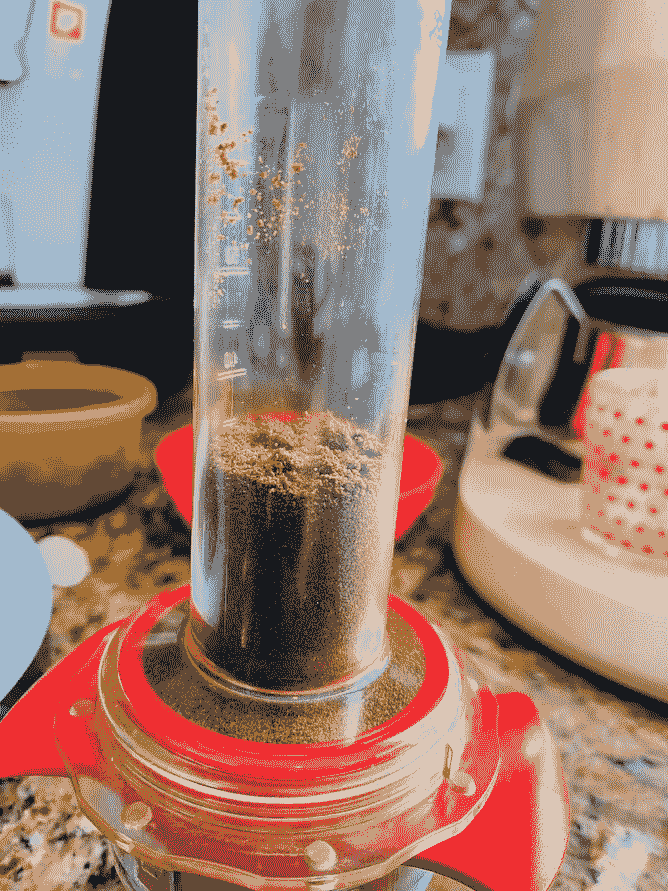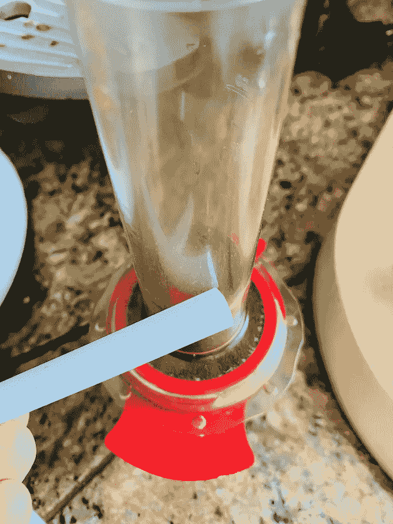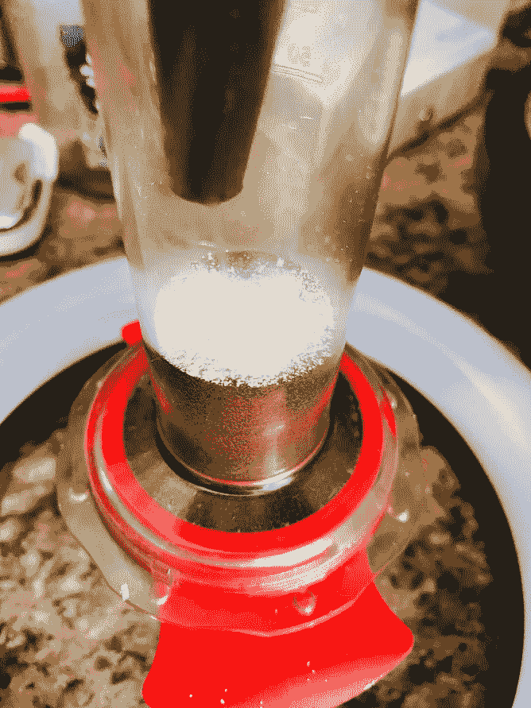

作者提供的图片与本文中的所有图片一样

# 首次测试

在测试过程中，我没有观察到粉笔移动到更深的冰球。当水进入试管时，粉笔在水中扬起，即使施加了压力，粉笔似乎也没有受到太大影响。这可能是由于粉末的表面积很小，压力作用很小。

移动水的主要因素是压力，压力导致流动，但流动只能推动相对于表面积的粒子。所以我怀疑在咖啡床移动和不紧密的方法中会发生细微的迁移，但在浓缩咖啡中，这似乎很难证明。

我兴奋地把冰球拉了出来，它碎了。但是我没有看到比顶端更深的粉笔。

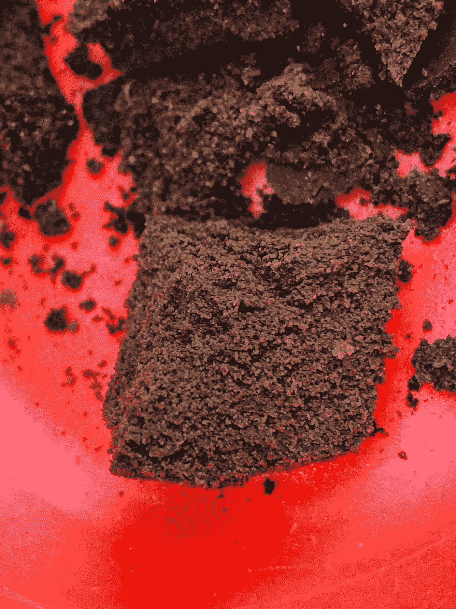

# 第二次测试

所以我用更多的粉笔再次测试。投篮后，当我把冰球拿出来时，我更加注意了。[这里的](https://youtu.be/6qC9uBcqkKg)是视频的链接。

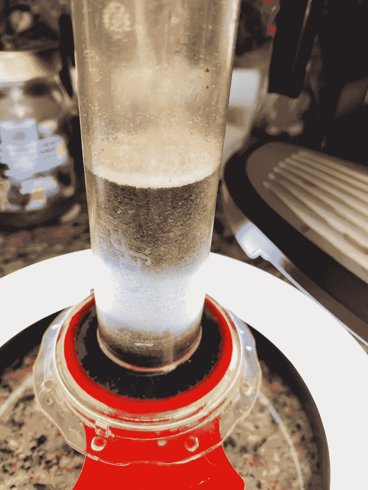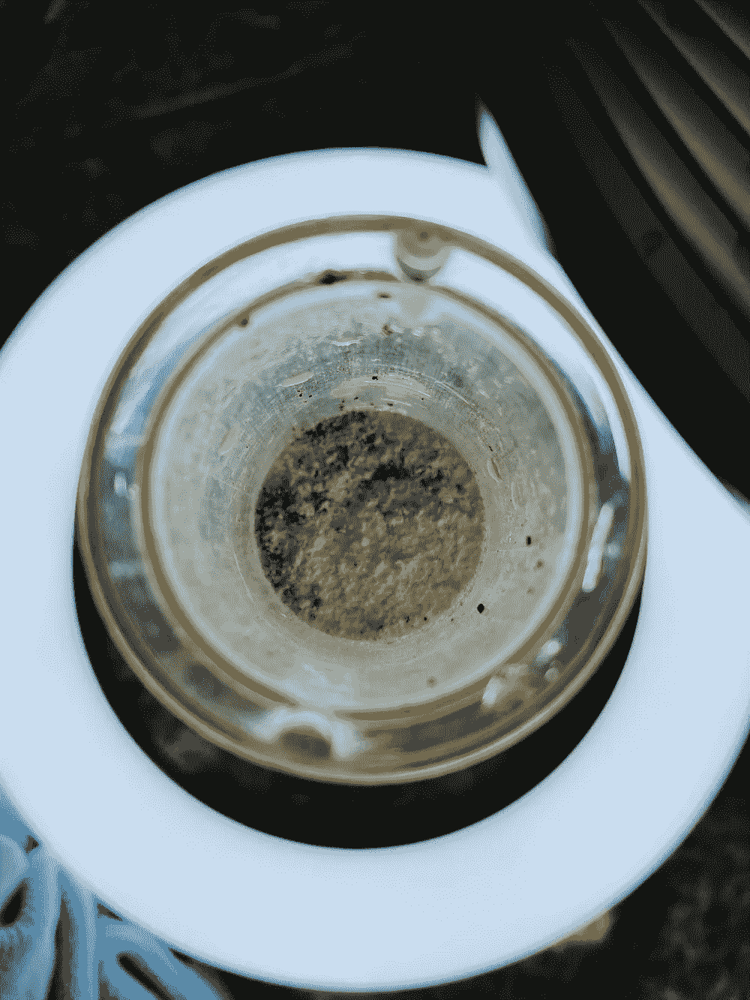

视频中的一些图片。我希望看到细颗粒从侧面流下，如果他们考虑到流动通常在中心之前从过滤器或管子的侧面流下。

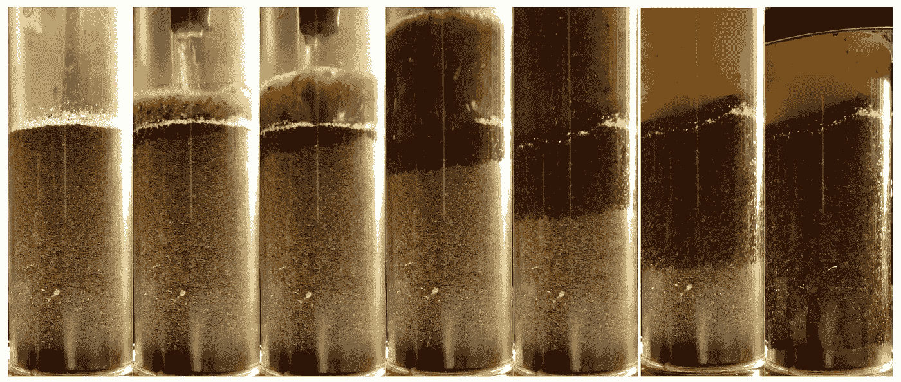

我只在冰球顶部发现了粉笔。我用多种方法切割冰球，除了粉笔深入的顶部，我没有观察到任何一层。

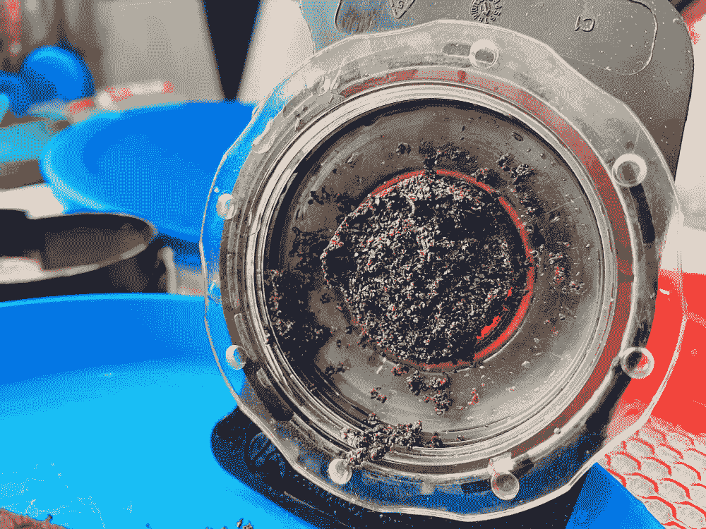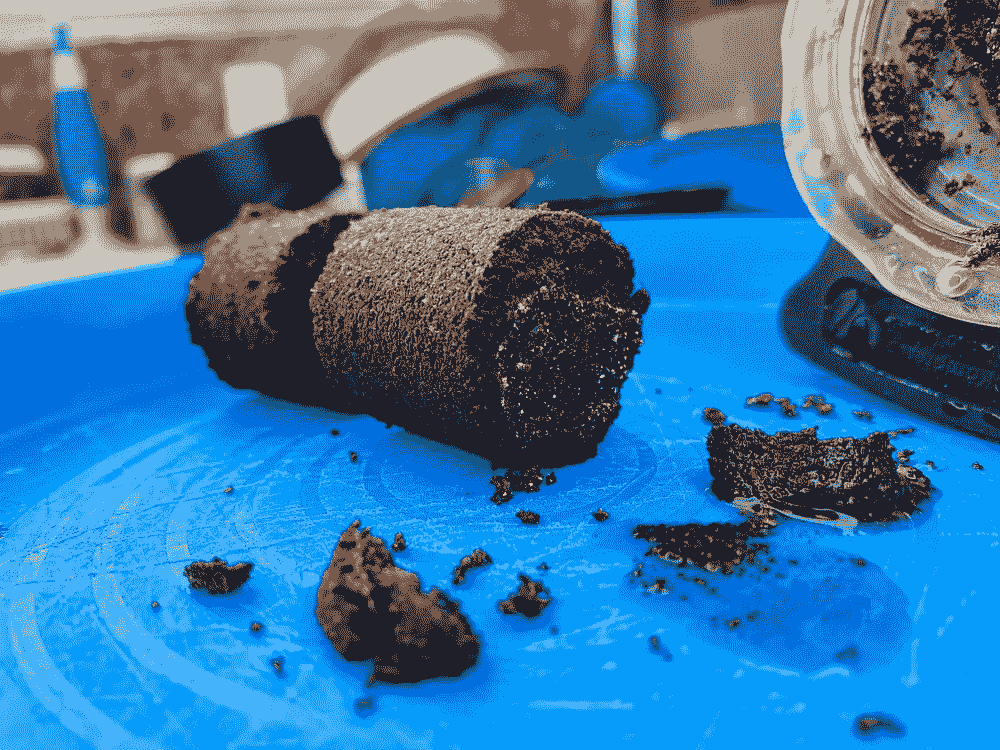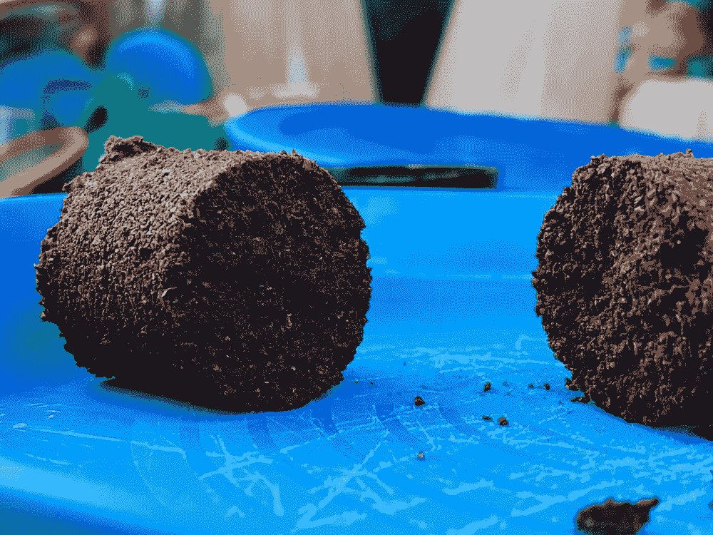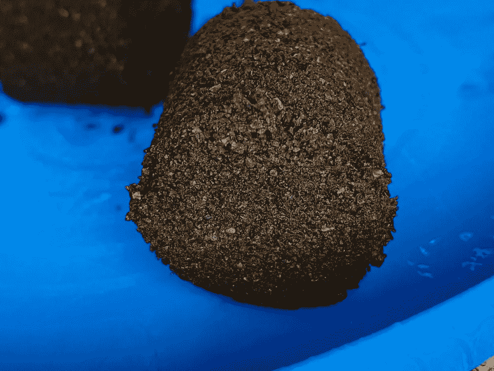

这是一个横截面，粉笔只出现在顶部。

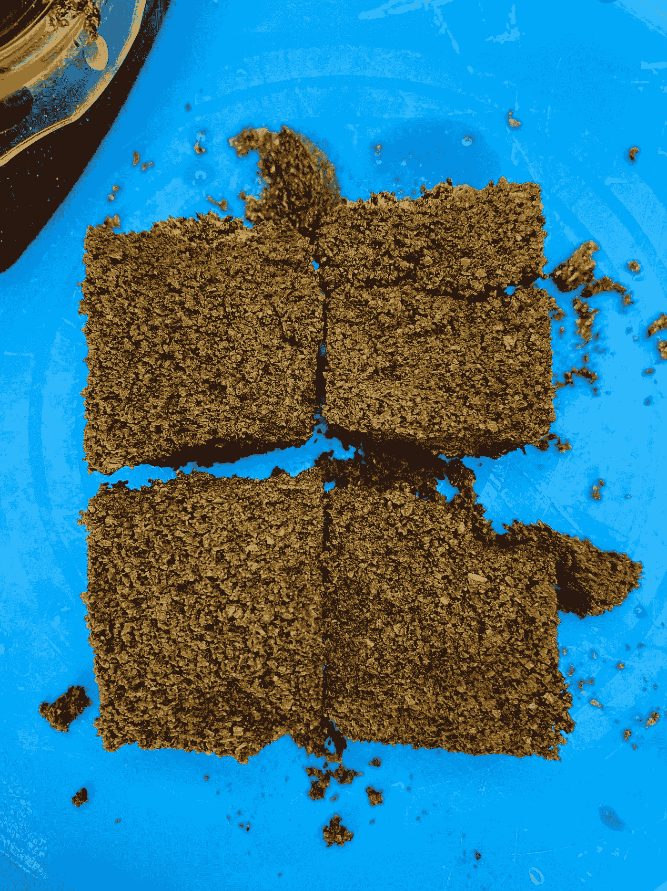

图像的底部是过滤器的底部

这是另一个更近的观察。

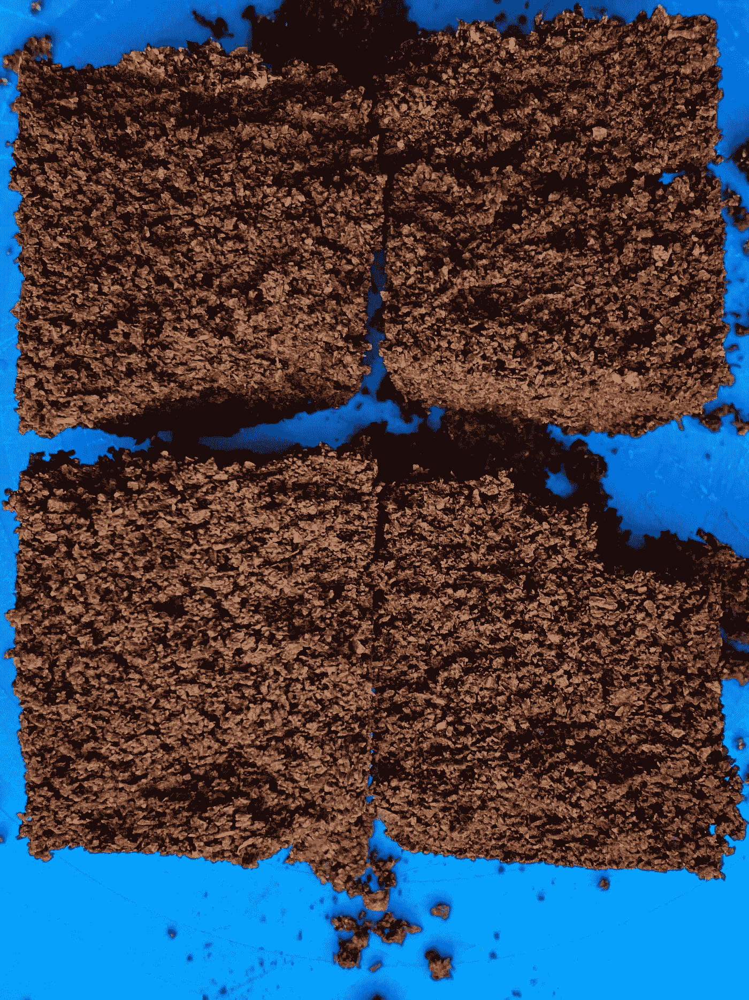

放大

多拍几张照片以防其他的不可信。

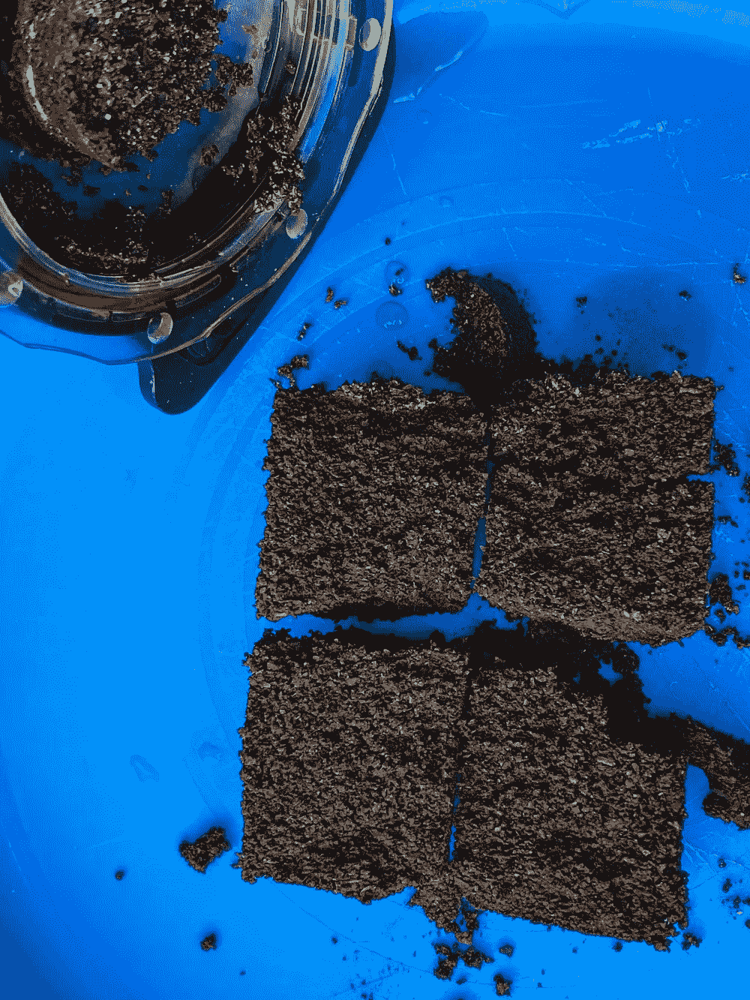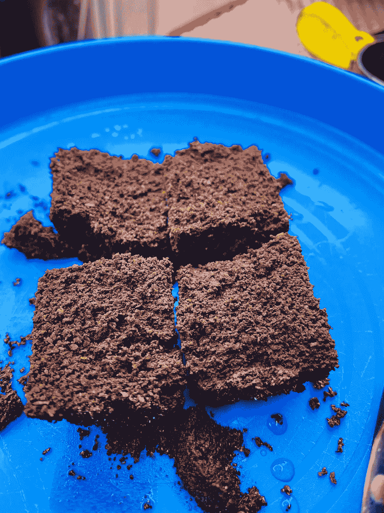

左图:显示了底部的底部和靠近过滤器的顶部，在那里过滤器被推出。右:在图像底部显示圆盘的顶部。

这个简单的实验并没有显示出浓缩咖啡的细微迁移的证据。没有发现比顶部更深的测试微粒。一些观察表明，由于表面积较小，当施加更多压力时，细颗粒会旋转，不会比其他颗粒被推得更低。

如果你愿意，可以在 Twitter 和 YouTube 上关注我，我会在那里发布不同机器上的浓缩咖啡视频和浓缩咖啡相关的东西。你也可以在 [LinkedIn](https://www.linkedin.com/in/robert-mckeon-aloe-01581595?source=post_page---------------------------) 上找到我。也可以关注我[中](http://medium.com/@rmckeon/follow)。

# 我的进一步阅读:

[按地区、工艺、等级和价格分类的咖啡](/coffees-by-region-process-grade-and-price-7e17c3c44baf)

[家庭烘焙咖啡的经济学](/the-economics-of-home-roasting-coffee-93003ea31ee8)

[咖啡豆脱气](/coffee-bean-degassing-d747c8a9d4c9)

[解构咖啡:分割烘焙、研磨和分层以获得更好的浓缩咖啡](/deconstructed-coffee-split-roasting-grinding-and-layering-for-better-espresso-fd408c1ac535)

[浓缩咖啡的预浸:更好的浓缩咖啡的视觉提示](/pre-infusion-for-espresso-visual-cues-for-better-espresso-c23b2542152e)

[咖啡的形状](/the-shape-of-coffee-fa87d3a67752)

搅拌还是旋转:更好的浓缩咖啡体验

[香辣意式浓缩咖啡:热磨，冷捣以获得更好的咖啡](/spicy-espresso-grind-hot-tamp-cold-36bb547211ef)

[断续浓缩咖啡:提升浓缩咖啡](https://link.medium.com/vmI2zVeQabb)

[用纸质过滤器改进浓缩咖啡](/the-impact-of-paper-filters-on-espresso-cfaf6e047456)

[浓缩咖啡中咖啡溶解度的初步研究](/coffee-solubility-in-espresso-an-initial-study-88f78a432e2c)

[断奏捣固:不用筛子改进浓缩咖啡](/staccato-tamping-improving-espresso-without-a-sifter-b22de5db28f6)

[浓缩咖啡模拟:计算机模型的第一步](https://towardsdatascience.com/@rmckeon/espresso-simulation-first-steps-in-computer-models-56e06fc9a13c)

[压力脉动带来更好的浓缩咖啡](/pressure-pulsing-for-better-espresso-62f09362211d)

[咖啡数据表](https://towardsdatascience.com/@rmckeon/coffee-data-sheet-d95fd241e7f6)