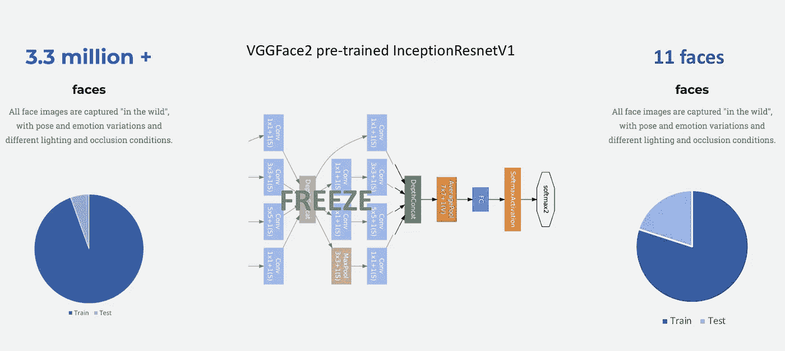
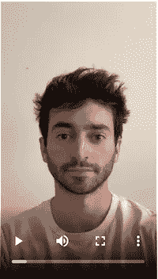
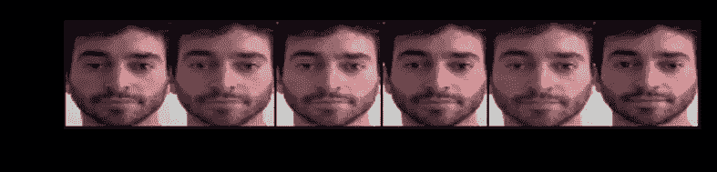
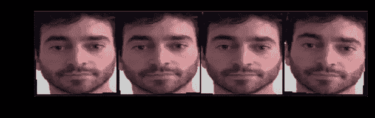
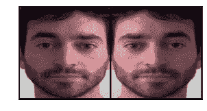
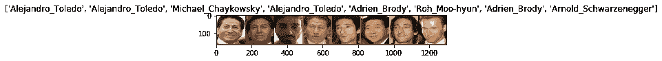
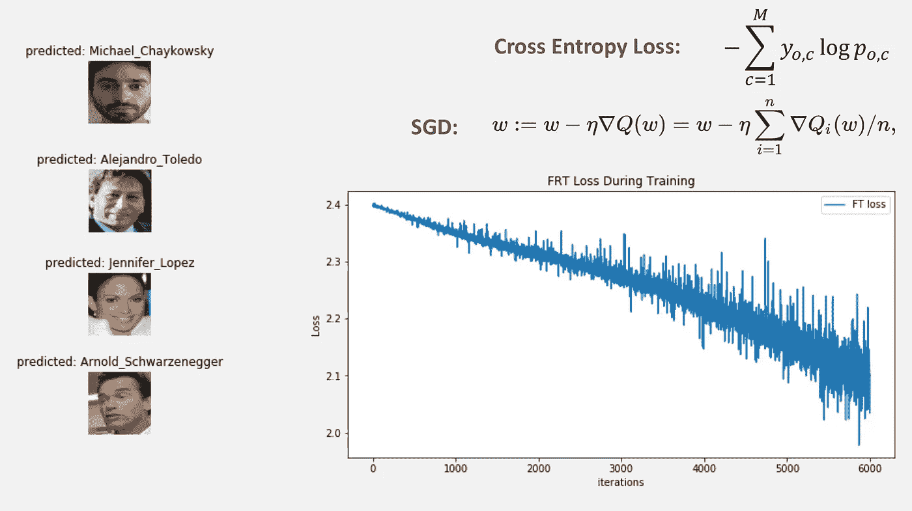

# 使用 PyTorch 微调面部识别分类器来识别您的面部

> 原文：<https://towardsdatascience.com/finetune-a-facial-recognition-classifier-to-recognize-your-face-using-pytorch-d00a639d9a79?source=collection_archive---------12----------------------->

## 利用 GANs 的对抗性攻击来欺骗面部识别系统。


这是我正在写的一个系列的一部分，关于利用 GANs 的对抗性攻击来欺骗面部识别系统。

然而，在我们欺骗面部识别分类器之前，我们需要建立一个来欺骗。我个人想造一个能识别自己脸的。我可以从一个预先训练好的网络开始，然后微调它来识别我的脸，而不是从头开始训练神经网络。微调是非常有益的，因为我们可以从已经在大规模人脸数据库上训练的模型权重开始，然后更新其中的一些权重，以反映我们希望它执行的新任务。这些权重已经知道如何识别人脸，但唯一的区别是它不知道我的脸。因此，让这个预训练的模型学习我自己的脸要容易得多，因为模型权重已经包含了执行任务所需的大部分信息。

# 目录结构

```
project
│   README.md
│   AGN.ipynb  
│
└───data
│   │   files_sample.csv
│   └───eyeglasses
│   │
│   └───test_me
│       └───train
|           └───Adrien_Brody
|           ...
|           └───Michael_Chaykowsky
|           ...
|           └───Venus_Williams
│       └───val
|           └───Adrien_Brody
|           ...
|           └───Michael_Chaykowsky
|           ...
|           └───Venus_Williams
│   
└───models
│   │   inception_resnet_v1.py
│   │   mtcnn.py
│   └───utils
```

`models`目录来自基于上面链接的 Tensorflow 实现的 [PyTorch facenet 实现](https://github.com/timesler/facenet-pytorch/tree/master/models)。

```
└───models
│   │   inception_resnet_v1.py
│   │   mtcnn.py
│   └───utils
```

这个`inception_resnet_v1.py`文件是我们将引入预训练模型的地方。Inception Resnet V1 模型在 [VGGFace2](http://www.robots.ox.ac.uk/~vgg/data/vgg_face2/) 上进行了预训练，其中 VGGFace2 是从谷歌图像搜索中开发的大规模人脸识别数据集，并且“在姿势、年龄、光照、种族和职业方面有很大的变化”

模型中每层的权重都有一个名为`requires_grad`的属性，可以设置为`True`或`False`。当您在训练循环中运行`loss.backward()`时，这些权重会更新，这包含了执行预测所需的所有信息。当微调网络时，我们*通过将`requires_grad`属性设置为`False`冻结*最后一个卷积块的所有层，然后只更新剩余层上的权重——直观地，您可以想象早期的层包含识别人脸属性和基本层特征所需的基本层信息，因此我们在更新最终层以包括另一张人脸(我的)的同时保持所有性能。



所有的`train`目录都有每个人的 11 或 12 个图像，所有的`val`目录都有每个人的 4 或 5 个图像。`Michael_Chaykowsky`是我的脸部目录，在那里我使用了各种姿势、灯光和角度。为了收集这些图像，我用标准的 iPhone 在不同的空间拍摄了视频，然后将这些视频转换为图像，并在每个视频上使用 MTCNN 进行面部对齐和裁剪到适当的大小(160 x 160 像素)。

# 进口

```
**from** torch **import** nn, optim, as_tensor
**from** torch.utils.data **import** Dataset, DataLoader
**import** torch.nn.functional **as** F
**from** torch.optim **import** lr_scheduler
**from** torch.nn.init **import** *
**from** torchvision **import** transforms, utils, datasets, models
**from** models.inception_resnet_v1 **import** InceptionResnetV1**import** cv2
**from** PIL **import** Image
**from** pdb **import** set_trace
**import** time
**import** copy**from** pathlib **import** Path
**import** os
**import** sys
**import** matplotlib.pyplot **as** plt
**import** matplotlib.animation **as** animation
**from** skimage **import** io, transform
**from** tqdm **import** trange, tqdm
**import** csv
**import** glob
**import** dlib**import** pandas **as** pd
**import** numpy **as** np
```

# 用于人脸对齐的多任务级联卷积神经网络

```
**from** IPython.display **import** VideoVideo("data/IMG_2411.MOV", width=200, height=350)
```



我旋转脸的视频

将视频帧捕获为`.png`文件，并旋转/裁剪/对齐。

```
vidcap = cv2.VideoCapture('IMG_2411.MOV')
success,image = vidcap.read()
count = 0
success = **True**
**while** success:
    cv2.imwrite(f"./Michael_Chaykowsky/Michael_Chaykowsky_{
                  format(count, '04d') }.png", image)
    success,image = vidcap.read()
    print('Read a new frame: ', success)
    count += 1
```

这些图像是旋转的，所以我用`imagemagick`让它们正面朝上。确保先进行`brew install imagemagick`。我认为有另一种方法来安装这个库，但如果我回忆起来这是一个噩梦——所以一定要建议`brew install`。

```
%%!
**for** szFile **in** ./Michael_Chaykowsky/*.png
**do** 
    magick mogrify -rotate 90 ./Michael_Chaykowsky/"$(basename "$szFile")" ; 
**done**
```

`! pip install autocrop`

Autocrop 有一个很好的功能，他们可以调整人脸图像的大小，并且你可以指定人脸的百分比。如果你使用的是完整的 MTCNN 方法，你可以放弃这个方法(*preferred*)，但如果不是，你可以这样做，这要容易得多。

```
! autocrop -i ./me_orig/Michael_Chaykowsky -o ./me/Michael_Chaykowsky160 -w 720 -H 720 --facePercent 80
```

`! pip install tensorflow==1.13.0rc1`

`! pip install scipy==1.1.0`

现在使用 facenet 的[大卫·桑德伯格 Tensorflow 实现](https://github.com/davidsandberg/facenet)中的`align_dataset_mtcnn.py`脚本，我们可以将它应用到人脸图像目录中。

```
%%!
**for** N **in** {1..4}; **do** \
python ~/Adversarial/data/align/align_dataset_mtcnn.py \ # tensorflow script
~/Adversarial/data/me/ \ # current directory
~/Adversarial/data/me160/ \ # new directory
--image_size 160 \
--margin 32 \
--random_order \
--gpu_memory_fraction 0.25 \
& **done**
```

现在你已经有了一个目录，所有的面都被对齐并适当地裁剪以用于建模。

# 加载数据

当我们加载数据时，我们将对图像进行一些随机变换，以改善训练。可以尝试不同的转换，您可以尝试不同的转换，例如



随机颜色抖动



随机旋转+/- 5 度



随机水平翻转

这里我使用随机水平翻转。所有这些变换使模型更具普遍性，并防止过度拟合。

```
data_transforms = {
    '**train**': transforms.Compose([
        transforms.RandomHorizontalFlip(),
        transforms.ToTensor(),
        transforms.Normalize([0.485, 0.456, 0.406], [0.229, 0.224, 0.225])
    ]),
    '**val**': transforms.Compose([
        transforms.ToTensor(),
        transforms.Normalize([0.485, 0.456, 0.406], [0.229, 0.224, 0.225])
    ]),
}data_dir = 'data/test_me'
image_datasets = {x: datasets.ImageFolder(os.path.join(data_dir, x),
                                          data_transforms[x])
                  **for** x **in** ['train', 'val']}
dataloaders = {x: torch.utils.data.DataLoader(image_datasets[x],
                                              batch_size=8, 
                                             shuffle=True)
              **for** x **in** ['train', 'val']}
dataset_sizes = {x: **len**(image_datasets[x]) **for** x **in** ['train','val']}
class_names = image_datasets['train'].classes
class_names
```

**Out[1]:**

`['Adrien_Brody','Alejandro_Toledo','Angelina_Jolie','Arnold_Schwarzenegger','Carlos_Moya','Charles_Moose','James_Blake','Jennifer_Lopez','Michael_Chaykowsky','Roh_Moo-hyun','Venus_Williams']`

```
**def** imshow(inp, title=**None**):
    """Imshow for Tensor."""
    inp = inp.numpy().transpose((1, 2, 0))
    mean = np.array([0.485, 0.456, 0.406])
    std = np.array([0.229, 0.224, 0.225])
    inp = std * inp + mean
    inp = np.clip(inp, 0, 1)
    plt.imshow(inp)
    **if** title **is** **not** **None**:
        plt.title(title)
    plt.pause(0.001)  # pause a bit so that plots are updated# Get a batch of training data
inputs, classes = **next**(**iter**(dataloaders['train']))# Make a grid from batch
out = utils.make_grid(inputs)imshow(out, title=[class_names[x] **for** x **in** classes])
```



# 获取 VGGFace2 数据集上的预训练 ResNet

```
**from** models.inception_resnet_v1 **import** InceptionResnetV1**print**('Running on device: {}'.format(device))model_ft = InceptionResnetV1(pretrained='vggface2', classify=**False**, num_classes = **len**(class_names))
```

# 冻结早期层

回想之前我提到过，我们将冻结穿过最后一个 conv 街区。为了找到它的位置，我们可以使用`-n, -n-1, ...`遍历这个列表，直到找到这个块。

`list(model_ft.children())[-6:]`

**Out[2]:**

```
[Block8(
   (branch0): BasicConv2d(
     (conv): Conv2d(1792, 192, kernel_size=(1, 1), stride=(1, 1), bias=False)
     (bn): BatchNorm2d(192, eps=0.001, momentum=0.1, affine=True, track_running_stats=True)
     (relu): ReLU()
   )
   (branch1): Sequential(
     (0): BasicConv2d(
       (conv): Conv2d(1792, 192, kernel_size=(1, 1), stride=(1, 1), bias=False)
       (bn): BatchNorm2d(192, eps=0.001, momentum=0.1, affine=True, track_running_stats=True)
       (relu): ReLU()
     )
     (1): BasicConv2d(
       (conv): Conv2d(192, 192, kernel_size=(1, 3), stride=(1, 1), padding=(0, 1), bias=False)
       (bn): BatchNorm2d(192, eps=0.001, momentum=0.1, affine=True, track_running_stats=True)
       (relu): ReLU()
     )
     (2): BasicConv2d(
       (conv): Conv2d(192, 192, kernel_size=(3, 1), stride=(1, 1), padding=(1, 0), bias=False)
       (bn): BatchNorm2d(192, eps=0.001, momentum=0.1, affine=True, track_running_stats=True)
       (relu): ReLU()
     )
   )
   (conv2d): Conv2d(384, 1792, kernel_size=(1, 1), stride=(1, 1))
 ),
 AdaptiveAvgPool2d(output_size=1),
 Linear(in_features=1792, out_features=512, bias=False),
 BatchNorm1d(512, eps=0.001, momentum=0.1, affine=True, track_running_stats=True),
 Linear(in_features=512, out_features=8631, bias=True),
 Softmax(dim=1)]
```

移除 conv 块后的最后几层，放入`layer_list`。

```
layer_list = list(model_ft.children())[-5:] # all final layers
layer_list
```

**Out[3]:**

```
[AdaptiveAvgPool2d(output_size=1),
 Linear(in_features=1792, out_features=512, bias=False),
 BatchNorm1d(512, eps=0.001, momentum=0.1, affine=True, track_running_stats=True),
 Linear(in_features=512, out_features=8631, bias=True),
 Softmax(dim=1)]
```

将所有开始的层放在一个`nn.Sequential`中。`model_ft`现在是一个火炬模型，但没有最终的线性，汇集，batchnorm 和 sigmoid 层。

```
model_ft = nn.Sequential(***list**(model_ft.children())[:-5])
```

如果训练只是最后一层:

```
**for** param **in** model_ft.parameters():
    param.requires_grad = **False**
```

重新连接自动设置`requires_grad = True`的最后 5 层。

这个线性层`Linear(in_features=1792, out_features=512, bias=False)`实际上需要编写两个自定义类，这看起来不太明显，但是如果你查看数据输入/输出，你可以看到在这个层中有一个扁平化和正常化类。[检查 resnet 实现](https://github.com/pytorch/vision/blob/3d5610391eaef38ae802ffe8b693ac17b13bd5d1/torchvision/models/resnet.py#L203)在`last_linear`层整形的原因。

```
**class** Flatten(nn.Module):
    **def** __init__(self):
        **super**(Flatten, self).__init__()

    **def** forward(self, x):
        x = x.view(x.size(0), -1)
        **return** x**class** normalize(nn.Module):
    **def** __init__(self):
        **super**(normalize, self).__init__()

    **def** forward(self, x):
        x = F.normalize(x, p=2, dim=1)
        **return** x
```

然后，您可以将最后的层应用回新的顺序模型。

```
model_ft.avgpool_1a = nn.AdaptiveAvgPool2d(output_size=1)
model_ft.last_linear = nn.Sequential(
    Flatten(),
    nn.Linear(in_features=1792, out_features=512, bias=False),
    normalize()
)
model_ft.logits = nn.Linear(layer_list[3].in_features, len(class_names))
model_ft.softmax = nn.Softmax(dim=1)model_ft = model_ft.to(device)criterion = nn.CrossEntropyLoss()# Observe that all parameters are being optimized
optimizer_ft = optim.SGD(model_ft.parameters(), lr=1e-2, momentum=0.9)# Decay LR by a factor of *gamma* every *step_size* epochs
exp_lr_scheduler = lr_scheduler.StepLR(optimizer_ft, step_size=7, gamma=0.1)
```

# 火车

```
**def** train_model(model, criterion, optimizer, scheduler,
                num_epochs=25):
    since = time.time()
    FT_losses = []
    best_model_wts = copy.deepcopy(model.state_dict())
    best_acc = 0.0 **for** epoch **in** **range**(num_epochs):
        **print**('Epoch {}/{}'.format(epoch, num_epochs - 1))
        **print**('-' * 10) # Each epoch has a training and validation phase
        **for** phase **in** ['train', 'val']:
            **if** phase **==** 'train':
                model.train()  # Set model to training mode
            **else**:
                model.eval()   # Set model to evaluate mode running_loss = 0.0
            running_corrects = 0 # Iterate over data.
            **for** inputs, labels **in** dataloaders[phase]:
                inputs = inputs.to(device)
                labels = labels.to(device) # zero the parameter gradients
                optimizer.zero_grad() # forward
                # track history if only in train
                **with** torch.set_grad_enabled(phase == 'train'):
                    outputs = model(inputs)
                    _, preds = torch.max(outputs, 1)
                    loss = criterion(outputs, labels) # backward + optimize only if in training phase
                    **if** phase **==** 'train':
                        loss.backward()
                        optimizer.step()
                        scheduler.step()

                FT_losses.append(loss.item())
                # statistics
                running_loss += loss.item() * inputs.size(0)
                running_corrects += torch.sum(preds == labels.data) epoch_loss = running_loss / dataset_sizes[phase]
            epoch_acc = running_corrects.double() /
                         dataset_sizes[phase] **print**('{} Loss: {:.4f} Acc: {:.4f}'.format(
                phase, epoch_loss, epoch_acc)) # deep copy the model
            **if** phase **==** 'val' **and** epoch_acc > best_acc:
                best_acc = epoch_acc
                best_model_wts = copy.deepcopy(model.state_dict()) time_elapsed = time.time() - since
    **print**('Training complete in {:.0f}m {:.0f}s'.format(
        time_elapsed // 60, time_elapsed % 60))
    **print**('Best val Acc: {:4f}'.format(best_acc)) # load best model weights
    model.load_state_dict(best_model_wts)
    **return** model, FT_losses
```

# 评价

```
model_ft, FT_losses = train_model(model_ft, criterion, optimizer_ft, exp_lr_scheduler, num_epochs=500)plt.figure(figsize=(10,5))
plt.title("FRT Loss During Training")
plt.plot(FT_losses, label="FT loss")
plt.xlabel("iterations")
plt.ylabel("Loss")
plt.legend()
plt.show()
```



# 还会有更多

请关注本系列的更多内容，我将描述如何使用 GANs 的对抗性攻击来欺骗这个分类器。

