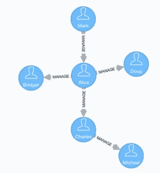
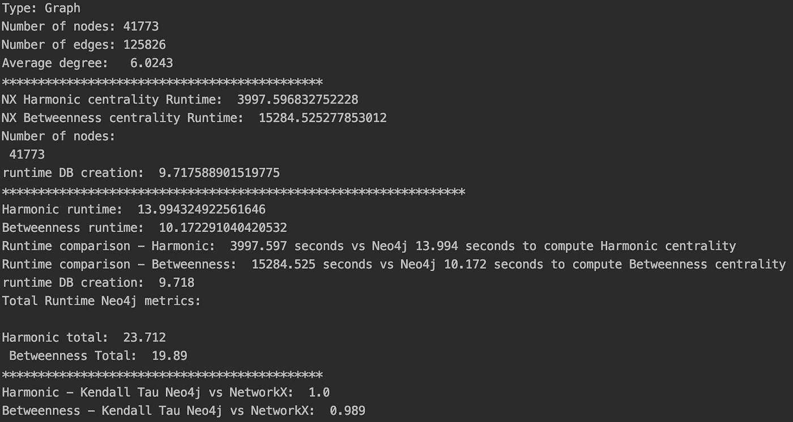

# 启动你的中心性度量引擎:Neo4j vs NetworkX——一场各种各样的拉力赛…

> 原文：<https://towardsdatascience.com/fire-up-your-centrality-metric-engines-neo4j-vs-networkx-a-drag-race-of-sorts-18857f25be35?source=collection_archive---------25----------------------->


埃洛伊·卡拉斯科在 [Unsplash](https://unsplash.com/s/photos/drag-race?utm_source=unsplash&utm_medium=referral&utm_content=creditCopyText) 上拍摄的照片

在本文中，我和 Mark Needham 在 Python NetworkX 包和 [Neo4j 图形数据科学库](https://neo4j.com/developer/graph-data-science/)之间进行了一场赛跑。在这场比赛中，我们让他们比赛，看谁在计算无向图的介数和调和中心度方面最快。我们还将使用 [Neo4j Python 驱动程序](https://neo4j.com/developer/python/)，这样我们甚至不需要离开 Python IDE 的舒适环境。

**为什么选择 NetworkX？**

NetworkX 包是最老的产品，早在 2008 年就发布了(…那时候 Neo4j 还在早餐喝热巧克力…)。从很多方面来看，它仍然是最流行的网络分析 Python 包，事实上，根据我们的统计，至少有四本关于网络分析的书籍使用 NetworkX 包作为他们的主力。

**哪种中心性指标？**
如前所述，我们关注两个重要的网络中心性度量:中间性[和调和中心性](https://en.wikipedia.org/wiki/Betweenness_centrality)[度量。介数度量基于通过它的最短路径的分数来测量节点的重要性，因此它也经常被视为它捕获了多少“信息流”。如下图所示:如果 Alice 离开，许多节点将会孤立。](https://en.wikipedia.org/wiki/Harmonic)



[Neo4j 图像](https://neo4j.com/docs/graph-algorithms/current/labs-algorithms/betweenness-centrality/)

调和中心性度量是对接近度度量的改进，因此也是“基于距离”的度量，其中高分意味着该特定节点平均来说可以以更少的跳数到达其他节点。正如我们在前一篇文章中所讨论的；根据 [Boldi & Vigna](https://www.tandfonline.com/doi/abs/10.1080/15427951.2013.865686) 的说法，这是一种“黄金标准”。

我们将本文分为两个主要部分:首先探索 Neo4j 数据库和 Python 驱动程序以及 NetworkX 算法的设置，在第二部分，我们对竞争对手的实际性能进行实验和评论。

## 为比赛做准备…

关于如何在 Neo4j 中创建数据库以及 Python 驱动程序的一个很棒的帖子是由[杨](/neo4j-cypher-python-7a919a372be7)发表的。然而，我们要做的改变是让 Neo4j Python 驱动程序从数据库的“导入”目录中读取文件(与亦舒文章中的 URL 相反)。当我们想要对多个不同的文件执行网络分析时，这是很方便的，我们稍后将回到这一点。最后一步，我们通过“pip install neo4j”在我们的环境中安装 Neo4j Python 驱动程序，或者通过在 PyCharm 中将驱动程序作为一个包加载来更容易地安装。

## 使用 Neo4j Python 驱动程序构建数据库。

从下面的代码可以看出；只需几行简单的代码就可以访问 Neo4j 丰富的工具和功能。我们首先实例化驱动程序，其中参数是 bolt 连接器，我们可以在 Neo4j 浏览器中找到，然后是用户和密码的验证，这是我们在创建项目时建立的。

接下来，我们定义希望驱动程序执行的 Neo4j 查询，这些查询需要用[密码](https://neo4j.com/developer/cypher/)语言编写。两个主要语句中的第一个将在图的节点上创建一个约束，以确保它是唯一的。该约束还将在 Node(id)属性上创建一个索引，这将显著提高运行时间。第二个查询是创建数据库的标准 Cypher 语句，就像我们在 Neo4j 环境中使用的一样，我们还确保文件路径在文件名前引用了一个 **file:///** 前缀。

我们现在准备运行驱动程序会话，我们分两步执行。第一次运行使用“创建或替换数据库”语句，该语句针对系统数据库执行，并允许“动态”创建数据库。第二次运行执行约束创建语句和数据库导入语句。作为一项安全检查，我们还将节点算作一个查询。

## 在 Neo4j 中计算中心性度量

插入数据后，我们可以使用 Neo4j 图形数据库(GDS)计算中心性指标。使用 Cypher 调用 GDS 过程没有什么特别之处，如下面的代码所示，当检索到相应的指标时，我们需要进行一些格式化，以便测量 Neo4j 和 NetworkX 输出之间的准确性。我们通过使用 [Kendall Tau](https://en.wikipedia.org/wiki/Kendall_rank_correlation_coefficient) 度量，调用“scipy”库来实现这一点，该库要求两个列表在一个“numpy”数组中。为此，我们调用了我们的 Pandas 朋友，在那里我们对结果进行降序排序，然后需要格式化成一个 numpy 数组，以便在我们的准确性测试中使用。

作为安全措施，我们再次将数据保存到 csv 文件中。当然，这并不是绝对必要的，但是因为我们希望从一个脚本中运行所有的东西，其原因将在稍后变得清楚，当事情出错时，它将被证明是有价值的。

在我们进入 NetworkX 引擎之前，先简单介绍一下我们使用的真实网络。从斯坦福的快照数据库中，我们选择了 http://snap.stanford.edu/data/gemsec-Deezer.html[的 Deezer RO 设置。这是一个友谊网络，无向，来自音乐流媒体服务 Deezer，由 41，773 个节点和 125，826 条边组成。](http://snap.stanford.edu/data/gemsec-Deezer.html)

## 准备好我们的 NetworkX 引擎

我们现在可以漫步到 NextworkX pitlane。Deezer RO 网络有一个简单的边列表，我们使用 NetworkX 函数来加载图形:

```
G = nx.read_edgelist(RW_network, nodetype=int, comments='#',
                     delimiter=',', create_using=nx.Graph(), encoding='utf-8')
```

NetworkX centrality 函数同样简单明了:

```
HC_nx = nx.harmonic_centrality(G)
BC_nx = nx.betweenness_centrality(G)
```

最后，我们再一次要求我们的熊猫朋友带来一些结构，但是我们也需要使值正常化。这里我们应用与 Neo4j 算法相同的方法，简单地除以节点数— 1。

两个引擎都准备好了，我们可以将它们滚动到起始网格上，在下面的 Python 脚本中，我们对每个函数调用进行了计时:

## 让游戏开始吧！

当按下绿色的“Run”按钮时，我们看到 NetworkX 首先在几秒钟内构建了图形，而 Neo4j 使用 Python 驱动程序花费了 9.7 秒。然而，对于 NetworkX 来说，这已经是最好的了。对于调和中心性，Neo4j GDS 仅用了 14 秒就返回了 41，773 个中心性值…网络花了 3，997 秒穿过终点线…(即 1 小时 6 分钟)。当计算 Kendall Tau 时，两个列表完全匹配，得分为 1.00。计算介数中心性变得有些尴尬——Neo4j 在 10 秒内返回一点点值。NetworkX 在 15，284 秒内爬完这条线，大约 4 小时 15 分钟。Kendall Tau 的中间值为 0.986，这只是略微偏离，可能是由于一些平局或浮点差异(使用的硬件:macOS，3.1 GHz 双核英特尔酷睿 i5，8GB 内存)。



## 对速度的需求

Neo4j GDS 算法的神奇之处是双重的。对于谐波中心性，Neo4j GDS 算法利用多源广度优先搜索方法，这是一种允许在单个 CPU 内核上对同一图形运行多个并发 BFS 的算法。运行介数中心性时，NetworkX 算法在单线程上执行。相比之下，Neo4j GDS 平均划分节点空间，然后对每个分区中的每个节点运行 Brandes 算法，因此它应用了多线程方法。

## 结论

众所周知，NetworkX 是一个相当慢的包，但这个练习表明，对于中型到大型无向图，Neo4j GDS 成为首选引擎。此外，使用我们之前提到的更改 Neo4j 设置的便利技巧，可以完全使用 Neo4j Python 驱动程序来完成图表分析，因此它允许使用简单的 Python 循环对存储在“import”目录中的一组不同图表进行分析。使用 NetworkX 需要几天时间来分析的一组 50-100k 节点的图表，比如说 20 个，现在可以在几个小时内完成。

王高·a·哈格伯格、丹尼尔·a·舒尔特和彼得·j·斯沃特，[“使用 NetworkX 探索网络结构、动力学和功能”](http://conference.scipy.org/proceedings/SciPy2008/paper_2/)，载于[第七届 Python 科学会议论文集(SciPy2008)](http://conference.scipy.org/proceedings/SciPy2008/index.html) ，格尔·瓦洛夸、特拉维斯·沃特和贾罗德·米尔曼(编辑)，(美国加利福尼亚州帕萨迪纳)，第 11–15 页，2008 年 8 月

然后，Manuel 等人《越多越好:高效多源图遍历》*VLDB 基金会会议录*8.4(2014):449–460。