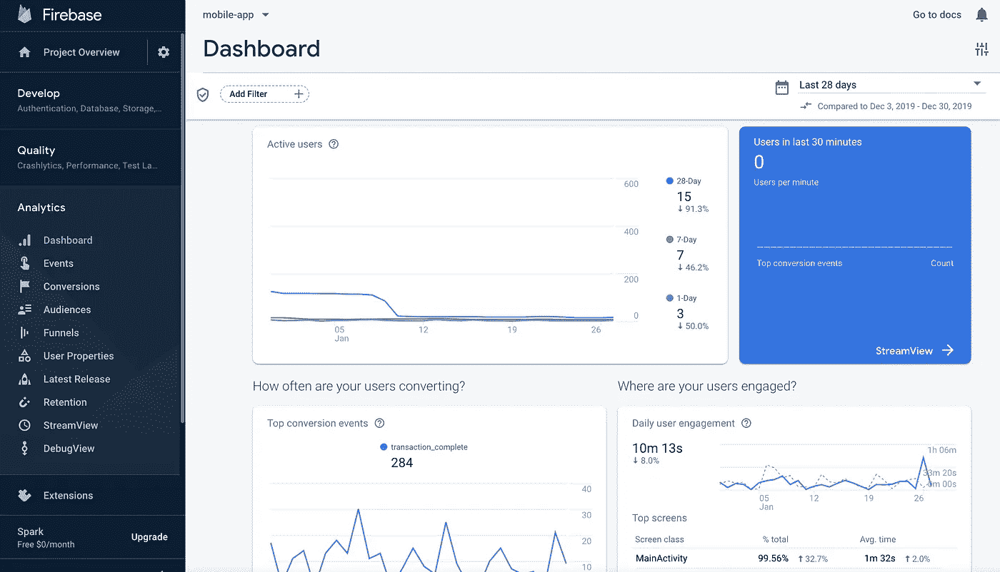
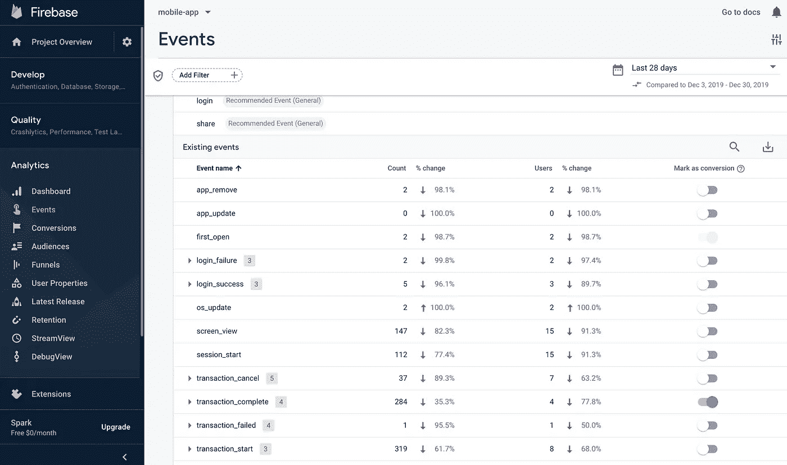
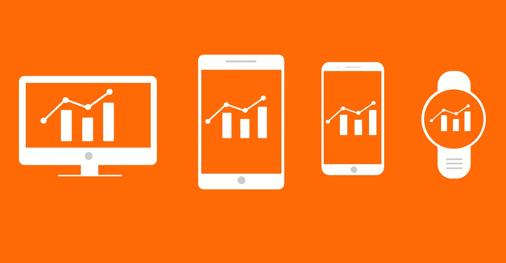
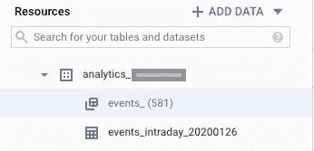
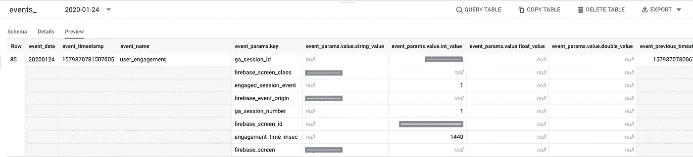

# 使用 Google BigQuery 的 Firebase 事件分析

> 原文：<https://towardsdatascience.com/firebase-event-analytics-with-google-bigquery-ec756230f768?source=collection_archive---------10----------------------->

## 帮助您开始应用分析的详尽指南

我开始从事事件分析。正如大多数移动应用程序一样，这个应用程序也链接到 Firebase 进行事件跟踪。这很难理解，尤其是因为网上关于这方面的资源有限。在进入这个系统 4 个月后，我有了一些理解和经验，我将在这篇关于 Firebase Analytics 的易于理解的帖子中分享。(这篇文章包括一些直接来自谷歌文档的信息)。我们开始吧！

> 多美啊，
> 坐在我的办公桌前，
> 望着窗外，看到整个城市，
> 在我眼前伸展开来
> 
> 混凝土丛林的尽头，以河流为标志，
> 贯穿整个城市
> 
> 一个世界，一个非常不同的世界住在河对岸。
> 好还是坏，你问。让我们不要用善良的尺度来衡量每件事，当所有的事情都是真实的时候，都是不同的。

# 什么是 Firebase Analytics？

正如 [wiki](https://en.wikipedia.org/wiki/Firebase) 所说， **Firebase** 提供了一个实时数据库和后端服务。该服务为应用开发者提供了一个 API，允许应用数据跨客户端(基本上是用户)同步，并存储在 **Firebase 的**云上。

**Firebase** 的核心是 Google **Analytics** ，这是一个 **analytics** 解决方案，它集成了 **Firebase** 的各种功能，并提供多达 500 个不同事件的报告，这些事件可以使用 **Firebase** SDK 来定义。

> 简而言之，Firebase 可以让你追踪你的用户在应用程序上做了什么(事件)，将其保存在云(实时数据库)上，还可以让你可视化这些数据。

下面是一个 Firebase 分析仪表板的截图。您可以选择查看不同时间段的性能。在仪表盘上，您将获得关于您的活跃用户、他们的参与度(他们在哪个屏幕上花了多长时间)、转化事件(例如，何时进行应用内购买)、您的受众的地理位置、他们的忠诚度、移动平台以及更多详细信息。



显示实时信息的 Firebase 分析仪表板

# 我们所说的事件是什么意思？

正如谷歌的文档所说，事件提供了对你的应用程序中正在发生的事情的洞察，比如用户操作、系统事件或错误。

## 自动事件

Firebase 会自动跟踪一些事件(和用户属性),例如应用程序安装后首次打开的事件、通知取消事件、操作系统更新或应用程序更新事件等。

## 自定义事件

除了自动事件之外，开发人员还可以创建自己的事件来跟踪用户活动或系统事件/错误。你的应用程序记录的事件总量没有限制。例如，如果你是一个约会应用程序，当用户在某人身上向右滑动时，或者当用户将搜索偏好从半径 5 公里更改为 500 公里时，你可以选择记录事件。如果你是一个电子商务应用程序，你可以选择在用户添加/删除购物车中的商品或者用户结账时记录一个事件。

## 事件记录

对于每个事件，firebase 都允许您跟踪一系列其他相关信息。它们可以被分组为**事件属性**(事件源自哪个屏幕，哪个用户 ID 被正确刷过，设置了什么新的搜索距离等等。)、**用户属性**(用户 ID、年龄、性别等。)、**设备属性**(设备类型、品牌、型号、操作系统、语言等。)、**位置属性**(事件起源的国家、地区、城市等。)、 **app 属性** (app 版本，安装 app 的商店)等。



为此移动应用配置的事件列表

如果您需要 Firebase dashboard 没有提供的问题的答案，您可以将您的分析数据连接到 BigQuery，它允许进行更复杂的分析，如查询大型数据集、与其他数据源连接、创建业务报告等。这就是我们接下来要讨论的。



[来源](https://pixabay.com/images/id-2156083/)

# 将数据带到 BigQuery

由于您希望将原始数据从 Firebase 导入 BigQuery，您可能会对进行用户级分析感兴趣，为此，您必须添加用户 ID，以便跨平台和设备跟踪用户。为什么？

Firebase 不会识别您平台上的唯一用户。它所做的只是跟踪名为 user_pseudo_id 的唯一应用实例的活动。这意味着，如果你卸载并重新安装你的约会应用程序，如果你更换了你的设备，或者如果你正在使用来自同一个提供商的多个应用程序，Firebase 不会自动通知这只是一个用户。为了能够在您的平台上识别个人，您需要自己为他们设置用户 id。设置用户 ID 后，您的所有活动都将自动标记为该值。

问题！如何设置用户 ID？如何将 Firebase 中的数据连接到 BigQuery？
回答——作为一名数据科学家，你不会做这种事。应用程序开发人员能够更好地为您完成这一切。这是来自 Google 的指南，他们可以用它将 Firebase 数据连接到 BigQuery。既然我们已经将原始数据推送到 BQ 中，那么让我们跳到 BigQuery 上来看看如何使用它！

# BigQuery 中的原始事件导出

*(我知道看起来很吓人:p)*

我从未见过有重复记录的表格，而这张就是。关于导出的数据，需要知道一些事情

*   在将一个 BQ 项目与 firebase 链接之后，第一次导出会创建一个名为 analytics_xxx 的数据集，其中 x 表示您的分析属性 ID(不要担心这一点)。



*   在这个数据集中，每天导出一个名为 events_YYYYMMDD 的表(按日期分区的 BQ 表)
*   您还会看到一个 events_intraday_ <date>表，这是一个用今天的原始事件更新的实时表。</date>
*   因为表是按天划分的，所以您可以查询某一天的单个表，也可以使用`FROM analytics_xxxxxxxxx.events_20200131 **OR**
    FROM analytics_xxxxxxxxx.events_*
    WHERE _table_suffix BETWEEN ‘20190201’ AND ‘20200131’`过滤多个表
*   这些表是事件级表，具有事件属性、用户属性、设备属性等的重复记录。这意味着，对于每个事件，将有多个事件属性被保存为键、值对(数组)而不是平面表格式，如下所示。



由于这种结构，会发生两件事，

*   您将无法使用常规 SQL 查询数据库。例如，当您想要为 user_gender 属性过滤您的雇佣事件时，您将不能简单地编写`**where user_gender = ‘Male’**`
*   你不能将这种表格结构导出到 Google Sheets 或者你的本地。

为了处理这种表格格式，让我们讨论一些查询风格和功能。

## UNNEST 函数

正如您可能已经猜到的那样，unnest 函数有助于使我们混乱的(起初)表格变平。`**UNNEST**`函数获取一个数组，并将其分解成每个单独的元素。例如，计算 1 月 20 日这一周应用程序中男性用户数量的查询将类似于-

```
SELECT count(DISTINCT user_id) FROM 
 (SELECT user_id,
 (SELECT value.string_value FROM UNNEST(user_properties) WHERE key = “user_gender”) AS gender
 FROM analytics_xxxxxxxxx.events_*`
 WHERE _table_suffix BETWEEN ‘20200120’ AND ‘20200126’
 )
 WHERE gender = “Male”
```

这里，`**UNNEST**`函数获取了数组 user_properties 并展开了它。然后，从用户属性的所有键、值对中，我们过滤了 user_gender，并提取了保存了“男性”和“女性”的字符串值。我们将这个提取称为性别，然后在封闭查询中过滤掉男性*和男性*。

## WITH … AS 样式中的复杂查询

当创建一个包含多个步骤的报告时，比如说在计算保留时，你需要创建一些中间表格，然后才能最终编写`select users, their day-7 retention for a period of 30 days from table x`

现在，BigQuery 不是 SAS 或 Python，您可以编写多个步骤并同时运行它们。该平台一次只运行一个查询。所以为你的拯救干杯..作为风格。它允许您使用表别名在同一个查询中创建多个表。例如保留率-

```
with
cohort_items as
 (SELECT user_pseudo_id,
 MIN( TIMESTAMP_TRUNC(TIMESTAMP_MICROS(event_timestamp), DAY)) as cohort_day
 FROM analytics_xxx.events_*
 WHERE _table_suffix BETWEEN ‘20170101’ AND ‘20191231’
 AND event_name = ‘first_open’
 GROUP BY 1
 ),

user_activites AS 
(
SELECT A.user_pseudo_id, DATE(C.cohort_day) as cohort_day,
DATE_DIFF(DATE(TIMESTAMP_TRUNC(TIMESTAMP_MICROS(event_timestamp), DAY)), DATE(C.cohort_day), DAY) AS day_number 
FROM analytics_xxx.events_* A
LEFT JOIN cohort_items C ON A.user_pseudo_id = C.user_pseudo_id
WHERE _table_suffix BETWEEN ‘20170101’ AND ‘20191231’
GROUP BY 1,2,3),cohort_size AS  ( SELECT cohort_day, count(1) as number_of_users FROM cohort_items GROUP BY 1 ),retention_table AS
(
SELECT C.cohort_day, A.day_number, COUNT(1) AS number_of_users
FROM user_activites A
LEFT JOIN cohort_items C 
ON A.user_pseudo_id = C.user_pseudo_id
GROUP BY 1,2
)SELECT
B.cohort_day, ifnull(B.number_of_users,0) as total_users,
B.day_number, safe_divide((ifnull(B.number_of_users,0)), S.number_of_users) as retention,
FROM retention_table B
LEFT JOIN cohort_size S ON B.cohort_day = S.cohort_day
WHERE B.cohort_day IS NOT NULL and B.day_number >= 0 and B.day_number < 31
)
```

在这里，我们创建了 3 个中间表，分别名为 cohort_items、user_activities 和 retention_table，然后我们可以使用它们来聚合并获得最终的保留表。

cohort_items —根据用户首次打开应用程序的日期确定新用户群组

user_activities —对于这些已识别的用户，获取他们在应用程序上的日常活动。如果一个用户在 firebase 上记录了单个事件，我们认为他们在那天是活动的。

retention_table —在天级别(cohort_day)聚合上表，并确定每天(day_number)在第 0 天、第 1 天、第 7 天保留了多少用户。。。直到第 n 天。

最后，在最后一个 select 语句中，我们计算每个群组 day 和 day_number 组合的保留百分比，并且只保留第 0 天到第 30 天的保留。

# 一些最佳实践

在您开始使用 BigQuery 中导出的数据创建报告后，您将会遇到分析和您的报告之间的差异。您可以使用以下最佳实践来获得更好的结果:

1.  使用特定日期的表，而不是在 WHERE 子句中对事件时间戳使用日期比较。事件时间戳基于客户端设备时间，而客户端设备时间通常是不准确的。
2.  不要比较像 session_start 或 user_engagement 这样频繁触发的事件。
3.  如果任何查询耗尽了分配的资源，请删除 ORDER BY 子句，因为这是一个开销非常大的操作，并且不能并行处理，所以请尽量避免(或者尝试在有限的结果集中应用它)
4.  总是获得过去 3 天的报告，以便从 GA4F 导出到 BigQuery 的数据得到规范化。数据每天只导出到 BigQuery 一次。因此，包含最近三天的查询将在 Firebase Analytics 和 BigQuery 之间显示不同的结果。

我希望这篇文章能帮助你了解一些关于 Firebase Analytics 的知识。在这篇文章之后会有更多的文章讨论更具体的任务，如使用事件数据来绘制用户行为，创建用户旅程等。

如果您有任何问题/建议，请随时提出您的意见，并通过 [LinkedIn](https://www.linkedin.com/in/kritikajalan/) 或 [Twitter](https://twitter.com/Kritika_Jalan) 与我联系