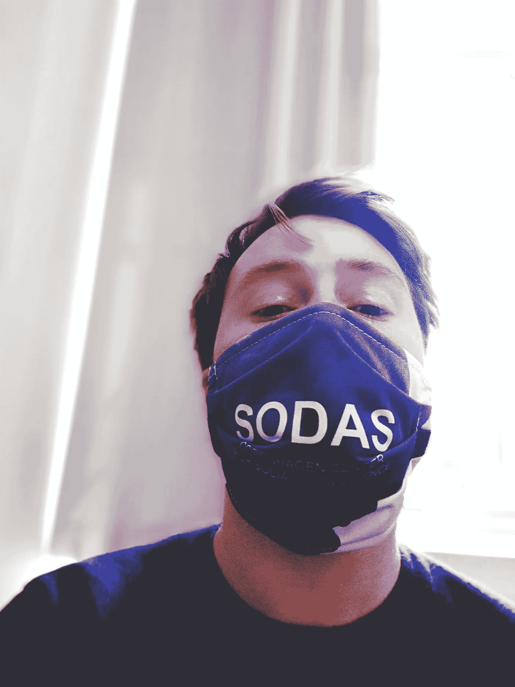
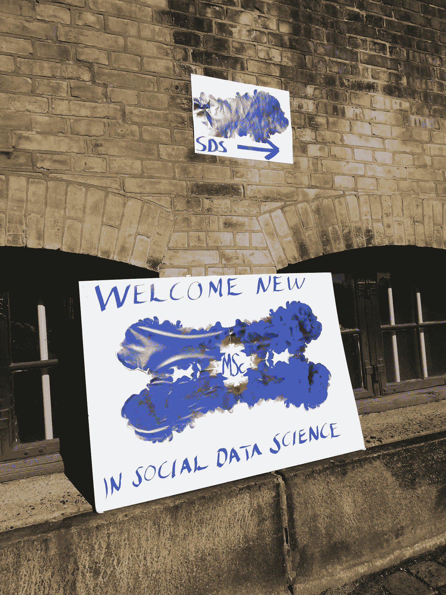
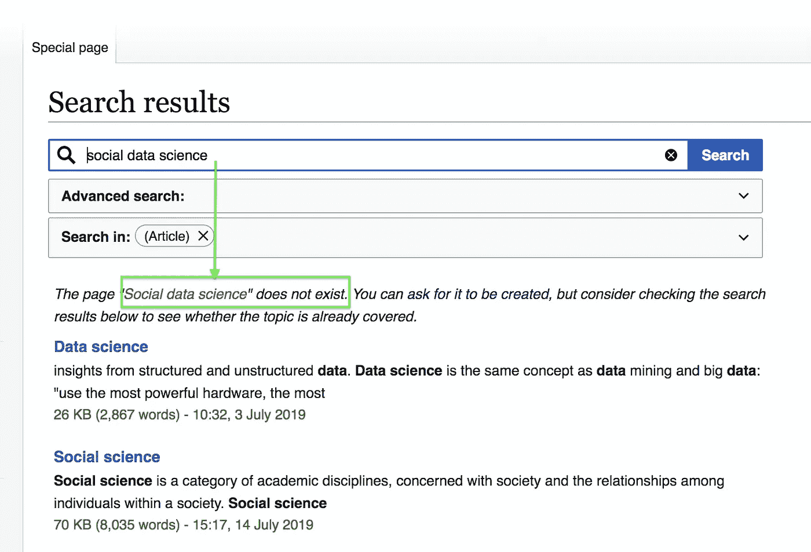
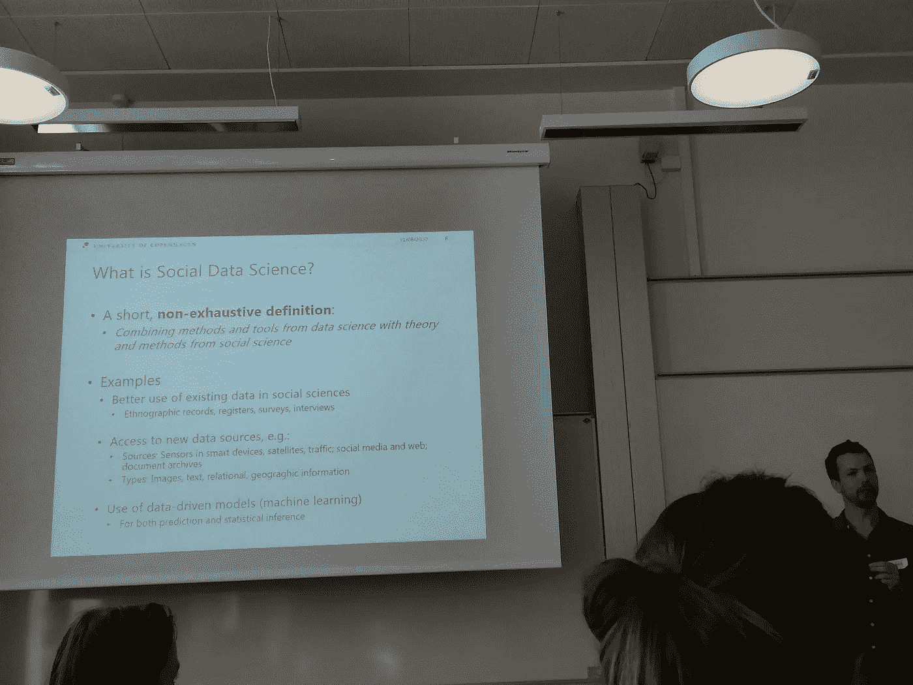
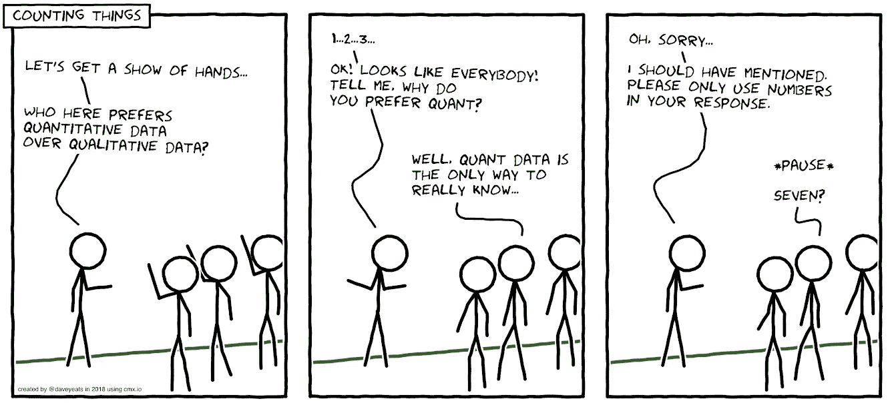
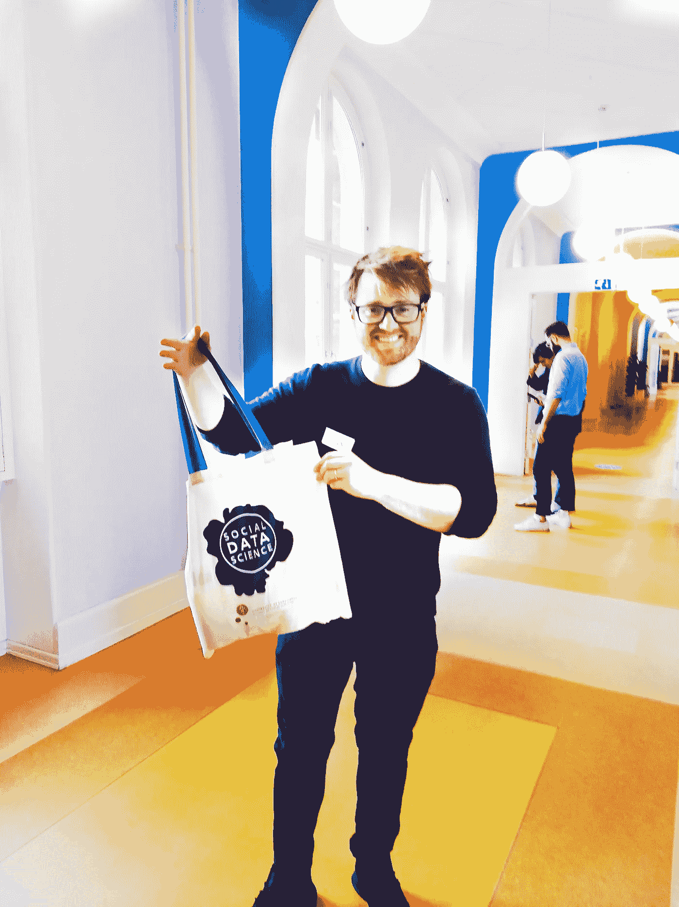
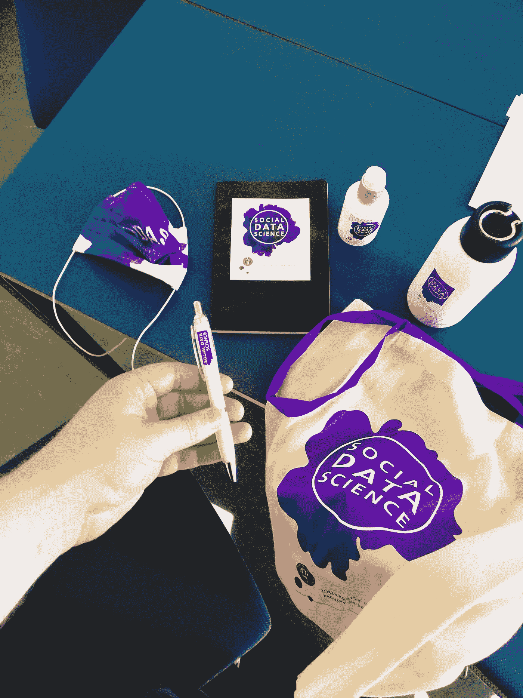
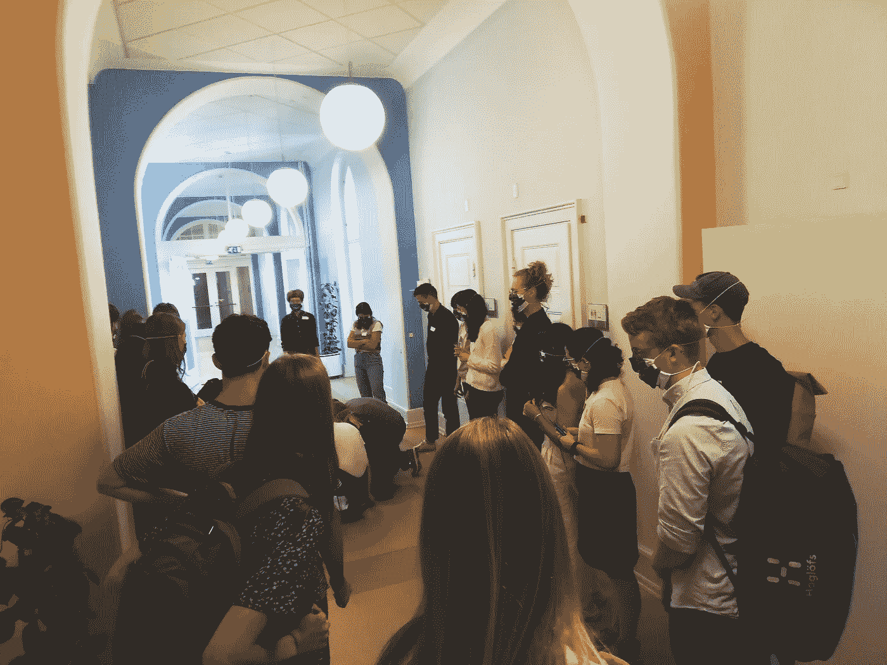
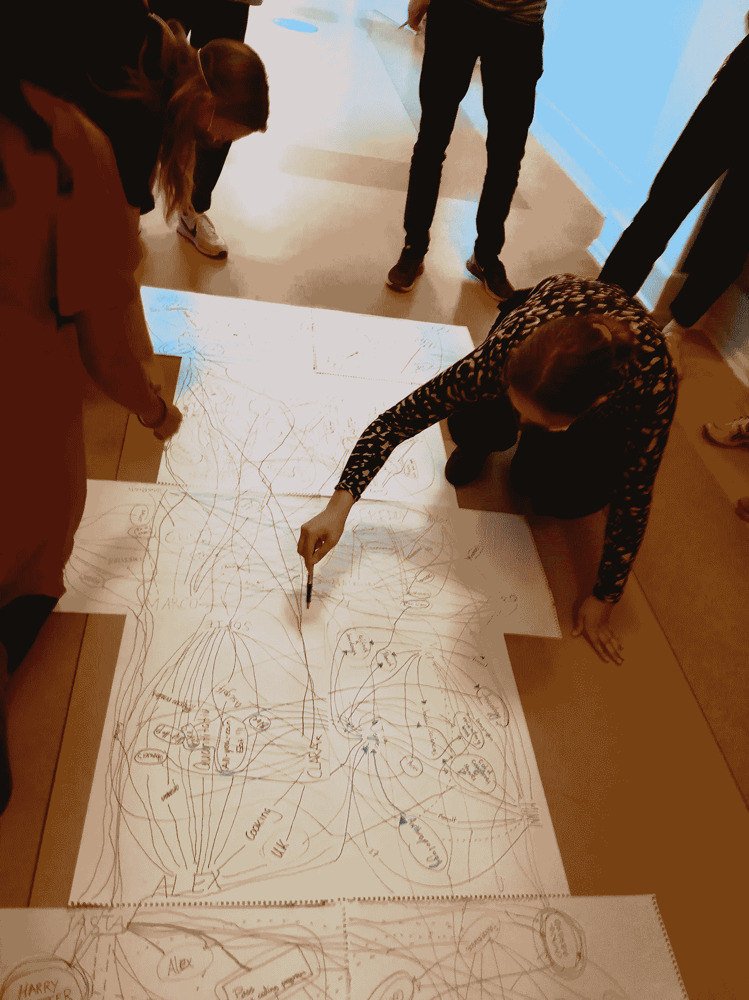
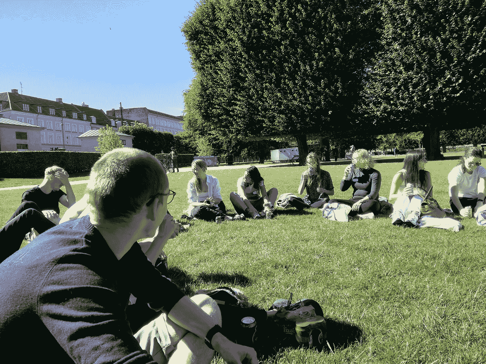

# 社会数据科学的第一天

> 原文：<https://towardsdatascience.com/first-day-of-social-data-science-beedc2174232?source=collection_archive---------29----------------------->

来自[哥本哈根社会数据科学中心(SODAS)](https://sodas.ku.dk/) 的定制面具，作者照片。

## 哥本哈根大学社会数据科学硕士(SODAS)的第一批学生

在疫情时代，开始研究生课程的第一天是不同的。

尤其是考虑到一个人能有多幸运。首先，能够参加这样一个节目，其次，由于减轻努力，一个人能够进行这样一个面对面的会议。

对于一些人来说，成为一名新生可能会感到害怕，许多参加研究生课程的人会搬到一个新的国家。

这是一篇关于我作为哥本哈根大学新的社会数据科学硕士的第一天的文章。

我将首先尝试解释什么是社会数据科学，以及我为什么决定参加这个项目，然后展示当天的几张照片。

# 欢迎新的社会数据科学硕士

哥本哈根大学外面的标志。作者照片。

我朝大学走来首先看到的是所有的学生聚集在古老的历史建筑周围。过了一会儿，我找到了这个标志，它指引我找到了另一个标志，并让我找到了去教室第一堂课的路。

必须指出的是，我参加社会数据科学硕士的旅程已经开始了一段时间。

过去我有很多问题，作为一名社会科学家，对编程感兴趣。

## 什么是社会数据科学？

如果社会科学家试图学习编程来帮助他们进行研究并对实现提出更高的要求，社会会受益吗？

思考这个问题是我在探索围绕这些话题的问题时如何想到这个术语的。我之前在 2019 年 7 月 19 日写的一篇文章中试图探索这一点:

 [## 走向社会数据科学

### 数量越多，责任越大

towardsdatascience.com](/towards-social-data-science-f90c5c020855) 

至少维基百科告诉我，社会数据科学‘不存在’。

作者于 2019 年 7 月 19 日拍摄的截图显示，维基百科没有社会数据科学的记录。(注:2020 年 7 月 31 日似乎仍然如此)

我想这让我更加兴奋而不是气馁。

然而，我错误地认为(正如我在一个短暂的时刻所做的那样)这个场所没有被探索。

当时我发现牛津大学(T3)、T4 大学(T5)、伦敦政治经济学院(T5)和哥本哈根大学(T6)都有相关课程。

哥本哈根大学的定义不断出现在我的脑海里:

> ***社会数据科学*** *是社会科学和计算机科学相结合的新学科，其中大数据的分析与社会科学理论和分析相联系。*
> 
> 与社会数据科学相关的研究领域很多。它们可以基于从例如社交媒体收集的数字数据、注册数据、客户数据或者基于人们留下的其他类型的数字痕迹，例如通过他们个人使用互联网、他们使用智能电话和其他数字服务。这些庞大的数据集也可以与通过人类学实地工作等收集的定性数据相结合。
> –[*哥本哈根大学社会科学系 7 月 19 日检索*](https://socialsciences.ku.dk/social-data-science/)

MSc 的研究负责人 Andreas Bjerre-Nielsen 在当天早些时候重申了这一点。社会数据科学和经济系助理教授索达说:

> "社会数据科学是:将数据科学的方法和工具与社会科学的理论和方法相结合."

他确实提到有多种定义，这可能是其中之一。

这张幻灯片涵盖了社会数据科学的一个定义。作者照片。

## 以不同的学科视角进入哥本哈根大学的社会数据科学硕士

不久前，我在哥本哈根大学找到了这个项目。

2019 年 7 月 30 日，我深入报道了哥本哈根大学社会数据科学研究生课程的发展:

 [## 人工智能安全和社会数据科学

### 哥本哈根大学及其新设立的社会数据科学硕士项目

towardsdatascience.com](/ai-safety-and-social-data-science-527c2c576a98) 

当然，我从来没有想过，当我写这篇文章的时候，我会加入其中…

看着哥本哈根社会数据科学中心(SODAS)作为一个研究单位，并检查他们的项目，我有一个想法:

> 哇，这是一个真正包容和雄心勃勃的计划！

哥本哈根的苏打水似乎在很大程度上试图包含不同的学科观点，尤其是相信定性研究在社会数据科学中有一席之地。

在我发现这个节目之前，我在 6 月 30 日写了这篇文章。

 [## 定性数据科学家

### 探索定性数据和研究的概念

towardsdatascience.com](/the-qualitative-data-scientist-e0eb1fb1ceb9) 

虽然这幅漫画很简单，但它展示了我曾经作为一名采访者工作时，有时会发现自己所处的情况。

由 UX 研究经理戴夫·叶芝使用 cmx.io 制作的漫画

也就是说*(或者别人画的)*，我认为理解一个问题的不同方法非常重要。

*重点是:我们需要各种不同的视角和方法！*

> 哥本哈根大学的社会数据科学硕士项目主要涉及六个学科(人类学、数据科学、经济学、政治学、心理学和社会学)。

因此，来自不同背景的不同人相互尊重是这个项目的核心。

此外，似乎大多数人来自不同的国家，最大的群体自然是丹麦人。

该课程旨在第一年**中获得*共同点*；第二年**中**中**和*建立在你最认同*的学科基础之上，并与这些新知识相结合。

这仅仅是开始。

> 在这第一天，我很快体验到来自这么多学科的人聚集在一个研究生项目中，这让我非常高兴。

我也惊喜地看到汽水团队在的每一个细节上投入了*的疯狂努力。*

*我是说，我们甚至有一个手提袋。*

**

*快乐和悲伤的亚历克斯收到了一个来自苏打水的手提袋。*

*我对研究生课程有如此多的期望，不知道第一天会怎样。*

*我很高兴地说，这是温暖人心的。*

*人们来自不同的地方，他们试图保持尽可能的安全。*

*我们有口罩、抗菌剂、水瓶、笔、书和书包。*

**

*苏打水并不轻视品牌！作者照片。*

*面罩非常合适，且可以重复使用。*

**

*作者带着汽水面具的照片，作者拍摄。*

*在使用这些口罩的同时，我们进行了小组活动。*

**

*首批苏打水聚集在走廊里。作者照片。*

*我们先在小组中的单张纸上画圈。然后，两组人联合起来，在彼此的圆圈上画线。后来，所有的文件被合并在一起，形成一个大的整体。*

**

*我们都在这种氛围中。作者照片。*

*后来，我们中的一些人聚集在国王的花园里，离汽水大楼只有几分钟的路程。*

**

*一群在草地上喝汽水的学生。为了隐私而模糊的脸。作者照片。*

*我想不出更好的方式来开始这个研究生项目。*

*太阳甚至出来了。*

*与来自这么多学科的人交谈已经给了我一些新的想法。*

*非常感谢[Mette My Madsen](https://antropologi.ku.dk/ansatte/vip/?pure=da%2Fpersons%2Fmette-my-madsen(af9d97f8-bb79-40b9-b0ff-227a10ffe369)%2Fcv.html)(SODAS 的博士后)领导了这一天，并成为一名出色的辅导员。*

*我的印象是，大多数人似乎对这个项目的开始相当满意。*

*我很期待接下来的几周会发生什么。*

**这里是#500daysofAI，您正在阅读的是第 454 条。500 天来，我每天都在写一篇关于或与人工智能相关的新文章。**