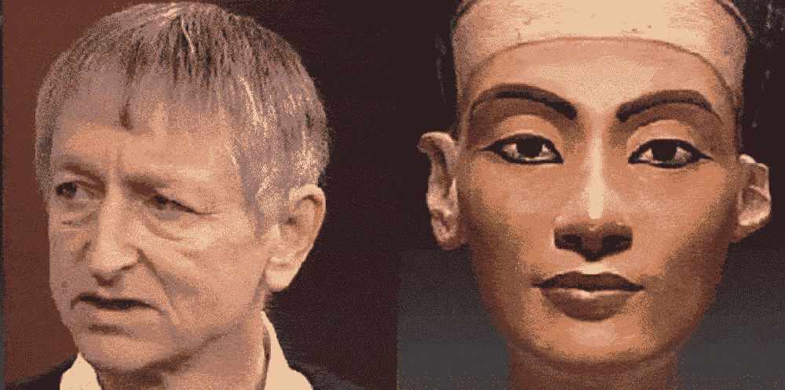
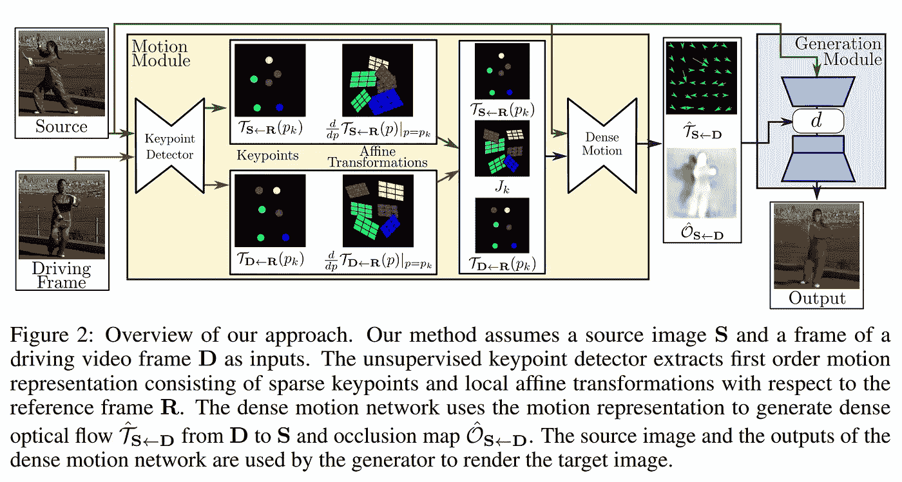
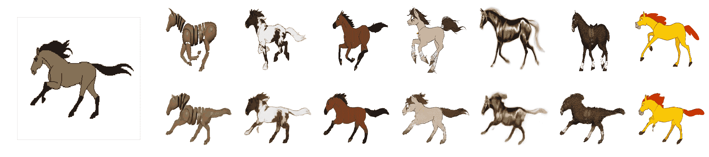
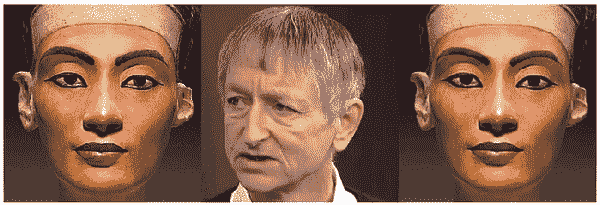
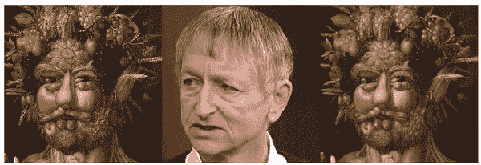
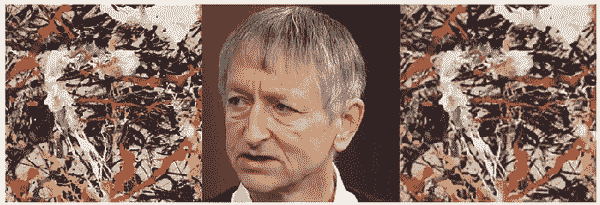
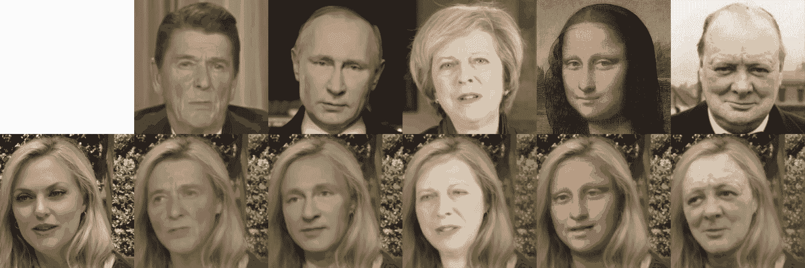

# 一阶运动模型

> 原文：<https://towardsdatascience.com/first-order-motion-model-ab3908407208?source=collection_archive---------10----------------------->

## 一个有效的框架。



一阶运动模型的作用

S **eeing** 曾为**belieng**。感谢艾，我们终于要告别这种可爱幼稚，却又危险的信仰了。因为事实上从来都不是。在 20 世纪，照片被专制政权修饰过。通过深度学习，我们体验到了重新阐释现实的新方法。这不是一种危险；这是一个机会。

在各种方法中，由 *Aliaksandr Siarohin 等人*提出的**[**用于图像动画的一阶运动模型**](https://aliaksandrsiarohin.github.io/first-order-model-website/)**】**的框架和论文以其绝妙的构思吸引了人们的注意:**

> **图像动画包括生成视频序列，以便源图像中的对象根据驱动视频的运动进行动画制作。我们的框架解决了这个问题**，而没有使用任何注释或关于特定对象的先验信息来制作动画**。一旦**在一组描述同一类别**(例如人脸、人体等*)的对象的视频上进行训练，我们的方法就可以**应用于该类别的任何对象**。([来源](https://aliaksandrsiarohin.github.io/first-order-model-website/)，我强调)***

**关键点与变换一起设置(类似于 Photoshop 中的木偶工具，或运动捕捉套装上的传感器)，因此训练的运动可以转移到目标图像。**

**要求是相同的对象类别。**

****

**来源:[https://aliaksandrsiarohin . github . io/first-order-model-website/](https://aliaksandrsiarohin.github.io/first-order-model-website/)1)**

****简而言之**，无监督学习方法分析源素材中的运动数据，将其普遍化，并应用于目标素材。**

****

**来自纸张的运动样本([来源](https://aliaksandrsiarohin.github.io/first-order-model-website/) ) **1)****

## **换脸:Deepfakes？**

**它还允许以与 [face2face-approach](/14-deep-learning-uses-that-blasted-me-away-2019-206a5271d98?source=friends_link&sk=4ac313764b2ca90e765566714dd2c88e) 完全不同的方式交换脸。当 [face2face](/face2face-a-pix2pix-demo-that-mimics-the-facial-expression-of-the-german-chancellor-b6771d65bf66) 接合[人脸检测器](https://github.com/davisking/dlib/blob/master/examples/face_detection_ex.cpp)并将面部特征应用于目标图像时，框架“**一阶运动模型**进行另一种方式:**

> **运动被描述为一组关键点位移和局部仿射变换。生成器网络**将源图像的外观和驾驶视频的运动表示**相结合。此外，我们提出明确地**模型遮挡**，以便向生成器网络指示哪些图像部分应该被修补([源](http://papers.nips.cc/paper/8935-first-order-motion-model-for-image-animation.pdf))。**

**而且效果惊人的好。**

**你可以使用 [**GitHub 库**](https://github.com/AliaksandrSiarohin/first-order-model) 或者 [**Colab 笔记本**](https://colab.research.google.com/github/AliaksandrSiarohin/first-order-model/blob/master/demo.ipynb#scrollTo=UCMFMJV7K-ag) 来尝试一下。**

**我用 AI 先锋 **Geoffrey Hinton** 的[镜头在**娜芙蒂蒂**上试了试运气。这段录像是用笔记本送来的。可以用另一个视频素材。它必须符合特定的要求和尺寸。](https://www.youtube.com/watch?v=XG-dwZMc7Ng)**

**结果非常令人信服:**

****

**相反，应用我自己的照片会带来一些小问题，尤其是关于眼镜。我想，这些模式在镜头中是缺失的，所以关键点的分配有时会失败:**

****

**使用 **Arcimboldo** 的一幅画，我们可以看到运动分配是如何工作的——一些图形特征仍然被检测为背景，并且没有动画。**

****

**最有趣的效果发生在我们使用没有外貌特征的图像时——甚至是抽象艺术。我用的是波洛克的作品:**

****

**在这里，我们可以观察到模型是如何试图在混乱的结构中确定自己的方向——并让它到达某一点。**

**论文展示了其他面部交换实验:**

****

**来源:[https://aliaksandrsiarohin . github . io/first-order-model-website/](https://aliaksandrsiarohin.github.io/first-order-model-website/)、 **1)****

**或许如果我们将这种方法与**风格转移**——甚至与 [**深度画风调和**](https://medium.com/merzazine/ai-creativity-alien-elements-with-style-27ee7e45df92?source=friends_link&sk=4f8bf8dd08b1e76b3fcaa88676add697) 相结合，我们会获得更加连贯的效果。**

## **DeepFakes 时代:一个机会？**

**如果你看到这样的模型，你首先想到的肯定是: ***DeepFake*** 。我们已经太偏向了(并且一直偏向我们的神经网络)。**

**我们还能相信视觉吗？数字时代我们能区分*真*和*假*吗？**答案是:“*我们再也不能了”*。**但是:答案仍然没有在那一点上结束。**

**这种天真地相信图像背后的真相——如此诱人，因为如此简单——是一种危险的欺骗。一幅图像背后有无数的真相。即使是没有任何后期制作痕迹的 raw 图像也不是真相，而是特别选择的视角。未知本体一瞥。Pars pro toto 我们应该注意它在语义上的脆弱性。**

**我们必须重新思考我们与真理概念的关系。因为像人这样的道理太多了。当然，欺骗某人很容易，伪造一个图像或视频片段，并将其作为真实的东西呈现出来。人们已经这样做了——从友好的恶作剧到总统使用。**

**但是信不信由我们自己。我们需要比以前更多地研究和分析。当然，这对我们的大脑和感知来说是更多的工作，但这就是现实。理解世界并不像我们过去几个世纪所认为的那样容易。**

****相信影像是一种舒服的自欺。我感谢所有人工智能打破这一信念的努力。****

****来源:****

1.  **框架方案和 GIF 演示，标有***1)***:
    [网站](https://aliaksandrsiarohin.github.io/first-order-model-website/) // [论文](http://papers.nips.cc/paper/8935-first-order-motion-model-for-image-animation)**

```
@InProceedings{Siarohin_2019_NeurIPS,
  author={Siarohin, Aliaksandr and Lathuilière, Stéphane and Tulyakov, Sergey and Ricci, Elisa and Sebe, Nicu},
  title={First Order Motion Model for Image Animation},
  booktitle = {Conference on Neural Information Processing Systems (NeurIPS)},
  month = {December},
  year = {2019}
}
```

****2。**视频片段。采访杰弗里·辛顿:[https://www.youtube.com/watch?v=XG-dwZMc7Ng](https://www.youtube.com/watch?v=XG-dwZMc7Ng)**