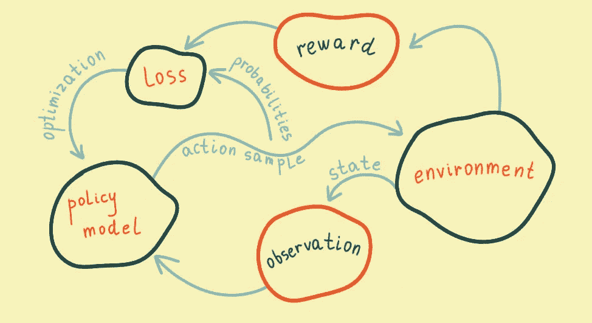
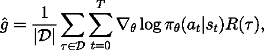
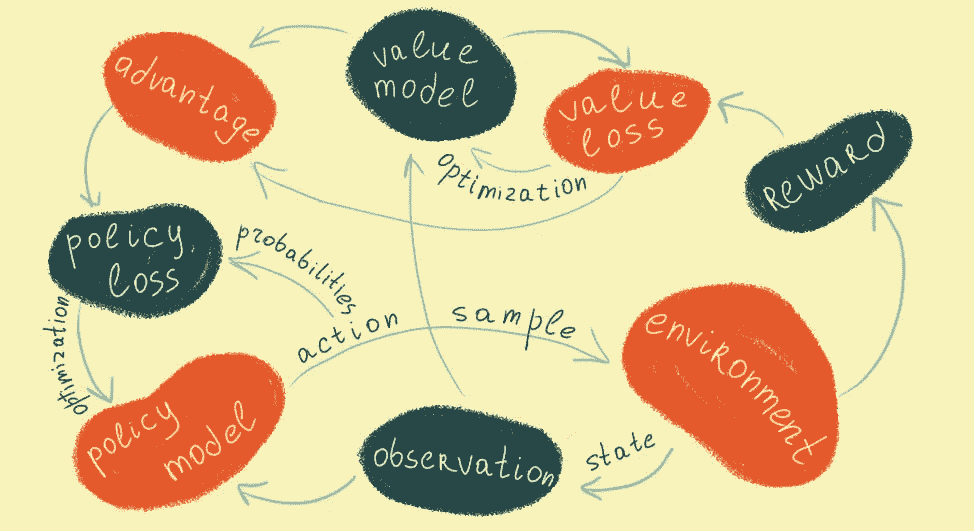
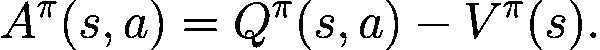
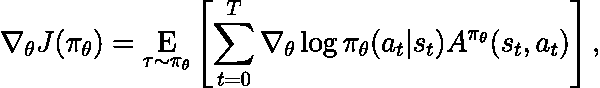

# 强化学习的第一步

> 原文：<https://towardsdatascience.com/first-steps-in-reinforcement-learning-20cffd1c0b92?source=collection_archive---------32----------------------->


插图作者:[伊洛娜·塞雷达](https://www.behance.net/gallery/93893223/Infographic-and-cover-for-the-AI-article)

## 从简单的政策到加强使用旋转上升

如果你曾经使用 OpenAI 创建的[旋转资源](https://spinningup.openai.com/en/latest/)研究过强化学习，你会注意到他们关于学习强化学习的建议。也就是说，从强化(或 VPG，即普通政策梯度)开始，尝试从头开始实施 RL 算法。我也是，结果证明这是一项相当艰巨的任务，所以我决定先研究它们的实现。

该算法看起来很简单，但是他们实现[简单策略](https://github.com/DmytroSytro/spinningup/blob/master/spinup/examples/pytorch/pg_math/1_simple_pg.py)和 [VPG](https://github.com/DmytroSytro/spinningup/blob/master/spinup/algos/pytorch/vpg/vpg.py) 的复杂度有很大差距。简单的策略看起来像是专门为学习而设计的易于理解的代码，而 VPG 看起来像是一个具有并行化、模块、类和大量参数的专业库。我意识到两全其美会很棒，因此，我决定让 VPG 摆脱简单的政策执行。这个想法是引入最小的必要的变化，使 VPG。在这个过程中，我必须仔细研究简单策略和 VPG 实现。我认为这是一个很好的练习，比从零开始的实现要求更少，并且仔细研究和理解了 OpenAI 的实现。

# 简单政策

如果您不熟悉[旋转启动简介](https://spinningup.openai.com/en/latest/spinningup/rl_intro3.html)，以下描述对于理解代码是必需的。否则，您可能会对我对 Spinning Up 中介绍的概念的理解感兴趣。

在继续之前阅读 [Spinning Up intro to RL](https://spinningup.openai.com/en/latest/spinningup/rl_intro.html) 是一种建议，但实际上，如果你熟悉深度学习的基础知识，直观地理解简单的策略梯度是非常容易的。



由[伊洛娜·塞雷达](https://www.behance.net/gallery/93893223/Infographic-and-cover-for-the-AI-article)

你所需要做的就是拥有一个环境，一个可以在其中行动的代理，收集关于环境的观察，根据一些政策(即规则或功能)行动，接收奖励，计算通过优化政策功能使奖励最大化的损失。因此，基本上，策略可以是一个神经网络，它接收观察结果作为输入，并产生动作概率作为输出:

get_policy(obs)看起来像一个标准的深度神经网络(完整代码[此处](https://github.com/DmytroSytro/spinningup/blob/master/spinup/examples/pytorch/pg_math/1_simple_pg.py))

区别在于损失函数。为了获得关于我们政策的真实损失的反馈，我们需要根据政策功能给出的行动概率对行动进行抽样，采取行动，获得奖励，根据抽样的行动概率对奖励进行加权。实际上，代理可以确定性地行动(即没有随机抽样)，只选择概率最高的行动。但这应该会更糟，因为代理人应该设法探索其行动空间，而不是停留在局部成功。看看梯度政策最简单的公式:



从这里旋转起来

你可以不理会求和符号和 ***D*** 。这些是平均和求和运算。重要的一点是，策略 ***(π)*** 参数*θ*在优化中是变化的，因为它们决定了依赖于状态 ***s*** 的动作 ***a*** ，动作带来回报 ***R*** 。奖励确定为每个轨迹 ***τ*** 末端奖励之和(试)。

所以，这是一种奇怪的损失函数，因为回报取决于政策的输出，而且回报必须通过梯度上升来优化。最后一个问题实际上可以很容易地通过改变符号来解决。但最奇怪的是，损失实际上并不能说明什么。损失函数只是指示在具有特定策略的环境的特定状态下的特定损失。在优化策略后，代理可以采取不同的行动，这可以将环境带入不同的状态，从而带来不同的回报。所以模型改进的实际指标是收到的奖励，而不是损失。

# VPG(增援)

VGP 有什么新鲜事？首先，代理人得到了一个分裂的人格，因为我们都是，这样，代理人看起来更真实。这意味着经纪人现在同时是演员和评论家。用更通俗的话来说，这意味着除了决定如何行动的政策函数，我们还有试图在行动前预测回报的价值函数。



伊洛娜·塞里达

有什么帮助？好吧，简单政策中的政策函数仍然隐含地说明了回报，只是因为回报在它的损失函数中。不过，奇怪的是，政策必须预测行动，但它优化了回报。比简单的职责划分更有意义的是，获得的奖励通常是不稳定的，即差异很大。所以，用各种方法计算的收益来代替损失函数中的回报是有意义的。



从[旋转起来](https://spinningup.openai.com/en/latest/spinningup/rl_intro.html)

行动优势的基本思想是比较特定状态下的特定行动后接当前最优政策下的行动( ***Q*** )与该状态及后续状态下的最优政策行动在预期报酬( ***V*** )方面的差异。因此，在 VPG，重要的是采取行动后获得的奖励，而不是整个轨迹(审判中的状态、行动和奖励的路径)。将这个回报与当前最优策略的预期(平均)回报进行比较也很重要。看看 VPG 的梯度:



从[旋转起来](https://spinningup.openai.com/en/latest/algorithms/vpg.html)

因此，计算期望轨迹*的梯度，其中根据最优策略*对策略动作进行采样，并且对于每个状态***s*通过动作*给定状态***s**s*的概率对优势***A****进行加权********

***就现实而言，而不是数学(除非你相信数学是现实)，我们在一个轨迹中所拥有的只是一系列的状态观察、最优政策下采取的行动、奖励以及价值函数对这些奖励的评估。除了动作实际上是从最优策略分布中采样的，并且在某些状态下，出于探索的目的，可能会对不具有最高概率的动作进行采样。这很有趣，因为价值函数将根据以前的许多试验来评估该状态的奖励，当然，在这些试验中，更高概率的行为被采样得更频繁。***

***因此，价值函数评估在最优策略下，当前试验的平均回报。另一方面，当前的轨迹也是在最优政策下做出的，但有些决策是冒险的探索性决策。因此，这个想法基本上是收集奖励，在未来从当前行动中获取奖励，并将其与当前政策的平均奖励进行比较。在 OpenAI 的实现中，使用了一般优势估计(GAE ),我发现这是理解 VPG 最具挑战性的部分。这里不欢迎你。如果你看看 OpenAI 的 advantage 的代码实现，就不难了:***

***其思想是将 ***Q*** 计算为下一步奖励的贴现和贴现值(这是下一步奖励的评估)并将 ***V*** 用作基线以减少优势的方差。***

**因此，算法与简单策略的不同之处在于，在每次尝试后，我们需要计算价值和优势，在策略优化后，我们需要优化价值函数。**

# **代码更改**

**首先，我们需要添加预测奖励的 *values_net* :**

**添加 *value_loss* 也很重要，它使用 MSE 和优化奖励，为使用 advantage 的策略模型添加新的损失函数，还有 *discount_cumsum* 帮助计算 advantage，以及归一化 advantage 的归一化函数:**

**除此之外，价值函数的优化器也是必须的。在进行试验时，与简单策略的第一个区别是，OpenAI 的 VPG 实现不会将剧集收集到一个批处理中，而是相反地使用单集进行优化，并剪辑过长的剧集:**

**大部分批量变量看起来很肤浅，因为批量只是一个插曲。我只是让它们更容易与简单策略进行比较。一集的奖励不加总，奖励收集到 n-1 步，因为这是优势函数应该使用的。计算所有观察值。因此，奖励是用 gamma 参数贴现计算的。优势是按照 OpenAI 的实现来计算的。
最后，需要做的是优化:**

**值得注意的是，对于策略优化中的每一步，我们在价值函数优化中都采取了许多步骤。这是合理的，因为，如前所述，政策损失并不真正表明改善，但价值函数应该根据迄今为止的最优政策预测每个州的平均回报。**

**奇怪的是，每次观察的批量大小都不同，这取决于典型深度学习的剧集长度。**

**将学习速率和最大批量长度的默认值设置为与 OpenAI 相同，我们最终可以测试该算法。对于相同的环境，它的工作原理非常相似。例如:**

```
**epoch: 145   loss: -0.078   return: -78.000   ep_len: 79.000
epoch: 146   loss: 0.098   return: -110.000   ep_len: 111.000
epoch: 147   loss: -0.017   return: -96.000   ep_len: 97.000
epoch: 148   loss: 0.058   return: -92.000   ep_len: 93.000
epoch: 149   los: -0.033   return: -103.000   ep_len: 104.000**
```

**因此，对于 OpenAI gym 的“Acrobot-v1”环境，它转换为大约相同的平均回报。或者对于“CartPole-v1”:**

```
**epoch: 695   loss: 0.003   return: 500.000   ep_len: 500.000
epoch: 696   loss: -0.032   return: 377.000   ep_len: 377.000
epoch: 697   loss: -0.006   return: 500.000   ep_len: 500.000
epoch: 698   loss: -0.008   return: 500.000   ep_len: 500.000
epoch: 699   loss: -0.010   return: 500.000   ep_len: 500.000**
```

**它只适用于离散的操作空间，没有并行化，但那是我的任务——进行将简单策略转换为 VPG 所需的最小更改。**

# **结论**

**总而言之，很明显，从零开始实现 VPG 比像我一样将两个实现结合起来更具挑战性。但是，我仍然认为这是理解 OpenAI 的简单策略和 VPG 实现的一个非常有用的练习。我希望最终的脚本更容易理解，但代价是不那么高效和优雅。我认为它让你从零开始为更具挑战性的 RL 算法的实现做更充分的准备。我打算继续做下去，做成一个系列。你可以在这里找到这篇文章[的所有代码。](https://github.com/DmytroSytro/spinningup/tree/master/spinup/algos/pytorch/vpg)**

**特别感谢 [Ilona Sereda 为本文制作了精彩的插图和信息图！](https://www.linkedin.com/in/ilona-sereda-539bb515a/)**

# **参考**

**[1] J .舒尔曼，p .莫里茨，s .莱文，m .乔丹，p .阿贝耳(2016)，[利用广义优势估计的高维连续控制，](https://arxiv.org/pdf/1506.02438.pdf) ICLR 2016**

**[](https://spinningup.openai.com/en/latest/) [## 欢迎来到极速旋转！-编制文件

### 编辑描述

spinningup.openai.com](https://spinningup.openai.com/en/latest/)**