# 用 PySpark 构建机器学习模型

> 原文：<https://towardsdatascience.com/first-time-machine-learning-model-with-pyspark-3684cf406f54?source=collection_archive---------16----------------------->

## 初学者的循序渐进指南

自己设计

Spark 是实现集群计算的引擎名，而 PySpark 是 Python 使用 Spark 的库。

PySpark 是一种很好的语言，可以进行大规模的探索性数据分析，构建机器学习管道，为数据平台创建 ETL。如果您已经熟悉 Python 和 Pandas 之类的库，那么为了创建更具可伸缩性的分析和管道，PySpark 是一种很好的学习语言。

这篇文章的目的是展示如何使用 PySpark 构建一个 ml 模型。

# **如何安装 PySpark**

PySpark 的安装过程非常简单，就像其他 python 包一样。(例如熊猫、Numpy、scikit-learn)。

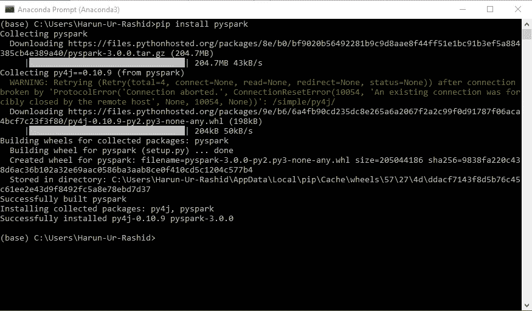

图 01

一件重要的事情是首先确保 java 已经安装，以确保 java 已经安装在您的机器上。然后你就可以在 jupyter 笔记本上运行 PySpark 了。

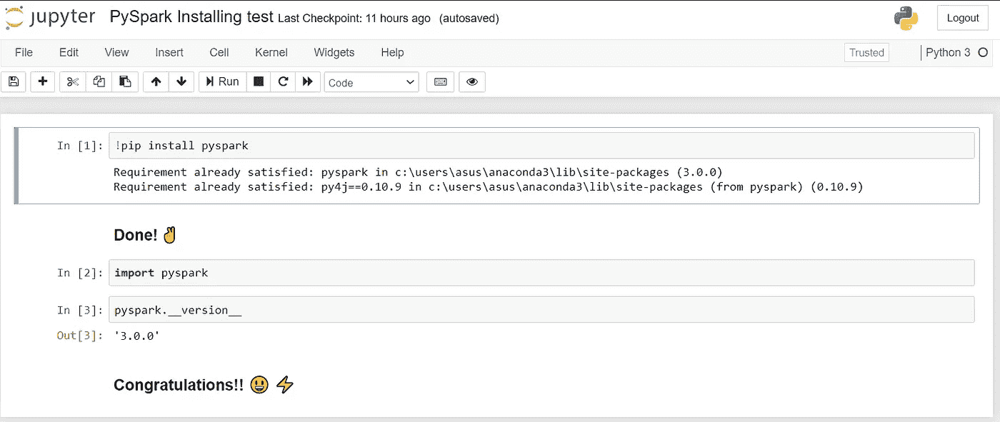

Jupyter 笔记本中的 PySpark 检查

# 探索数据

当我们[在 Python](https://hackernoon.com/ml-for-diabetes-from-bangladesh-d99d1d058d82) 中建立 ml 模型时，我们将使用相同的数据集，并且它与一个国家糖尿病和消化和肾脏疾病研究所的糖尿病疾病相关。分类目标是预测患者是否患有糖尿病(是/否)。数据集可以从 [Kaggle](https://www.kaggle.com/uciml/pima-indians-diabetes-database) 下载。

读取 _ 数据. py

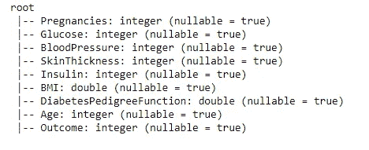

图 02

数据集包括几个医学预测变量和一个目标变量，结果。预测变量包括患者的怀孕次数、身体质量指数、胰岛素水平、年龄等。

*   输入变量:葡萄糖，血压，身体质量指数，年龄，怀孕，胰岛素，皮肤厚度，糖尿病，糖尿病功能。
*   产出变量:结果。

先看一下前五个观察结果。熊猫数据框比 Spark DataFrame.show()好看。

显示 _ 数据. py

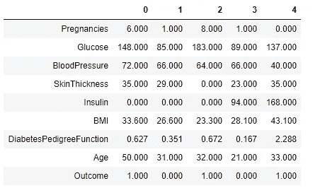

图 03

在 PySpark 中，您可以使用`toPandas()`用熊猫的数据帧显示数据

data _ show _ in _ pandas _ data frame . py

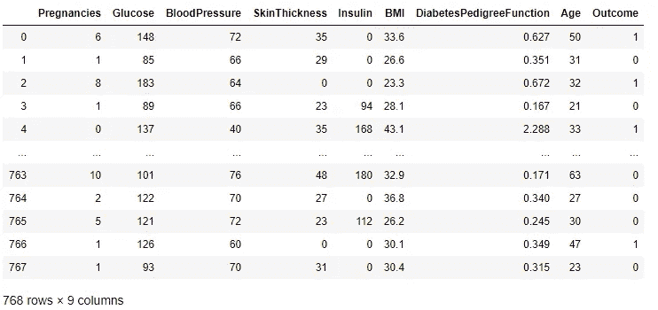

图 04

检查班级是否完全平衡！！

class_balance_check.py

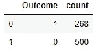

图 05

# 统计摘要

统计 _ 汇总. py

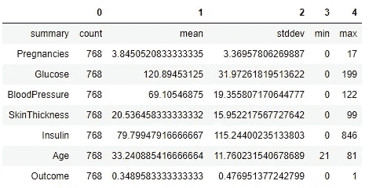

图 06

**自变量之间的相关性**

相关性. py

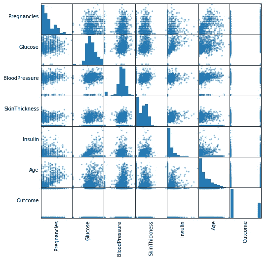

图 07

# **数据准备和特征工程**

在这一部分，我们将删除不必要的列并填充缺失的值。最后，我们将为 ml 模型选择特性。这些功能将分为两部分:训练和测试。

让我们开始任务吧👨‍🚀

1.  **缺失数据处理:**

missing_data_handling.py

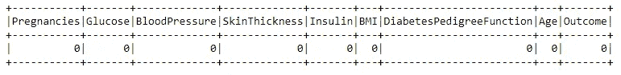

图 08

哇！！👌这很好，因为数据集中没有任何缺失值。😀

**2。删除不必要的列**

columns_dropping.py

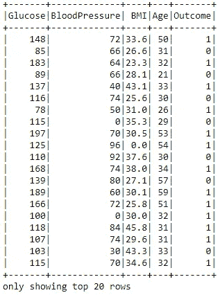

图 09

**3。特征转换成矢量**

VectorAssembler 将多个列合并为一个向量列的要素转换器。

转换成矢量格式

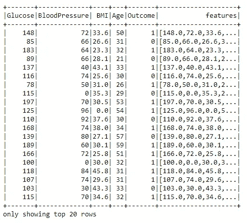

图 10

搞定了。！✌️现在的特征被转换成了矢量。🧮

**4。训练和测试分割**

将数据随机分为训练集和测试集，并为可重复性设置种子。

训练 _ 测试 _ 拆分. py

***训练数据集计数:620***

***测试数据集计数:148***

# **机器学习模型构建**

1.  **随机森林分类器**

随机森林是一种监督学习算法，也用于分类和回归情况。但是，它主要用于分类问题。正如我们所知，森林是由树木组成的，更多的树木意味着更健壮的森林，以类似的方式，随机森林算法在数据样本上创建决策树，然后从每个样本中获得预测，最后通过投票选择最佳解决方案。这是一种比单一决策树更好的集成方法，因为它通过平均结果来减少过拟合。

random_forest.py

**评估我们的随机森林分类器模型。**

random_forest_evaluate.py

***随机森林分类器准确率:0.7945205479452054(79.5%)***

2.**决策树分类器**

决策树被广泛使用，因为它们易于解释、处理分类特征、扩展到多类分类设置，同时不需要特征缩放，并且能够捕捉非线性和特征交互。

决策树. py

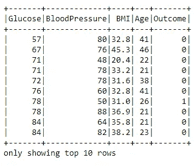

图 11

评估我们的决策树模型。

决策树评估

***决策树准确率:0.7876712328767124(78.8%)***

3.**逻辑回归模型**

当因变量为二分变量(二元变量)时，逻辑回归是进行回归分析的合适方法。像所有回归分析一样，逻辑回归是一种预测分析。逻辑回归用于描述数据，并解释一个因变量与一个或多个名义变量、序数变量、区间变量或比率水平自变量之间的关系。当因变量(目标)是分类变量时，使用逻辑回归。

logistic _ 回归. py

评估我们的逻辑回归模型。

logistic _ regression _ evaluator . py

***逻辑回归准确率:0.7876712328767124(79.7%)***

4.**梯度增强树分类器模型**

梯度推进是一种用于回归和分类问题的机器学习技术，它以弱预测模型(通常是决策树)的集合的形式产生预测模型。

g_boosted_tree.py

评估我们的梯度增强树分类器。

g _ boosted _ evaluator . py

***渐变树准确率:0.8013698630136986(80.13%)***

# 结论

PySpark 是数据科学家学习的一门好语言，因为它支持可扩展的分析和 ML 管道。如果您已经熟悉 Python 和 Pandas，那么您的许多知识都可以应用于 Spark。综上所述，我们已经学会了如何使用 PySpark 构建一个机器学习应用。我们尝试了三种算法，梯度提升在我们的数据集上表现最好。

我从 [Favio Vázquez](https://medium.com/u/e8ec6fa4d7d4?source=post_page-----3684cf406f54--------------------------------) 的 Github 资源库' [first_spark_model](https://github.com/FavioVazquez/first_spark_model) 中获得了灵感。

源代码可以在 [Github](https://github.com/harunshimanto/Machine-learning-with-PySpark/tree/master/First%20PySpark%20ml%20model) 上找到。我期待听到反馈或问题。

> *当 PySpark 像对速度游戏车的需求一样给出加速器档位时，机器学习模型闪闪发光。*

参考资料:

1.  Guru99， [PySpark 初学者教程:机器学习示例](https://www.guru99.com/pyspark-tutorial.html#8)

2.[阿帕奇 Spark 3.0.0](https://spark.apache.org/docs/latest/ml-classification-regression.html)

3.Susan Li，[使用 PySpark 和 MLlib 的机器学习—解决一个二元分类问题](/machine-learning-with-pyspark-and-mllib-solving-a-binary-classification-problem-96396065d2aa)