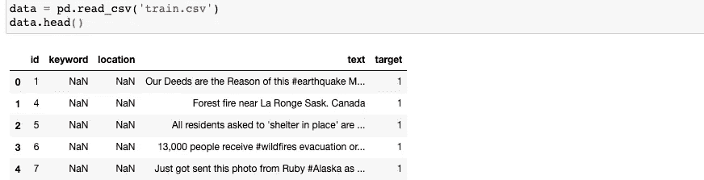
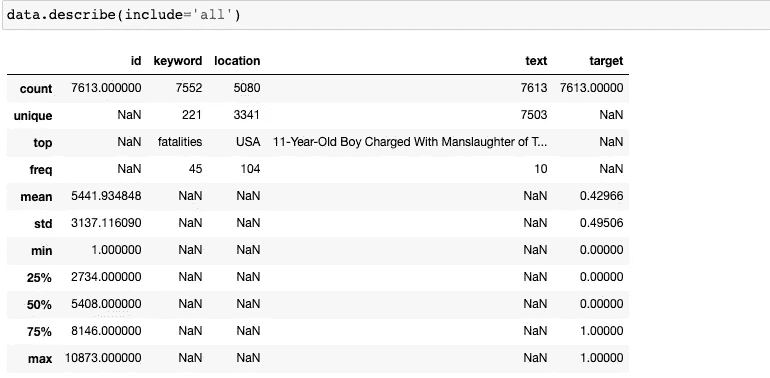
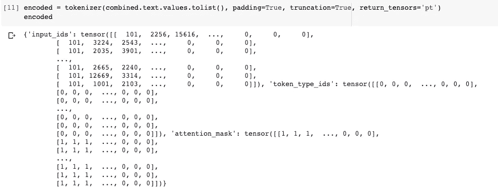
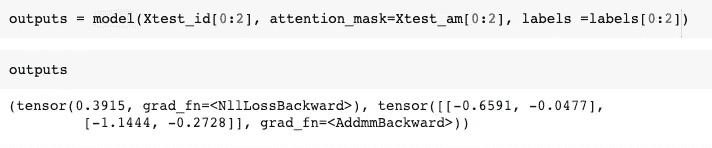
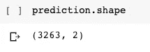
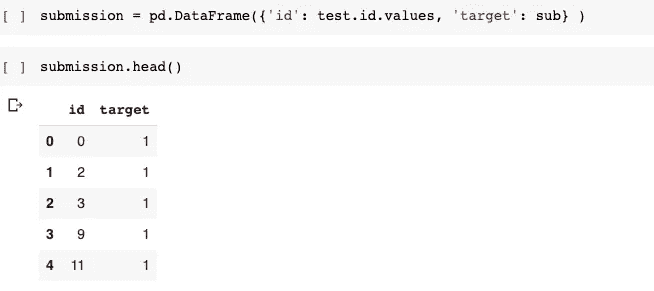

# 首次微调 BERT 框架

> 原文：<https://towardsdatascience.com/first-time-using-and-fine-tuning-the-bert-framework-for-classification-799def68a5e4?source=collection_archive---------24----------------------->


照片由 Dmitry Ratushny 拍摄

# 语言之旅的开始

当我决定参加一个正在进行的[比赛](https://www.kaggle.com/c/nlp-getting-started/overview)时，我对 NLP 领域的兴趣就开始了，比赛的目的是识别给定的推文是否是关于任何灾难的。我在语言处理领域没有任何经验，在几次互联网搜索后，我开始了解一些数据的文本预处理，如**标记化和词条化**，使用[**tfidfttransformer 和 TfidfVectorizer**](https://kavita-ganesan.com/tfidftransformer-tfidfvectorizer-usage-differences/#.Xxrv1_gzZhE) 进行特征提取，然后简单地使用**朴素贝叶斯**进行分类(得分= 0.77)。我在此期间参加了一个[深度学习专业课程](https://www.coursera.org/specializations/deep-learning)并了解了 **RNN** 并决定使用 **LTSM 模型**来完成这项任务，并获得了更好的结果(得分= 0.79987，前 40%)。在那门课程中，提到了迁移学习以及它如何成为任何任务的有力工具。我想为什么不在我现在拥有的数据集上尝试一下。

# 伯特的发现

我在 NLP 中搜索了不同的框架，并了解了 BERT。据说它是 Google 在 NLP 领域最强大和最有影响力的模型之一，在一个大型的未标记数据集上进行训练，在 11 个单独的 NLP 任务上取得了最先进的结果。它可以根据您的需要进行微调，从而使其更加强大。我决定使用这个框架，并根据我的数据集对它进行微调。我在搜索如何使用这个框架，偶然发现了 [**拥抱脸变形金刚**](https://huggingface.co/transformers/index.html) ，它为自然语言理解(NLU)和自然语言生成(NLG)提供了通用架构(BERT、GPT-2、罗伯塔、XLM、DistilBert、XLNet…)，拥有 100 多种语言中超过 32 个预训练模型，以及 TensorFlow 2.0 和 PyTorch 之间的深度互操作性。

> 经过大量的实验和阅读文档，我能够对这个模型进行微调，并希望这种体验也能在某种程度上帮助你。

# 我们开始吧

**首先，我们来看看给出的数据**

```
data = pd.read('train.csv')
data.head()
```



代码片段的输出

```
data.describe(include = 'all')
```



代码片段的输出

同样，还有一个“test.csv ”,我们必须预测它的推文。我们可以合并两个数据集，并对它们进行一些必要的操作。我们可以删除关键字和位置列，这样我们就可以只根据给定的推文进行预测。

```
df1 = pd.read_csv('content/drive/My Drive/disaster tweets/train.csv')df2 = pd.read_csv('content/drive/My Drive/disaster tweets/test.csv')combined = pd.concat([df1,df2], axis=0)combined = combined.drop(['keyword','location'], axis=1)
```

我没有预处理或清理数据(例如，删除标点符号或 HTML 标签等。)因为我只是想看看如何使用这个框架。我确信清理和处理数据将会得到更好的结果。

```
**from transformers import BertForSequenceClassification, AdamW   ** *#importing appropriate class for classification*
**import** **numpy** **as** **np**
**import** **pandas** **as** **pd**
**import** **torch**
**model = BertForSequenceClassification.from_pretrained('bert-base-uncased')**   *#Importing the bert model*
**model.train()**     *#tell model its in training mode so that some
layers(dropout,batchnorm) behave accordingly*
```

> **符号化和编码**

为了使用 BERT 模型，我们必须首先对我们的文本进行记号化和编码，BERT 记号化器在拥抱面部转换器中提供。

```
from transformers import BertTokenizertokenizer = BertTokenizer.from_pretrained(‘bert-base-uncased’)encoded = tokenizer(combined.text.values.tolist(), padding=True, truncation=True, return_tensors='pt')
```



代码片段的输出

编码器以字典 *('input_ids '，' attention_mask '，' token_type_ids')* 的形式为单个 tweet 给出三个张量，供模型使用。

现在，让我们将张量分成不同的变量(我们只需要' input_ids '和' attention_mask ')，并在测试和训练格式中再次分解组合的数据。

```
input_id = encoded['input_ids']
attention_mask = encoded['attention_mask']train_id = input_id[:len(df1)]
train_am = attention_mask[:len(df1)]
test_id = input_id[len(df1):]
test_am = attention_mask[len(df1):]train = combined.iloc[:len(df1)]
test = combined.iloc[len(df1):]
```

出于训练和测试的目的，让我们将训练数据分成两部分，用于模型的训练和测试。

```
Xtrain = train.iloc[:6800]
Xtest =  train.iloc[6800:]Xtrain_id = train_id[:6800]
Xtrain_am = train_am[:6800]
Xtest_id = train_id[6800:]
Xtest_am = train_am[6800:]labels = torch.tensor(Xtrain.target.values.tolist())
labels = labels.type(torch.LongTensor)
labels.shape
```

> **微调模型**

现在，让我们把重点放在模型上。我们将使用 PyTorch 来训练模型(也可以使用 TensorFlow)。首先，我们将配置我们的优化器(Adam)，然后我们将批量训练我们的模型，以便我们的机器(CPU，GPU)不会崩溃。

```
optimizer = AdamW(model.parameters(), lr=1e-5)
n_epochs = 1 
batch_size = 32 

for epoch in range(n_epochs):

    permutation = torch.randperm(Xtrain_id.size()[0])

    for i in range(0,Xtrain_id.size()[0], batch_size):
        optimizer.zero_grad()

        indices = permutation[i:i+batch_size]
        batch_x, batch_y,batch_am = Xtrain_id[indices],   labels[indices], Xtrain_am[indices]

        outputs = model(batch_x, attention_mask=batch_am, labels=batch_y)
        loss = outputs[0]
        loss.backward()
        optimizer.step()
```

这里输出给我们一个包含交叉熵损失和模型最终激活的**元组**。例如，这是两个张量的输出



模型给出的输出

在 softmax 激活功能的帮助下，我们可以使用这些激活来分类灾难推文。

现在，让我们在训练集中剩余数据的帮助下测试模型。首先，我们必须将模型置于测试模式，然后从模型中获取输出。

```
model.eval()     ***#model in testing mode***
batch_size = 32
permutation = torch.randperm(Xtest_id.size()[0])

for i in range(0,Xtest_id.size()[0], batch_size):

  indices = permutation[i:i+batch_size]
  batch_x, batch_y, batch_am = Xtest_id[indices], labels[indices], Xtest_am[indices]

  outputs = model(batch_x, attention_mask=batch_am, labels=batch_y)
  loss = outputs[0]
  print('Loss:' ,loss)
```

您还可以通过将输出与标签进行比较来获得准确性指标，并计算(正确预测)tweets 总数)* 100。

现在，让我们预测我们的实际测试数据，我们必须找到其输出。

```
import torch.nn.functional as F  ***#for softmax function***
batch_size = 32
prediction = np.empty((0,2)) ***#empty numpy for appending our output***
ids = torch.tensor(range(original_test_id.size()[0]))
for i in range(0,original_test_id.size()[0], batch_size):
  indices = ids[i:i+batch_size]
  batch_x1, batch_am1 = original_test_id[indices], original_test_am[indices]
  pred = model(batch_x1, batch_am1) ***#Here only activation is given*** *as output*
  pt_predictions = F.softmax(pred[0], dim=-1)  *#applying softmax activation function*
  prediction = np.append(prediction, pt_predictions.detach().numpy(), axis=0) ***#appending the prediction***
```



谓词的形状

如我们所见，预测有两列，**预测[:，0]** 给出标签为 0 的概率，而**预测[:，1]** 给出标签为 1 的概率。我们可以使用 [argmax 函数](https://numpy.org/doc/stable/reference/generated/numpy.argmax.html)来找到合适的标签。

```
sub = np.argmax(prediction, axis=1)
```

然后通过排列这些标签，我们可以得到我们的预测。

```
submission = pd.DataFrame({'id': test.id.values, 'target':sub})
```



提交数据集

使用这个模型，我得到了 0.83695 分，甚至没有清理或处理数据，就进入了前 12%。因此，我们可以看到这个框架是多么强大，它可以用于各种目的。你也可以在这里看到代码。

我希望我的经验可以在某种程度上帮助你，也让我知道还可以做些什么来提高性能(因为我也是 NLP :P 的新手)。