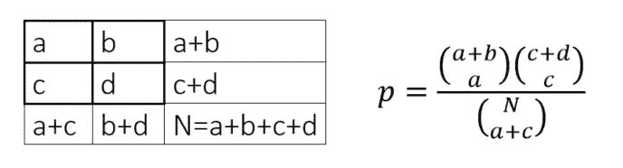
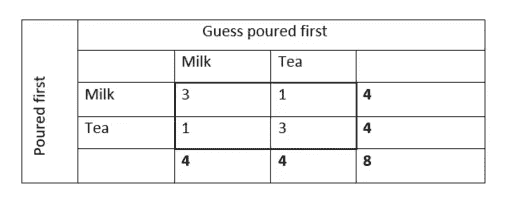
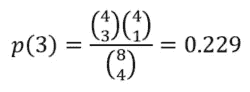
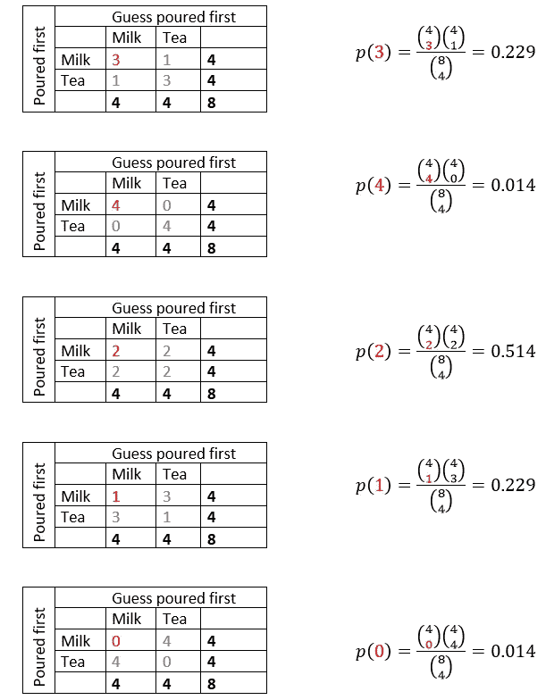
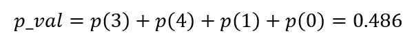
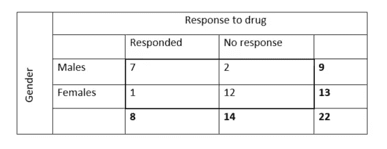
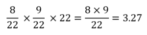

# Fisher 用 Python 从头开始的精确测试

> 原文：<https://towardsdatascience.com/fishers-exact-test-from-scratch-with-python-2b907f29e593?source=collection_archive---------9----------------------->

在本文中，我想简要回顾一下 Fisher 的精确测试，然后继续展示它在 Python 中的实现。之后，我们希望通过与 Python 内置函数的输出进行比较来验证我们的结果。

罗纳德·费雪爵士(1890 年 2 月 17 日-1962 年 7 月 29 日)可以说是 20 世纪最著名的统计学家之一。他对现代统计学的最大贡献之一是“费雪精确检验”。

Fisher 精确检验用于确定列联表中两个分类变量之间是否存在显著关联。Fisher 精确检验是 Pearson 独立性卡方检验的替代方法。虽然实际上对所有样本量都有效，但 Fisher 精确检验实际上适用于样本量较小的情况。
一般建议使用 Fisher 精确检验，而不是卡方检验，只要列联表中超过 20 %的单元具有预期频率< 5。

罗纳德·艾尔默·费希尔爵士(图片来自阿德莱德大学[珍本与特别收藏馆](http://hdl.handle.net/2440/81670)

与其他统计检验(如 z 检验、卡方检验)不同，在其他统计检验中，p 值是使用真实分布的近似值(如正态分布、χ2 分布)计算的，Fisher 精确检验产生精确的 p 值，因此得名。这就是为什么一些作者在任何可能的情况下(计算上)都更喜欢 Fisher 的精确检验而不是 Pearson 的卡方检验——即使样本量更大。

Fisher 精确检验用于计算随机机会导致的比例或比我们观察到的比例更极端的比例的概率——给定列联表的这些边际总数。因此，我们假设裕度是固定的，并使用排列和组合来确定每个可能的列联表的概率，使用以下公式:

上面的公式给出了在一个特定的列联表中观察到这种数据排列的精确的超几何概率 *p* ，假设在零独立性假设下有给定的余量。

# “女士品茶”实验:

费希尔通过“女士品茶”——实验介绍了他的测试:在一次茶话会上，费希尔的一位女同事声称，她可以分辨出杯子里先加入的是茶还是牛奶。费希尔提议用一个实验来检验这位女士的假设。他准备了八杯茶，每杯先加牛奶或茶。然后，他把八个杯子递给这位女士，让她分别决定哪个杯子先装满牛奶还是茶。她知道每种类型有四个杯子，但不知道顺序。零假设(H₀)是这位女士的猜测能力不比偶然好，换句话说，行和列变量是独立的。另一个假设(Hₐ)是，她会系统地猜测更多的正确或错误，而不仅仅是偶然的。获得了以下结果:

由于实验设计的边缘是固定的——这位女士知道有 4 个杯子先倒入牛奶，4 个杯子先倒入茶——我们有一个自由度，因此，如果我们知道她正确得到的第一杯牛奶的数量，我们可以完成一个单独的列联表。为了计算获得的概率，让我们假设在列联表中，第一杯倒的三杯牛奶被正确识别，我们使用排列和组合。有“8 选 4”种可能的方法来挑选第一杯倒的牛奶中的四杯。这将是我们的分母。有“4 选 3”可能的方法来猜对四分之三的第一杯牛奶。那么就有“4 选 1”的可能方法来错误地从四个倒第一杯茶的杯子中选择一个作为第一杯牛奶。因为这些是独立的，我们得到以下概率:

现在让我们来计算 p 值，它是在零假设下观察到这个或者一个更极端的列联表的概率。因此，我们将不得不确定所有可能的列联表及其各自的概率，给定我们的固定利润。这是我们得到的结果:

最后，我们可以通过将 p(a)≤p(3)的所有概率 p(a)相加来计算我们的 p 值，因为这是在“女士品茶”实验中观察到的 p(3)的对应列联表。这将为我们提供以下 p 值:

由于 p 值非常高，我们没有证据拒绝我们的零假设。虽然从技术上讲，可以用费希尔精确检验报告单侧 p 值，但建议总是报告双侧 p 值。⁴

# Fisher 对 Python 的精确测试:

现在让我们考虑下面的例子，用 Python 从头开始实现 Fisher 的精确测试。假设我们正在进行一项试验，涉及一种治疗特定疾病的新药 X，我们想确定对这种药物的反应性是否存在性别差异。这是我们在试验后观察到的列联表:

乍一看这些数据，我们可能会认为女性和男性对药物 x 的反应不同。但是我们怎么知道这种观察不仅仅是由于偶然呢？让我们首先陈述一个无效假设，H₀:，病人的性别和对药物 x 的反应是随机独立的。接下来，让我们在列联表的边距固定且零假设为真的条件下，计算得到这个或更极端的列联表的机会。

让我们导入一些 Python 库:

接下来，我们用熊猫创建观察列联表:

…将边际总额和总计相加:

此后，我们要计算列联表中每个单元格的期望值。如果“性别”和“对药物的反应”这两个变量之间没有关联，预期值表示应该在表格的每个单元格中找到的数字。对于每个单元格，我们通过将其各自的 Row_Total 乘以其各自的 Column_Total 并最后除以总计来计算其期望值。对于左上角的单元格，将产生以下结果:

在 Python 中:

在我们的列联表中，超过 20 %的单元格具有期望的频率< 5, so we have to apply Fisher’s exact test. It is recommended to use floats when setting up the ‘original’ contingency table because Panda’s 【 -[函数](https://pandas.pydata.org/pandas-docs/version/0.23/generated/pandas.DataFrame.at.html)以某种方式保留了原始的数据类型。或者，我们可以用[熊猫。DataFrame.loc](https://pandas.pydata.org/pandas-docs/version/0.23/generated/pandas.DataFrame.loc.html#pandas.DataFrame.loc) 。

现在我们要定义一个函数 p(a ),它将左上角单元格的值作为输入，并返回在给定固定边距的情况下观察这个特定列联表的概率。我们使用 Panda 的[data frame . iloc](https://pandas.pydata.org/pandas-docs/stable/reference/api/pandas.DataFrame.iloc.html#pandas.DataFrame.iloc)-函数来避免基于标签位置的索引，使用 Scipy 的[special . binom-函数](https://docs.scipy.org/doc/scipy/reference/generated/scipy.special.binom.html)来实现二项式系数。

在那之后，我们计算概率 p(a)为每一个可能的“a”值给定我们的固定利润。然后我们取那些 p(a)≤p(a=7)的概率，将这些值相加，最终得到我们的 p 值。

最后，我们希望通过与 Python 内置函数的输出进行比较来验证我们的结果。因此，我们导入 scipy.stats …

…并且很高兴地注意到两个 p 值是相同的。

完整的 jupyter 笔记本可以在我的 GitHub 上找到:[https://GitHub . com/BundleOfKent/Fisher-s-exact-test-from-scratch/releases/latest](https://github.com/BundleOfKent/Fisher-s-exact-test-from-scratch/releases/latest)

参考资料:

1.  金 H. Y. (2017)。临床研究人员的统计注释:卡方检验和费希尔精确检验。*修复牙科学&牙髓病学*， *42* (2)，152–155。doi:10.5395/rde
2.  Hess，A.S .和 Hess，J.R. (2017)，分类变量关联的理解检验:皮尔逊卡方检验和费希尔精确检验。输血，57:877–879。doi: [10.1111/trf.14057](https://doi.org/10.1111/trf.14057)
3.  费希尔(1935 年)。实验的设计。奥利弗和博伊德。
4.  Meulepas，E. (1998)，费希尔精确检验的双尾***P***‐值。生物群落。约旦，40:3-10。土井:[3.0.CO>10.1002/(sici)1521–4036(199804)40:1❤::aid-bimj3；2-T](https://doi.org/10.1002/(SICI)1521-4036(199804)40:1<3::AID-BIMJ3>3.0.CO;2-T)

 [## 费希尔精确试验

### 费希尔精确检验是一种用于列联表分析的统计显著性检验。虽然实际上…

en.wikipedia.org](https://en.wikipedia.org/wiki/Fisher%27s_exact_test)