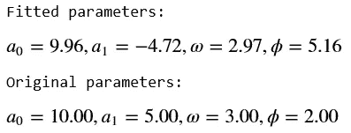

# 用 Python 中的机器学习拟合余弦(正弦)函数

> 原文：<https://towardsdatascience.com/fitting-cosine-sine-functions-with-machine-learning-in-python-610605d9b057?source=collection_archive---------8----------------------->

[图像信用](https://i.gifer.com/1uoE.gi)

## 混合使用贝叶斯优化和线性回归来拟合物理学中最常见的函数之一。

*作者:卡门·马丁内斯-巴博萨和何塞·塞利斯-吉尔*

几天前，我们的一位同事问我们，如何利用对谐波信号行为的合理了解来拟合谐波信号的数据。这似乎是一个标准问题，因为在物理学中，许多过程都是周期性的。发动机的活塞；手表的钟摆；轮子的运动；甚至月球围绕地球的运动也遵循一种模式，这种模式在物理学中被称为*谐振子*，在数学上可以表示为:

其中 *a₀、a₁、* ⍵、ϕ是信号的位移、振幅、频率和相位。在下一张图中，我们可以看到该函数的曲线图，以及这些元件在信号中的作用:

谐波信号的参数。

在收到我们同事的邮件后，我们认为这是一个很容易用现有的 Python 库(如 Scipy)解决的问题。这个 Python 的包有一个名为 *optimize.curve_fit，*的方法，它使用非线性最小二乘法来拟合函数 *f* 到一些输入数据(正弦函数拟合的例子可以在[这里](https://scipy-lectures.org/intro/scipy/auto_examples/plot_curve_fit.html)找到)。Scipy 提供的功能相当快；然而，经过一些尝试后，我们注意到用户需要对每个参数值有一个概念，这样代码才能给出一个好的估计。我们探索了其他替代方案，如贝叶斯优化或回归，它们被证明是将数据拟合到谐波信号的非常好的替代方案。

在这篇博客中，我们将探讨如何使用 *Scipy* 和*hyperpt*来拟合谐波信号。我们还介绍了 [Python 的包 *HOBIT*](https://github.com/Harmonic-Oscillator-hyBrid-fIT/HOBIT) (谐振子混合拟合):一种混合方法，结合贝叶斯优化和线性回归，高效拟合余弦(正弦)函数。通过这篇博客，我们将探讨每种方法的优缺点。

这个博客的所有代码都可以在这个 [GitHub 仓库](https://github.com/Harmonic-Oscillator-hyBrid-fIT/HOBIT)中找到。

让我们从 n=100 个观察值的玩具数据集开始，它根据 *f(x)* 表现:

我们使用函数*NP . random . normal(size = n)*将噪声引入信号，以便使其更接近真实测量值。

我们在训练和测试中分割数据，这样 80%的观察值用于训练，其余的用于测试拟合度(即，我们进行单次验证拟合度):

# 用 Scipy 优化拟合

功能[优化。Scipy 的 *curve_fit*](https://docs.scipy.org/doc/scipy/reference/generated/scipy.optimize.curve_fit.html#scipy.optimize.curve_fit) 使用非线性最小二乘算法寻找 *f(x)* 的最优参数。该函数提供了不同的优化方法:Levenberg-Marquardt 算法(“lm”)；信赖域反射算法(“trf”)和狗腿算法(dogbox)。我们不会解释这些技术，更多信息可以访问 Scipy 的[文档，它解释了最小二乘算法的实现](https://docs.scipy.org/doc/scipy/reference/generated/scipy.optimize.least_squares.html#scipy.optimize.least_squares)。

*optimize.curve_fit* 在 Python 中的实现如下所示:

*pₒ* 是 *optimize.curve_fit* 函数的可选输入，是用户给定的*f(x)*参数的初始猜测。

运行此代码会导致以下结果:

注意 *a₁* 和ϕ与原始参数相差甚远。这可以解释为 *f(x)* 具有周期性行为，并且损失函数——在我们的例子中是均方误差(MSE)——具有许多局部最小值。这可能会导致错误的拟合参数，无论优化方法如何*。*换句话说: *p₀* 应该非常接近函数的真实参数，这对于拟合一个参数未知的函数是矛盾的。

*f(x)* 周期行为的另一个结果是，尽管参数与真实参数相差甚远，但 Scipy 可能提供合理的拟合，见下图:

使用 Scipy 的 *optimize.curve_fit* 拟合 f(x)。测试集的均方误差:1.79

尽管 Scipy 在拟合周期性函数方面存在局限性，但 *optimize.curve_fit* 的最大优势之一是其速度，非常快，在 0.016 秒后显示结果。如果已知参数域的估计值，我们建议在 *optimize.curve_fit* 中设置“method='trf '”或“method='dogbox ' ”,并通过选项 *bounds* 设置范围，以便用户仍然可以利用该包的速度。

# 使用 Hyperopt 进行装配

[Hyperopt](https://github.com/hyperopt/hyperopt) 是一个 Python 库，它使用[贝叶斯优化](https://app.sigopt.com/static/pdf/SigOpt_Bayesian_Optimization_Primer.pdf)来最小化机器学习算法中使用的从简单多项式到复杂损失函数的任何函数。在 Hyperopt 中制定优化问题需要三个基本部分:

1.  目标函数:这是我们想要最小化的函数。在我们的例子中，它是 MSE。
2.  参数域:我们知道或认为参数可能位于的范围。
3.  优化算法:这是用于创建目标函数的概率模型的方法，在每次迭代中从该模型中选择新的参数*、a₀* 、*、a₁* 、ω和ϕ。概率模型也称为代理曲面。

在这篇文章中，我们不打算详细解释 Hyperopt 是如何工作的。关于这个话题的精彩介绍，你可以去这个[博客。](/an-introductory-example-of-bayesian-optimization-in-python-with-hyperopt-aae40fff4ff0)

我们定义*目标*函数如下所示:

由于 Hyperopt 的实现，我们需要定义一个名为 *objective2* 的辅助函数，它为优化添加了多个参数。

Hyperopt 的实施如下:

变量*空间*定义了参数域。 *tpe_algo* 是 Hyperopt 使用的优化算法之一，即[树形结构 Parzen 估计器方法](https://papers.nips.cc/paper/4443-algorithms-for-hyper-parameter-optimization.pdf) (TPE)。 *fmin* 是根据 *tpe_algo* 在指定空间内最小化目标函数的超点函数，直到一定次数的评估。设置变量 *rstate* 以产生可重复的结果。

运行*fmin*500 次迭代后， *f(x)* 的最佳参数存储在变量 *tpe_best 中。*结果如下:

显然，与 Scipy 的 *optimize.curve_fit* 相比，Hyperopt 给出的结果更接近真实值，即使 MSE 更大(见下图)。但是，请注意，用户需要提前知道参数域，尽管范围可以比 Scipy 的方法更广。

使用贝叶斯优化的 f(x)的 Fir。测试集的均方误差:3.37

对于 500 次迭代，找到 *f(x)* 的最佳参数需要 4.88 秒。如果用户先前不知道 *a₀* 、 *a₁* 、ω和ϕ，则必须定义更大范围的参数空间，但这将需要更多次迭代来找到最优解。另一方面，如果 *a₀* 、 *a₁* 、ω和ϕ的真实值不在定义的参数范围内，结果将会是错误的。

# 使用混合方法拟合:HOBIT

我们开发了一个 Python 库，叫做:谐振子混合拟合( [HOBIT](https://github.com/Harmonic-Oscillator-hyBrid-fIT/HOBIT) )。该库结合了 Hyperopt 的强大功能和 S [cikit learn](https://scikit-learn.org/stable/) 的灵活性，可精确拟合谐波信号。HOBIT 设计用于拟合正弦(余弦)信号。用户可以定义ω和ϕ的范围，但 HOBIT 默认使用以下范围:

这对于谐振子是典型的。

不需要事先了解 a₀和 a₁，因为它们是由霍比特确定的。

HOBIT 的实现非常简单，如下所示:

*regression for trigonometric*类有两种拟合方法: *fit_sin* 拟合正弦函数和 *fit_cos* 拟合余弦函数。在任何这些方法中，你需要包括你的训练集(X_train，y_train)和你想要运行优化的迭代次数(由 *max_evals* 给出)。还可以包含其他的 Hyperopt 参数，例如，如果您想让结果可重现，可以在变量 *rstate* 中设置一个随机种子。HOBIT 将结果参数存储在变量 *best_parameters* 中。

运行上面的代码会产生以下结果:

与 Scikit learn 类似，我们可以使用 predict 函数来应用在看不见的数据上找到的参数:

数据的拟合 *f(x)* 如下所示:

f(x)的 Fir 使用新 Python 的包 HOBIT。测试集的均方误差:2.21

对于 500 次迭代，HOBIT 需要 3.05 秒找到 *f(x)* 的最优参数，几乎比 Hyperopt 快了两秒！对于相同的迭代次数，HOBIT 的拟合具有更低的 MSE。

# HOBIT 是如何工作的？

HOBIT 的目的是提供最适合输入数据的参数 *a₀* 、 *a₁* 、ω和ϕ，其方式与使用 Scikit learn 的分类器相同。霍比特根据观测结果对 a₀和 a₁进行了初步估计。这些参数的初始假设是:

我们将这些初始值以及ω和ϕ的默认范围引入到超远点。在拟合函数中指定的迭代之后，我们通过 *tpe_algorithm* 获得拟合的ω和ϕ。

我们使用拟合的ω和ϕ进行变换，从而实现多项式回归。我们使用 Scikit [learn 的线性回归模型](https://scikit-learn.org/stable/modules/generated/sklearn.linear_model.LinearRegression.html)对这一转换进行处理，以获得 a₀*和 a₁* 的最终值。(关于使用 Scikit learn 进行多项式回归的更多信息，可以去这个[博客](/polynomial-regression-bbe8b9d97491))。通过使用这种混合方法，HOBIT 拟合数据的速度比 hyperopt 更快，因为它只需找到ω和ϕ，而 *a₀和 a₁* 是通过使用回归模型获得的。

一旦找到参数，用户就可以使用预测功能将模型应用于另一个看不见的数据。HOBIT 的使用简单直观，尤其是在使用 Scikit learn 的情况下。我们建议提前查看数据，以便对ω的域做出现实的定义。

您可以在此处找到笔记本，其中的示例将有助于更详细地了解 HOBIT。

# 结论

余弦(正弦)函数广泛应用于数学和物理中，但是考虑到它们的周期行为，根据数据拟合它们的参数并不总是一件容易的事情。在这篇博客中，我们修改了 Python 中的一些现有方法，这些方法可以用来进行这样的拟合。

我们探索三个工具:*optimize . curve _ fit*from*Scipy，Hyperopt，和 HOBIT。我们拟合根据余弦函数表现的数据集。每种包装都有一些优点。以下是我们对其中每一种方法的使用建议:如果用户事先详细了解可以找到最佳参数的范围，那么使用 Scipy 的 *optimize.curve_fit* 是最佳选择，但是，如果用户没有这方面的知识，结果可能不正确。如果用户对函数的了解非常有限，那么 Hyperopt 可能会有所帮助，主要问题是需要为每个参数设置一个大的域，从而强制使用更多的迭代来进行拟合。最后，HOBIT 是一个新工具，结合了两个世界的优点，使正弦(余弦)信号的拟合更容易、更快，使用户可以设置范围和迭代。类似于 Hyperopt，如果用户没有任何先前的参数知识，可以定义更宽的范围，但是这将需要更多的迭代来找到最优解。尽管如此，考虑到只有两个参数的域将被调整，HOBIT 将比仅使用 Hyperopt 更快。*

*感谢阅读！*

*您可以通过 LinkedIn 联系我们:*

* [## Carmen Adriana Martínez Barbosa -数据科学家/顾问-研究员- Deltares | LinkedIn

### 拥有天体物理学博士学位并对数据科学充满热情的积极进取的专业人士。在…方面有很强的背景

www.linkedin.com](https://www.linkedin.com/in/camartinezbarbosa/)  [## Jose Celis-Gil -数据科学家- Pointlogic，尼尔森公司| LinkedIn

### 在实现最佳绩效和找到提高利润/影响比率的平衡点的愿望的驱使下…

www.linkedin.com](https://www.linkedin.com/in/jose-celis-gil/)*