# 广义线性模型分解

> 原文：<https://towardsdatascience.com/fitting-glms-by-hand-189c02af33a8?source=collection_archive---------10----------------------->

## 使用最大似然法和梯度下降法在 Python 中从头拟合 GLMs

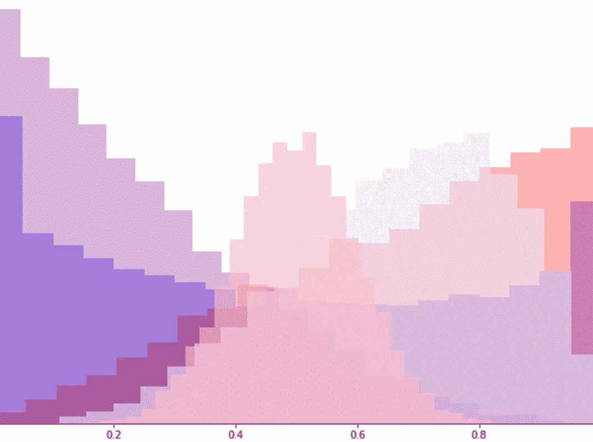

在普通的线性回归中，我们将结果变量视为几个输入变量加上一些随机噪声的线性组合，通常假设为正态分布。虽然这种建模方法易于解释、高效实现，并且能够准确捕捉许多线性关系，但它确实有一些明显的局限性。线性模型的简单扩展，广义线性模型(GLM)能够放宽线性回归的一些最严格的假设。这些假设包括:

1.  结果变量和输入变量之间的线性关系
2.  误差项的正态分布
3.  误差项的恒定方差。

放宽这些假设允许我们将更灵活的模型应用于更广泛的数据类型。

GLMs 可以很容易地用 R 或 Python 这样的语言编写几行代码，但是要理解模型是如何工作的，亲自动手编写代码总是很有帮助的。本文展示了如何仅使用 Python 的 Numpy 包从头实现 GLMs。要了解更多关于 GLMs 的基础和直觉，请查阅[这篇文章](/generalized-linear-models-9cbf848bb8ab)或[这本书](https://www.amazon.com/Generalized-Linear-Examples-Springer-Statistics/dp/1441901175)。

# GLM 结构

拟合 GLM 首先需要指定两个组件:我们的结果变量的随机分布和分布的平均参数与其“线性预测器”之间的*链接*函数。

## 随机成分

构建 GLM 的第一步是确定结果变量的分布。如果数据有二元响应，我们可能要使用伯努利或二项式分布。如果我们正在处理计数数据，泊松模型可能更有用。通常假设这种分布来自于指数分布族，包括二项式、泊松、负二项式、伽玛和正态分布。

这些模型中的每一个都可以用其均值参数𝜇 *= E(Y)* 来表示。例如，我们将二项式模型指定为 *Y ~* Bin *(n，p)* ，也可以写成 *Y ~* Bin *(n，* 𝜇 */n)* 。一旦我们估计了𝜇，我们就将 *Y* 建模为来自𝜇̂指数化的分布，我们对 *Y* 的预测值就是𝜇̂.

## 链接功能

在 GLM 中，我们将𝜇估计为“线性预测”𝜂的非线性函数，而后者本身是数据的线性函数。连接𝜇和𝜂的非线性函数被称为*链接*函数，我们在模型拟合之前确定它。链接函数被写成𝜇的函数，例如𝜂 *= g(* 𝜇).

假设我们有以下训练数据，其中每个 **x** 是一个 D 维向量:

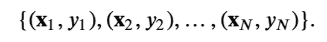

我们首先将𝜂写成对于每个观测值 n = 1，…，n 的线性函数 **x** :

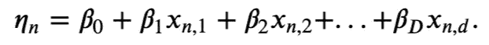

然后我们用链接函数将𝜂和𝜇联系起来:

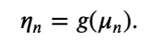

# 安装 GLM

为了适合 GLM，我们实际上只是寻找βs 的估计:从这些，我们获得𝜂的估计，这立即导致𝜇的估计，然后给我们一个 *Y 的估计分布！*按照以下步骤估算βs:

1.  将 y 的分布指定为𝜇.的函数
2.  指定链接函数，𝜂 *= g(* 𝜇).
3.  确定一个损失函数。这里，我们使用负对数似然。我们可以将损失函数分解为每个线性预测值和相应的真值 *Y* 的函数，如下图所示。
4.  通过闭合解或梯度下降法，找出使损失函数最小的β值。

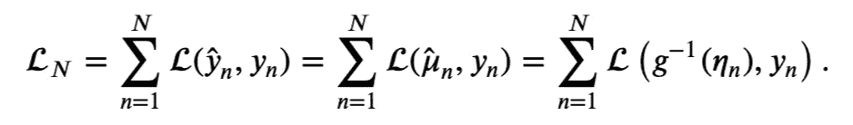

# 线性回归——GLM 的特例

为了加强我们对这种结构的理解，让我们首先以 GLM 格式写出一个典型的线性回归模型。作为步骤 1，让我们指定 *Y* 的分布。回想一下，典型的线性模型假设

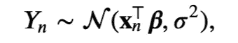

其中 **β** 是系数的长度为 D 的向量(假设我们已经为每个 **x** 加了 1，因此 **β** 中的第一个元素是截距项)。请注意，该分布的平均值是数据的线性组合，这意味着我们可以通过以下等式根据线性预测值编写该模型

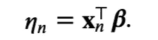

然后在第二步，我们需要找到连接𝜇和𝜂.的函数在线性回归的情况下，很简单。由于 *E(Y) =* 𝜇，并且我们建模的 *Y* 的平均值是𝜂，所以我们有𝜂 *= g(* 𝜇) = 𝜇！

第三步:让我们找到负的对数可能性。

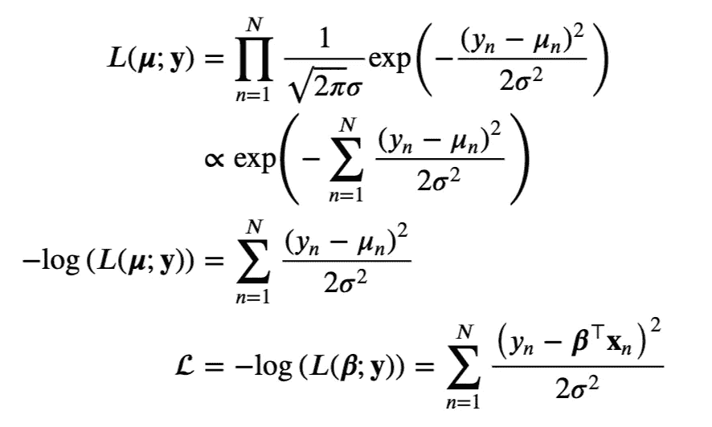

注意，我们的损失函数与误差平方和成正比。

最后，对于第 4 步，让我们看看我们是否可以分析性地最小化这个损失函数。首先对 **β** 求导，并将其设为等于 **0。**

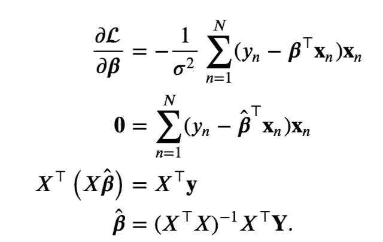

这就给出了我们所熟知并喜爱的来自普通线性回归的闭式解。

现在是简单的编码。让我们随机生成一些正态分布的 *Y* 值并拟合模型。下面的散点图显示，我们对 **β** 的拟合值非常接近真实值。

```
import numpy as np
import matplotlib.pyplot as plt
%matplotlib inline
import seaborn as snsnp.random.seed(123)## GENERATE STUFF ### Generate X
N = 1000  # number of observations
D = 10 # dimension of each observation
X = np.random.randn(N, D-1) # (minus 1 because we have to add the intercept)
intercept = np.ones(N).reshape(N, 1) 
X = np.concatenate((intercept, X), axis = 1)# Generate true beta
beta = np.random.randn(D)# Generate response as function of X and beta
y = X @ beta + np.random.randn(N)## FIT STUFF ##
beta_hat = np.linalg.inv(X.T @ X) @ X.T @ y## PREDICT STUFF ##
y_hat = X @ beta_hat## PLOT ##
fig, ax = plt.subplots()
sns.scatterplot(beta, beta_hat)
ax.set(xlabel = 'True Betas', ylabel = 'Estimated Betas', title = 'Beta vs. Beta Hats');
```

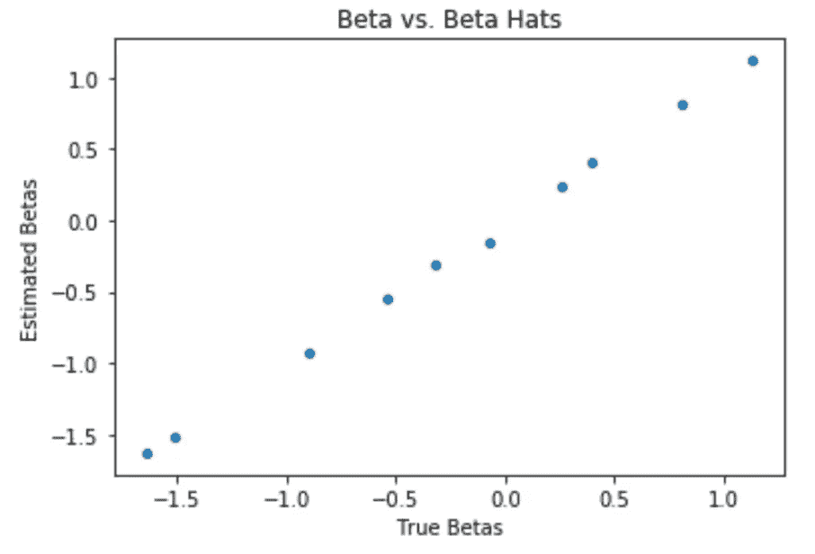

# 逻辑回归——二元数据的 GLM

在逻辑回归中，我们将输出建模为独立的伯努利试验。即我们假设

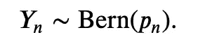

这就完成了第一步。对于第 2 步，我们必须找到一种方法将我们的线性预测器𝜂与我们的参数*p*联系起来，因为 *p* 在 0 和 1 之间，而𝜂可以是任何实数，自然的选择是对数概率。即，

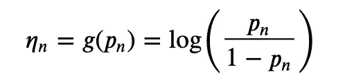

相反，我们使用 sigmoid 函数从𝜂得到 *p* (我称之为 S) *:*

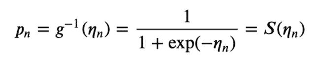

这就结束了第二步。对于第 3 步，找出负对数似然。

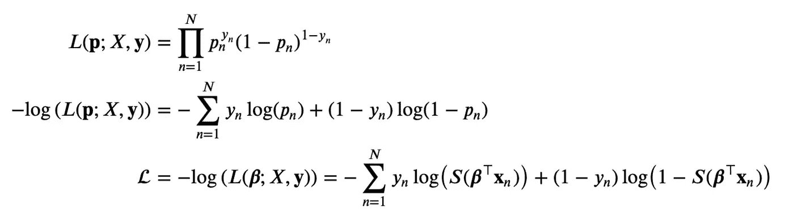

这就给出了我们的损失函数，完成了第 3 步。对于第 4 步，我们找到了 **β** 的值来最小化这种损失。不幸的是，在逻辑回归的情况下，没有封闭形式的解决方案，所以我们必须使用梯度下降。所以，让我们找到损失函数相对于 **β** 的导数。首先注意 *S'(x) = S(x)(1-S(x)):*

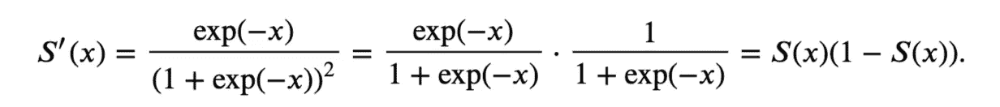

然后我们可以推导出整个梯度:

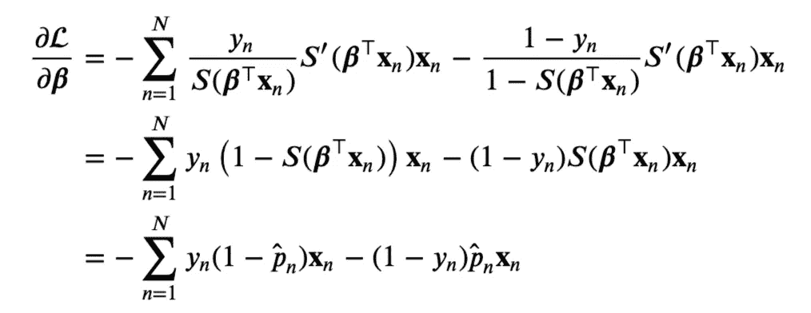

为了加速 Python 中的计算，我们也可以把它写成

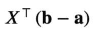

在哪里

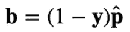

和

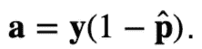

现在让我们使用梯度下降来拟合模型。同样，下面的散点图显示，我们对 **β** 的拟合值非常接近真实值。

```
np.random.seed(123)## GENERATE Ys ### Generate response as a function of the same X and beta
# only now it's a Bernoulli r.v. 
def sigmoid(x):
    return 1/(1 + np.exp(-x))
p = sigmoid(X @ beta)
y = np.random.binomial(1, p)## FIT WITH GD ##
nruns = 10**5
learning_rate = 0.0001
beta_hat = np.random.randn(D) # initialize beta_hat estimates
p_hat = sigmoid(X @ beta_hat) # initialize p_hats
for run in range(nruns):
    # get gradient 
    a, b = y*(1-p_hat), (1-y)*p_hat 
    grad = X.T @ (b-a)
    # adjust beta hats
    beta_hat -= learning_rate*grad
    # adjust p hats
    p_hat = sigmoid(X @ beta_hat)## PLOT ##
fig, ax = plt.subplots()
sns.scatterplot(beta, beta_hat)
ax.set(xlabel = 'True Betas', ylabel = 'Estimated Betas', title = 'Beta vs. Beta Hats');
```

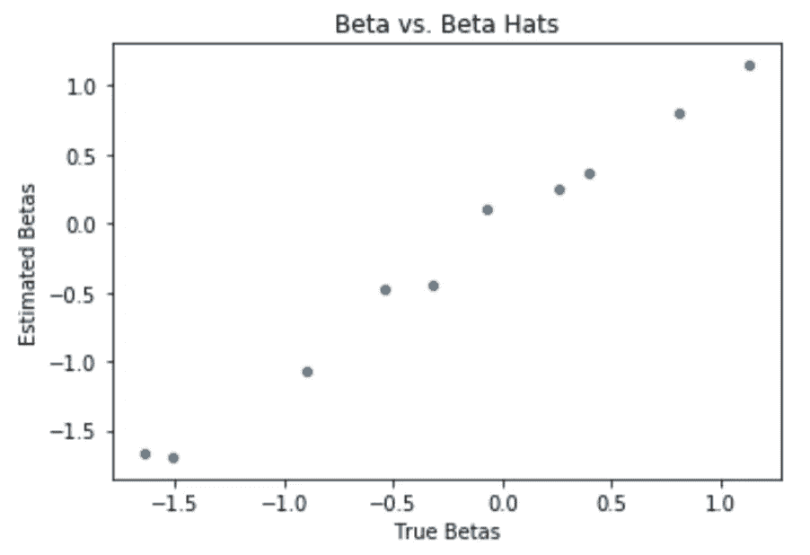

# 泊松回归-计数数据的 GLM

泊松是对计数中发生的数据建模的一种很好的方式，例如高速公路上的事故或因马踢而死亡。

第一步:假设我们有

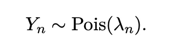

第二步，我们指定链接函数。链接函数必须将非负速率参数λ转换为线性预测值η ∈ ℝ.一个常见的功能是

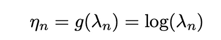

这当然也有负面影响

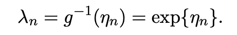

现在进行第三步，找到负的对数可能性。

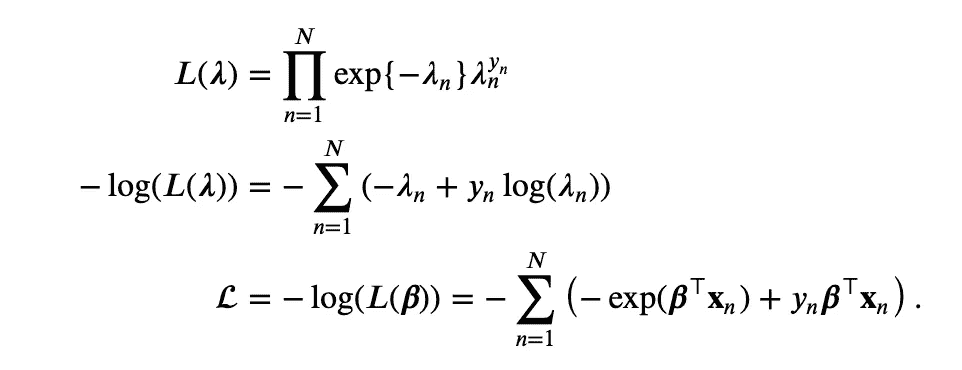

第四步，对 **β** 进行优化。

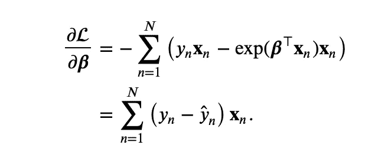

不幸的是，没有封闭形式的解决方案，所以我们再次转向梯度下降，如下所示。再一次，估计的参数被绘制成真实的参数，并且模型再一次做得很好。

```
np.random.seed(123)## GENERATE Ys ### Generate response as a function of the same X and beta
# only now it's a Poisson r.v. 
beta = np.random.randn(D)/2
lam = np.exp(X @ beta)
y = np.random.poisson(lam = lam)## FIT WITH GD ##
nruns = 10**5
learning_rate = 0.00001
beta_hat = np.random.randn(D)/2 # initialize beta_hat estimates
lam_hat = np.exp(X @ beta_hat) # initialize lam_hatsfor run in range(nruns):
    # get gradient 
    c = y - lam_hat
    grad = X.T @ c
    # adjust beta hats
    beta_hat -= learning_rate*grad
    # adjust lambda hats
    lam_hat = np.exp(X @ beta_hat)## PLOT ##
fig, ax = plt.subplots()
sns.scatterplot(beta, beta_hat)
ax.set(xlabel = 'True Betas', ylabel = 'Estimated Betas', title = 'Beta vs. Beta Hats');
```

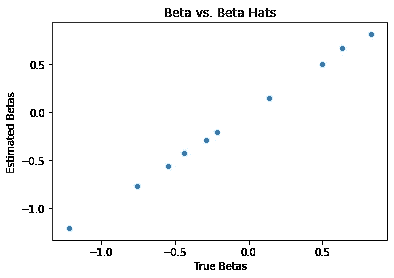

在实际构建 GLMs 时，Python 中 R 的`glm`命令和 statsmodels 的`GLM`函数很容易实现，并且编程效率高。但是，熟悉 GLM 的结构对于参数调整和模型选择至关重要。当谈到建模时，通常了解引擎盖下是什么的最好方法是自己制造汽车。