# 拟合曲线:推理方法和冠状病毒建模

> 原文：<https://towardsdatascience.com/fitting-the-curve-comparing-approaches-in-coronavirus-predictive-modeling-4a5f0e36c3c5?source=collection_archive---------39----------------------->

*【本帖最后更新于 5 月 14 日*】*

***编者注:*** [*走向数据科学*](http://towardsdatascience.com/) *是一份以研究数据科学和机器学习为主的中型刊物。我们不是健康专家或流行病学家，本文的观点不应被解释为专业建议。想了解更多关于疫情冠状病毒的信息，可以点击* [*这里*](https://www.who.int/emergencies/diseases/novel-coronavirus-2019/situation-reports) *。*

在开始之前，我想重申一下，我是一名软件工程师，而不是流行病学家。

我分解了两个被广泛引用的模型，它们的评论，以及它们如何与我们从未见过的各种推理和预测结果联系起来。

这里的目标是通过学习变量、做出假设和构建推理结构来将这些值转化为预测值。

如果你对传染病建模感兴趣，我已经链接了我参考的每一篇论文，当然也有一个[维基百科页面。](https://en.wikipedia.org/wiki/Mathematical_modelling_of_infectious_disease)

记住，乔治·博克斯通常的免责声明:

所有的模型都是错的，但有些是有用的。

# 内容

1.  推理和建模技术
2.  [SIR 型号](#f676)
3.  [IHME vs 帝国理工](#2ca4)
4.  [IHME 模式](#ce7f)
5.  [帝国学院模型](#7efb)
6.  [什么让模型有用](#19a1)
7.  [模拟、研究、杂项](#0815)

# 推理和建模技术

假设我请你仅根据第一张图表预测洛杉矶、芝加哥和堪萨斯城**1980 年的人口。你将如何着手做这件事？**

*只有克里夫兰和奥马哈显示到 1980 年*。

(第二个图表显示了实际数据)

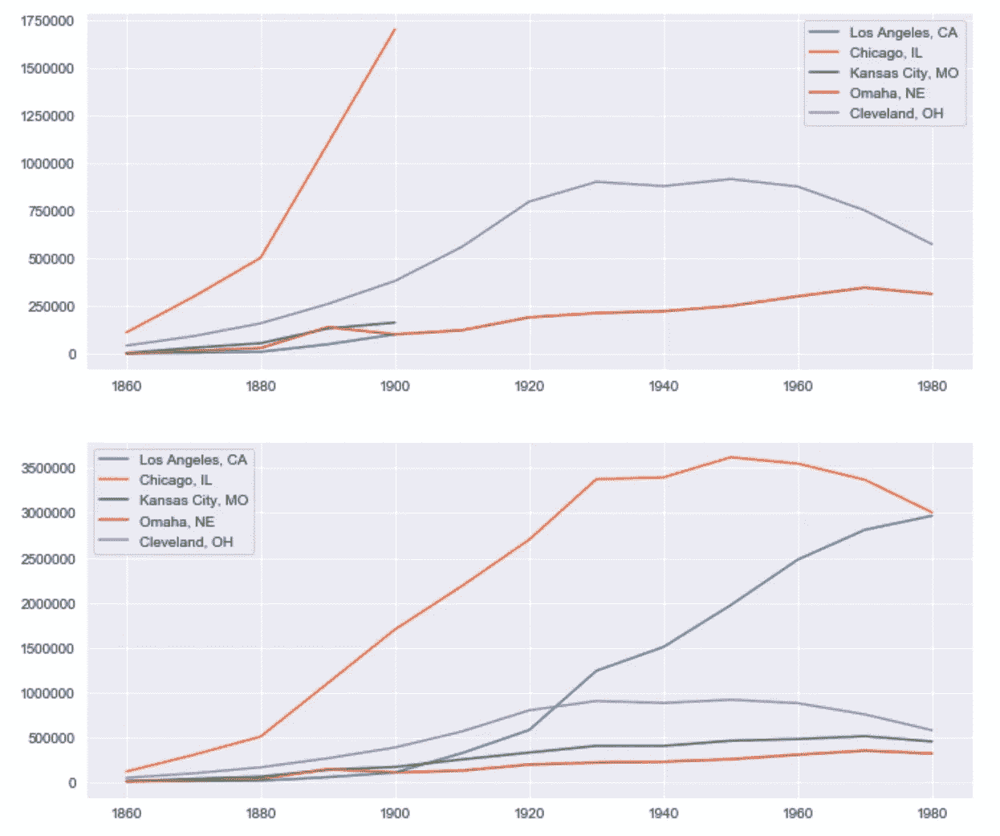

仅仅根据这张图表，很难预测。

如果我告诉你:洛杉矶濒临海洋，堪萨斯城和奥马哈是内陆城市，芝加哥和克利夫兰在湖边。另外，如果我提到洛杉矶附近没有竞争对手，芝加哥已经被确立为中西部的中心。这可能有助于你的预测。

随着我们变得更加富裕，西方的出生率下降了，这是怎么回事？还有一些完全不可预测的事件，比如洛杉矶在 20 世纪 20 年代成为世界电影之都。最重要的是，如果数据不可靠怎么办？郊区应该算吗？一个城市最近合并了一个新的区域吗？

像这样的动态几乎不可能预测。虽然这不是一个完美的类比。这是在以后查看流行病学模型时需要考虑的问题。

## 推理定义

得出结论有几种不同的推理方式。本文中的[描述了其中一个关键对比:](http://www.uvm.edu/~jphoffma/models/Hoffmann_SIMULATION_06.pdf)

> **演绎法**需要专业知识来建立一个基于机械论的模型，并依赖于对生态系统内机制的第一性原理理解。相比之下，**归纳法**仅使用生态系统的可用经验输出数据的信息内容来构建预测模型。

换句话说

*   归纳推理从 [**因果→规则**](https://www.youtube.com/watch?v=-nn3XMoPC7s)
*   演绎推理从 [**原因、规则→结果**](https://www.youtube.com/watch?v=-nn3XMoPC7s)

如今，当我们听到统计建模时，我们通常谈论的是一个 3 步过程。

1.  模型训练/装配
2.  预言；预测；预告
3.  估价

然后，我们通过用更好的模型、更好的数据或两者来重新训练，随着时间的推移改进我们的模型。

**试衣和训练可以与规则学习**相关联。这种学习通常发生在[许多用于导出关联的例子中](https://en.wikipedia.org/wiki/Newton%27s_law_of_universal_gravitation#cite_note-5)。更类似于归纳推理。

**预测或计算可以与应用这些学习到的规则相关联。**更类似于(尽管不完全是)演绎推理。

每个模型都结合了这些步骤。他们用不同的学习技术在不同的粒度水平上这样做，但是他们做这些步骤。

# 冠状病毒的流行病建模

我们将研究三种方法。

*   分室模型
*   IHME / UW 方法
*   帝国理工学院的方法

# 分室模型

分室模型试图将人口的不同部分置于不同的状态。许多流行病模型使用分室方法。我想提到这些是因为它们在流行病学中有使用的历史。SEIR 模型包括这些主要状态，

**易感、暴露、受感染/传染性、移除**

然后根据这些状态之间的相互关系建立微分方程。这些流动状态看起来类似于麻省理工学院的德尔菲模型，

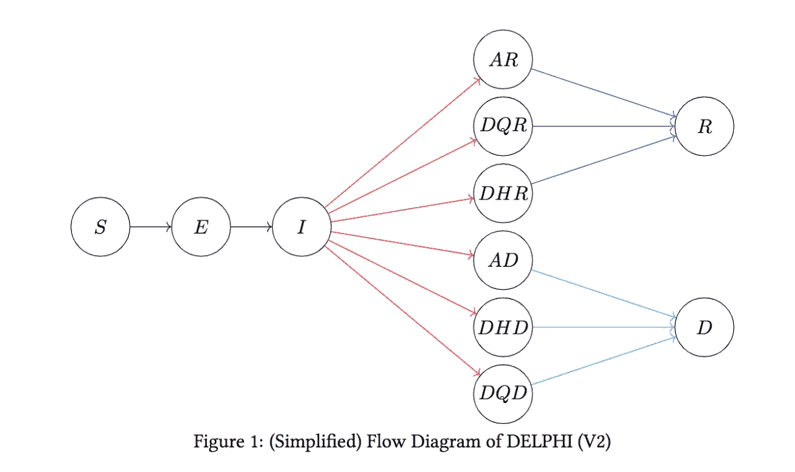

[https://github . com/covid analytics/DELPHI/blob/master/DELPHI _ Explainer _ V2 _ 8 . pdf](https://github.com/COVIDAnalytics/DELPHI/blob/master/DELPHI_Explainer_V2_8.pdf)

产生的方程看起来像这样，

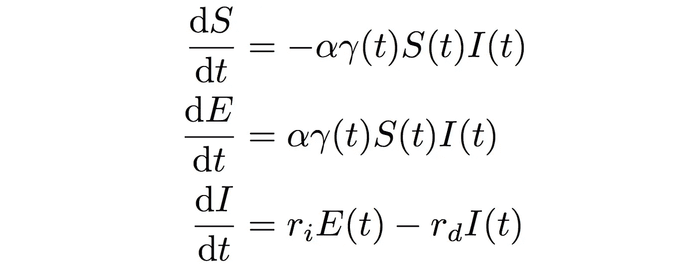

易感、暴露和传染性方程

请注意，这些模型试图捕捉人们从易感、传染到康复过程中感染的消长。

我们看到感染人群随时间的变化(dI/dt)是如何由暴露个体的数量(E(t))减去已感染个体的数量决定的。个人可以根据过去的时间在不同的状态之间移动。这可能导致我们看到某种阻尼曲线或振荡向稳定状态移动。

我认为这更像是一种**演绎法**，因为我们为各州制定了要遵循的规则，通过这些规则我们得出了解决方案。然而，调节这些变量的一些参数值是以归纳的方式学习的。

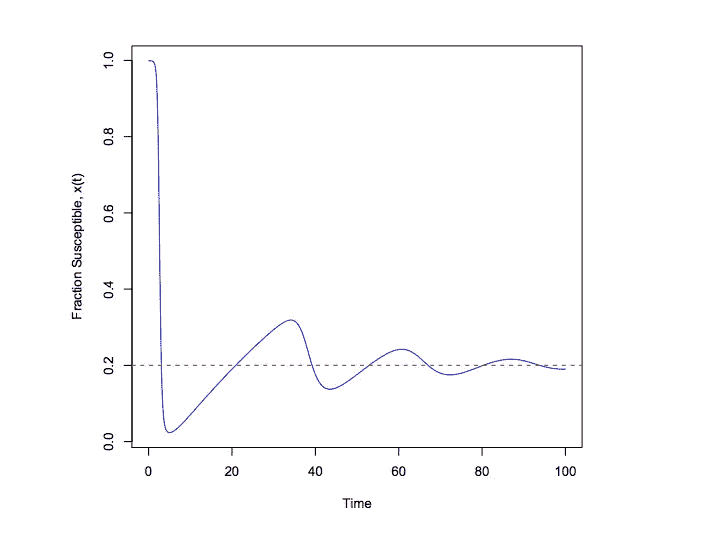

微分方程会产生这样的结果

# IHME 和帝国理工学院模型

## 他们如何比较？

*   IHME 模型的核心是估算累积病例和死亡人数。
*   帝国理工学院的模式是围绕随着时间的推移产生感染。

## 让我们把这个和人口的例子联系起来。

IHME 模型将着眼于估计一个特定城市的总人口轨迹，给出其以前的人口，并观察其他城市如何达到稳定或增长。这是一个统计模型。它只是预测总人口。

帝国理工学院的模式会更复杂。这将类似于模拟一些家庭的起始数量，然后分配概率给他们可能有多少个孩子，他们是否选择留在一个城市，或者新的家庭是否会以某种概率进入系统(模拟移民)。然后，我们可以统计每次模拟运行中的总人数，以获得最终的估计值。

*此外:SIR 类型的微分方程模型将建立一个具有一定增长率、限制因素和死亡率的方程组。然后我们会在不同的时间点求解，直到达到稳定状态。这个模型可能对城市人口增长不是很有用，因为有太多的外部因素。*

# IHME 模型

让我们来看看[华盛顿大学的范文](https://www.medrxiv.org/content/10.1101/2020.03.27.20043752v1)。

*以下数据来自 3 月 4 日的发布。*

> ***调查结果*** *:使用统计模型，我们预测新冠肺炎高峰时的超额需求为总床位 64，175 张(95% UI 7，977 至 251，059 张)和 ICU 床位 17，380 张(95% UI 2，432 至 57，955 张)。我们估计在接下来的 4 个月中，美国将有 81，114 例(95% UI 38，242 至 162，106)死亡病例来自新冠肺炎。*

该模型以 95%的可信度预测了 38，242 到 162，106 例死亡。

## “曲线”

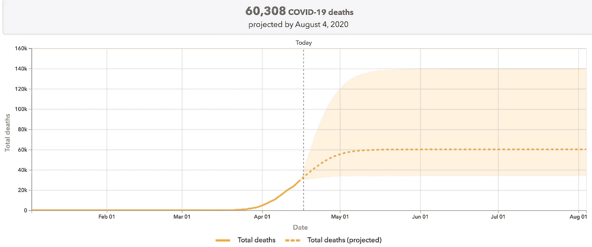

这是 4 月 17 日发自:[https://covid19.healthdata.org/united-states-of-america](https://covid19.healthdata.org/united-states-of-america)

## 曲线到底是怎么推导出来的？

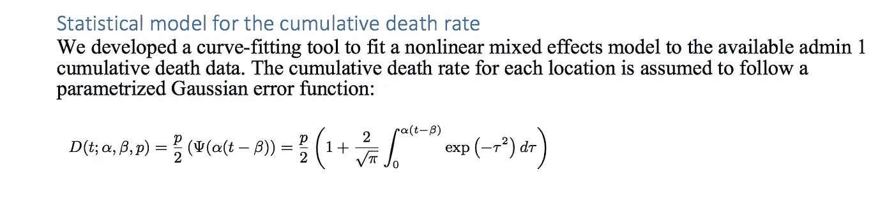

数学魔法

*来自附录*

> *水平:p 控制速率可以达到的最大渐近水平*
> 
> *斜率:α控制感染的速度*
> 
> *拐点:β是 D 变化率最大的时间。*

我们这里有 4 条基本“规则”。这三个变量以及模型本身的形式。请注意，模型本身是被选择的，并没有真正被学习，但是模型中的变量仍然需要拟合。在这里，我们寻求一种模式，这种方法更符合归纳推理。

## 续 IHME 白皮书

> *…假设每种类型模型中的协变量乘数的值紧密遵循从武汉数据获得的拟合，这是在训练数据集中达到稳定状态的时间序列。*

**每种模型中的协变量乘数(变量相关的规则)的值被假定为非常符合武汉的数据。**

> *具体来说，来自武汉的概括信息是社会距离对最大死亡率和到达拐点时间的影响。对于每种类型的模型，我们都考虑了“短期”和“长期”变量，以分别解释现有数据和预测长期趋势。在前一种情况下，协变量乘数可能会偏离适合武汉的协变量乘数，而在后一种情况下，武汉的数据对最终的协变量乘数有较大的影响。*

据此，武汉数据中最能概括的部分是社会距离的长期影响。这是有疑问的，但它是一个关键的假设。

## p，α，β是怎么学来的？

我们应该记住，p、α和β并不是实际的物理现象，比如人口密度，或者病毒在一个表面上会存活多久——它们只是控制这条曲线形状的参数。这条曲线是他们假设的最接近累积死亡率的形状。

记住，这项研究使用了来自世卫组织网站、地方和国家政府的新冠肺炎每日死亡数据。3 月份，这一数据极其稀少。即使在今天，人们仍然担心数据的质量。重要的是，这些变量是从现有的数据点中学习来的。

## 4 月 17 日更新:变量是如何更新的？

> **主要发展 1:** 扩大社会距离政策的类别并考虑流动性
> 
> 正如我们在[4 月 10 日的更新](http://www.healthdata.org/sites/default/files/files/Projects/COVID/Estimation_update_041020.pdf)中提到的，IHME 团队成员一直在使用来自[笛卡尔实验室](https://github.com/descarteslabs/DL-COVID-19)、 [SafeGraph](https://www.safegraph.com/dashboard/covid19-commerce-patterns?is=5e8b94eac6a05447bd786ae9) 和谷歌(通过他们的[新冠肺炎社区移动性报告](https://www.google.com/covid19/mobility/))的移动性数据，处理和测试与实施的每种类型的距离政策相关的模型…
> 
> **主要进展 2:** 量化新冠肺炎每日死亡人数在哪里达到峰值，以及峰值持续多长时间。

本地化的社会距离和流动性指标[现在用于](https://ihmeuw-msca.github.io/CurveFit/methods/#statistical-model)帮助预测每个地点的流行高峰。此外，他们还采用了一种统计方法来确定出现峰值的位置以及峰值平均持续的时间。这个特定于位置的信息很重要。尽管如此，他们使用的过程需要一个峰值来识别这些特征。如果没有它，他们如何准确预测峰值呢？

## 这些之前是怎么估计的？

数据极其有限。三月中旬，我们只有武汉的数据。据我所知，我们没有任何特定位置的社交距离指标来指导任何协变量。我们没有具体位置的实际峰值数据。我们没有高峰期的数据。在最初的模型发布的时候，我觉得很难得到一个精确的特定位置的测量值。

## 为什么不用 SIR 模型？

SIR 模型将更好地反映感染随时间的消长。然而，IHME 大学的研究人员在三月份有意识地决定不使用这个模型:

> 新冠肺炎的预测很大程度上是基于数学模型，该模型捕捉了从易受感染状态到受感染状态，然后到恢复状态或死亡状态(SIR 模型)的移动概率…
> 
> 另一种策略是专注于对经验观察到的新冠肺炎人口死亡率曲线进行建模，这些曲线直接反映了病毒的传播和每个社区的病死率。

## IHME 的批评

一些人对这种模式表示担忧。悉尼大学转化数据科学中心的数据科学家也表达了对该模型的担忧(5)。

> IHME 的模型对每个州的死亡人数给出了 95%的预测区间。如果不确定性估计正确，那么我们预计 95%的州的实际值位于这些区间内，”她说。
> 
> “但是我们没有。事实上，只有 30%的美国州的实际死亡人数在 95%的预测区间内，而 70%的州在该区间之外。因此，要么不确定性被低估，要么点估计不准确，或者两者兼而有之，”她说。

此外， [StatNews 文章](https://www.statnews.com/2020/04/17/influential-covid-19-model-uses-flawed-methods-shouldnt-guide-policies-critics-say/)中强调的一条评论如下:

> 根据伦敦卫生与热带医学学院和伦敦帝国学院的研究人员的评论，[本周在《内科医学年鉴》上发表了](https://annals.org/aim/fullarticle/2764774/caution-warranted-using-institute-health-metrics-evaluation-model-predicting-course)，IHME 的预测是基于“没有流行病学基础的统计模型”
> 
> “统计模型”是指将美国的数据放入其他国家随着时间推移的新冠肺炎死亡人数图表中，假设美国的疫情将模仿那些国家的疫情。但各国的对策大相径庭。当美国的疫情曲线因应对措施(比如说)弱于或晚于中国而发生变化时，IHME 的建模者会调整曲线以适应新的现实。

同样在[内科年鉴](https://annals.org/aim/fullarticle/2764774/caution-warranted-using-institute-health-metrics-evaluation-model-predicting-course)，

> 该模型基于一个可能不正确的假设，即社会距离政策的影响在任何地方都是一样的，抑制政策将在所有地区实施，并将始终有效

请注意，两篇评论提到了同一个问题，**不同国家的反制措施和抑制政策不尽相同**。我们怎么能假设它们会有同样的效果呢？

这一部分非常重要。如果不同国家的对策没有可比性，那么我们就没有办法做出正确的预测。

# 帝国学院模式

这是另一个被广泛引用的模型。

他们的模型显示，如果不采取措施阻止疾病传播，美国将有 220 万人死亡(6)。

回想一下演绎法的定义，

> 演绎法需要专业知识来建立一个基于机械论的模型，并依赖于对生态系统中的机制的第一性原理的理解。

**这非常类似于模拟，或基于主体的模型。**

引用[的一篇自然文章](https://www.nature.com/articles/d41586-020-01003-6):

> 该小组在 3 月 16 日进行了模拟，为英国政府应对新冠肺炎疫情提供信息。该模拟使用了 2005 年建立的基于代理人的模型，以观察如果 H5N1 禽流感变异为可在人群中轻易传播的版本，泰国会发生什么情况
> 
> 使用这些参数的模拟运行将总是给出相同的预测。但是被称为随机模型的模拟注入了一点随机性——例如，像掷一个虚拟骰子来看 I 组中的某人是否会在他们相遇时感染 S 组中的人。当模型运行多次时，这给出了一系列可能的可能性。
> 
> 建模者也用不同的方式模拟人们的活动。在“基于等式”的模型中……另一种方法是使用“基于主体”的方法，在这种方法中，每个人都根据自己的特定规则移动和行动——就像视频游戏系列“模拟人生”中的模拟角色一样。

我们这里有很多优势。由于 21 世纪[的计算能力](https://github.com/mrc-ide/covid-sim#building)，我们实际上可以用这些模型模拟非常复杂的情况，因为不同的代理可以通过模拟以不同的方式进行。

在这个帝国理工学院的案例中，关于疾病传播的机制没有那么抽象。第一原则/机制是在较低水平上学习的(即我们使用住院率、传染性)。

## 测量社会接触和传染性(R-零)

> 英国广播公司疫情研究有两个组成部分，一个集中在哈斯勒梅尔镇[16]，另一个集中在更广泛的英国人口[17]。在这里，我们展示了来自英国国家研究的数据。在使用 BBC 疫情应用程序加入这项研究时，用户首先输入他们的基本人口统计信息，包括年龄、家庭规模、性别和职业。该应用程序然后在 24 小时内每小时记录他们的大概位置…

数据收集的结果如下所示:

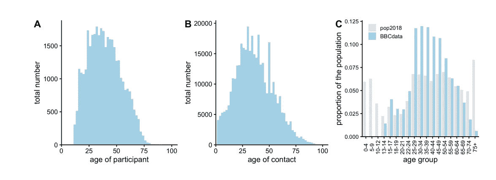

[https://www . medrxiv . org/content/10.1101/2020 . 02 . 16 . 20023754 v2 . full . pdf](https://www.medrxiv.org/content/10.1101/2020.02.16.20023754v2.full.pdf)

## r-零

> 我们假设 R0=2.4，但是检查 2.0 和 2.6 之间的值。我们假设有症状的个体比无症状的个体传染性高 50%。假设个人传染性是可变的，用平均值为 1、形状参数为 0.25 的伽马分布来描述。

r-nough 可以用多种方法测量。有一种方法类似于本文中[描述的方法:](https://www.ncbi.nlm.nih.gov/pmc/articles/PMC1804098/)

> 流行病学家使用疫情开始时获得的个体水平接触追踪数据计算 R0。一旦一个人被确诊，他/她的接触者将被追踪和检测。然后通过对许多诊断个体的继发性病例数进行平均来计算 R0。

我们使用了一种归纳的方法来推导低水平的接触测量。这些“第一原理”机制，以及住院率、感染传播的概率等因素将用于模拟。

## 其他变量定义

> *我们假设潜伏期为 5.1 天【9，10】。对于有症状的人来说，假定传染性发生在症状发作前 12 小时，对于无症状的人来说，传染性发生在感染后 4.6 天，随着时间的推移，传染性分布导致平均产生时间为 6.5 天。*

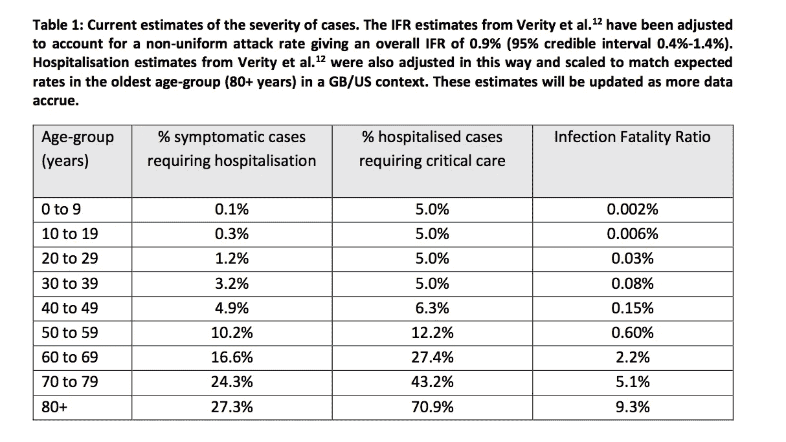

## 复杂行为

基于主体的模型的一个主要好处是，它们实际上可以捕捉大多数封闭形式的模型没有捕捉到的复杂的交互效应。

例如，封闭形式的方程很难对此建模。

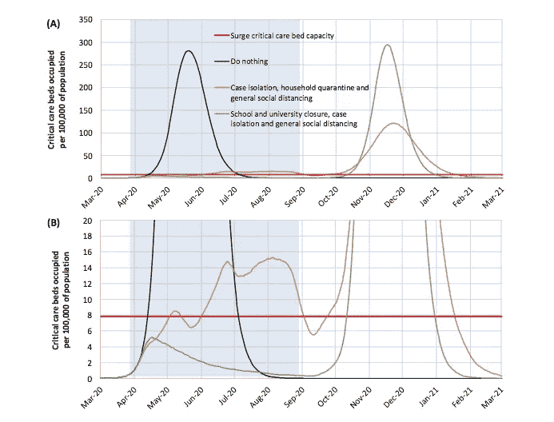

我们可以尝试捕捉复杂的相互作用和其他高度依赖于许多环境因素和时间的影响。

当社交距离在夏天和秋天变得缓和时会发生什么？第二波或第三波会有多大？模拟模型具有更好的能力来捕捉这种类型的交互。

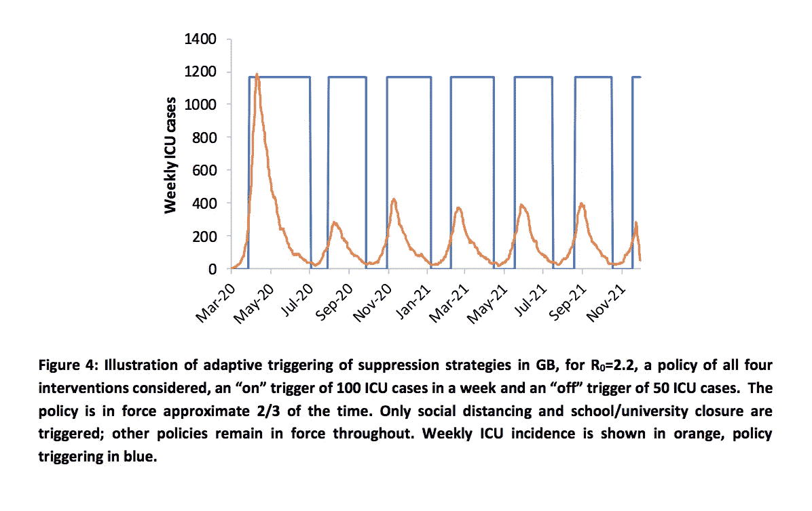

此外，当我们改进某些评估时，他们可以更新参数。他们可以更新个体传染性并运行模型。他们可以更新住院概率并运行模型。诸如此类。

## 复杂模型和复合误差

当然，模拟建模也会产生糟糕的结果。

这些模型更复杂。作为一名计算机程序员，如果说我学到了什么，那就是事情越复杂，出错的可能性就越大。

因为我们一遍又一遍地执行特定的交互，所以数字可能会显著下降——这可能会导致**复合错误**。

如果我们遗漏了一两个重要的变量，我们的结果会非常误导人。这方面的一个例子是病死率。将这些估计从 0.03%修正到 0.02%，或者从 0.08%修正到 0.04%，将会大大减少预测的死亡人数。

(由于这个原因，许多建模者执行**敏感性分析**来查看整个模型对特定变量的变化有多敏感。)

这方面的一个例子是在[这篇文章](https://www.aier.org/article/imperial-college-model-applied-to-sweden-yields-preposterous-results/)中提到的结果，瑞典研究人员使用帝国理工学院的模型来预测他们自己国家的死亡人数。

> [我们的瑞典模型](https://www.medrxiv.org/content/10.1101/2020.04.11.20062133v1.full.pdf)显示，根据保守的流行病学参数估计，目前的瑞典公共卫生战略将导致 5 月份重症监护负荷达到峰值，超过疫情之前的 40 倍，中位死亡率为 96，000 (95% CI 为 52，000 至 183，000)。

到目前为止，这种结果还没有出现。[截至 5 月 8 日，他们的死亡率约为 3100 人

# 哪个更有用？

这是一个很难回答的问题。

首先，哪个更准确？但是仅仅在国家层面上是正确的并没有多大帮助。如果你过分高估了德克萨斯州和佛罗里达州的病例，同时低估了纽约州和新泽西州的病例，那么即使累计计数接近正确，也只能为州或国家的准备工作提供有限的帮助。

请看前两张图表:其中一个国家发布了“呆在家里”的命令，另一个没有。第三个图表显示了德国，一个成功实施封锁和接触者追踪措施的国家。我不知道是否有任何一个模型能够预测到这些结果，考虑到他们各自的政策。

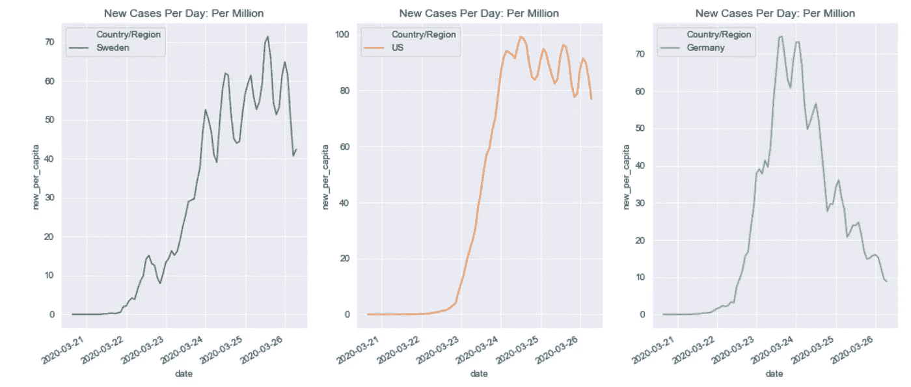

来源数据:[https://github . com/CSSEGISandData/新冠肺炎/tree/master/csse _ covid _ 19 _ Data/csse _ covid _ 19 _ time _ series](https://github.com/CSSEGISandData/COVID-19/tree/master/csse_covid_19_data/csse_covid_19_time_series)【新增病例 3 日移动平均线】

有些事情是无法准确预测的。大规模的人类行为就是其中之一。随着时间的推移，不同的人群实际上会对实施的距离措施做出怎样的反应？

尽管如此，给定特定条件的存在，最有用的模型是准确的。考虑人口密度、公共交通普及率、天气、戴口罩倾向、社交距离(或实际跟进)、受感染人口百分比、年龄人口统计、家庭人口统计(瑞典的单身家庭与意大利的多代同堂家庭)。

考虑这些是极其重要的，因为我们需要知道实际上什么在起作用，这些措施在多大程度上起作用，在哪里起作用，以及何时起作用。4 月份在德克萨斯州可能成立，但 5 月份在波士顿可能不成立。亚洲的封锁与美国的封锁[不同(这是一个大问题)。](https://www.npr.org/sections/health-shots/2020/04/29/847755751/compared-to-china-u-s-stay-at-home-has-been-a-giant-garden-party-journalist-says)

考虑到最近的一系列建议，这是一个很好的例子。[IHME 团队最近发布了关于各州何时可以放松社交距离措施的建议。](https://www.npr.org/sections/health-shots/2020/04/25/844088634/when-is-it-safe-to-ease-social-distancing-heres-what-one-model-says-for-each-sta)

让我们来看看其中的两个:

*   7 月 20 日北达科他州
*   5 月 21 日伊利诺伊州

标准是每百万居民少于 1 例。

我们能精确测量吗？北达科他州的居民不到一百万。我的直觉是芝加哥比北达科他州更危险。如果北达科他州有一个人冠状病毒检测呈阳性，整个州应该关闭？北达科他州的全面封锁与接触追踪、社会距离和戴口罩相比如何？北达科他州的百万分之一病例和伊利诺伊州的不同。在芝加哥跳上“L”(公共交通&高风险)的一个病例和在北达科他州开车去上班的一个病例是不同的。

# 证据和推理

还记得他们说没有证据表明戴口罩真的有帮助吗？现在记住这一点，花一分钟来看看这条推文中显示的模拟。

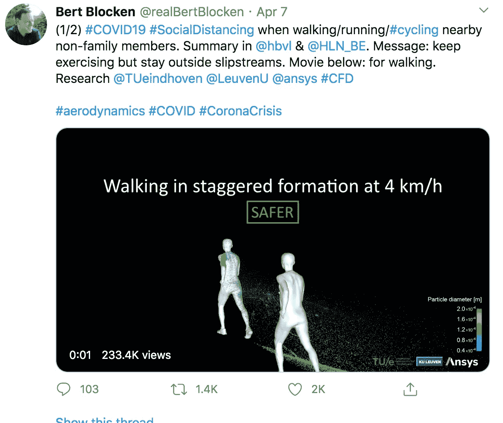

[https://Twitter . com/realBertBlocken/status/1247540730425249799？s=20](https://twitter.com/realBertBlocken/status/1247540730425249799?s=20)

上面的模拟可能看起来很吓人。这是一个很酷的模拟…但也有点令人不安。

## 有哪些事情是我们不知道的？

它是如何雾化的？如果你身边有人呼吸，你感染的可能性有多大？在里面和外面有很大的区别吗？由于不确定可能性，人们可以通过吸入感染者排出的飞沫感染呼吸道疾病。

## 我们知道哪些事情？

物理屏障阻止液滴向前移动(至少尽可能向前)。当人们呼吸时，我们排出飞沫。

## 一些演绎推理

我会尽力模仿夏洛克·福尔摩斯。

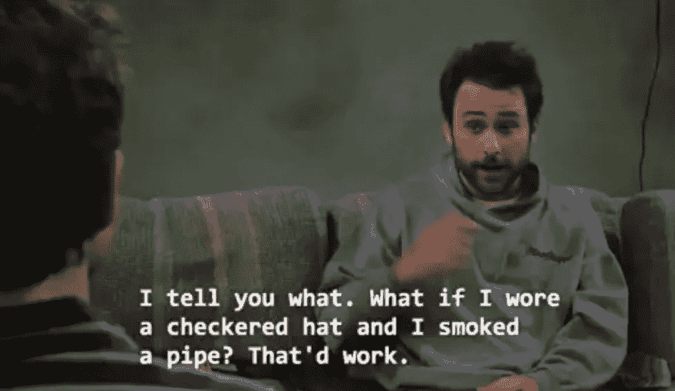

[*来源*](https://www.buzzfeed.com/jamiejones/champion-of-the-sun?utm_source=dynamic&utm_campaign=bfsharecopy&sub=0_7788270#7788270)*—20 日电视台/Via*[*fycharlieday.tumblr.com*](http://fycharlieday.tumblr.com/post/113995570682)

鉴于:

*   有许多无症状的个体
*   当人们呼吸时，他们排出飞沫
*   感染者的飞沫可以被另一个人吸入
*   物理屏障阻止水滴在太空中扩散

…面具可能是个好主意(我知道，令人惊讶)。

## 这在当时是有意义的

因此，鉴于推特上的模拟模型，以及我出色的演绎推理，我认为跟在外面的人后面可能不是一个好主意。我想很有可能被感染。但是很容易计算错误。我们经常错过某些(重要的)变量。

为了说明我的观点，我将引用[来自中国的这项研究，该研究称仅检测到一组感染源来自户外。](https://www.medrxiv.org/content/10.1101/2020.04.04.20053058v1)在这项研究中，大多数(几乎所有)疫情发生在室内。

无论这项研究是否得到证实，将模拟和研究进行比较的目的是为了显示我们的演绎推理如何在很多很多地方出错。这引发了许多问题。风是如何影响的？阳光怎么样？湿度怎么样？

考虑到我们有足够的数据，这就是使用归纳的——我敢说是科学的——方法非常有用的地方。如果我们可以观察病例实际发生的地方，并控制足够的变量，它提供了所有这些因素的一定程度的抽象，并归结为，我们一直看到室内环境而不是室外环境中的传播。为什么不知道确切的原因，但至少我们有更好的能力来回答一个给定的问题。

**这就是为什么我们从事随机对照试验，尝试用我们从未见过的数据来测试我们的模型，并且通常尝试收集尽可能多的数据。我们希望控制足够多的(未知)变量，这样我们的模型在新数据上仍能表现良好。**

# 摘要

在我看来，如果你没有很多数据，但对系统的底层机制有信心，那么演绎-模拟或分室模型似乎更合适。如果你不知道一个机制是如何工作的，但有合理数量的数据，那么最好尝试使用归纳法以及我们可以使用的许多统计或机器学习方法。事实上，研究人员使用这些方法的组合，随着时间的推移进行更新和改进预测。

糟糕的模型可能比没有模型更糟糕。在某种程度上，当谈到保护我们的健康时，我们可以使用基本的统计数据、良好的记录、常识和可靠的方法。关于向前发展，我们希望模型能够预测给定特定行为模式、人口密度和人口统计的后果。无论哪种模型能够最好地捕捉到与疾病传播相关的变量，都可能是最有用的。

约翰·康威

当讨论模拟模型和复杂行为时，你必须承认约翰·康威的贡献。不幸的是，他最近因新冠肺炎并发症去世了。他的贡献不会被忘记。

**论专家**

我不希望人们放弃这种想法，“好吧，所谓的专家不能同意，所以[他们什么都不知道](https://qz.com/1709972/bill-gates-economists-dont-actually-understand-macroeconomics/)有些人比其他人更好。有些模型是好的，有些是坏的。批评最好留在个案的基础上。

# 链接如果你对疾病建模、复杂动力学或推理感兴趣

*   [https://necsi.edu/corona-virus-pandemic](https://necsi.edu/corona-virus-pandemic)
*   [https://www.networkscienceinstitute.org/covid-19](https://www.networkscienceinstitute.org/covid-19)
*   [https://covid19.gleamproject.org/](https://covid19.gleamproject.org/)
*   [https://en . Wikipedia . org/wiki/compartment al _ models _ in _ epidemiology # The _ SEIR _ model](https://en.wikipedia.org/wiki/Compartmental_models_in_epidemiology#The_SEIR_model)
*   [https://www.youtube.com/watch?v=pqXASFHUfhs](https://www.youtube.com/watch?v=pqXASFHUfhs)
*   [https://en.wikipedia.org/wiki/Conway%27s_Game_of_Life](https://en.wikipedia.org/wiki/Conway%27s_Game_of_Life)
*   [http://www . uvm . edu/~ jphoffma/models/Hoffmann _ SIMULATION _ 06 . pdf](http://www.uvm.edu/~jphoffma/models/Hoffmann_SIMULATION_06.pdf)
*   [https://github.com/mrc-ide/covid-sim](https://github.com/mrc-ide/covid-sim)

1.  [https://www . medrxiv . org/content/medrxiv/Suppl/2020/03/30/2020 . 03 . 27 . 20043752 . dc1/2020 . 03 . 27 . 20043752-1 . pdf](https://www.medrxiv.org/content/medrxiv/suppl/2020/03/30/2020.03.27.20043752.DC1/2020.03.27.20043752-1.pdf)
2.  艾萨克·牛顿:“在[实验]哲学中，特定的命题是从现象中推断出来的，然后通过归纳而变得普遍”:[principal ia](https://en.wikipedia.org/wiki/Philosophiae_Naturalis_Principia_Mathematica)，第 3 册，General Scholium，在 1729 年出版的 Andrew Motte 英译本第 2 卷第 392 页。
3.  [http://www . health data . org/research-article/forecasting-新冠肺炎-影响-医院-床位-天数-ICU-天数-呼吸机-天数-死亡人数](http://www.healthdata.org/research-article/forecasting-covid-19-impact-hospital-bed-days-icu-days-ventilator-days-and-deaths)
4.  【https://ihmeuw-msca.github.io/CurveFit/methods/ 
5.  [https://www . Sydney . edu . au/news-opinion/news/2020/04/14/us-新冠肺炎-死亡-预测不佳-由 ihme-model.html](https://www.sydney.edu.au/news-opinion/news/2020/04/14/us-covid-19-deaths-poorly-predicted-by-ihme-model.html)
6.  [https://www.nature.com/articles/d41586-020-01003-6](https://www.nature.com/articles/d41586-020-01003-6)
7.  [https://www . Imperial . AC . uk/media/Imperial-College/medicine/SPH/ide/gida-fellowships/Imperial-College-covid 19-NPI-modeling-16-03-2020 . pdf](https://www.imperial.ac.uk/media/imperial-college/medicine/sph/ide/gida-fellowships/Imperial-College-COVID19-NPI-modelling-16-03-2020.pdf)
8.  [https://www.ncbi.nlm.nih.gov/pmc/articles/PMC1804098/](https://www.ncbi.nlm.nih.gov/pmc/articles/PMC1804098/)