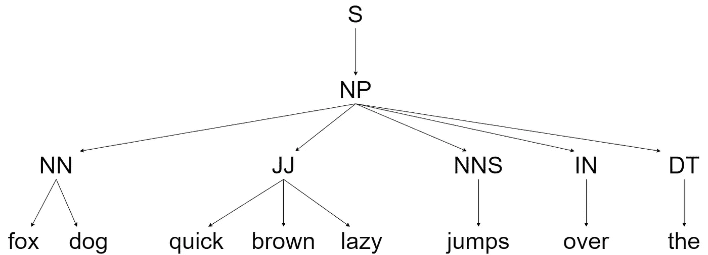
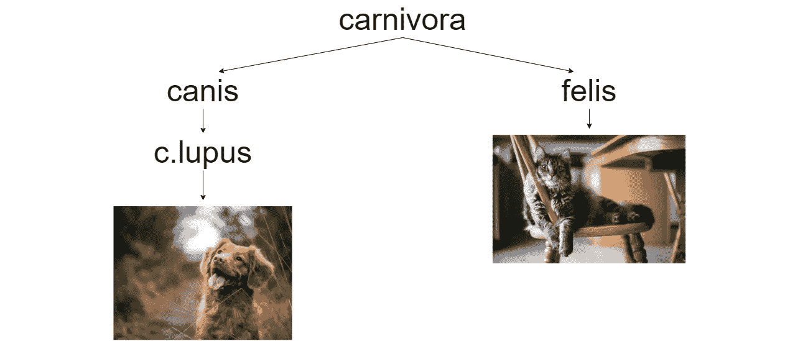

# 五个高级 Python 特性

> 原文：<https://towardsdatascience.com/five-advanced-python-features-169c96682350?source=collection_archive---------8----------------------->

## 花括号作用域、自动形象化和其他编写更好代码的方法


Josh Kahen 在 [Unsplash](https://unsplash.com?utm_source=medium&utm_medium=referral) 上拍摄的照片

ython 总能找到一些让我们惊喜的东西——这种语言中包含了太多精彩的特性。幸运的是，这意味着我们永远不会学不完东西。

随着时间的推移，我已经养成了一个习惯，那就是记下我在 Python 中偶然发现的每个新特性。大多数情况下，它们令人兴奋，但使用案例非常有限。

然而，其他时候，我偶然发现了一个真正非常广泛适用的特性——通常，它会改变我的编码方式。我用一个列表来记录这些特性，这篇文章涵盖了列表中我最喜欢的五个特性。

```
**Get Method for Dictionaries** - no more KeyErrors
**Tree Datatypes** - or autovivification
**Advanced List Indexing** - [::3]?
**Decorator Functions** - those @ things
**Denote Scopes with Braces** - not whitespace *(my favorite feature)*
```

# 字典的 Get 方法

dictionary `get`方法执行与更常见的`dict[key]`语法相同的操作，但有一个显著的不同——如果`key`在我们的字典中不存在，我们不会抛出错误:

```
dictionary = {
    'one': 1,
    'two': 2
}
dictionary['three']
```

`**[Out]:** KeyError: 'three'`

用**得到** —

```
dictionary.get('three')
```

`**[Out]:** None`

`get`方法返回 **None** ，而不是返回一个 **KeyError** 。

我们可以更进一步，用`get`方法的第二个参数指定如果`key`不存在要返回的值:

```
dictionary.get('three', False)
```

`**[Out]:** False`

```
dictionary.get('three', "doesn't exist")
```

`**[Out]:** 'doesn't exist'`

*最后，如果你知道你的字典的内容——不要用* `*get*` *它更慢！(感谢*[*Petru*](https://medium.com/u/b4afc3baa612?source=post_page-----169c96682350--------------------------------)*)*

# 树数据类型

树数据类型如下所示:



句子中单词的树形表示及其各自的词性(PoS)标签。来源:作者。

它表示一个分层的树结构，在最顶层有一个根值，向下分支到子节点。每个子节点有一个父节点，每个父节点可以有一个或多个子节点。

现在，我们在 Python 中的表示将非常类似于嵌套字典，我们将像这样构建:

```
tree = {
    'carnivora': {
        'canis': {
            'c.lupus': 'c.l.familiaris'
        },
        'felis': 'f.catus'
    }
}
```

这里我们需要为每个子节点定义一个新的字典，一次一个步骤。

它缓慢、混乱并且容易出错——想象一下一个简单的五层树，其中每个父节点只有两个子节点。

幸运的是，我们可以用下面的代码构建我们的树数据类型:

现在，我们可以立即构建整个分支，而不是像我们所做的那样定义每个子字典:

```
tree = Tree()
tree['carnivora']['canis']['c.lupus'] = 'c.l.familiaris'
tree['carnivora']['felis'] = 'f.catus'
print(tree)**[Out]:** {
           'carnivora': {
               'canis': {
                   'c.lupus': 'c.l.familiaris'
               },
               'felis': 'f.catus'
           }
       }
```



**人类最好的朋友**的科学分类树以及其他那些人们喜欢的东西。 [Jamie Street](https://unsplash.com/@jamie452?utm_source=medium&utm_medium=referral) 在 [Unsplash](https://unsplash.com?utm_source=medium&utm_medium=referral) 上拍照(左)，Kari Shea 在 [Unsplash](https://unsplash.com?utm_source=medium&utm_medium=referral) 上拍照(右)。

这个方法有一个名字，[auto vivification](https://en.wikipedia.org/wiki/Autovivification)——每当一个未定义的值被[解引用](https://www.computerhope.com/jargon/d/dereference-operator.htm)时，自动创建新的数组和散列。

另一个单行实现(不包括导入)可以在[这里](https://gist.github.com/hrldcpr/2012250)找到。

# 高级列表索引

## 步伐

有几种未知的列表切片方法，尽管很有用。第一个是使用**步骤**:

```
x = [0, 2, 4, 6, 8, 10, 12, 14, 16, 18]
x[::2]
```

`**[Out]:** [0, 4, 8, 12, 16]`

我们在这里使用的语法是`list[start:end:**step**]`——因为我们将`start`和`end`留空，我们从列表的最开始迭代到最末尾，其中`step`为`2`。

```
x[3:8:2]
```

`**[Out]:** [6, 10, 14]`

## 命名切片

下面这个高级列表切片方法叫做**命名切片**。这里，我们将一个切片赋给一个变量，如下所示:

```
named_slice = slice(5, None)  # this is equivalent to [5:]
```

然后，我们可以将这个命名切片应用于任何列表。

```
x[named_slice]
```

`**[Out]:** [10, 12, 14, 16, 18]`

我们在这里使用的语法使用相同的*开始、结束、步骤*模式— `slice(start, end, step)`。我们可以这样重写`x[3:8:2]`:

```
new_slice = slice(3, 8, 2)
x[new_slice]
```

`**[Out]:** [6, 10, 14, 18]`

# 装饰函数

装饰函数是我相信我们很多人都见过的奇怪的`@func_name`事物之一——特别是 Flask 库大量使用了它们。

它们非常容易理解，而且非常有用。装饰者只是允许我们修改一个函数的行为，而不用显式地修改我们的函数。

例如，我们可以定义一个`pointless`函数，它将遍历一个范围，最终返回打印的乘以 2 的最终值:

```
def pointless():
    for i in range(20000000):
        x = i*2
    print(x)
```

`**[Out]:** 39999998`

这个函数什么都不会做，只会花很长时间来运行——但这正是我们想要的。我们将使用装饰函数来计时这个函数的运行时间。

装饰器的定义就像任何普通函数一样:

```
def timer(func):
    def wrapper():
        start = datetime.datetime.now()
        func()
        runtime = datetime.datetime.now() - start
        print(runtime)
    return wrapper
```

然后，在定义我们的`pointless`函数来继承`timer`行为时，我们可以使用这个奇怪的@语法。

```
***@timer***
def pointless():
    for i in range(20000000):
        x = i*2
    print(x)pointless()**[Out]:** 39999998
       **0:00:01.220755**  *<-- this is returned from our decorator*
```

我们也可以使用多个装饰器。让我们定义另一个名为`repeat`的函数，它将对任何给定的函数迭代两次。

```
def repeat(func):
    def wrapper():
        for i in range(2):
            func()
            print(i)
    return wrapper
```

如果我们现在将`@timer`和`@repeat`装饰器都应用到我们的`pointless`函数中，我们将得到:

```
***@timer
@repeat*** def pointless():
    for i in range(20000000):
        x = i*2
    print(x)pointless()**[Out]:** 39999998
       **0**               *<-- printed in @repeat*
       39999998
       **1**               *<-- @repeat again*
       **0:00:01.220755**  *<-- printed from @timer*
```

在这里，我们将`pointless`包装到了`@repeat`中，并将结果函数包装到了`@timer`中——就像一些古怪的科学怪人的 Python 函数一样。

我们在这里使用的装饰器是简单的玩具例子。对于装饰者，我们可以做更多的事情——我建议看看这些文章/资源:

*   [Python 装饰者入门](https://realpython.com/primer-on-python-decorators/) *(一篇关于装饰者的免费综合文章)*
*   [流畅的 Python，卢西亚诺·拉马尔霍](https://amzn.to/2OMODLF) *(大量的 Python——不仅仅是装饰者)*

# 用大括号表示范围

很容易我最喜欢的 Python 中的*高级*特性，而不是依靠空格来表示作用域*(无聊)*——我们可以使用花括号！

我们从`__future__`库中导入功能:

```
from __future__ import braces
```

我们出发了！

这是 Python 中五个不常见但非常方便的特性。我想留给你们几个值得尊敬的例子来验证一下:

```
>>> import this
>>> import antigravity
>>> hash(float('inf'))
```

我把一个小的 GitHub repo 放在一起，里面有上述所有特性的例子，还有更多。查看它的代码片段——当然，也可以随意添加您自己的代码片段！

如果你有任何建议或问题，请随时通过[推特](https://twitter.com/jamescalam)或在下面的评论中联系我们。或者，如果你想要更多这样的内容，我也会在 [YouTube](https://www.youtube.com/c/jamesbriggs) 上发布。

感谢阅读！