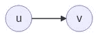
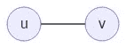
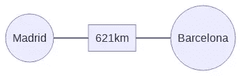
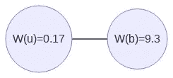
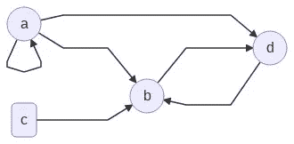
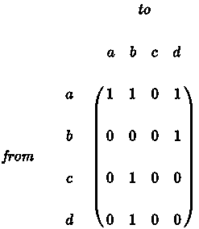
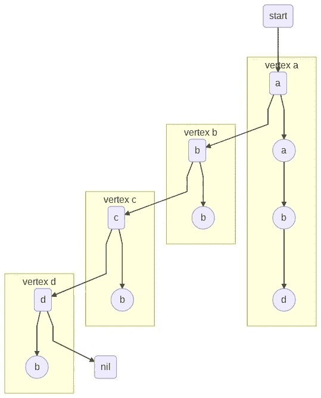
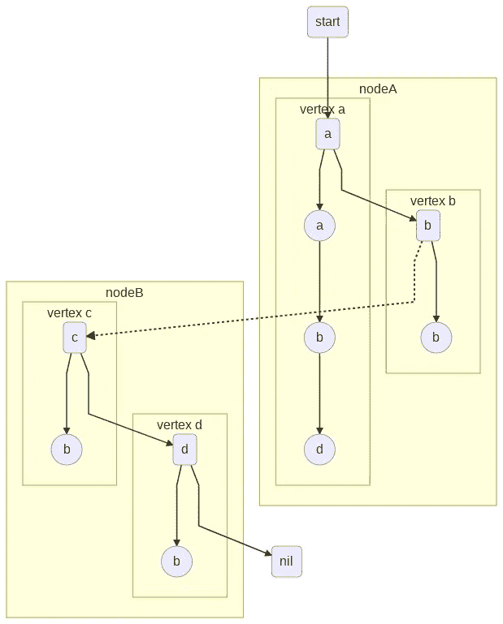

# 图形处理的五大挑战

> 原文：<https://towardsdatascience.com/five-challenges-of-graph-processing-94e0a4041431?source=collection_archive---------48----------------------->

## 图计算从业者必须克服的最相关问题的总结。


照片由 [Unsplash](https://unsplash.com?utm_source=medium&utm_medium=referral) 上的 [israel palacio](https://unsplash.com/@othentikisra?utm_source=medium&utm_medium=referral) 拍摄

在[之前的一篇文章](/graph-processing-a-problem-with-no-clear-victor-3683c483f5dc)中，我公开了我对缺乏清晰的图形处理平台/解决方案/框架/架构的看法。然而，图形处理必须处理的主要问题是什么？把这几行作为开胃菜送给那些好奇的人。

(除非另有说明，否则图片属于作者所有)。

[](/graph-processing-a-problem-with-no-clear-victor-3683c483f5dc) [## 图形处理:一个没有明确胜利者的问题

### 你知道最流行的图形处理解决方案吗？没有吗？别担心。现在还没有。

towardsdatascience.com](/graph-processing-a-problem-with-no-clear-victor-3683c483f5dc) 

# 1.图形是非结构化的

图是顶点 *V* 和连接这些顶点的边 *E* 的集合。一个图 *G=(V，E)* 可以是有向的，也可以是无向的。在有向图中，从顶点 *u* 到顶点 *v* 的任何边都有方向( *u* → *v* )。这就是，我们可以从 *u* 到 *v* 。



作者图片

如果图是无向的，我们就没有方向。这就是， *u* 连接到 *v* 上。



作者图片

另外，我们可以有权重为 W(e) 的边。



作者图片

和权重为 W(u)，W(v)的顶点。



作者图片

# 2.图形表示

图形特别适合于**代表绝对任何东西**。从社会网络到原子力之间的相互作用。这种程度的自由很难转化成计算机。图的一个非常计算机友好的表示是**邻接矩阵** *A* 。 *A* 是一个大小为 *|V| x |V|* 的方阵，其中 *A* ᵢ *ⱼ* 表示在顶点 *i* 和 *j* 之间存在一条边。对于无向图， *A* 是对称矩阵。例如，对于图表



作者图片

我们可以在邻接矩阵中得到它的表示:



因为前面的表示是矩阵，所以我们可以使用所有可用的代数运算工具。例如，通过对每一列的值求和，我们得到了针对每个顶点的边的数量。此外，我们可以使用[谱图理论](https://en.wikipedia.org/wiki/Spectral_graph_theory)计算特征值和特征向量，这些特征值和特征向量可以给我们提供有趣的信息。

# 3.记忆

但是还有其他方面需要考虑。**内存利用率怎么样？**想想上面的邻接矩阵，对于一个 4 x 4 的矩阵(16 个单元)，我们有 10 个空单元(等于 0)。为这个矩阵分配内存时，我们浪费了 62%的分配内存和不相关的信息。对于非常大的稀疏矩阵，这种成本是不可接受的。我们在很多情况下都有稀疏矩阵，想想社交网络。脸书有 26 亿活跃用户，每个档案最多只能有 5000 个好友。此外，一些操作变得很麻烦。例如，知道相邻顶点涉及整个矩阵的操作。

幸运的是，我们有其他更“内存友好”或者至少更适合某些场景的解决方案。一个**邻接表**是一个列表，其中每一项代表图中的一个顶点。对于每个顶点，我们都存储指向其相邻顶点(邻居)的指针。以上面的例子为例:



作者图片

邻接表将存储的信息限制在相邻顶点。顶点 *a* 可以访问其相邻顶点的引用列表。这有助于实现可以穿过图顶点的**遍历**操作，并使得存储附加数据增强数据**位置**成为可能。

从性能的角度来看，这就是图形成为一种非常难以处理的数据结构的地方。假设我们想要访问顶点*a*(*γ(a)*)的所有邻居。 *a* 的相邻顶点是:自身、 *b* 和 *d* 。这意味着我们必须访问 *b* 和 *d* 的内存位置。如果这些内存碎片还没有被缓存，会发生什么？这是一个缓存缺失，这意味着我们必须从主内存中取出图形的一部分。对于具有大量邻居的顶点，缓存缺失将反复重复。这直接影响了图形遍历器的性能。在大多数图形算法中，内存访问缺乏局部性是一个性能限制。

另一个有趣的问题是**当图形不适合主存**时会发生什么？就性能而言，高速缓存未命中代价高昂，但访问二级存储器的代价要高几个数量级。

# 4.分布式解决方案

如果我们考虑分布式解决方案，缺乏本地性可能是一个巨大的性能瓶颈。对于跨节点拆分图形的分布式内存解决方案，我们可能有这样的解决方案:



作者图片

对于在 nodeA 中运行的操作，对顶点 *c* 或 *d* 的任何访问都必须从其他节点检索信息。如果可以修改边权重，复杂性会增加。谁是边缘的主人？顶点呢？像 [Metis](http://glaros.dtc.umn.edu/gkhome/metis/metis/overview) 这样的解决方案可以跨 *n* 个库或节点给你最好的图划分。然而，使算法适应分布式分区并不容易。并且计算最佳分区是一个昂贵的操作。

# 5.平行

而**并行**呢？这取决于要并行化的问题或算法。然而，在诸如广度优先搜索(BFS)或深度优先搜索(DFS)之类的经典迭代器中，利用诸如队列或堆栈之类的并发访问数据结构存在明显的问题。例如，这是 BFS 的伪代码:

```
1  procedure BFS(G, root) is
2      let Q be a queue
3      label root as discovered
4      Q.enqueue(root)
5      while Q is not empty do
6          v := Q.dequeue()
7          if v is the goal then
8              return v
9          for all edges from v to w in G.adjacentEdges(v) do
10             if w is not labeled as discovered then
11                 label w as discovered
12                 w.parent := v
13                 Q.enqueue(w)
```

如果我们认为上面的伪代码是并行运行的，我们必须保证自动访问/修改 *Q* 和 labels 结构。这给多个并行实例带来了巨大的瓶颈，会导致非常差的性能。

# 摘要

在这篇文章中，我介绍了在设计基于图形的解决方案时，图形带来的一些潜在问题。您可能会发现许多其他问题。不过，我觉得这些是主要的。你会发现还有其他一些特别难以克服的问题。我很想听听。

感谢阅读！