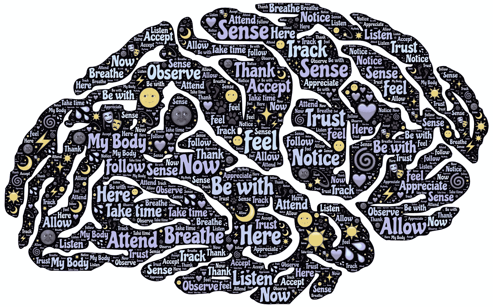
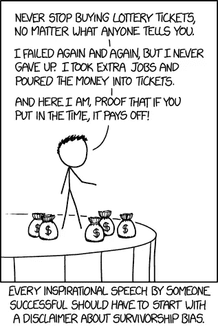
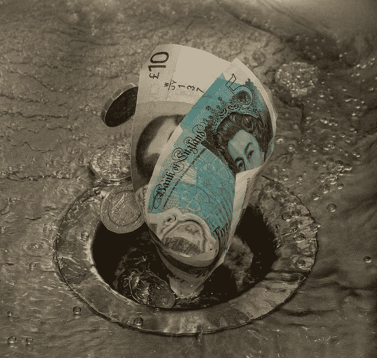
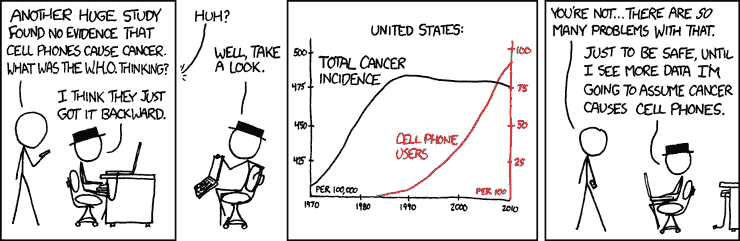

# 数据科学中的五种认知偏差(以及如何避免它们)

> 原文：<https://towardsdatascience.com/five-cognitive-biases-in-data-science-and-how-to-avoid-them-2bf17459b041?source=collection_archive---------29----------------------->

重新训练你的思维。图片由来自[皮克斯拜](https://pixabay.com/?utm_source=link-attribution&utm_medium=referral&utm_campaign=image&utm_content=1000062)的[约翰·海恩](https://pixabay.com/users/johnhain-352999/?utm_source=link-attribution&utm_medium=referral&utm_campaign=image&utm_content=1000062)拍摄

## 每个人都是扭曲思维的认知偏见的牺牲品，但数据科学家必须防止他们破坏自己的工作。

最近，我在读罗尔夫·多贝尔的*清晰思考的艺术*，这让我以一种前所未有的方式思考认知偏差。我意识到一些认知偏见是多么根深蒂固。事实上，当我们的思维受到影响时，我们甚至经常没有意识到。对于数据科学家来说，这些偏见真的会改变我们处理数据和做出日常决策的方式，而且通常不会变得更好。

> 尽管我们处理的所有事实看似客观，但数据科学在其过程中却出人意料地主观。

作为数据科学家，我们的工作是理解事实。在进行这种分析时，我们不得不做出主观决定。因此，即使我们使用确凿的事实和数据，数据科学也有很强的解释成分。

因此，我们数据科学家需要非常小心，因为所有人都非常容易受到认知偏差的影响。我们也不例外。事实上，我见过许多数据科学家最终根据预先存在的信念、有限的数据或不合理的偏好做出决策的例子。

在这篇文章中，我想指出五种最常见的认知偏差。我还将提供一些建议，告诉数据科学家如何避免这些错误，做出更好、更合理的决策。

# 1.生存偏差

[来源](https://xkcd.com/1827/)

第二次世界大战期间，非营利研究组织海军分析中心的研究人员承担了一个问题。他们需要在军队战斗机最薄弱的地方进行增援。为此，他们求助于数据。他们检查了每一架从战斗任务中返回的飞机，并记下了子弹击中飞机的位置。基于这一信息，他们建议飞机在这些精确的位置进行加固。

你认为这种方法有什么问题吗？

当然，问题是他们只看返航的飞机，而不看返航的飞机。当然，来自被击落飞机的数据几乎肯定会更有助于确定飞机的致命损坏可能发生在哪里，因为那些是遭受灾难性损坏的飞机。

研究小组遭受了生存偏差:他们只是看了他们可用的数据，而没有分析更大的情况。这是一种选择偏差，在这种情况下，我们根据一些任意的标准隐式地过滤数据，然后试图从中找出意义，而没有意识到或承认我们正在处理不完整的数据。

让我们想想这可能如何应用到我们的数据科学工作中。假设你开始处理一个数据集。您已经创建了自己的特征，并在建模任务中达到了相当高的精度。但也许你应该问问自己，这是不是你能达到的最好结果。你试过寻找更多的数据吗？也许将天气预报数据添加到您在 ARIMA 模型中使用的常规销售变量中会有助于您更好地预测销售。或者，假期的一些特征可以告诉你的模型，为什么你的购买者在感恩节或圣诞节前后表现得特别时尚。

***建议克服:*** 减轻这种偏见的一种方法是以严谨、科学的方式思考手头的问题，然后集思广益，找出任何有助于解决问题的数据(而不仅仅是从数据开始)。这些方法看似相似，但第二种方法限制了你的视野，因为你不知道你的工作中缺少了什么。通过使用第一种方法，你将知道哪些数据是你无法获得的，并且你最终会将这些因素纳入你的结论中。

# 2.沉没成本谬论

来源: [Pixabay](https://pixabay.com/photos/down-the-drain-money-waste-sink-4708734/)

我们都在某个时候看到过沉没成本谬误，不管是因为我们已经付了钱而看完那部糟糕的电影，还是因为我们已经看了一半而看完那本糟糕的书。每个人都遇到过这样的情况，他们最终浪费了更多的时间，因为他们试图挽救他们已经投入的时间。

沉没成本，也称为追溯成本**，**是指已经发生且无法通过任何额外行动收回的成本。沉没成本谬误是指人类倾向于根据他们已经做了多少投资来做决定，这导致了更多的投资，但却没有任何回报。

> 有时候，尽管很难，最好的办法就是放手。

这在数据科学项目中经常发生。一个项目可能运行了两年多而没有结果，但是一个调查者继续运行它，因为已经投入了如此多的时间、金钱和努力。或者，一名数据科学家可能会全心全意地为她的项目辩护，因为她在项目上投入了太多，没有意识到投入更多的工作从长远来看对她或公司没有帮助，而且最好是放弃这个项目。

***建议克服:*** 把自己从这种认知偏差中拯救出来的一个方法是，关注未来的收益和成本，而不是已经失去的过去的成本。你必须养成忽略先前成本信息的习惯，尽管这很难。当然，对于我们这些数据科学家来说，忽视数据从来都不容易。对我自己来说，我发现有条不紊的方法在这种情况下效果最好。我拿起纸和笔，远离所有的干扰，努力想出做一个项目所需的所有额外成本，以及我未来可能获得的收益。如果任务的成本部分看起来过于重要，那么是时候继续前进了。

# 3.虚假因果关系

[来源](https://xkcd.com/925/)

作为数据科学家，我们总是在寻找模式。这种趋势意味着，有时我们甚至会发现根本不存在的模式。我们的大脑是如此训练有素，以至于我们甚至可以尽可能地理解混乱。

因为我们的训练让我们寻找模式，所以记住一条简单的格言至关重要，即相关性并不意味着因果关系。这五个字就像数据科学工具箱的锤子，没有它你什么也做不成。仅仅因为两个变量前后移动并不一定意味着一个导致另一个。

这个原则已经被无数的例子生动地证明了。举个例子，

*   通过查看消防部门的数据，您会注意到，随着越来越多的消防员被派往火灾现场，最终对财产造成的损害也越大。因此，你可能会推断更多的消防员正在造成更大的损失。
*   在另一个著名的例子中，一位学者在调查 20 世纪 80 年代纽约市的犯罪原因时发现，严重犯罪的数量与街头小贩出售的冰淇淋数量之间有很强的相关性。但是我们就应该得出吃冰淇淋会让人犯罪的结论吗？既然这没有什么意义，我们显然应该怀疑有一个未被观察到的变量导致了这两者。在夏季，犯罪率最高，这也是大多数冰淇淋出售的时候。冰淇淋销售不会导致犯罪，犯罪也不会增加冰淇淋销售。

在这两种情况下，过于肤浅地看数据会导致不正确的假设。

***建议克服:*** 作为数据科学家，我们在提出研究结果时，需要留意这种偏差。通常，看似因果关系的变量可能不会被仔细检查。我们还应该特别注意在创建模型变量时避免这种类型的错误。在这个过程的每一步，重要的是问问我们自己，我们的自变量是否可能只是与因变量相关。

# 4.可用性偏差

你是否曾经说过这样的话，“我知道[在此插入一个通用语句]，因为[插入一个单独的例子]。”例如，有人可能会说，“喝啤酒不会发胖，因为鲍勃喝得很多，而且他很瘦。”如果你有，那么你已经遭受了可用性偏见。你试图用有限的数据来理解这个世界。

***人们自然倾向于根据我们已经获得的信息或我们经常听到的事情做出决定，而不去寻找可能有用的替代方案。结果，我们把自己限制在一个非常具体的信息子集。***

这在数据科学领域经常发生。数据科学家倾向于获取和处理更容易获得的数据，而不是寻找更难收集但可能更有用的数据。我们用我们理解的模型来凑合，这些模型对我们来说是一个整洁的包，而不是更适合手头的问题但更难得到的东西。

***建议克服:*** 在数据科学中，克服可用性偏差的一个方法就是拓宽我们的视野。致力于终身学习。阅读。很多。关于一切。那就多读一些。认识新的人。在工作中或在线论坛上与其他数据科学家讨论您的工作。更开放地接受你可能需要在方法上做出改变的建议。通过接受新的信息和想法，你可以确保不太可能使用不完整的信息。

# 5.确认偏差

一个老笑话说，如果你折磨数据足够长的时间，它就会招供。通过足够的工作，你可以扭曲数据，让它说出你想要它说的话。

我们都有一些信仰，这很好。这是人类的一部分。然而，不正常的是，当我们让这些信念不经意地进入我们形成假设的方式。

我们可以在日常生活中看到这种趋势。我们经常以这样一种方式解释新信息，使它与我们自己的信念相一致。我们在网站上阅读最符合我们信仰的新闻。我们和与我们相似并持有相似观点的人交谈。我们不想得到令人不安的证据，因为这可能会导致我们改变我们的世界观，而我们可能害怕这样做。

例如，在项目的成本效益分析阶段，我在数据科学中看到了确认偏差。我见过有人执着于证实他们假设的数据，而忽略所有矛盾的证据。显然，这样做可能会对项目的收益部分产生负面影响。

***建议克服:*** 对抗这种偏见的一个方法是批判性地审视你所有的信念，并试图找到关于你每一个理论的令人不安的证据。我的意思是，通过去你通常不去的地方，和你通常不说话的人交谈，并保持开放的心态，积极地寻找证据。

# 结论

> 在我们这个信息过载的时代，我们被如此之多的数据包围着，以至于我们的大脑拼命地去理解这些噪音。

有时候，能够根据有限的信息来理解这个世界是很有用的。事实上，我们在做大多数决定时都没有考虑太多，而是听从自己的直觉。我们大多数日常行为的潜在危害是非常小的。然而，允许我们的偏见影响我们的工作，会让我们陷入不幸的境地。如果我们做了一个重要的决定，结果证明是错误的，我们最终可能会失去金钱或信誉。

了解我们的大脑如何工作将有助于我们避免这些错误。

如果你想了解更多关于数据科学的知识，我想调出吴恩达的这个 [***精品课程***](https://www.coursera.org/learn/machine-learning?ranMID=40328&ranEAID=lVarvwc5BD0&ranSiteID=lVarvwc5BD0-btd7XBdF681VKxRe2H_Oyg&siteID=lVarvwc5BD0-btd7XBdF681VKxRe2H_Oyg&utm_content=2&utm_medium=partners&utm_source=linkshare&utm_campaign=lVarvwc5BD0) 。这是我开始的原因。一定要去看看。

谢谢你的阅读。将来我也会写更多初学者友好的帖子。在 [**媒体**](https://medium.com/@rahul_agarwal) 关注我或者订阅我的 [**博客**](http://eepurl.com/dbQnuX) 了解他们。一如既往，我欢迎反馈和建设性的批评，可以通过 Twitter [@mlwhiz](https://twitter.com/MLWhiz) 联系。

*这个故事最初发表于* [*此处*](https://builtin.com/data-science/cognitive-biases-data-science) *。*