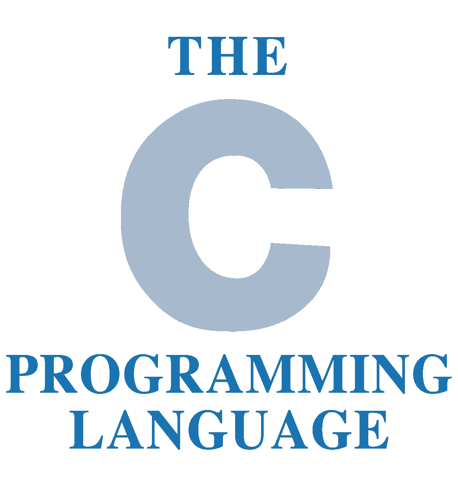
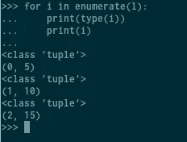

# 五个很酷的 Python 循环技巧

> 原文：<https://towardsdatascience.com/five-cool-python-looping-tips-14f6f44bcfc7?source=collection_archive---------4----------------------->

## 帮助你掌握 Python 迭代循环技巧的 5 个技巧。


(python 标识由[http://python.org 提供)](http://python.org))

或者循环很可能是一个新的 Python 程序员最先学会的概念之一。这是有充分理由的，因为 for 循环可以对数据做很多事情，而不会变得狡猾。然而，经常很容易让您的思想停留在简单迭代的世界中，而没有利用一些更有效和简洁的迭代方法和技巧来应用于 for 循环。使用这些技巧不仅可以使 for 循环更快，还可以使代码更简洁，为 Python 中潜在的循环机会打开一扇新的大门。

# Zip:一次遍历两个列表


(python 徽标由 http://python.org 提供)

在我的经验中，我发现一个真正有价值的工具是一次遍历两个数组的能力。这在其他语言中显然要困难得多，而在 Python 中我非常欣赏这种简单性。为了一次遍历两个数组，我们只需使用 zip()方法。

```
for first,second in zip(array1,array2):
    print(first)
    print(second)
```

演示这一点的一个很好的例子是用一组偶数和一组奇数进行计数:

```
odds = [1,3,5,7,9]
evens = [2,4,6,8,10]
for oddnum, evennum in zip(odds,evens):
    print(oddnum)
    print(evennum)
```

我们的输出会是:

```
1
2
3
4
5
6
7
8
9
10
```

# 在范围内:编写一个 C 风格的循环



虽然这看起来很基本，但是你可以用经典的 C 风格的循环做很多有趣的事情。

```
for i in range(10):
    print(i)
    if i == 3:
        i.update(7)
```

我们中的 C 爱好者可能认为这不一定是 C 风格的 for 循环，但这是不用编写自己的迭代方法就能得到的最接近的方法。幸运的是，我喜欢浪费时间，所以我决定写一个新的迭代器来尽可能接近经典的 C 循环:

```
class forrange:

    def __init__(self, startOrStop, stop=None, step=1):
        if step == 0:
            raise ValueError('forrange step argument must not be zero')
        if not isinstance(startOrStop, int):
            raise TypeError('forrange startOrStop argument must be an int')
        if stop is not None and not isinstance(stop, int):
            raise TypeError('forrange stop argument must be an int')

        if stop is None:
            self.start = 0
            self.stop = startOrStop
            self.step = step
        else:
            self.start = startOrStop
            self.stop = stop
            self.step = step

    def __iter__(self):
        return self.foriterator(self.start, self.stop, self.step)

    class foriterator:

        def __init__(self, start, stop, step):
            self.currentValue = None
            self.nextValue = start
            self.stop = stop
            self.step = step

        def __iter__(self): return self

        def next(self):
            if self.step > 0 and self.nextValue >= self.stop:
                raise StopIteration
            if self.step < 0 and self.nextValue <= self.stop:
                raise StopIteration
            self.currentValue = forrange.forvalue(self.nextValue, self)
            self.nextValue += self.step
            return self.currentValue

    class forvalue(int):
        def __new__(cls, value, iterator):
            value = super(forrange.forvalue, cls).__new__(cls, value)
            value.iterator = iterator
            return value

        def update(self, value):
            if not isinstance(self, int):
                raise TypeError('forvalue.update value must be an int')
            if self == self.iterator.currentValue:
                self.iterator.nextValue = value + self.iterator.step
```

# Enumerate():索引您的 dim

Python 中的 enumerate 方法允许 Python 对从数组中出来的列表索引进行编号。为了证明这一点，我将列出一个包含三个元素的列表:

```
l = [5,10,15]
```

现在我们可以像这样访问数组索引:

```
l[1]
10
l[0]
5
l[2]
15
```

在枚举这些列表的时候，我们会把 dim 的索引位置，连同 dim，一起砸进一个新的变量里。注意新变量的类型。



Python 会自动把这些索引放到一个元组里，我觉得很奇怪。我当然更喜欢用一个元素的 Python 字典来接收结果。幸运的是，我们总是可以用 Python 的将我们的枚举转换成 Python 字典

> “非常简单”

类型断言！

```
data = dict(enumerate(l))
```

这将给我们:

```
>>> data
{0: 5, 1: 10, 2: 15}
```

# Sorted():在期间而不是之前对数据进行排序。

对于任何处理大量数据的人来说，排序方法都是一种基本方法，数据科学家通常都应该这样做。排序是按照预期的方式工作的，字符串按照从字母 A 到字母 B 的字母顺序排序，整数和双精度从- **∞** 升序排序。关于这个函数需要注意的一点是，它不能处理包含字符串、整数或浮点数的列表。

```
l = [15,6,1,8]
for i in sorted(l):
    print(i)
1
6
8
15
```

我们也可以通过将 reverse 参数设置为 False 来执行相反的操作:

```
for i in sorted(l,reverse = True):
    print(i)
15
8
6
1
```

对于我们可用的最后一个参数，我们可以使用一个键。密钥是应用于给定循环内每个 dim 的函数。为此，我喜欢使用 lambda，它将创建一个匿名但仍可调用的函数。

```
l.sort(key=lambda s: s[::-1])
```

# Filter():只循环你想要的数据。

在处理大量数据时，一个绝对有助于提高性能的函数是 filter 函数。filter 函数完全按照您的预期工作，在迭代之前过滤掉数据。当您只想对特定范围内的数据产生影响，而不必对其应用条件时，这可能会很有用。

```
people = [{"name": "John", "id": 1}, {"name": "Mike", "id": 4}, {"name": "Sandra", "id": 2}, {"name": "Jennifer", "id": 3}]for person in filter(lambda i: i["id"] % 2 == 0, people):
...     print(person)
... 
{'name': 'Mike', 'id': 4}
{'name': 'Sandra', 'id': 2}
```

# 结论

理想情况下，将这些方法应用到 Python 代码中不仅会使代码更简洁，而且很可能会更快。利用这些方法将会给你迭代的超能力，并使通过迭代处理大量数据变得容易得多，这有时是不可避免的。