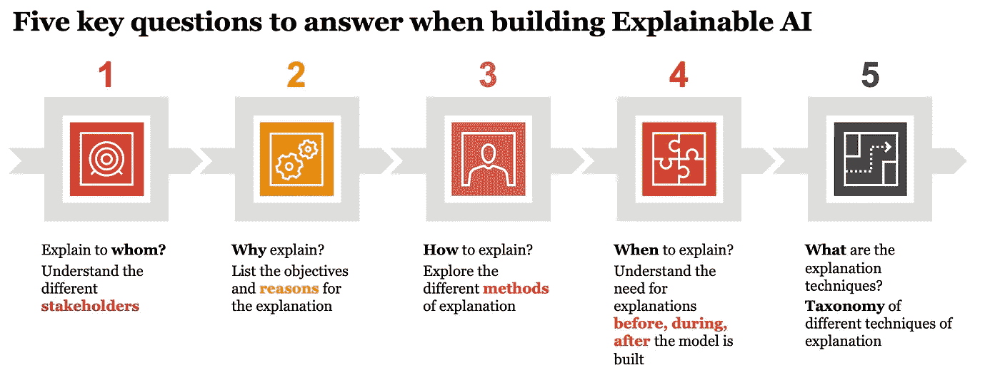

# 解释可解释人工智能的五个关键问题

> 原文：<https://towardsdatascience.com/five-critical-questions-to-explain-explainable-ai-e0c40bdca368?source=collection_archive---------31----------------------->

## 开始你负责任的人工智能之旅

来源:图片来自 J[ohn moes Bauan](https://unsplash.com/@johnmoeses)来自 [Unsplash](https://unsplash.com/)

最近在印度举行的一次关于负责任的人工智能促进社会赋权的会议上，讨论的主题是可解释的人工智能。可解释的人工智能是更广泛的负责任的人工智能学科的关键要素。负责任的人工智能涵盖了一系列与人工智能相关的风险和问题的道德、法规和治理，包括偏见、透明度、可解释性、可解释性、健壮性、安全性、安全性和隐私性。

可解释性和可解释性密切相关[话题](https://analyticsindiamag.com/explainability-vs-interpretability-in-artificial-intelligence-and-machine-learning/)。可解释性是模型级别的，目标是理解整个模型的决策或预测。可解释性是在模型的单个实例中，目的是理解为什么模型会做出特定的决策或预测。当谈到可解释的人工智能时，我们需要考虑五个关键问题——向谁解释？为什么解释？什么时候解释？怎么解释？有什么解释？

来源:作者创作

# **谁来解释？**

解释的受众或向谁解释应该是首先要回答的问题。理解听众的动机，听众计划做出什么行动或决定，他们的数学或技术知识和专长都是在阐述解释时应该考虑的重要方面。根据我们的经验，我们提出了四种主要的受众类型-

*   **最终用户:**这些是消费者，他们正在接收由人工智能系统做出的决策、行动或建议的解释。解释本身可以以数字方式(例如，智能手机应用程序或在线应用程序)或通过人(例如，信贷员解释消费者的贷款申请如何被 AI 系统拒绝)来传递。最终用户主要关心的是决策、行动或建议对他们生活的影响。
*   **业务发起人:**这些是业务或职能部门的公司高管，他们使用人工智能系统来做出影响其他业务或职能部门或其客户的决策、行动或建议。业务发起人既关心个别的解释，也关心更广泛的模型可解释性。业务主管主要关心的是治理过程，以确保组织遵从法规，并且客户对解释感到满意。
*   **数据科学家:**这些数据科学家设计、训练、测试、部署和监控人工智能系统做出的决策、行动和建议。该解释可能用于“调试”或测试系统的目的，也可能是增强正在构建的模型的潜在来源。主要关注的是解释在多大程度上反映了模型的推理、法规要求和最终用户的接受程度。
*   **监管者:**这些是监管者，他们可能希望确保人工智能系统不会歧视或伤害任何个人或群体。根据人工智能系统使用的领域和人工智能应用的性质，解释的严格程度可能会有所不同。监管者主要关心的是确保向消费者提供充分的可操作的解释，并且对消费者没有损害。

这四种受众类型的列表绝非详尽无遗，但它确实抓住了不同群体之间的一些关键差异。他们也把我们引向了下一个问题。

# **为什么解释？**

是否需要解释取决于听众或前一个问题的答案。终端用户需要对人工智能系统所建议的决策或行动进行解释，以便执行建议。从最终用户的角度来看，人工智能系统的可操作性和可信度是解释的关键要求。企业用户需要一个解释，以确保公司治理和管理其集团或公司的声誉风险。数据科学家需要解释来验证模型，并在模型的准确性、可解释性、公平性、稳健性和其他性能标准之间进行权衡。监管机构要求做出解释，以确保遵守现有法规，并确保消费者不会受到伤害。

# **什么时候解释？**

解释可以在模型建立之前生成，也称为事前*或者先对模型进行训练和测试，然后生成解释，也称为事后 。根据模型的复杂程度、所要求和达到的精度以及所要求的解释水平，技术的选择可能会有所不同。有一些技术，如回归或决策树，本质上比深度学习等其他技术更容易解释。一般来说，在建立模型之前，最好对可解释性的水平有个概念。现在有许多技术可用于[事后解释](https://arxiv.org/pdf/1910.10045.pdf)。*

# ***如何解释？***

*说到 ***如何解释*** 有多种不同的解释模式。视觉或图形解释、表格数据驱动解释、自然语言描述或语音解释是一些现有的解释模式。具体模式取决于听众以及解释的目的。例如，一名销售人员可能对显示销售增长图表以及销售增长是如何实现的解释感到满意。对于一个拥有智能手机的印度农民来说，同样的图形解释可能不足以解释他不断增加的作物销售收入。类似地，与详细的书面解释相比，通过语音界面可以更好地提供对建筑工人的指示以及对为什么给出这些指示的解释。*

# ***有什么解释(手法)？***

*在[学术文献](https://arxiv.org/pdf/1910.10045.pdf)中描述和评估了许多解释技术。它们属于六大方法，因为它涉及到事后解释。*

*   ***特征相关性:**这些解释能力的方法关注于模型的内部功能，并突出了最能解释模型结果的特征。*
*   ***模型简化:**这些方法关注于建立一个新的模型，它是一个待解释的更复杂模型的简化。*
*   ***局部解释:**这些方法对解决方案空间进行细分，并为不太复杂的较小部分提供解释。*
*   ***举例说明:**这些方法提取特定的代表性数据来解释模型的整体行为。*
*   ***可视化:**这些方法允许最终用户可视化模型行为，通常是通过降低问题的复杂性。*
*   ***文本解释:**这些方法将解释转换成自然语言文本。*

*这里所说的可视化和文本解释是当我们决定了解释的模式或“如何解释”时要使用的具体技术在前一节中考虑过*

*总之，在我们开始在企业内部实施任何可解释的人工智能计划之前，我们需要回答这五个问题，以便更清楚地了解我们希望我们的人工智能系统如何是可解释的，以及我们可以利用学术文献中的哪些技术。*