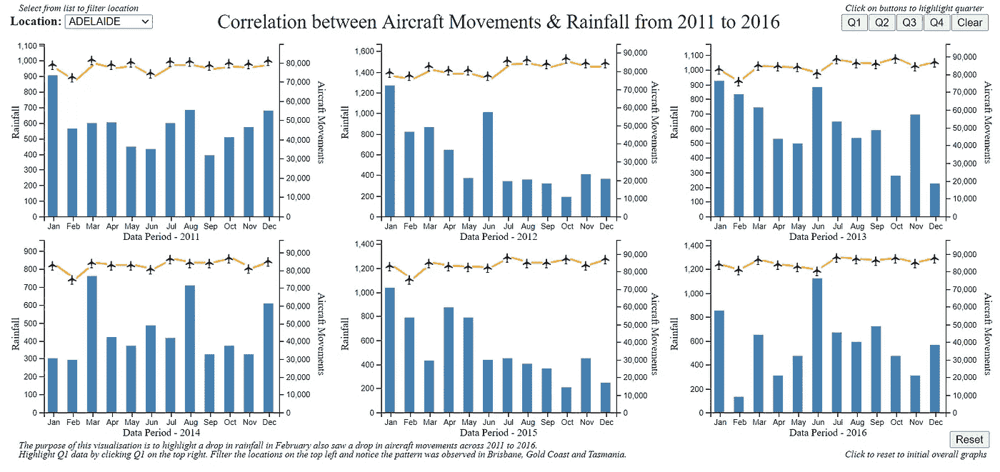
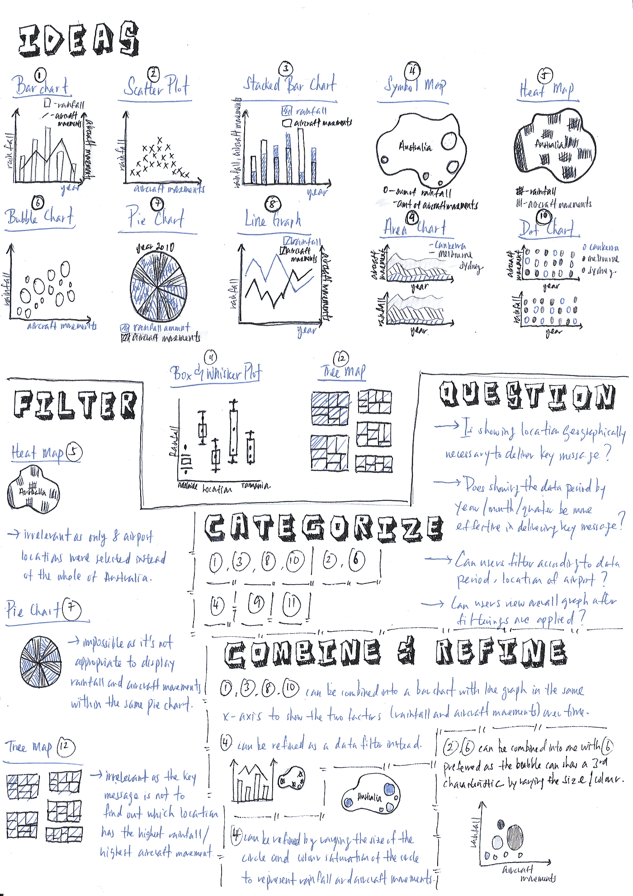
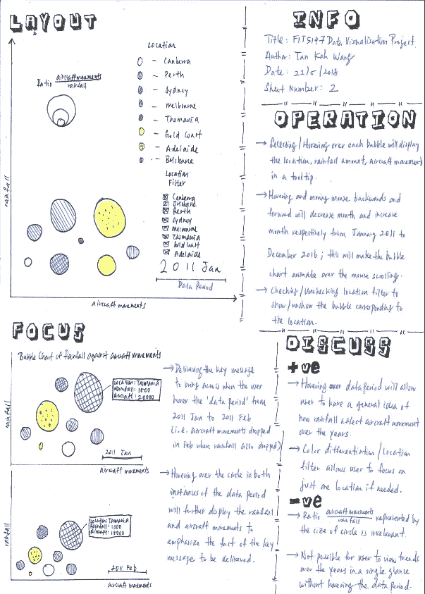
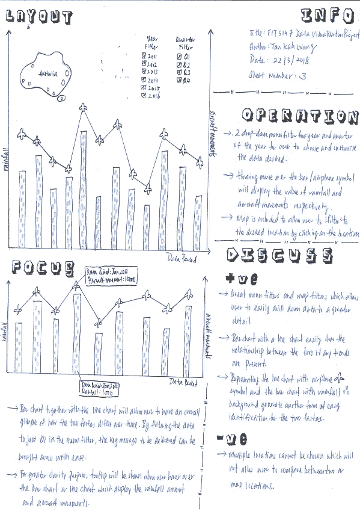
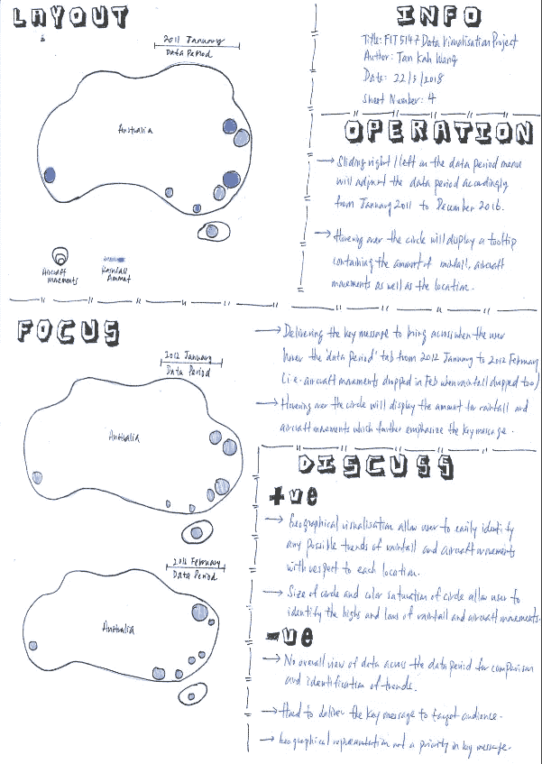
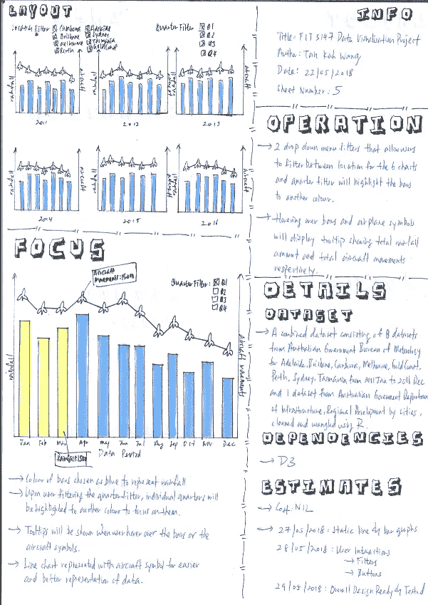
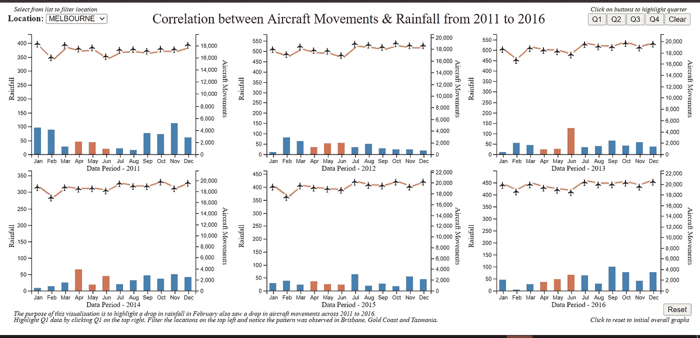

# 数据可视化的五种设计表方法

> 原文：<https://towardsdatascience.com/five-design-sheet-methodology-approach-to-data-visualisation-603d760f2418?source=collection_archive---------6----------------------->

作者图片— D3.js 可视化

假设我们应该将我们的发现可视化，并将它们清楚地传达给我们的利益相关者，我们如何决定数据可视化的类型来有效地传递这些见解呢？我们是否只是探索像 Tableau 或微软 Power BI 这样的初学者友好的数据可视化工具来制作图表？或者我们应该花更多的时间使用像 D3.js 或 R shiny library 这样的复杂工具来设计更有创造性的可视化？首先，我们应该先决定工具还是先决定设计？我们头脑中的想法很难在我们熟悉的工具中实现，并且经常以简单而无效的可视化设计而告终，这种可能性是肯定存在的。

引入五张设计单(FDS)方法是为了使草图和低保真度原型正式化，以允许可视化设计师探索他们的想法，而不用担心技术方面。顾名思义，在这个方法中有 5 张纸，这篇文章将触及每张纸是关于什么的，以及它们是如何被用来开发上面截图中的可视化的(在 D3.js 中完成)。

# 问题陈述

阿瑟·埃德尔曼在 [Unsplash](https://unsplash.com?utm_source=medium&utm_medium=referral) 上的照片

这一部分并不完全重要，但我认为完整地描述一下我们试图通过 FDS 方法实现的目标会很好。我们正试图从 2011 年 1 月至 2016 年 12 月的数据期间，研究澳大利亚 8 个主要机场，即阿德莱德、布里斯班、堪培拉、黄金海岸、墨尔本、珀斯、悉尼和塔斯马尼亚的降雨量和飞机起降之间可能的相关性。

我希望传达给目标受众的关键信息是，从 2011 年到 2016 年，2 月份的降雨量和飞机起降次数之间存在明显的模式。二月份降雨量减少，飞机起降量也随之减少。

传达这一关键信息的目标受众是澳大利亚政府基础设施、区域发展和城市部。这一政府机构的主要作用包括通过运输支持经济增长和增加运输通道。通过向他们传达关键信息，可能会导致在 2 月份计划更多的航班和航线，当时很明显，2011 年至 2016 年 2 月份的飞机活动明显减少，同时降雨量也有所下降。这与政府数据的责任是一致的，因为这将导致公众获得更多的航班信息，进而通过增加收入来促进经济增长。此外，包含来自同一政府机构的飞机活动量的数据集，通过呈现对其自己的数据集的分析，可能会导致数据的更大可信度，从而加强关键信息的传达。

# 表格 1 —创意表格

这是最初的头脑风暴表，你只要在一张纸上勾画出你所有的想法，不管它们是否现实或可行。想出至少 10-20 个 ***想法*** ，然后 ***根据是否有重复或不相关的概念过滤*** 这些想法。*将想法归类在一起，思考是否有遗漏的概念。 *****提问*** 设计是否能解决原始问题(即能否有效传达信息)，选择 3 个想法，在接下来的 3 张纸上探讨。***

**

*作者图片— FDS 第 1 页*

*在“**创意**部分总共生成了 12 个不同的图表/草图，考虑到关键信息，在“**过滤器**部分删除了不相关的图表/草图。热图被认为是不相关的，因为该项目的数据集没有覆盖整个澳大利亚，只选择了 8 个机场位置。饼状图也被删除，因为在一个饼状图中表示两个数据因素(降雨量和飞机起降)是不合适的。移除了树形图，关键信息是不要比较最高/最低降雨量/飞机移动。剩余的想法被分为五个主要类别，如“**分类**部分所示，然后它们被组合成三种可能的设计，即组合条形图和折线图、符号图和气泡图，将在接下来的 3 页中讨论。*

*在提出叙事视觉化的可能想法，以便能够将关键信息传达给目标受众时，提出并记录了一些问题:*

*展示地理位置对于传递关键信息是否必要？*

*按年/月/季度显示数据周期是否更有效*

*传递关键信息？*

*用户能否根据数据周期、机场位置进行过滤？*

*应用过滤后，用户可以查看整体图表吗？*

# *表 2 —替代设计表*

*第 2 页、第 3 页和第 4 页旨在更深入地探索从第 1 页中选择的 3 种设计，通常包含以下部分:*

*1. ***信息*** :标题、作者、数据集等元信息*

*2. ***布局*** :设计可视化草图*

*3. ***操作*** :列出可视化中可用的功能，以及用户能够用它做什么*

*4. ***焦点*** :识别可视化设计的核心部分*

*5. ***讨论*** :讨论设计的优点、缺点、可行性*

**

*作者图片— FDS 第 2 页*

*正在考虑的第一个设计是气泡图。使用这种可视化，当用户水平拖动数据周期过滤器时，将传达关键信息，这将使气泡图随时间变化。这样，当用户从 1 月拖动到 2 月时，圆圈的位置将会更低，因为与 1 月相比，2 月的降雨量和飞机移动量都更低。这将使用户对降雨如何影响飞机运动有一个大致的了解，并且基于位置的气泡的不同颜色表示，用户也可以在位置过滤器的帮助下容易地识别不同位置的可能趋势。最后，当用户悬停在显示位置、降雨量和飞机总移动量的气泡上时，会显示一个工具提示。*

*该设计没有被选为最终设计，因为只有两个基于数值的数据因素，即飞机移动和降雨量，没有预先存在的第三个数据因素可以与圆圈的宽度一起显示。因此，需要计算这两个因素之间的比率来表示气泡的宽度，我认为这是不相关的，并且在传达关键信息时提供了很少的上下文。此外，气泡图的轴最好由两个基于值的数据表示，由于我们的数据集和关键信息包括时间数据因素，它只能作为过滤器包含在此可视化中，这使得用户很难在不水平拖动数据周期过滤器的情况下一眼就识别出这些年的关键信息。*

# *表 3—替代设计表*

**

*作者图片— FDS 第 3 页*

*正在考虑的第二个设计是条形图和折线图的组合。通过这种可视化，它将允许用户对这两个数据因素(降雨量和飞机活动)随时间的变化有一个总体的了解。并且通过将数据过滤到期望的年份和季度的附加用户交互，用户将更容易集中于数据周期的四分之一，这将因此导致关键消息的更有效的传达。此外，当用户悬停在条形图或折线图上的飞机符号上时，将显示工具提示。地图形式的第三个用户交互过滤器被包括在内，以便用户在 8 个不同位置之间进行过滤，同时在地理上识别关键信息。用降雨量作为背景来表示条形图，用飞机符号来表示折线图，将产生另一种形式的两个数据因素之间的容易识别。*

*这种可视化的第一个问题是不允许用户同时选择多个位置。位置过滤器将只允许同时选择一个位置，这将阻止用户在两个位置之间进行比较。此外，由于关键信息主要集中在二月的数据期间，所以用 12 个单独的条形表示一年中的 12 个月的单个条形图可能不适合仅集中在二月。一次按月表示整个数据周期将导致在单个条形图中绘制总共 72 个条形图，这对用户来说可能很难理解信息和关键信息。*

# *表 4—替代设计表*

**

*作者图片— FDS 第 4 页*

*正在考虑的第三个设计是一个符号地图。飞机的移动将由地图上圆圈的大小来表示，降雨量将由圆圈的颜色饱和度来表示。包括一个过滤器，用户可以通过水平拖动在数据周期之间过滤。当用户访问从 1 月到 2 月的数据周期过滤器时，可以突出显示关键信息，这将看到圆的大小减小，圆的饱和度变浅，因为与 1 月相比，2 月的飞机活动和降雨量减少。将鼠标悬停在每个圆圈上还会显示降雨量和飞机移动量，让用户掌握真实的数据值。这种地理可视化允许用户容易地识别关于每个位置的任何可能的趋势，并且圆圈的大小和颜色饱和度允许用户进一步识别两个数据因素的高点和低点。*

*然而，由于关键信息主要关注的只是时间因素(即二月)，地理代表不应成为重点，因为它可能会使用户偏离关键信息。此外，用户很难在同一地图上一次查看整个数据周期，这可能会使关键信息不太突出。最后，尽管不同地点的降雨量和飞机活动的高低可以很容易地通过圆圈的颜色饱和度和大小来识别，但这不是关键信息的组成部分。*

# *表 5—实现表*

*这是最终选定的设计，详细说明了可视化中的概念。它包含有关设计、功能和要实现的交互的信息。本表中可以讨论以下组件:*

*1. ***描述*** 的主要设计模式、算法或数据结构及引用*

*2.底层 ***数学*** 以及布局尺寸等设计中用到的计算*

*3. ***软件*** 需求、 ***依赖*** 等*

*4. ***费用估算*****等***

***5.任何 ***其他*** 需求或所需资源***

****

**作者图片— FDS 第 5 页**

**最终选择的设计是对表 3 的改进——折线图和条形图的组合。数据集将绘制在 6 个不同的图表上，每个图表代表一年(即 2011 年至 2016 年)，而不是在单个图表中绘制整个数据集。季度过滤器将有助于关键信息的传达，因为与用户选择的季度相对应的条形将在所有 6 个图表中突出显示，这允许用户只关注那些条形。将包括一个位置过滤器，允许用户在位置之间过滤。最后，当用户将鼠标悬停在蓝色条(对应于降雨量的颜色)和代表飞机活动数据因素的飞机符号上时，将显示工具提示。**

**选择这种设计的主要原因是，用户只需看一眼就能更容易地查看整个数据集，从而轻松识别关键信息，而不是逐年过滤数据或使用一个包含 72 个条形的图表。第二个原因是，我觉得这是两个数据因素相对于时间因素的最简单和最有效的表示。请记住，目标受众是政府机构，应该实现能够迅速传递信息的可视化。**

**用户将首先获得整个数据集的总体视图，而不考虑位置，使用季度过滤器突出显示第 1 季度的条形将允许用户在 6 个不同的图表中显示 2011 年至 2016 年 2 月降雨量下降时，看到飞机活动下降的明显模式。这将有效地传达突出二月份的关键信息。并且如果用户有兴趣识别该模式是否在所有 8 个位置都一致或者在任何位置更显著，则可以使用位置过滤器。**

# **摘要**

****

**作者图片— D3.js 可视化**

**这是五个设计表方法，帮助我们最终能够在 D3.js 中设计和实现我们的最终可视化设计，如上面的截图所示，并具有表 5 中描述的所有功能。虽然为一个可视化问题想出 5 张纸似乎令人生畏，而且可能没有时间效率，但我觉得这是一个很好的方式，让我可以将我所有的想法结合起来，深入到微小的领域，如果我从一开始就设计可视化设计，我可能会错过这些领域。希望这个演练可以帮助你们成为一个有效的数据可视化设计师！**

****