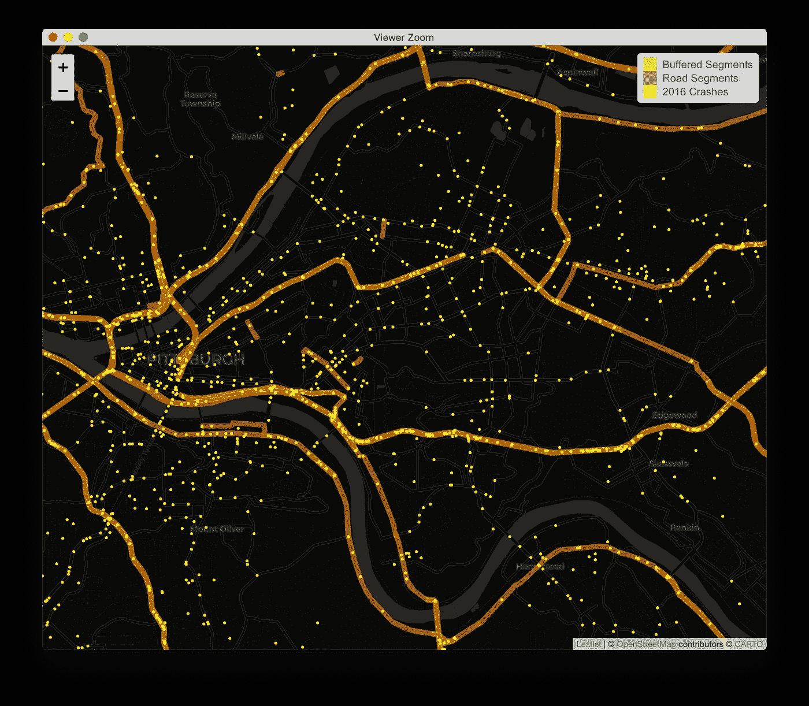
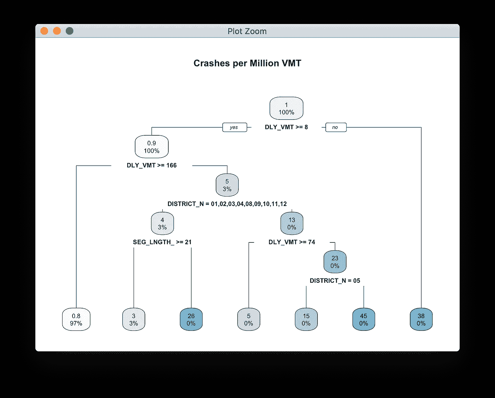
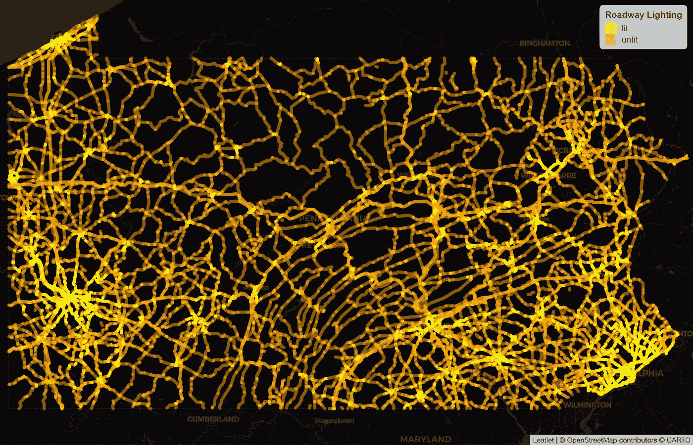
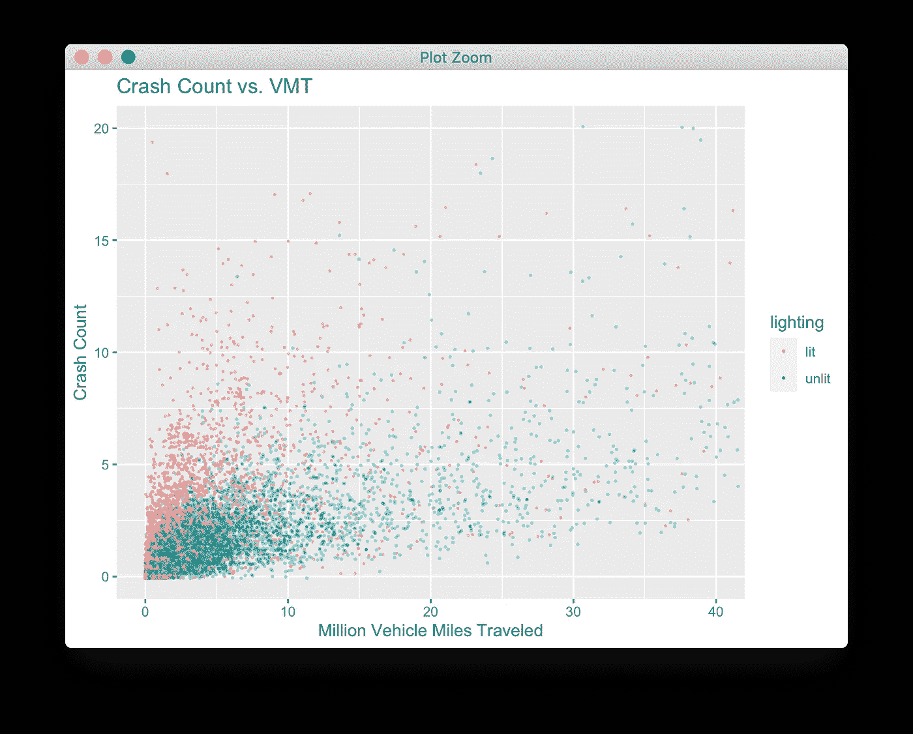

# 交通数据科学的五项基本技能

> 原文：<https://towardsdatascience.com/five-essential-skills-for-transportation-data-science-8c4bed72c03e?source=collection_archive---------35----------------------->

## 公共部门交通机构渴望雇佣数据科学家；不需要博士学位


宾夕法尼亚州匹兹堡照明道路上的夜间交通(摄影:马克·埃格)

交通几乎每天都与每个人的生活息息相关。建设和运营世界道路、高速公路和其他公共交通网络的公共部门实体渴望聘用具备理解海量数据技能的数据科学家。熟练掌握本文中描述的五项技能将使你能够回答运输机构日常面临的许多问题。加入运输部或大都市规划组织是任何希望应用自己的技能服务于更大利益的新数据科学家的完美切入点。

感兴趣吗？作为一名支持运输机构的数据科学家，以下是你需要掌握的五项基本技能:

1.  数据管理和转换
2.  地理信息系统
3.  决策树
4.  绘图和测绘
5.  计数回归模型

本文通过对宾夕法尼亚州道路照明和交通安全之间的*关系的应用调查来说明这些技巧的应用。这个例子使用了 R，由于它丰富的用户生态系统和分析包，它为许多运输问题提供了一个极好的工作台。*

# 设置

假设你是宾夕法尼亚州交通部的分析师。该机构正在权衡将其年度道路安全预算的更多支出用于安装公路照明，还是用于护栏等其他安全改进。你的职责是帮助回答这个问题:“街道照明对撞车有什么影响？”我们在下面研究这个问题。

您可以下载代码，并通过从[https://github.com/markegge/safety-demo/](https://github.com/markegge/safety-demo/)克隆这个库来跟随自己

# 数据准备:GIS +数据转换

数据分析几乎总是通过数据准备将源数据转换成适合分析的格式来进行的。这包括派生新属性、连接表、聚合和重塑表等操作。

r 的`data.table`和`dplyr`包都是强大和通用的数据转换多工具。在本文中，我使用 R 的`data.table`包，我更喜欢它的速度和简洁的语法。

安全分析通常使用五年的历史碰撞数据。因此，我们开始从[宾夕法尼亚州事故信息交换中心](https://crashinfo.penndot.gov/PCIT/welcome.html)加载五年的事故历史:

因为运输描述了人和货物在空间中的移动，所以运输数据通常是空间的。要处理空间数据，您需要熟悉基本的 GIS 操作，如缓冲、融合和连接，以及在 Web 墨卡托投影、StatePlane 投影和 UTM 投影之间重新投影空间数据。

投影是一种将圆形星球的空间数据映射到平面计算机屏幕上的方式。Web 地图通常使用名为 Web 墨卡托(EPSG:4326)的投影显示以纬度和经度测量的距离数据。由于经度的长度随纬度而变化，因此测量、缓冲和相交操作通常在国家平面或 UTM 投影中执行，这些投影以英尺或米而不是度来测量距离。

在此分析中，我们将使用联邦高速公路管理局提供的宾夕法尼亚州高速公路网[的空间表示。每条道路都被分成几段。为了统计每个路段的撞车次数，我们将路段缓冲 50 英尺，然后在空间上将撞车点连接到缓冲线。](https://www.fhwa.dot.gov/policyinformation/hpms/shapefiles.cfm)

在 R 中，`sf`包为强大的 GDAL 空间库提供了一个接口，允许在 R 中使用您可能已经通过使用 PostGIS 或 Python 而熟悉的相同空间函数。

结果看起来像这样:



接下来，我们将把我们的碰撞计数制成表格，并将这些结果连接回我们的空间数据。我们还使用碰撞属性，根据联合碰撞中报告的照明条件，估算给定路段是否被照亮。

# 决策树

决策树是识别数据中结构关系的有用工具。他们的主要用途是通过导出一个规则集将观察结果分为两类或更多类，但是他们定义规则集的内部算法也是一个有用的*探索性数据分析*工具，用于确定预测因素和结果变量之间的关系。

在下面的部分中，决策树用于填充没有任何交通事故的路段的“照明”属性，并了解数据集中哪些属性可预测交通事故率。



决策树的图形呈现，用于预测崩溃率。每日车辆行驶里程较低的路段(VMT DLY)车祸率较高。

# 绘图和测绘

数据可视化使人类能够快速处理和发现大量数据的趋势。对于空间数据，这通常意味着制图。例如，我们可以使用 R 的`leaflet`包(它为流行的传单 JavaScript web 映射库提供了一个 API)来检查我们基于碰撞的道路照明分配是否有意义。



对于绘制表格数据，`ggplot2`是 R 的主要数据可视化库。下面，我们绘制了路段碰撞数与暴露量(车辆行驶里程，定义为路段长度乘以日交通量)的关系图。



绘制路段碰撞次数与车辆行驶里程的关系图显示，有照明的路段往往具有较高的碰撞次数和较低的 VMT。

# 计数回归模型

回归是一种非常有用的统计工具，用于识别数据中的数量关系。普通最小二乘法的线性回归是最常见的回归类型(用于预测具有线性预测关系的连续结果变量)，但回归实际上是一系列具有许多不同类型和应用的模型。扩展您的回归库以包括计数模型在运输环境中有许多应用。

全州范围内的交通事故数据通常采用零膨胀负二项式(ZINB)回归模型，该模型考虑了短距离或低交通量路段记录的交通事故为零的概率。我们可以通过在 ZINB 回归模型中将照明作为解释变量来研究道路照明和碰撞之间的关系。

我们的 ZINB 模型根据曝光(VMT)和光照预测撞车。以下是模型输出:

```
Call:
pscl::zeroinfl(formula = total_crashes ~ lighting + mvmt | mvmt, data = segments)Count model coefficients (poisson with log link):
                Estimate Std. Error z value Pr(>|z|)    
(Intercept)    2.1916955  0.0040869  536.28   <2e-16 ***
lightingunlit -0.3935121  0.0056469  -69.69   <2e-16 ***
mvmt           0.0370332  0.0001227  301.72   <2e-16 ***Zero-inflation model coefficients (binomial with logit link):
            Estimate Std. Error z value Pr(>|z|)    
(Intercept)  0.14028    0.03982   3.523 0.000427 ***
mvmt        -1.97937    0.06055 -32.690  < 2e-16 ***
---
Signif. codes:  0 '***' 0.001 '**' 0.01 '*' 0.05 '.' 0.1 ' ' 1
```

该模型估计，没有照明的路段(*lighting unlight*)比没有照明的路段(其他条件相同)平均少发生 0.4 起车祸。

这一反直觉的发现表明了混杂变量的存在。毕竟，照明不是随意安装的。我们打算调查照明对撞车的影响；我们似乎已经发现了碰撞对照明的影响(即照明似乎安装在固有的危险位置)。

然而，我们的失败为其他可能成功的方法指明了道路。由于照明不是随机安装的，因此更好的方法可能是找到照明条件随时间变化的数据，例如新安装的照明或维护记录显示灯泡烧坏的地方。

# 实践中的数据科学

数据科学是迭代的。托马斯·爱迪生曾说过一句著名的话，关于他多次制造出能正常工作的灯泡的失败，“我没有失败。我刚刚发现了一万种行不通的方法。”在数据科学的实际应用中，一点谦逊大有帮助；如果一个主题很重要，那么它很可能已经被研究过了。不要指望你的第一次调查会彻底颠覆现有的规范。做好失败比成功更频繁的准备；尝试新的迭代，结合以前迭代中的学习，直到您得到一个可操作的发现(或用完数据，这是经常发生的情况)。


照片:马克·艾格

几乎每一个活着的人都与我们的交通系统的质量和效率相互作用并受其影响，无论是通过其成功——流动性和经济机会——还是缺点(全球变暖；仅在美国，每年就有 40，000 多人死于汽车；拥堵；等等。).大多数公共部门交通机构拥有丰富的数据，但缺乏熟练的数据科学家来扩大他们对数据知情决策的使用。

如果你愿意持之以恒，并具备上述五种技能的工作知识，公共部门交通机构是面向影响的数据科学家的好去处。