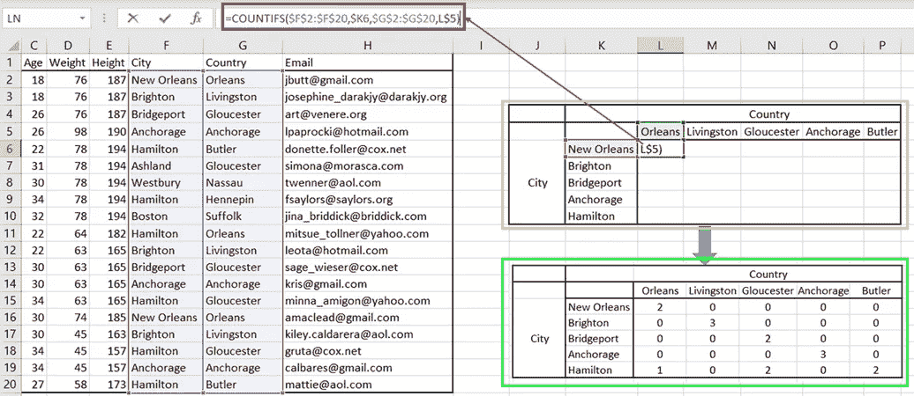
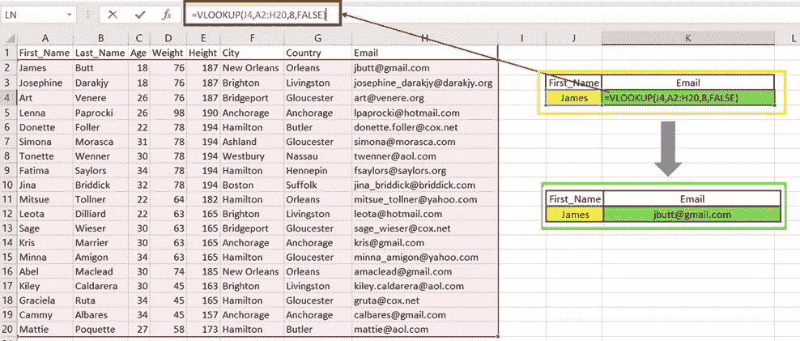
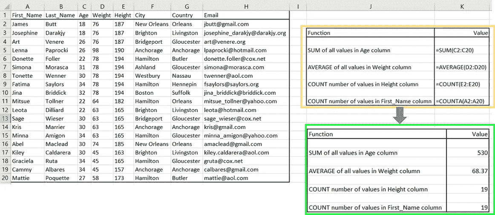
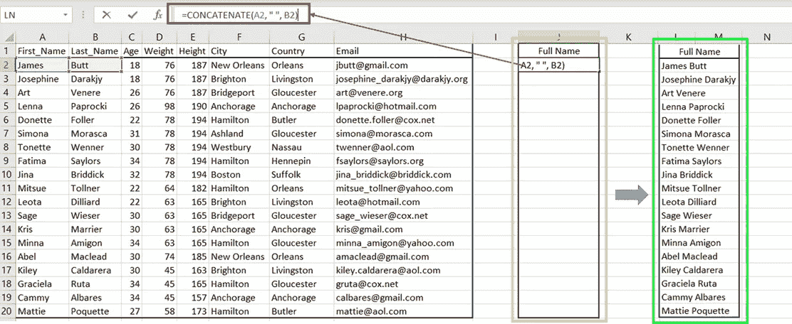
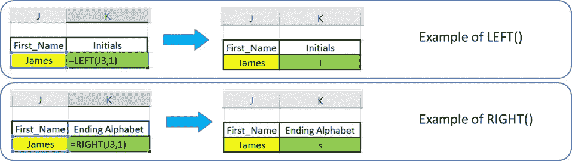
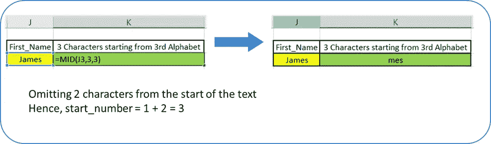

# 五个 Excel 函数加快数据分析

> 原文：<https://towardsdatascience.com/five-excel-functions-for-faster-data-analysis-19d88e5395e4?source=collection_archive---------9----------------------->

## 使用 MS Excel 进行动手数据分析

## 和专业技巧，快速获得数据驱动的见解


图片由 [Esa Riutta](https://pixabay.com/users/esariutta-1582392/?utm_source=link-attribution&utm_medium=referral&utm_campaign=image&utm_content=1771393) 来自 [Pixabay](https://pixabay.com/?utm_source=link-attribution&utm_medium=referral&utm_campaign=image&utm_content=1771393)

> “想象一个没有 Excel 的世界。那对我来说是不可能的。”—微软首席执行官塞特亚·纳德拉

Microsoft Excel 是全球电子表格工具，于 1985 年首次发布，用于分析表格形式的数据。它使得数据和数字分析对每个人都是可访问的。它不仅提高了⚡️的生产率，还引发了一种新的商业思维方式。

是的。今天，我要告诉你微软 Excel 的故事。通过这个故事，我将用有趣的例子向您介绍五个 Excel 函数，以加速您的数据分析。

**来点外卖怎么样？？？** *是的！我正在分享一些提高你使用 Excel 效率的专业技巧。所以继续关注这个*📌*符号通过故事为亲提示。*

在过去的十年里，我们都看到了大量的用于数据分析和可视化的创新软件。尽管如此，微软 Excel 仍然是普通专业人士最喜欢的工具。特别是对于管理者来说，它是快速管理、操作和可视化各种数据的最佳工具，而无需付出太多额外的努力。

为了不在简介中浪费更多时间，让我们从 Excel 函数开始。我正在使用这个 [Dummy_People](https://github.com/17rsuraj/data-curious/blob/master/Images/Dummy_People.xlsx) 数据集。

# 用 COUNTIFS()计算值

想要快速轻松地取出不同数值的⚡️计数吗？
那么 COUNTIFS()就是你的朋友。

当你试图 ***统计 Excel 中一列中某项的出现*** 或者多列中多个变量的出现，那么你就要使用 COUNTIFS()函数。

例如:从库存数据集中计算特定类别的商品销售数量，或者在新冠肺炎数据集中找出多少 20 岁的男性感染了冠状病毒，或者只是在著名的泰坦尼克号数据集中找出多少 60 岁的头等舱乘客幸存下来。

> COUNTIFS()计算符合指定条件的值的数量

🎯该函数接受多个*【范围，标准】*对，并返回满足所有*【范围，标准】*对的值的个数。

下面是语法:

```
=COUNTIFS(Range_1, Criteria_1, Range_2, Criteria_2,............)
```

凡事有例子就好。所以现在来了一个，



图片作者:Excel 中的 COUNTIFS()

在这个例子中，我使用 COUNTIFS()作为，

```
=COUNTIFS($F$2:$F$20,$K6,$G$2:$G$20,L$5)
```

其中，`[$F$2:$F$20,$K6]`和`[$G$2:$G$20,L$5]`是*【范围，标准】*对。当`$K6`处的值在范围`$F$2:$F$20`内并且`L$5`处的值在范围`$G$2:$G$20`内时，该公式计算单元格的数量。在公式栏中键入此公式，然后按 enter 键以获取单元格 L6(在图像中的黄色框中)中的计数。只需将光标拖动到整组单元格上，即可获得最终输出，如图中绿色框所示。

🎯COUNTIFS()可以被视为 Excel 中的一个大型函数，因为它接受多达 127 对*范围&标准*

故事并没有到此结束。看看这些关于 COUNTIFS()的有趣事实。


作者图片:Excel COUNTIFS()标准

*这些类型的标准意味着什么？—* 看看这个片段

```
=COUNTIFS( G2:G20, "Gloucester", C2:C20, ">30", E2:E20, 165)This will count how many people from "Gloucester" are older than 30 years and height 165
```

## 📌 ***Ctrl + Shift 快速选择***

使用这个组合键来更快地选择数据集，而不是使用鼠标单击和拖动光标。只需点击您想要选择的第一个单元格，按住 ***Ctrl + Shift*** 并使用向上或向下箭头键分别选择上方或下方列中的所有数据，或者按向左或向右箭头键选择左侧或右侧行中的所有数据。

# 使用 VLOOKUP()搜索值

不管在哪个领域，函数 VLOOKUP()都是 Excel 中一个流行的、广泛使用的和公认的函数。

> VLOOKUP()查找指定范围内的指定值并返回信息

它省去了您在不同的 Excel 表和表格之间来回移动以获得预期值的麻烦。

VLOOKUP()做你的工作需要什么？🎯没有，除了这 4 个输入—

*   查找值:要搜索或查找的值
*   Range:查找值所在的列或值的范围
*   Column:包含要返回的信息的列号
*   Boolean:如果需要近似匹配，则为 TRUE 如果需要查找值的精确匹配，则为 FALSE。但是，该输入是可选的。

下面是语法和一个例子:

```
=VLOOKUP(Lookup value, Range, Column, Boolean)
```



图片作者:Excel 中的 VLOOKUP()

在这个例子中，我使用 VLOOKUP()作为，

```
=VLOOKUP(J4,A2:H20,8,FALSE)
```

在这里，Excel 将在区域`A2:H20`中的单元格`J4`中搜索 First_Name。作为输出，我返回了与 First_Name 匹配的电子邮件地址，它出现在`8th`列中。使用可选参数`FALSE`，我返回了与`J4`中的值完全匹配的结果。

VLOOKUP()的一个限制是，要返回的列或值必须出现在数据集中 Lookup_Value 的右侧。为了克服这一点，Excel 推出了新功能— `**XLOOKUP()**`。目前，此功能仅适用于 Microsoft 365 订阅者。更多关于其用法的信息可以在[这里](https://support.microsoft.com/en-us/office/xlookup-function-b7fd680e-6d10-43e6-84f9-88eae8bf5929)找到。

## 📌利用 F4 提高生产率

在数据分析和可视化中，你会遇到一种情况，你需要 ***多次重复你上一个动作*** 。你所需要做的就是在你想要重复上一个动作的地方按下 F4 键。
另外，F4 是在 Excel 公式中添加绝对单元格引用 的 ***快捷键！在任何公式中，当您键入单元格引用时，只需一直按下 F4，然后 Excel 将遍历所有绝对单元格引用的可能性，例如， `$A1`、`A$1`和`$A$1`***

# 用 SUM()、COUNT()、AVERAGE()聚合值

在几乎所有的领域中，您总是在数据分析中计算一些聚合值，例如加法、最大值、最小值、计算值的数量等等。

对于聚合值，这是三个最常用的函数。顾名思义，函数 SUM()将一组特定单元格中的数字相加，就像我们的示例中的— `=SUM(starting_cell : ending_cell)`
一样，为了计算年龄列中所有值的总和，我使用了

```
=SUM(C2:C20)
```

但是，您可以指定用逗号分隔的单元格编号，如— `=SUM(cell_1, cell_2, cell_3, …)`，或者用逗号分隔您想要添加的实际数字，如`=SUM(number_1, number_2, number_3, …)`，而不是提及单元格的范围

*那为什么要使用 SUM()函数* ❓
🎯因为这样可以节省您在每次键入单元格数字或要添加的实际数字后键入“ ***+*** ”的精力。

类似地，AVERAGE()函数计算一组特定单元格中数字的算术平均值，例如— `=AVERAGE(starting_cell : ending_cell)`

我计算了 Weight 列中所有值的平均值，

```
=AVERAGE(D2:D20)
```

COUNT()函数将给出所提供参数列表中数值 的 ***计数。因此，如果您以参数列表的形式提供单元格范围，函数 COUNT()将只计算那些有数字的单元格。***

*但是如果你想计算包含文本或逻辑值的单元格的数量，并且❓*

别担心！！！

🎯只需在上面的 COUNT()函数的末尾添加字母" ***A*** "即可创建一个新函数 COUNTA()，该函数将计算包含数值和文本值的单元格的数量。所有语法的其余部分保持不变。



作者图片:Excel 中的聚合函数

在上图中，在黄色框中，您可以看到我讨论过的所有值聚合函数，在绿色框中，您将找到结果。

## 📌Ctrl +空格和 Shift +空格

有些情况下，您希望 ***选择一整行或一列*** 。这些组合可以让你的方式更容易。只需将光标放在属于您想要选择的列或行的单元格中，然后按
Ctrl + Space 选择整列，Shift + Space 选择整行。同样，您可以组合***Ctrl+Shift+Space***三个一组来选择数据的巨大块。

# 用 CONCATENATE()合并文本

这是 Excel 中最常用的文本函数之一。Excel 中的 CONCATENATE()允许您连接多个单元格中的文本数据，例如，连接门牌号、街道名称、城市以形成完整的地址，或者连接产品名称和用途以形成其描述，甚至连接客户 ID、名字和姓氏以形成完整的客户详细信息。

> *CONCATENATE()合并多个单元格的值*

这是语法—

```
=CONCATENATE(Text_1, Text_2, Text_3, ....)
```

这是它在我们的数据中的应用，

🎯但是，绝对没有必要为文本提及单元格编号，您可以随时键入您想要组合的文本。只需用双引号将文本括起来，并用逗号分隔，就像这样`“Text_1", "Text_2", "Text_3”`

看看这个例子——



作者图片:Excel 中的 CONCATENATE()

这里，函数`=CONCATENATE(A2, “ “, B2)`将`A2`中的文本和`B2`中的文本连接起来，它们之间有一个空格`“ “`，以获得这个人的全名。

嗯，就像其他函数一样，CONCATENATE()也会抛出一些错误🚩

1.  **#姓名？**:表示您*遗漏了应该包含文本的引号*
2.  **结果中的引号**:如果您*遗漏了分隔两个文本的逗号*，那么额外的、不需要的引号将出现在最终结果中

# 左()，中()，右()

不管您的工作域是什么，有时您希望将一列中的数据拆分为两列，或者希望从单元格中的文本值中仅选择几个文本字符。例如，将客户的姓名拆分为名字和姓氏，或者从整个地址中选择城市名称，或者从整个产品说明中选择产品名称。

简而言之，你要做的是 ***与*** 相反的 ***串联()*** 。那么这三个功能为您服务。

> *LEFT()，MID()，RIGHT()从文本中提取特定数量的字符*

顾名思义，🎯函数 LEFT()从*左侧*或单元格开始处提取指定数量的文本字符，函数 RIGHT()从*右侧*或单元格结束处提取指定数量的文本字符。您只需提供包含文本值的单元格编号和要提取的字符数。



作者图片:Excel 中的左()和右()

🎯函数 MID()从文本中间的任意位置提取指定数量的字符。当您想从选择中省略前几个字符时，可以使用这种方法。这里，您需要再提供 1 个输入。除了你想要的单元格号和字符数，还应该提到 start_number。

语法来了-

```
=MID(Text, start_number, number_of_characters)
```

和`*start_number = 1 + Number of characters you want to omit from start*`

为了更清楚地理解下面的例子，



作者图片:Excel 中的 MID()

## 📌用 Ctrl + Shift + L 快速创建过滤器和下拉菜单

您可以使用 Ctrl + Shift + L 快速打开或关闭 Excel 数据集中的下拉菜单和过滤器。只需选择数据集中的任意单元格，然后按下此三键来切换过滤器。这将节省您转到数据选项卡并搜索过滤器按钮的时间。

总结一下，

数据并不总是按照您的需求进行组织，您需要进行一些计算和文本操作，以便为您的分析提供良好的组织📊。在实际的数据分析过程中，您将尝试找到聚合值、统计数据，发现数据集中不同值的一些趋势和出现情况。

无论您是想提供数据驱动的见解，还是想为更高层次的决策做出贡献，或者只是想更快地完成工作，掌握正确的 Excel 函数都将超越⚡️，提高您的工作效率并节省您的时间⏰

掌握 COUNTIFS()、VLOOKUP()，这些聚合和文本函数肯定会让你的数据分析更快⚡️和生活更轻松。请记住，您分析数据的速度越快，您将数据转化为洞察力的速度就越快，并且有更多的时间来做出决策。

有兴趣了解更多关于数据分析的内容吗？？

然后看看我的其他文章:

[](/five-ways-for-faster-data-analysis-801a043bfea9) [## 加快数据分析的五种方法

### 让它在竞争中脱颖而出

towardsdatascience.com](/five-ways-for-faster-data-analysis-801a043bfea9) [](/label-encoder-and-onehot-encoder-in-python-83d32288b592) [## Python 中的标签编码器和 OneHot 编码器

### 通过示例了解标签编码器、OneHot 编码器和 Pandas 虚拟变量

towardsdatascience.com](/label-encoder-and-onehot-encoder-in-python-83d32288b592) [](/data-wrangling-raw-to-clean-transformation-b30a27bf4b3b) [## 数据争论—从原始到干净的转变

### 简单的三个字的解释

towardsdatascience.com](/data-wrangling-raw-to-clean-transformation-b30a27bf4b3b) 

***想找点乐子-n-learn？？***

这里是一个快速⚡️阅读，使自己的数据集与 ***现成的*** Python 代码。

[](/web-scraping-make-your-own-dataset-cc973a9f0ee5) [## 网页抓取—制作您自己的数据集

### 从网页中提取数据并将其存储到 excel 中—只需 4 个简单的步骤

towardsdatascience.com](/web-scraping-make-your-own-dataset-cc973a9f0ee5) 

继续学习！保持微笑！保持动力！

[](https://medium.com/@17.rsuraj/to-smile-with-cheese-c43d880cbce4) [## 带着奶酪微笑

### 一个诗意的故事，面对生活的不确定性，找到保持微笑的方法

medium.com](https://medium.com/@17.rsuraj/to-smile-with-cheese-c43d880cbce4) 

**感谢您的阅读和宝贵时间！**

我用这些技术来加速⚡️我的数据分析。希望对你也有帮助。一如既往，我乐于接受反馈，并想知道你还使用哪些技术来进行更快的数据分析。这里所有示例的数据集都是从[虚拟](https://www.briandunning.com/sample-data/)数据集派生出来的。

请随时添加您的反馈，并通过 [LinkedIn](https://www.linkedin.com/in/surajgurav17/) 与我联系。