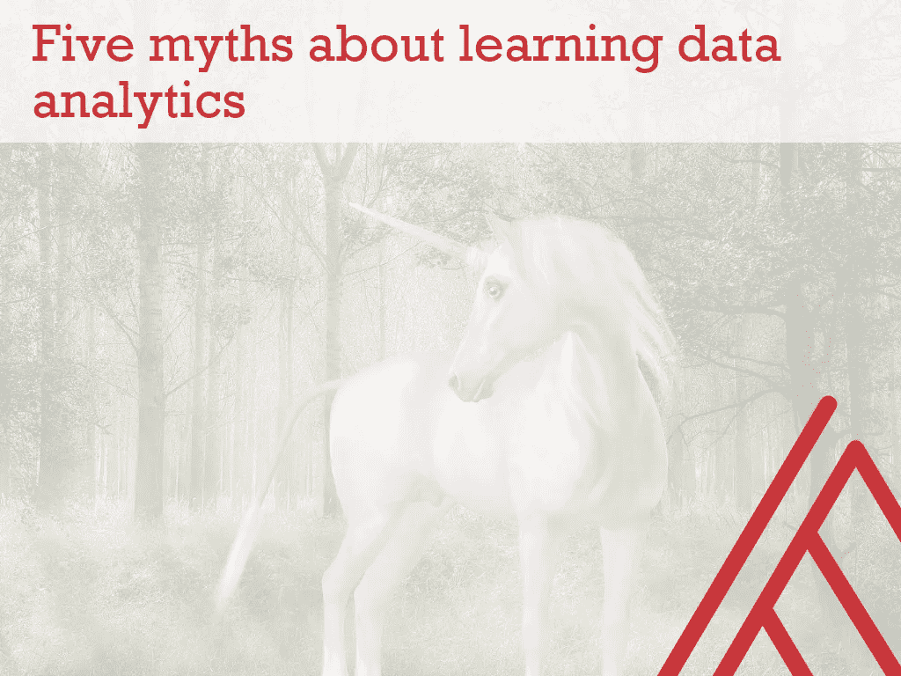
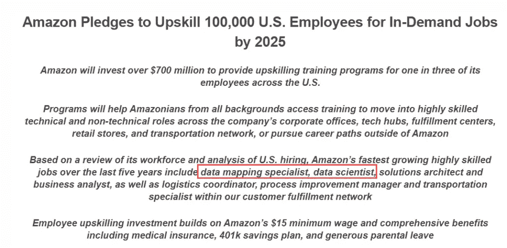

# 关于学习数据分析的五个误区

> 原文：<https://towardsdatascience.com/five-myths-about-learning-data-analytics-37a43473e2bf?source=collection_archive---------35----------------------->

图片来源:[https://pix abay . com/插图/独角兽-森林-童话-神秘-1981219/](https://pixabay.com/illustrations/unicorn-forest-fairy-tales-mystical-1981219/)

我开始厌恶学校里的数学，最终我在一学期的代数课上得了个“D”。

所以，我最终会从事数据分析似乎有点疯狂，对吗？

真的不应该:认为你不能是因为你在学校不喜欢数学，这是我发现的关于学习分析的五个误区之一。它们都在这里:

# 误解 1:我需要为此去学校

数据分析是一个高度技术性的领域，所以你可能认为你需要一个学位或文凭。我也是，我的两个硕士学位证明了这一点。根据我在数据教育的学术和训练营/在线学习领域的经验:学习数据分析不需要学位。

事实上，你在传统学术机构接受的培训很可能已经过时了。你将会被那些对行业发展不感兴趣，而是对学术出版的回音室感兴趣的老师们所教导。

有许多经济高效的方法可以让你自己学习数据分析，更好的是，有远见的组织正在为你提供高质量的数据教育，作为他们提升技能计划的一部分(稍后将详细介绍)。虽然高价学位可能有它的用处，但我不建议你从那里开始你的分析学习之旅。

# 误区二:我不会喜欢，因为我不喜欢数学

我们中的许多人和我一样，在学校里都有过糟糕的数学学习经历。所以，你可能会说你“不喜欢数学”，但你真的不喜欢吗？数学绝对是分析的核心，但计算、技术和商业思维也是如此。

想象一下，在你的工作和生活中，将数学作为一种表达和创造的手段，而不仅仅是解决黑板上冰冷的方程式。*这就是*数据分析的作用。不要让你所谓的数学恐惧症阻碍你。

# 误解 3:我的工作不需要它

你可能对成为数据分析师或数据科学家不感兴趣，但你确实需要*一些基础数据分析的能力，以保证你的职业生涯不会过时。*

举个例子，我们来看看亚马逊的 Upskiling 2025 倡议。在[新闻稿](https://www.businesswire.com/news/home/20190711005341/en/Amazon-Pledges-Upskill-100000-U.S.-Employees-In-Demand)中列出的第一个头衔是数据映射专家和数据科学家，以及业务分析师和物流协调员等角色。

*几乎所有这些角色都使用数据！对于一些人来说，“数据”甚至出现在标题中。对于其他人来说，数据隐含地为角色提供动力:例如物流协调员，预测和跟踪库存，以及流程改进经理，对任务和关系进行建模。*

因此，虽然你不必渴望成为一名数据科学家来为未来的劳动力提供价值，但你确实需要一些数据分析方面的安慰。

# 误解 4:我只在工作中需要它

我希望我在神话 3 中说服了你，不管你的职业规划如何，你都应该学习一点数据分析。让我在这个流言的基础上。

数据分析不仅仅是技术或职业培训:如果做得好，学习数据分析将为你提供另一种接触世界的方式。

“数据素养”是一个流行的术语，但我不知道我们是否给予了它应有的重视:它通常被视为能够在工作中有效使用数据的素质。然而，我认为数据素养，像常规素养一样，始于*享受*和*享受*数据。

随着您学习分析，您可能会发现自己构建了更多的电子表格来跟踪活动，然后分析这些数据。这可能是你的日常行走，或者你听过的歌曲。也许它们与工作无关，但它们也是有价值的数据分析学习项目。

# 误解 5:我不是合适的“类型”

计算机科学教授马克·古兹戴尔提到，许多学生觉得他们缺乏“[极客基因](https://cacm.acm.org/blogs/blog-cacm/189498-top-10-myths-about-teaching-computer-science/fulltext):“在学习技术方面，要么你懂，要么你不懂……”，我不懂。”

数据分析是一个高度技术化的领域，因此[冒名顶替综合症](https://en.wikipedia.org/wiki/Impostor_syndrome)十分猖獗。你*会*不时觉得自己是个毫无头绪的骗子。

想到有多少潜在的数据分析师因为觉得自己没有合适的社会经济、人口统计或教育背景而离开这个领域，我就不寒而栗。

我保证，如果你喜欢与计算机打交道，解决问题和改善业务，数据分析领域就有你的一席之地。作为一个社区，我们有责任通过你们的辛勤工作为你们指明道路。

# 事实:你可以学习数据分析

在您的数据分析学习之旅中，您克服了哪些误区？你还在面对哪些？如果你对学习感兴趣，你觉得是什么阻碍了你？请在评论中让我知道。

如果我能帮你开启旅程，请联系我。您可以通过注册我的时事通讯和独家免费访问我下面的学习分析资源库来开始。也欢迎您[给我写信或在我的联系页面](https://georgejmount.com/contact)安排免费电话。

我期待重塑你对分析的态度！

*原载于 2020 年 9 月 19 日*[*【https://georgejmount.com】*](https://georgejmount.com/five-myths-about-learning-data-analytics/)*。*