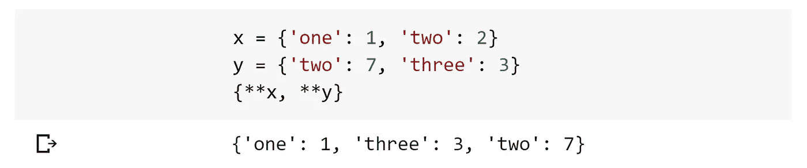
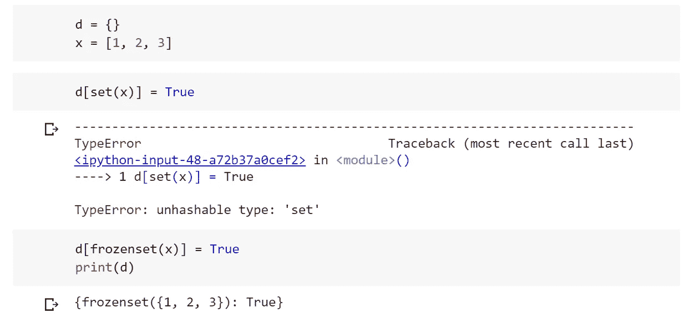
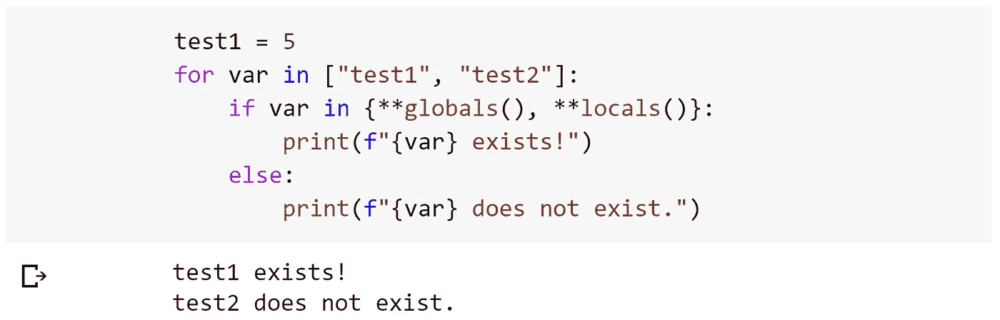
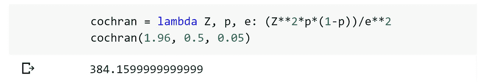

# 你(可能)不知道的五个 Python 特性

> 原文：<https://towardsdatascience.com/five-python-features-you-probably-didnt-know-d48faa0b892e?source=collection_archive---------3----------------------->

## 编写更优雅、更高效代码的简单步骤


照片由[拉蒙·萨利内罗](https://unsplash.com/@donramxn?utm_source=medium&utm_medium=referral)在 [Unsplash](https://unsplash.com?utm_source=medium&utm_medium=referral) 上拍摄

Python 大有可为。每周，我都会看到以我认为不可能的方式编写的代码。其中一些功能非常出色，我无法理解没有它们我是如何生活的——其他的功能知道了就好了。

本文将介绍其中一些不常用但仍然非常有用的功能，包括:

```
**Variable Assignments** - with *args and **kwargs (incl. dictionary merging)
**Frozensets** - what they are and why they're useful
**Multiple Conditionals** - cleaner logic
**Check if a Variable Exists** - in both local and global scopes
**Better than Lambdas** - writing Pythonic and functional one liners
```

# 变量赋值

就像 function *args 和**kwargs 一样，我们可以在变量赋值中使用相同的语法:


## 合并两本词典

合并字典时，使用 iterable 变量赋值方法特别有用，我们可以使用**kwargs 语法:



但是我们需要谨慎。如果两个字典之间有任何公共键，后面的键-值对(来自`y`)将替换前面的。

随着最新的[Python(3.9)](/new-features-in-python39-2529765429fe)即将发布的版本，我们将获得一个全新的语法来解决这个问题——字典合并和更新操作符:

```
z = **x | y**  # merge - same behavior as above
**x |= y**  # update - in-place dictionary merge
```

# 冰冻集

在 Python 中，我们可以使用集合，集合是不同对象的无序集合。这些集合是可变的，这意味着我们可以用`add()`和`remove()`来改变它们——这也意味着集合是不可改变的(稍后会详细介绍)。

或者，我们可以使用不可变的`frozenset()`——我们不能改变它的值。但是，因为它是不可变的，所以它是可散列的——当我们试图同时使用`set`和`frozenset`作为字典键时，就会显示这一点:



好吧，所以使用一个`frozenset`作为字典键并没有那么有用(如果有人有这样做的理由，请告诉我！).但是`frozenset`给我们的是更明确的、有意的代码。它警告未来的代码读者—

> 改变我，一切都会破碎

*有读者指出不止一个，而是两个*[**为此在推特上**](https://twitter.com/luke_binwalker/status/1279368482572943366)**——感谢！**

# *多重条件句*

*清理那些凌乱的 **if 语句**。而不是:*

```
*if 0 <= x and x <= 1:
     print('value is %')*
```

*我们可以写:*

```
*if (0 <= x <= 1):
    print('value is %')*
```

*更进一步，我们可以添加更多的条件语句，并用按位运算符将它们连接在一起，如下所示:*

```
*if (0 <= x < 1) | (7 <= x < 8) | (x == 10):
    print('passed')*
```

# *检查变量是否存在*

*需要检查变量是否存在？*

```
*if "var_name" in globals():
    print("var_name exists!")elif "var_name" in locals():
    print("var_name exists locally!")else:
    print("var_name does not exist.")*
```

*我们可以分别使用`globals()`和`locals()`来检查全局和局部范围内的变量。*

**

*检查变量 **test1** 和 **test2** 是否存在于全局或局部范围内。*

*两个作用域函数`globals`和`locals`都返回字典——所以我们也实现了上面的字典合并语法`{**x, **y}`。然后我们的代码在这个合并的范围字典中检查`test1`和`test2`。*

# *比兰姆达斯好*

*将 lambdas 用于快速简单的一行程序非常常见，但我很少看到它用于构建多参数函数。我们通常看到的是这样的:*

```
*do_something = lambda x: x**2 / (1 - x)*
```

*但是它们可以用来创建优雅的一行程序函数:*

**

*使用 lambda 函数创建一个包含 Cochran 公式的单行样本量计算器。*

*在我们开始到处编写 lambdas 之前，请注意这可能是 Python 中最讨厌的语法用法之一——所以让我们快速回顾一下。*

*[PEP 8](https://www.python.org/dev/peps/pep-0008/#programming-recommendations)—Python 的风格指南—**强烈反对使用 lambda 作为**命名函数**。***

***与此同时，单行函数，尤其是数学公式，可能看起来很神奇。***

***因此，我们不使用`lambda`，而是编写一行`def`语句，如下所示:***

******

***使用单行 def 语句创建带有 Cochran 公式的样本大小计算器。***

***你用哪种方法由你决定。如果你想让愤怒的暴徒拿着干草叉呼喊你的名字，使用`lambda`——否则，使用`def`。***

***这是我们五个非常有用的 Python 特性—***

```
*****Variable Assignments**
**Frozensets**
**Multiple Conditionals**
**Check if a Variable Exists**
**Better than Lambdas*****
```

***我希望其中一些对你来说是新的，对你和对我一样有帮助。如果你想了解更多内容，我在 [YouTube 上发布了 Python 视频](https://www.youtube.com/channel/UCv83tO5cePwHMt1952IVVHw)！或者，如果你有任何问题，请随时通过 [Twitter](https://twitter.com/jamescalam) 或在下面的评论中联系我们。***

***感谢阅读！***

***有兴趣了解更多关于 Python 的知识吗？***

***关于 Python 中的 API，你需要知道的一切，或者 Python 中的[高级正则表达式，怎么样？](/step-up-your-regex-game-in-python-1ec20c5d65f)***

***[](/step-up-your-regex-game-in-python-1ec20c5d65f) [## 用 Python 升级你的正则表达式游戏

### Python 中使用正则表达式的高级文本操作

towardsdatascience.com](/step-up-your-regex-game-in-python-1ec20c5d65f)***