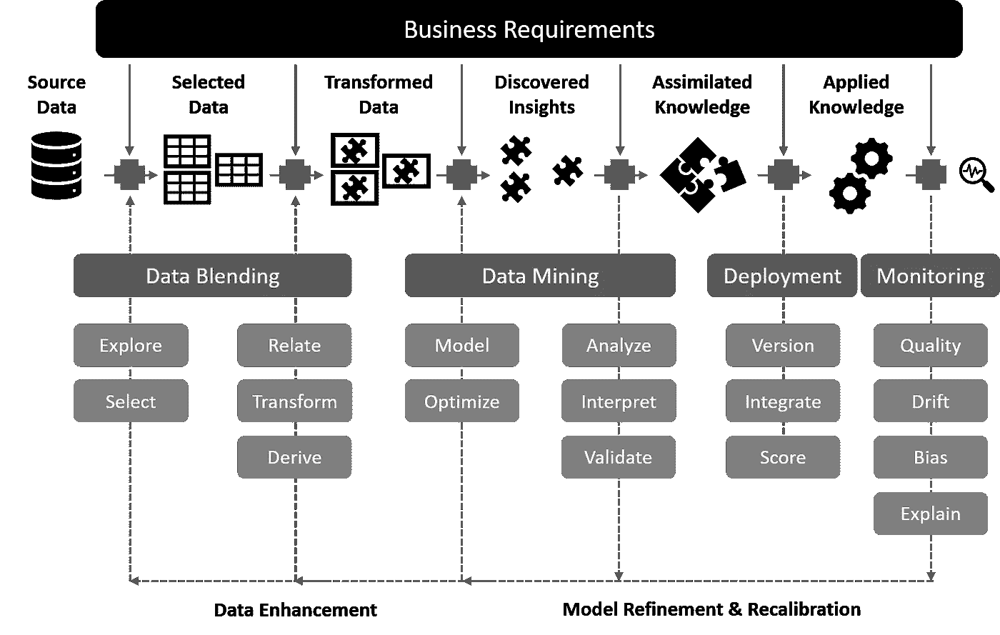
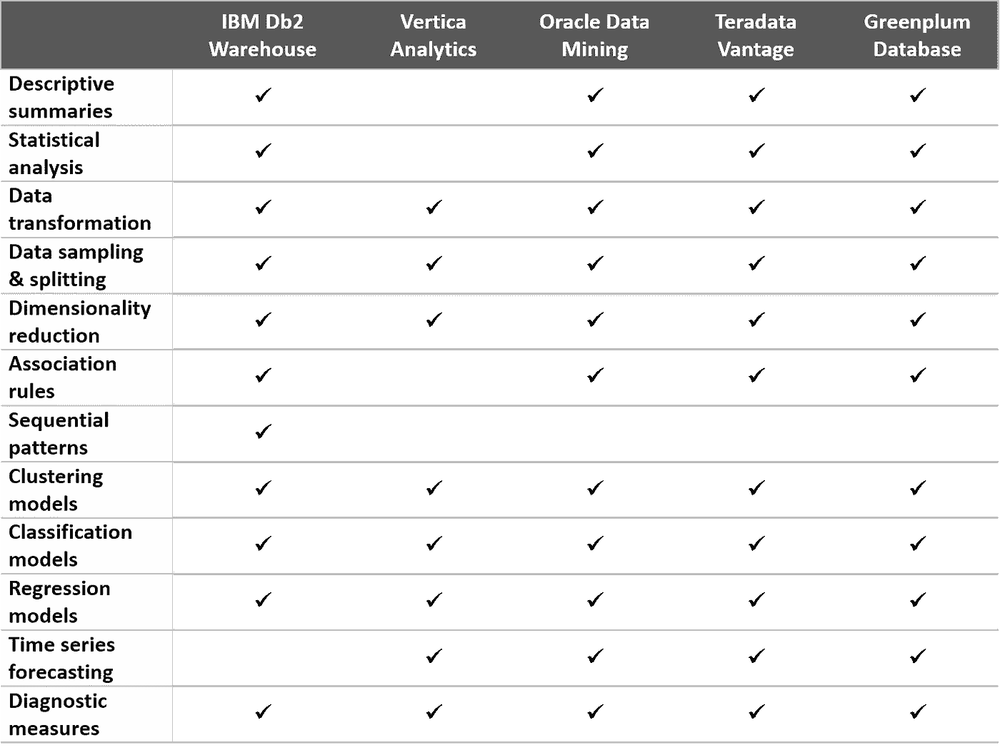
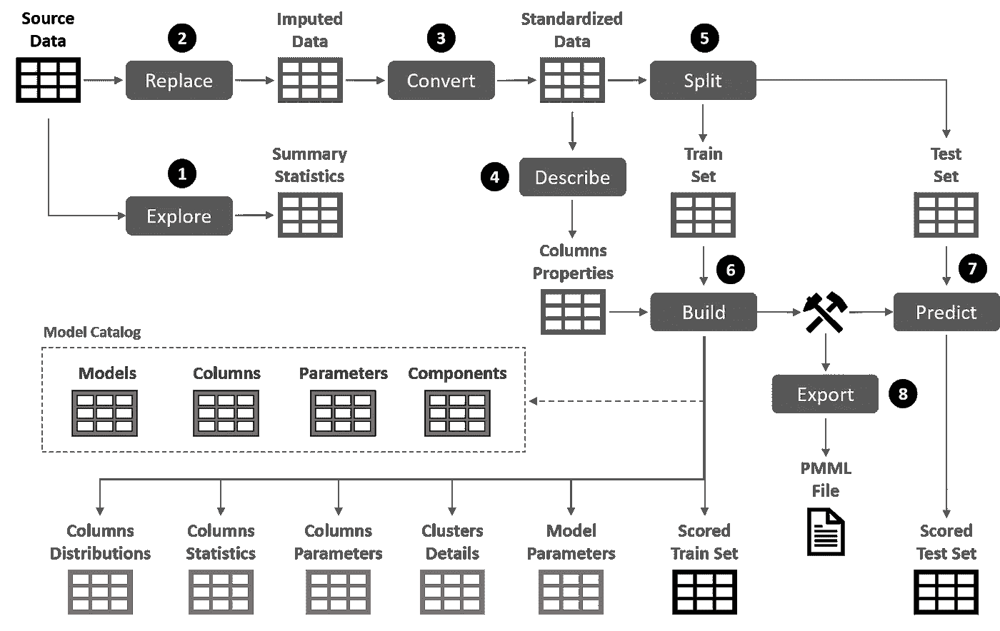
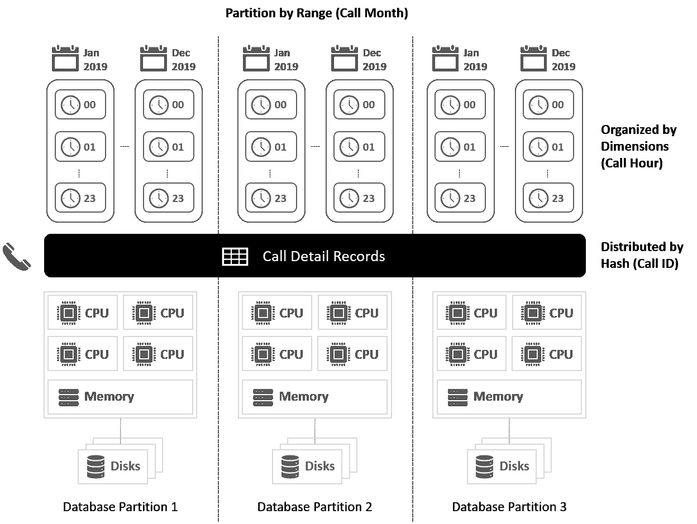
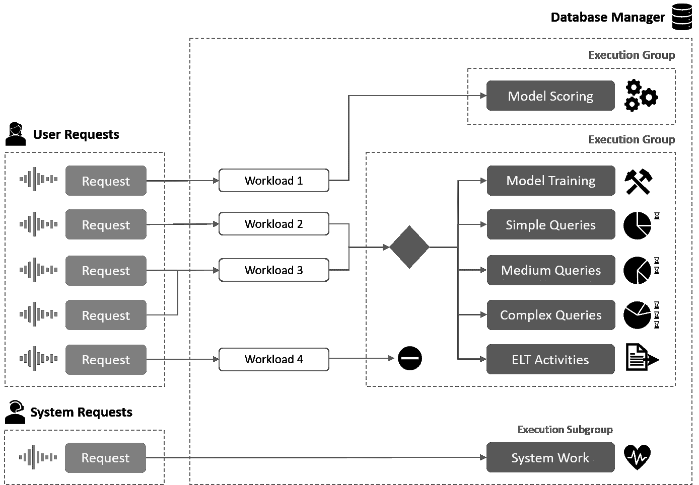
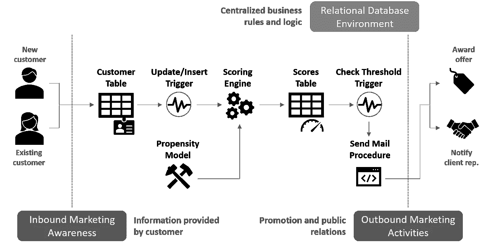
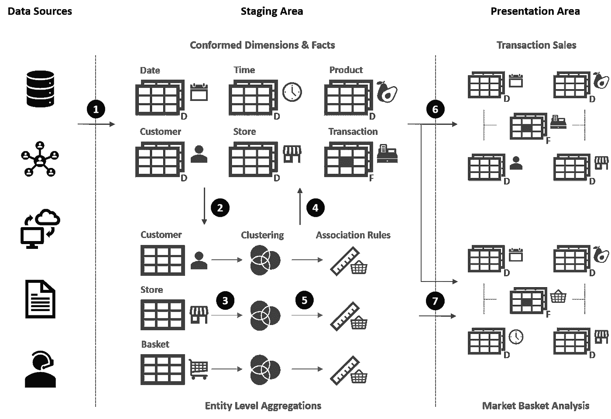
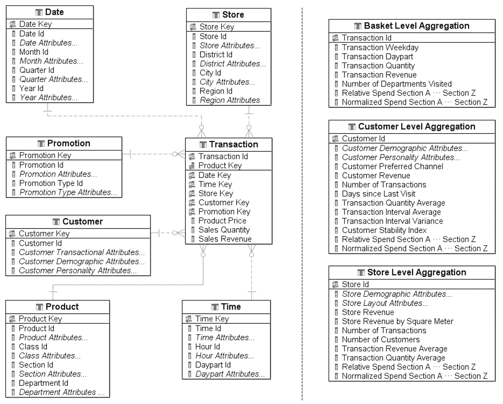

# 数据库内数据挖掘的五个理由

> 原文：<https://towardsdatascience.com/five-reasons-for-in-database-data-mining-84e9cf8e084a?source=collection_archive---------22----------------------->

## [Db2 仓库数据挖掘](https://medium.com/tag/db2-warehouse-data-mining)

## 利用关系数据库引擎实现集成的模式发现和预测建模解决方案

由[亚历山大·佩罗托](https://unsplash.com/@perotto?utm_source=medium&utm_medium=referral)在 [Unsplash](https://unsplash.com?utm_source=medium&utm_medium=referral) 上拍摄的照片

**数据挖掘**可以定义为一套方法、流程和技术，用于发现相关信息(通常隐藏在大量数据中),并将其应用和集成到业务运营中，以提高绩效和支持决策制定。

本文的目的是将关系数据库系统作为部署数据挖掘工作负载的合适平台，包括建模和评分操作。由于其在信息管理、可伸缩性、可扩展性和性能方面的独特能力，关系数据库提供了一个集成的环境，在这个环境中，数据和算法为了业务的利益而共存。

# 数据挖掘上下文

上面的数据挖掘定义由三部分组成，必须正确限定。

首先，相关信息的非平凡发现意味着模式、趋势和相关性的检测，这些模式、趋势和相关性不能通过传统的查询技术暴露，或者因为这些事实上是不适当的，或者对于问题的复杂性是非常低效的。相比之下，数据挖掘提供了来自人工智能(机器学习)和多元分析等学科的方法来解决这类问题。这些方法基于统计上稳健的算法，可以对结构化和半结构化数据集中的复杂关系进行建模，涉及不同的变量类型、高分散水平，并且不需要对底层数据分布进行假设。数据挖掘建模方法通常分为监督学习(分类、回归、时间序列预测)和非监督学习(聚类、关联规则检测、序列模式发现)。

其次，信息发现需要方法论。为了定义必须解决的问题、业务环境和所需的分析框架，它是必需的。该框架涵盖了将被纳入分析的变量或特征，以及准备步骤和建模任务的顺序，直至找到并应用有效的解决方案(**图** 1)。这种方法被转化为一套流程，包括数据集的初始鉴定和准备，一个或多个知识提取模型的开发、组装和验证，以及最后，也是最重要的，将准备-建模流部署到生产中，并对其进行持续监控和重新校准。与在其他环境中一样，这些流程是使用执行它们的几个底层 IT 服务来实现的。

最后但同样重要的是，提取信息的主要目标是提高业务绩效。首先，展示新的知识和见解，以支持战略计划和战术决策。然后，通过应用分析模型并将结果集成到信息和事务流程中，将这些知识部署到业务运营中。

业务焦点、方法论和面向服务的实现使数据挖掘成为核心业务分析专业化，而不仅仅是一堆数学技术和算法。

**图 1** —数据挖掘解决方案工作流程

## **数据挖掘的技术方法:历史回顾**

在过去的十年中，数据挖掘的应用领域和潜在用户的数量已经大大增加。过去被认为是高技能统计从业人员的受限领域，现在已经发展成为业务应用的一部分，涉及数据工程师、开发人员和最终用户。这一步在一定程度上是可能的，因为技术的发展促进了建模技术的使用和应用，并使之自动化。方法的形式化和标准化也有所贡献，但不如技术增强了嵌入数据挖掘的新一代分析应用程序那样决定性，使商业用户能够解决复杂的问题并利用新的机会。

从工具的角度来看，直到 90 年代中期，数据挖掘建模主要是通过编程语言在逐个案例的基础上开发的，尽管一些统计软件包和专用库的存在有助于促进这项工作。然后，市场上出现了一套配备有复杂的终端用户图形界面的数据挖掘工作台。SAS Enterprise Miner、IBM Intelligent Miner、Angoss KnowledgeStudio 或 ISL 克莱曼婷(后来被 SPSS 收购，现在是 SPSS Modeler，IBM Analytics 组合的一部分)等解决方案提供了数据挖掘可视化设计方法，具有数据库连接、数据准备、脚本扩展和模型可视化的扩展功能。尽管这些应用程序大多以独立模式运行，但供应商通常提供客户机-服务器架构来提高可伸缩性、并发性和性能。从某种意义上说，很大一部分新的数据挖掘实践者再次接受了纯编码方法，而没有考虑专用建模环境在易用性、生产率和可维护性方面可以提供的好处，这确实令人惊讶。

虽然基于工作台的方法包括数据转换、模型训练、测试和重新校准的能力，但它仍然需要建模概念的深厚知识，因此需要专业人员。此外，模型管理在许多解决方案中都是特定于供应商的，因此是专有的。将数据挖掘功能集成到业务应用层非常具有挑战性，这主要是由于缺乏灵活、标准化和易于使用的模型格式和编程接口。尽管与生产者无关的评分平台的出现有助于模型推理和部署，但完全集成的数据挖掘解决方案的开发对于这类应用程序来说仍然是一个问题，特别是对于与模型创建和内省有关的一切。模型生命周期管理中缺乏自动化功能是当前广泛使用编程库的原因，这些编程库大多基于 Python 或 Scala，通常由 Apache Spark 或 Hadoop 等分布式计算框架支持。

另一方面，在 21 世纪中期，以数据为中心的数据挖掘方法进入了市场。与其他数据库内分析产品一样，我们的想法是将数据挖掘工作尽可能集中到核心数据所在的位置。

数据库内分析计划起源于 90 年代中期，当时 Sybase、IBM、Oracle 或 Teradata 等提供商为他们的关系数据库系统配备了面向对象的扩展。这些扩展允许创建用户定义的类型和方法，因此数据库引擎中复杂数据结构的定义和操作成为可能。此外，在存储过程和函数中包含 C 语言以及后来的 Java 例程的能力扩展了 SQL 过程语言的能力，因此在数据库中实现丰富的业务逻辑不再是一种限制。此时，地理空间、图像、音频或内容管理扩展开始成为后续数据库版本的一部分。

数据库内数据挖掘基于这个数据库扩展范围。其思想是利用数据库平台的功能和资源来支持和公开数据挖掘功能，最重要的是，使业务应用程序能够嵌入数据挖掘，使其更容易被开发人员访问，并最终被业务用户访问。

目前，为了实现具有模式发现和预测建模能力的集成解决方案，数据库内数据挖掘是一条成熟的途径。像 Vertica(Vertica Analytics Platform)[1]、Teradata (Teradata Vantage) [2]、Pivotal (Greenplum Database) [3]、Oracle (Oracle Data Mining) [4]或 IBM (IBM Db2 Warehouse) [5]这样的数据仓库供应商多年来一直在发布他们的数据库内数据挖掘扩展，无论是以软件平台、设备还是公共或私有云平台上的数据仓库即服务产品(DWaaS)的形式。

在当前环境中，基于解耦微服务的软件架构决定了开发最佳实践，混合云环境在编排不断变化的组件时需要更大的灵活性，在数据库中放置数据挖掘功能的真正好处是什么？与其他方法相比，数据库内数据挖掘的关键点是什么？

这里列出了当数据库被认为是实现企业数据挖掘计划的目标环境时，给予数据库竞争优势的五个原因。列表是有编号的，但排序不代表相关性；这只是一种将每个主题暴露在它的前辈之上的正式方式。

# 1.将算法和计算引入数据，提高性能和可扩展性

几十年来，关系数据库系统一直是业务系统的核心，随着业务系统的发展，技术也在发展。它们已被证明是 OLTP ( *在线事务处理*)应用程序的最佳选择，在这些应用程序中，数据可用性和一致性是必需的；对于 OLAP ( *在线分析处理*)场景，复杂和动态聚合的可伸缩性和查询性能是关键因素。此外，关系数据库为 CRM ( *客户关系管理*)和 MDM ( *主数据管理*)解决方案提供了主要的持久性选项。这意味着大多数客户行为和社会人口统计数据——业务分析应用程序的燃料——本地驻留在关系存储库中。

但是关系数据库不仅仅是强大的数据存储。这是一个可以部署数据密集型应用程序的环境，这些应用程序是批处理、实时或事件驱动的。当然，数据挖掘是一个数据密集型过程。

在数据库中实现应用程序的机制是通过例程。数据库例程是封装了可以使用 SQL 调用的编程逻辑的对象。与其他编程方法一样，例程简化了代码重用、标准化和维护。例程可以是内置的，因此它们随数据库一起提供，用于各种支持任务，或者由用户创建以扩展 SQL 语言。除了封装访问控制等其他好处之外，数据库例程还提高了应用程序性能和 SQL 执行。这在构建具有大型训练集的数据挖掘模型时尤其重要。

建模意味着大量的数据库交互，因为数据必须在每个训练时期重复提取。如果数据挖掘算法作为数据库客户端运行，此过程将涉及多个远程 SQL 语句，进而会创建许多发送和接收网络操作。这导致了高水平的网络流量以及相关的增加的处理器成本。如果训练算法过程被实现为在数据库中执行的例程，则所有这些 SQL 语句，包括那些写入结果表的语句，都被封装到单个发送和接收操作中。因此，最小化了网络流量，提高了训练性能。

此外，例程中的 SQL 语句通常比从客户端应用程序发出的语句提供更好的性能。这是因为例程在与数据库相同的进程中执行，利用共享内存进行通信。如果例程实现静态 SQL(在数据挖掘任务中会接触预定义表中的数据),则访问计划将在预编译时生成，从而不会产生运行时开销，性能也会更好。

从功能的角度来看，数据库例程可以分为存储过程、函数和方法。存储过程是可以通过执行 CALL 或 EXEC 语句来调用的编译程序。它可以有输入、输出和输入输出参数，还可以执行各种 SQL 语句和程序逻辑。存储过程也可以返回多个结果集。函数提供了一种扩展和定制 SQL 功能的方法。与存储过程不同，函数是在 SQL 语句中调用的，例如 SELECT 或 VALUES 表达式或 FROM 子句。根据结果类型的不同，函数可以是标量(返回单个值)、列(聚合一组输入值的标量结果)、行(返回单个行)或表(将表返回到在 FROM 子句中引用它的 SELECT 语句)。最后，使用方法来定义用户定义类型的行为，这与其他面向对象的方法非常相似。

**表 1** —不同数据库提供商的建模能力

从实现的角度来看，数据库例程逻辑可以完全由 SQL 语句组成，也可以由外部编程语言代码组成。在前一种情况下，使用 SQL 过程语言扩展来实现例程逻辑，这些扩展通常因提供者而异(Sybase Transact-SQL、IBM SQL PL、Oracle PL/SQL、PostgreSQL PL/pgSQL 等)。).这些扩展带来了变量和条件处理程序声明、控制结构、错误管理等语句。

外部例程可以用许多编程语言编写，如 C/C++、Java、.NET 或者 Python。在任何情况下，代码都驻留在数据库之外，但是在同一个服务器中。在执行时，这些例程可以在与数据库管理器相同的进程中运行，从而提供很好的性能。它们极大地扩展了可以在 SQL 例程中实现的逻辑复杂性。例如，它们可以与文件系统交互，执行 HTTP 请求或发送电子邮件通知。虽然 SQL 例程在性能、安全性和可伸缩性方面提供了最好的选择，但是 C/C++例程通常是可比较的，此外还提供了更丰富的编程能力。

外部例程通常是在数据库中实现建模算法的最佳选择。特别是，外部存储过程最适合培训操作，因为它们的执行和调用方式(对程序的调用语句)是模型构建任务中所期望的。此外，模型构建通常涉及创建新的数据结构和插入或修改现有数据；函数中既不期望也不支持这种操作，它总是 SELECT 或其他数据操作语句的一部分。从这个意义上说，存储过程也比函数为 SQL 过程元素提供了更广泛的支持。相反，函数通常是评分操作的首选，因为这些函数自然适合 SELECT 语句。

用于建模操作的外部存储过程的好处可以总结如下:

*   **训练封装**。模型训练逻辑由几个数据库查询、中间计算处理以及结果持久化和返回组成，非常适合存储过程；繁重的 SQL 处理在数据库内部执行，只有最终结果返回给调用者。
*   **复杂逻辑实现**。支持嵌套和递归过程调用。开发人员可以利用面向对象或函数式编程范式，用他们觉得舒服的语言编写代码。存储过程、函数、类型和变量可以以实现建模和评分功能的模块形式打包在一起。
*   **外部动作支持**。这在几个场景中特别有用，比如外部评分平台中自动模型部署的 API 调用，或者相反，从文件系统中的模型导入操作。
*   **集成持久化**。外部存储过程支持几乎所有的 SQL 语句。不仅允许数据操作和修改操作，还允许静态和动态 SQL 形式的数据定义语句。例如，可以通过存储过程算法创建和删除持久表或临时表，以便进行中间计算。
*   **逻辑专门化**。如果训练运行中涉及的查询的数量和复杂性非常高，可以拆分实现逻辑以提高性能。SQL 和外部例程可以互操作。繁重的准备查询可以转移到 SQL 例程中，这对于这些任务更有效，因为它是由数据库服务器本机执行的。外部过程实现了建模逻辑，编排了可以交换结果集或通过临时表进行通信的其余组件。
*   **便携性**。作为外部例程实现的建模任务在不同操作系统上的数据库环境之间高度可移植，甚至在不同的提供者之间也是如此；由于编程逻辑存储在一个编译过的库中，它可以很容易地被共享，并适合在另一个引擎中工作。

为了实现这些功能，可以在内部开发例程，或者通过利用来自数据库提供商的专用内置数据挖掘模块来实现例程。当然，混合方法是可能的，也是推荐的，因此开箱即用的功能是定制的，并适应自己的环境。**表 1** 总结了不同数据库内数据挖掘提供者的主要建模能力；这个想法并不是要详述所有提供的算法，而是要表明所有这些算法都很好地支持不同的描述、转换和建模任务。不幸的是，但并不奇怪的是，在数据库内建模和评分活动的标准化方面没有统一的产品；几乎所有的提供商都采用专有的、因而是供应商锁定的方法。然而，这并不意味着缺乏这方面的努力。

总标题为*信息技术—数据库语言— SQL 多媒体和应用程序包(SQL/MM)* 的 ISO/IEC 13249 是一个国际标准，它定义了一组特定于应用程序的数据类型、表结构和相关例程的模块。这一规范背后的动机是支持在数据库中存储和操作多种内容类型，如图像、文本和空间数据，为 ANSI SQL 标准提供扩展。在这个方向上，并于 2002 年首次发布，*SQL/MM Part 6:Data Mining*[6]涵盖了数据挖掘用户定义类型及其相关例程。它以 SQL API 的形式为数据挖掘算法定义了一个标准化的接口，该接口可以放在关系数据库的顶层。目标是基于物理和逻辑规范、数据挖掘模型、挖掘运行设置和模型结果等元素来存储、管理和检索信息。

尽管该规范在功能和支持的模型方面非常丰富，但是这种规范的成功显然是有限的。在商业或开源产品中实现这些接口的惟一提供商是 IBM，它拥有 Db2 Intelligent Miner 建模和评分扩展器。但是，IBM 在 Db2 11.1 中反对这一功能，转而在 Db2 Warehouse 11.5 中采用专有方法。

在模型表示上已经达成了更多的共识，至少最初是这样。目前在版本 4.4 (2019)中，预测模型标记语言(PMML) [7]是统计和数据挖掘模型定义的事实上的标准。基于 XML，PMML 支持生产者和消费者应用程序之间的模型传输。数据挖掘集团(DMG)，开发标准的联盟，声称它得到了大约 30 个提供商的支持。尽管不同的编程框架以包和库的形式提供了扩展，但事实上，PMML 在过去几年里已经失去了一些吸引力。这是由于新算法和扩展的定义缺乏灵活性，因此模型生产者和评分引擎之间的互操作性有时会受到限制。

为了解决这些限制，DMG 在 2015 年发布了可移植分析格式(PFA) [8]，这是一种补充的基于 JSON 的格式，更类似于编程语言。PFA 通过组合基于类型系统、控制结构和大量原始函数库的构建块来定义模型。通过这种方式，可以很容易地组装新的算法流水线，而不需要像 PMML 那样被任何规范所接受。PFA 还很年轻，但正在获得关注。它非常适合通用应用，尤其是与更专注的开放标准(如 MLeap、ONNX 或 NNEF)相比。

在当前的数据库环境中，所有的提供者都实现了模型定义的专有格式。此外，只有 Greenplum、Oracle 和 IBM 提供了某种内置支持来导出或导入 PMML 模型，但在最近的版本中，它们正在失去模型幅度。任何数据库提供商都不支持 PFA。

**图 2**—IBM Db2 仓库中的集群管道和相关数据对象

作为内置数据挖掘扩展如何在数据库中工作的一个例子，**图 2** 展示了一个构建在 IBM Db2 仓库中的建模管道。在这个实现中，数据挖掘框架由一个模块(SYIBMADM)组成。IDAX)，它包含一组变量、条件、函数和分析存储过程。这些例程由一组四个存储模型元数据的目录表支持。

这些建模步骤基于葡萄酒数据集[9]部署了一个简单的聚类场景，这是化学计量学领域的一个众所周知的例子，经常用于机器学习以测试和展示不同的算法。该数据集包含属于三个不同品种的几种葡萄酒中存在的 13 种成分的化学分析结果。除了建立模型，pipeline 还有一个评分(预测)步骤:目标是分析聚类和品种之间的映射。

**清单 1** 根据所使用的存储过程、其功能和所需的参数详细描述了流程的每个步骤(步骤 2 是虚构的，只是为了完整起见:葡萄酒数据集不包含缺失值)。

**清单 1** —在 IBM Db2 仓库中使用分析存储过程实现集群管道

一旦构建了模型(步骤 6 ),它就被注册到目录表中。这些表包含不同的元数据，涵盖模型定义、超参数、特征属性和相关组件。这些组件是作为训练运行的结果而构建的表，它们取决于生成的模型的类型。在 K-means 聚类模型的情况下，创建并填充以下表:

*   **型号**。一个单行表，包含有关聚类模型的信息，如模型类、比较类型或比较度量。
*   **集群**。模型中存在的每个分类对应一行，提供分类的名称和说明(此字段可以编辑)、大小或同质性等信息。
*   **列**。提供关于模型签名的详细信息，每个输入要素占一行。它可以包含模型内部衍生的特征的附加行。
*   **栏目统计**。每个分类和特征一行:模式、均值、方差、最小值、最大值、重要性等。
*   **栏目分布**。每个要素边界的频率和附加测量值以及每个聚类中的值。

简而言之，模型洞察可以通过查询和报告工具或交互式仪表板以关系格式使用。最后，最后一步以 PMML 格式导出模型，以便在数据库内部或外部进一步利用。

# 2.利用内置的数据库引擎功能完成数据挖掘任务

从模型构建的角度来看，数据挖掘不仅仅是基于复杂的算法执行训练运行。组织、访问和操作数据的方式是确保良好性能和可伸缩性的关键，尤其是在处理数十亿条记录时。

以下是对关系数据库系统的一些功能的快速回顾，尤其是那些涉及如何优化训练数据的访问和检索，以及如何构建和管理数据挖掘模型的功能。

## 数据分区和表组织策略

数据库无共享架构已经存在多年，通过提供更高的处理能力和存储资源来确保系统的性能和容量。向外扩展是通过向现有集群添加新的逻辑或物理分区来实现的。在多分区数据库中，一个表可以放在多个分区中，因此它的行沿着集群的成员分布。这样，每个分区都由自己的资源、数据、索引、配置文件等组成。

通过分散表行，分区数据库提供了扩展的并行能力，尤其是对于数据检索。除了分区内并行(单个 SQL 查询被细分为多个部分，可以在单个分区内并行运行)之外，分区间并行还意味着将一个查询分解到多个分区，并行度由现有数据库分区的数量决定。可以同时透明地使用分区内和分区间并行，从而大幅提高查询的处理速度。在处理星型模式形式的大数据集时，这一点尤为突出，在星型模式中，事实表通常有数十亿行，并且有许多维度表，因此有大量的连接操作。

**图 3** 显示了一个呼叫详细记录(CDR)事实表，该表以三级模式组织。在第一级中，使用调用 ID 将行分布在三个数据库分区中。在这种情况下，这个分布键确保记录在所有三个分区中平均分配，因此在数据访问期间没有人会空闲。然后，在每个数据库分区中，表已经按定义的范围进行了分区，在本例中使用的是 call month。每个范围位于不同的存储对象中，一旦有了新数据，就可以很容易地分离和附加新的范围。最后，表数据沿着一个或多个维度被组织成块(在这个例子中是 call hour)。从全球来看，这种组织模式支持展现出高水平可伸缩性和性能的数据库设计。在任何情况下，重要的是要认识到跨多个分区和节点处理数据会带来一些开销，因此必须在数据量和性能之间进行权衡。

**图 3** —三级数据组织

此外，一些数据库引擎支持按列组织的表。在这种情况下，表数据页包含压缩的列数据而不是行数据，因此 I/O 只在作为查询一部分的列上执行。基于这种表的分析工作负载速度快了几个数量级，节省了存储空间，并且不再需要索引、物化视图、范围分区和耗时的数据库调优。

从数据挖掘的角度来看，这些表分区和组织策略意味着在数据访问和计算时间方面训练任务的加速。实现充分利用这些特性的算法的例程是基于分割-应用-组合策略的。它们运行一个主进程，发出几个并行请求，每个请求读取一部分训练数据，并计算各自的统计聚合和度量。在下一次训练迭代之前，所有这些部分结果最终被全局地收集和聚集。此外，几个例程总是可以利用查询间的并行性，并且可以同时执行。

分区功能还支持大容量、高速、并行的数据评分，为实时和批处理操作提供更好的并发支持。

## 联盟

基本上，联邦系统提供了数据虚拟化功能。这意味着单个 SQL 语句(读和写)可以收集分布在几个数据源中的数据，每个数据源来自不同的供应商。例如，通过一次选择，可以连接 Informix 表、MySQL 表、HDFS 拼花文件和 Excel 表中的数据，就像数据存储在本地的单个数据库中一样。从数据挖掘的角度来看，这可以简化建模和评分的数据访问，避免可能代价高昂的整合任务。它还促进了对不同和异构数据技术的组合访问，为关系和非关系数据源提供了连接器(包装器)。这使得在组装不同的数据片段以构建训练集和验证集时更容易。

提供这些功能的数据库引擎维护一个联邦系统目录，其中包含联邦数据库中的对象和统计信息。当提交一个查询时，SQL 编译器使用这个信息来开发一个最佳的访问计划，将查询分解成片段，然后下推到每个数据源。因此，每个片段都可以本地运行，并且结果可以被组合和呈现。此外，大多数联邦系统支持带有远程对象的缓存和物化查询表，从而提高了查询的性能并封装了一部分逻辑。远程数据源的联邦存储过程通常也受支持。

联邦数据库的好处不仅对数据库内数据挖掘部署可见，而且对任何利用数据库作为存储库的方法都可见，尤其是那些实现 SQL 推回的方法。

## 工作量管理

在数据库环境中，工作负载管理指的是监视和控制系统中活动工作的能力。这意味着可以将不同的工作负载分成不同的类别，使数据库服务器适应同一系统上不同的用户和应用程序需求。管理活动通常从定义不同的执行组和子组开始，在这些执行组和子组中可以分配数据库资源，以及确定如何允许工作在其上运行的阈值。这些资源包括 CPU 限制、最大执行时间、内存访问优先级、并发控制或运行活动的最大并行度。执行组定义通常还指定将为统计事件监视器收集的数据种类。

第二步是将数据库活动分类为工作负载，然后将工作负载映射到执行组。可以根据连接属性(如用户 ID、用户角色或应用程序名称)或活动类型属性来定义工作负载。例如，可以将不同子组中的数据定义和操作活动分开，将特定的密集只读查询与其他查询分开，或者隔离某些存储过程调用。**图 4** 展示了如何在数据仓库环境中处理和监控不同的工作负载类型。

工作负载管理是运营企业业务分析环境的关键要素。将数据库中的数据挖掘工作负载分配给特定的执行子组有几个好处。例如:

*   **区分开发和测试环境。**可以基于不同的模式在同一个数据库上放置几个沙箱。然后，每个模式中的活动可以关联到一个单独的执行组。
*   **隔离建模相关活动**。例程的执行可以与所有其他针对数据库的读写活动区别对待。此外，繁重的培训任务可能需要特定的专用资源。
*   **在模型训练期间控制和监控资源**。将不同工作负载中的请求集分开的原因之一是为了控制和监视，即使每个工作负载最终都指向同一个执行组。此外，还可以管理在特定地址空间中可以运行多少个并发训练任务，从而限制每个任务的执行时间。
*   **对特定应用的评分请求进行优先级排序**。可以调整专用执行组的规模，以满足来自事务性应用程序的实时评分请求，并根据内存和并发限制提供特定资源。
*   **基于历史数据捕获的容量规划**。数据混合和建模活动中的资源消耗的工作负载趋势可以在很长一段时间内建立。然后，可以根据这种分析预测未来的需求并确定数据库容量的大小。

**图 4** —数据仓库环境中基于独立子组的工作负载管理

## 备份和恢复

数据库备份背后的想法很简单:通过制作当前数据的副本并将其存储在不同的介质中来预测数据库可能出现的故障，以便在系统启动并再次运行时可以恢复它。备份通常可以在数据库、数据库分区或表空间级别完成，在后一种情况下只覆盖特定的表。此外，无论数据库在线还是离线，都可以进行备份。该过程也可以自动化，因此数据库管理员可以根据不同的方法来确定是否需要执行备份。

从数据挖掘的角度来看，数据库备份意味着处理模型目录表。这些表可以放在一个专用的表空间中(这是推荐的)，因此可以使用特定的策略单独维护它们。在任何情况下，它们都将是系统计划的一部分，可能有不同的时间表，因此不需要为数据挖掘模型提供单独的备份和恢复机制。

除了全球灾难恢复策略，包括 HADR ( *高可用性&灾难恢复*)，一些有趣的场景可以通过简单的备份功能来实现。其中之一是带有版本恢复的快照控制。在这种情况下，可以使用以前通过备份操作创建的映像将表空间恢复到以前的版本。如果一组模型是以循环和计划模式生成的，并且需要恢复以前的版本(例如，出于审计或质量控制的目的)，那么可以将它们放在专用表空间中的单独的表中，在生成新的一批模型之前进行备份和恢复操作。

## 访问控制

身份验证和授权是两种常见的数据库操作。第一种通常委托给外部设备，比如操作系统或 LDAP 服务器，但是授权是数据库管理器固有的。授权包括检查哪些数据库操作可以被执行，哪些对象可以被经过身份验证的用户访问。对于与数据挖掘相关的操作，在用户或组级别定义授权权限在以下情况下会很有用:

*   **限制访问训练和评分数据**。可以在表和视图级别授予读取权限，以及其他数据操作权限。该权限通常不仅包括 SQL SELECT 语句，还包括从数据库导出数据的实用程序。管理员可以控制可以挖掘的数据。
*   **授权谁可以训练、测试和应用模型**。执行权限涉及对数据库例程的操作，包括函数、方法和存储过程。由于培训、测试和评分操作是通过例程实现的，因此管理员可以定义能够启动这些任务的建模人员和开发人员组。这种限制能力不仅在安全性方面很重要，而且对于保持对数据库工作负载的控制也很重要。
*   **控制谁可以操纵现有的模型**。模型目录表也可以保护。这包括谁可以导出和导入模型，以及谁可以删除、更新和读取模型。结合执行特权，可以实现不同的安全场景。例如，一组用户可能有查询目录进行模型自检的权限，但没有执行评分操作的权限。

一流的数据库系统提供行和列访问控制(RCAC)，这是对表特权模型的补充。在数据保护方面，RCAC 提供了两个可以结合在一起的优势。首先，可以根据一些预定义的条件，限制用户只能访问记录的一个子集。这意味着不满足这种条件的记录在数据检索中会被忽略。第二，可以在列级别屏蔽数据。除非得到允许，否则列掩码会隐藏返回给用户或应用程序的数据。因此，不仅可以限制谁可以访问指定的列，还可以限制通过哪些例程进行访问。RCAC 促进了复杂业务规则的实施，定义了哪些特定数据集可以被访问、由谁访问以及使用哪些建模和评分例程。它还支持对模型目录的细粒度访问控制的定义。

还可以列举其他功能。例如，可以使用开箱即用的功能以及基于统一数据库日志记录子系统的审计任务来实施培训和评分运行的日常活动监控和执行计划。同样重要的是，所有这些都可以使用一个通用统一的 SQL 管理界面以编程方式进行管理。

# 3.利用混合数据管理功能进行数据访问和模型自省

一个现代的关系数据库系统应该遵循 NoSQL 模型，但是 NoSQL 站在这里不仅仅是为了 SQL。这意味着该系统为多语言持久性提供了一个混合的单一环境，结合了表格关系模型和其他灵活的模式方法，如键值、文档、列或图形存储。这包括管理除 SQL 之外的其他查询语言，还包括扩展它以支持 XML (SQL:2006 修订版)、JSON (SQL:2016 修订版)或 RDF 三元组等数据类型。

提供 XML 和 JSON 原生数据类型的第一个优势是能够使用半结构化数据源进行数据挖掘模型开发和评分。

存储在 XML 列中的数据可以通过使用 XQuery、SQL 或两者的组合来检索。SQL/XML 提供了发布功能，使 XQuery 表达式能够在 SQL 上下文中执行，因此需要数据关系视图的过程和应用程序可以在 XML 文档中进行查询。同样，XML 数据可以被分组或聚合，XML 文档可以与其他文档或关系数据连接，支持在它们之上定义视图。存储在 XML 列中的 XML 文档的特定部分可以被索引，从而提高查询的性能和效率。此外，SQL 优化器可以利用在 XML 数据和索引上收集的统计信息，在评估针对 XML 和关系数据嵌入 XQuery 的 SQL、XQuery 和 SQL/XML 函数时，生成高效的执行计划。

**清单 2** —结合了关系数据和 JSON 数据的 SQL 视图(下图)

作为一种轻量级的数据交换格式，JSON 与语言无关且可移植，是 XML 的替代物，用于半结构化数据。它消除了对预定模式设计的需要，不那么冗长，并且减少了对数据转换的需要。与 XML 一样，数据库可以提供 NoSQL(基于面向 JSON 的查询语言)和 SQL 方法。对于 SQL 访问，JSON 文档通常可以以原始格式或二进制编码格式(BSON)存储在列中，这提供了更快的文档遍历。SQL/JSON 路径表达式可以用来定义对 JSON 文档元素的访问，并发布它们，例如，以 SQL 视图的形式(**清单 2** )。此外，可以创建基于表达式的索引来帮助查询更好地执行。

除了支持半结构化数据的处理，这些数据类型的支持还为模型分析和内省提供了出色的能力。当使用基于 SQL 的可视化和报告工具来展示 PMML 模型中存在的洞察力时(**清单 3** )，或者当作为数据提取和转换工作的一部分，将它的内容分解到关系表的列中时(例如，一个集群模型的不同分区的统计数据)，这尤其有用。

从这个意义上说，创建或导入到数据库中的 PMML 模型可以直接存储在 XML 中或作为 BLOB 数据类型存储。在第一种情况下，模型以其固有的层次结构格式存储在一个表中，通常与其他关系数据放在一起。根据数据库引擎和模型的大小，如果模型很小(通常小于 32 KB)，它可以直接驻留在基表行中，也可以驻留在单独的存储对象中。如果模型适合表页的大小，读写语句的性能通常会提高，因为需要的 I/O 操作更少。在这两种情况下，如果数据库提供数据行压缩，启用它将提高 I/O 效率并减少存储空间需求。

在 BLOB 的情况下，由于模型压缩，二进制格式也提供了减小的大小。它也是独立于代码页的，因此可以将模型转移到用不同代码集定义的数据库中。然而，PMML 模型是序列化存储的，所以推荐这种方法主要用于模型归档。在任何情况下，总是可以通过在查询时解析二进制对象来检索 PMML 内容。

**清单 3** — SQL SELECT 从 PMML 模型中提取关联规则

以类似的方式，可以利用数据库的 JSON 功能来存储和查询 PFA 模型。一个有趣的特性是模型格式转换。提供原生 XML 类型的关系数据库引擎通常提供 XLST 支持，因此可以在 PMML 模型上实现和自动化转换，包括发布到其他格式，如 JSON 或 HTML。由于 PFA 通过组合函数库中的原语来定义模型，所以任何 PMML 模型都可以转换成 PFA(反过来并不总是可能的，尤其是对于那些还不是 PMML 标准一部分的模型类型)。在这种情况下，通过在单个 SELECT 语句中应用 XLS 样式表，可以将 PMML 模型转换为 PFA。

关于 RDF 数据集的最后一句话。一些数据库引擎有能力在关系表之上支持它们，包含关于 RDF 存储的数据和元数据:三元组、图、谓词、统计数据等。以三元组的形式建模关系使得由节点和边组成的复杂图形能够存储在数据库中，并使用 RDF 查询语言(如 SPARQL)进行检索。这种表示和 SPARQL 提供的全套分析查询操作使 RDF 成为一种有趣的格式，可以存储和分析由数据挖掘模型提取的关联规则和序列模式。

# 4.部署多个独家评分方案

一旦对数据挖掘模型进行了训练和测试，下一步也是最重要的一步就是将它部署到生产环境中，这样就可以通过对新的业务数据进行评分来应用它。值得注意的是，评分环境和支持数据库可以不同于建模环境。它也可以是分析性的、操作性的，甚至是混合工作负载。事实上，预测模型有望支持和增强持续的业务运营，因此 OLTP 应用程序环境将是最常见的环境。OLAP 解决方案还将受益于评分操作的自动化，因此结果可以直接集成到报告和仪表板中。

**清单 4**—Oracle 数据库中的 SQL 触发器，用于在客户资料发生变化时对记录进行评分

操作数据挖掘模型需要一些重要的考虑因素:

*   **模型格式标准化**。生产环境必须支持不同类型的模型和来自不同供应商的模型。应建立统一且独立于供应商的评分机制。PMML 和 PFA 应该是当前标准化的选择。
*   **管道脱钩**。模型所应用的数据在开发和生产中可能是不同的。这不仅适用于数据记录属性的位置和格式，也适用于在输入模型之前对这些记录进行的转换。即使对于生产环境，也必须支持不同的记录格式，因此必须有一个适配器来调整数据。
*   **不同的分数内容**。在一个或另一个场景中，评分有效载荷也可以不同。例如，当在开发环境中应用集群模型时，用户可能对获得不同集群 id 的质量和置信度感兴趣。但是，在生产中，唯一关心的可能是最佳集群 ID。有效负载的持久性需求(如果需要的话)可能也会不同。
*   **封装**。模型的重新校准，以及模型的替换，应该从开发到生产都是透明的，至少当模型的签名没有改变时是这样，即使底层的算法改变了。这意味着调用模型的语句不需要修改。

在数据库中部署数据挖掘模型提供了几种评分方案。这两者之间的选择将基于应用的实时要求，但也基于数据的易失性，因此，应该多长时间重新计算一次分数。

1.  **持续批量评分**。该模型应用于表的全部或部分记录。INSERT INTO SELECT 语句用于将评分有效负载(或其一部分)存储在结果表中，以供进一步处理和分析。当必须对大量记录进行评分，并在以后连续访问结果时，这种场景非常有趣。批量评分可以按需执行，也可以以脚本的形式部署到数据库调度程序，因此可以定期运行。
2.  **带视图批量评分**。在这种情况下，创建的视图在其定义中包含评分函数。每次对视图执行 SELECT 语句时，都会重新计算得分，但只针对那些属于查询一部分的记录。除了优雅之外，这种方法非常有效，因为一旦模型的数据发生变化，检索到的分数总是最新的。
3.  **持续触发得分**。触发器定义了一组响应特定表上的 SQL 操作(如插入、更新或删除)而执行的操作。此外，触发器定义有一个激活时间，它指定触发器应该在 SQL 操作之前还是之后激活。触发器可以包含 SQL 过程语言语句，包括存储过程调用，以及类似插入或更新其他表的辅助操作。它们是在数据库中放置和实施业务逻辑的元素。例如，可以在 INSERT 或 UPDATE 触发器的定义中调用模型，因此每次在表中插入或更新记录时，都会重新计算分数(或者分数，如果应用了多个模型)，并保存在结果表中(**清单 4** )。这也是一个非常有效的场景，因为一旦底层记录发生变化，分数就会自动更新。由于评分规则和逻辑现在都在数据库中，因此不需要在每个业务应用程序中对评分过程进行编程。这种基于触发的方法能够实现例如相对便宜的营销活动，因为不需要专门的软件，所以总拥有成本很低。**图 5** 是一个例子:每次注册一个新客户，或者当一个现有的客户信息改变时，customer 表中的一个触发器将被触发，根据倾向模型对客户档案进行评分。结果得分存储在一个表中，另一个触发器将检查购买倾向是否高于预定义的或动态的阈值。如果是这种情况，数据库程序将向客户发送一封带有特殊报价的电子邮件，并通知客户代表。
4.  **实时评分**。要评分的记录尚未永久保存在数据库中。它是由外部应用程序生成的，必须实时将分数返回给 It 部门，以支持业务决策(例如，根据当前购物篮数据和倾向模型提供或不提供折扣券)。在这种情况下，scoring 函数将像往常一样通过 SELECT 语句调用，但是它应该接受作为参数传递的记录值，而不是从数据库表中读取它们。

一些数据库引擎提供了保留的内存缓存，模型可以在其中更快地存储和执行:一旦模型在缓存中，加载和解析阶段就已经完成，并且可以在任何后续的评分任务中跳过。这对于提高实时评分场景的性能特别有用，在实时评分场景中，多个模型实例可以服务于不同的并发评分请求。

**图 5** —基于触发的营销

场景 1 和 2 在 OLAP 环境中更常见，而场景 3 和 4 在 OLTP 应用中更常见。在第二种情况下，必须特别采取一些预防措施。OLTP 应用程序通常至关重要，因为它们支持业务运营。基于触发的评分会影响数据库系统的性能和吞吐量。触发器是 SQL 事务的一部分，这意味着当触发器触发时，事务尚未完成，数据库锁仍然存在。此外，如果触发器由于任何原因失败，将回滚整个事务。触发过载事务；必须考虑这种影响，并通过工作负载管理保护数据库资源。

# 5.将数据挖掘操作与数据供应和多维分析结合起来

数据挖掘操作化不仅包括推理任务，其中经验证的模型被部署到生产环境中进行评分和持续监控。它应该处理完整的装配线，正如它在**图 1** 中的工作流程所示。尽管操作化不一定意味着自动化，但是模型工厂中的干预越少，与公司信息交付过程的集成就越多。

**图 6**—ELT 管道中的数据挖掘建模任务

事实上，自动化在一些涉及监督学习算法的场景中是可行的，但在一些非监督模型中也是可行的。描述性技术，如关联规则或序列模式发现，非常适合可以在数据操作作业中集成和调度的循环任务的思想。但是对于某些特定的聚类模型模板来说也是如此，其中的重点是描述而不是发现。

零售行业，特别是杂货店，提供了这种数据挖掘建模集成的好例子。**图 6** 表示 ELT ( *提取、加载和转换*)场景，具有三个规范部分:源系统、数据暂存区和表示层(数据集市)。这里的目标是在三个级别上集成细分&产品相似性模式。挑战不仅仅是通过对日常基础数据流建模来提取和发布新信息，而是要将这些洞察反馈到该流中，并丰富现有的业务维度。其工作原理如下:

1.  **数据提取**。数据从公司和外部来源提取，并放入暂存区(为简单起见，未显示中间存储对象)。这些来源包括交易数据库、运营 CRM 系统、社会人口统计面板，甚至来自社交网络和呼叫中心中的交互的用户满意度数据。所有这些信息都在数据库一级进行处理和转换；符合的维度和事实根据现有的业务维护策略进行更新。
2.  **数据聚合**。从这些一致的结构中派生出三个数据聚合:购物篮、客户和商店。该等合计乃于特定日期期间计算。它们总结了表示销售相关信息的不同指标，如每个部分或另一个产品层次结构级别中的相对支出和规范化的相对支出。**图 7** 表示初始星型模式和三个派生聚合。
3.  **聚类**。对于每个聚集级别，建立分割模型以便检测感兴趣的集群。我们的目标不是寻找小的利基市场，而是寻找具有一定时间稳定性和一致性的更广泛的群体。同样，重点是描述不同类型的行为，以及客户和商店如何在它们之间跳跃；特定的业务发现分段可以并行发生。为了提高自动化程度并加快流程，另一种方法可能包括以更低的频率重新校准集群模型。在这种情况下，将进行评分操作，而不是在每个聚合期间结束时构建模型。
4.  **尺寸富集**。集群映射信息被反馈到相应的一致结构中。“客户”和“商店”维度现在将有一个额外的层次结构，支持通过群集标识符进行明细导航。普通维度数据刷新和集群分配将具有不同的时间范围。因此，集群属性将使用某种类型的 SCD ( *缓慢变化的维度*)策略进行管理。
5.  **产品亲和力**。同时，对于每个聚集级别中的每个聚类，建立关联规则模型以提取产品相似性。产品分类可用于检测跨级别关联。对于客户级别，也可以实现顺序模式模型。这里的动机是提供一个分析框架，在这个框架中，可以在不同的业务级别上检测亲缘关系。此外，通过利用适当的数据分层来避免可能的辛普森悖论副作用。
6.  **数据展示**。一旦更新了维度，交易销售数据集市(以及所有其他覆盖不同业务流程的数据集市)就会发布更新后的数据，供最终用户使用。
7.  **篮子分析模型**。类似地，来自关联规则建模的发现也被转移到呈现区域。在这种情况下，实现了一个市场篮分析数据集市。它将共享大部分相同的维度，但有一些必要的专门化:为了正确地分析规则，角色扮演项目集维度将取代 Product。此外，为了适应不同层次的分析，应该有几个事实表。除了货币权重信息，这些事实表将主要包含绝对频率计数，因此其他指标，如支持度、信心、提升等。，可以通过聚合导出。

**图 7** —零售销售星形模式(左)，具有三个聚合级别，用于进一步细分(右)

这个例子可以很容易地扩展到包括额外的技术。例如，可以实施时间序列建模来增强产品相似性分析，并提供支持、信心和提升预测。

这个案例很好地展示了 ELT、数据挖掘和多维建模如何集成到同一个场景中。此外，它说明了高级建模技术如何完全嵌入到常规数据流中:只是它们的结果以成员属性和业务度量的形式直接暴露给最终用户。

这种集成的基础是关系数据库。通过利用 SQL API 进行数据挖掘操作，可以自动执行 ELT 管道中的所有相关任务，而不依赖于外部系统，并具有数据库服务器在可伸缩性、可靠性和数据管理能力方面提供的所有优势。

# 结论

应该有另外的第六个原因来完成这个论述，这很简单:关系数据库系统是分析师工具箱中构建和集成数据挖掘操作的宝贵资源。在许多业务场景中，应该始终考虑这一选项。这是一个将算法带到企业数据所在位置的问题。

在当今时代，人们痴迷于用超过五年的时间重新命名和改造每一项技术和学科，很快就会有人说这是边缘计算。我们会看到的。

# 一般参考

[1] Vertica Systems，[用于预测分析的机器学习](https://www.vertica.com/docs/9.2.x/HTML/Content/Authoring/AnalyzingData/MachineLearning/MachineLearning.htm)，Vertica Analytics Platform Version 版文档

[2] Teradata 公司，[机器学习引擎解析函数参考](https://docs.teradata.com/reader/Tk6W9zbo2NHGakhfyvWmmw/nt3Z~v5KgGV98ELQWJvQNg)，Teradata Vantage 文档发布号 1.1，8.10

[3] Pivotal Software，Inc .[使用 MADlib 的机器学习和深度学习](http://docs.greenplum.org/6-4/analytics/madlib.html)，Greenplum Database 版文档

[4]甲骨文公司，[甲骨文数据挖掘用户指南](https://docs.oracle.com/en/database/oracle/oracle-database/19/dmprg/index.html)，甲骨文数据库 19c 帮助中心

[5] IBM 公司，[分析存储过程](https://www.ibm.com/support/knowledgecenter/SSCJDQ/com.ibm.swg.im.dashdb.analytics.doc/doc/r_analytic_stored_procedures.html)，Db2 仓库 11.5 知识中心

[6] ISO/IEC JTC 1/SC 32 数据管理和交换，[ISO/IEC 13249–6:2006 信息技术|数据库语言| SQL 多媒体和应用程序包|第 6 部分:数据挖掘](https://www.iso.org/standard/38648.html)，国际标准化组织

[7]数据挖掘组， [PMML 4.4 通用结构](http://dmg.org/pmml/v4-4/GeneralStructure.html)，PMML 标准

[8]数据挖掘组， [PFA 0.8.1 规范](http://github.com/datamininggroup/pfa/releases/download/0.8.1/pfa-specification.pdf)，用于分析的可移植格式

[9] Forina，m .等人，[葡萄酒数据集](http://archive.ics.uci.edu/ml/datasets/Wine)，UCI 机器学习知识库