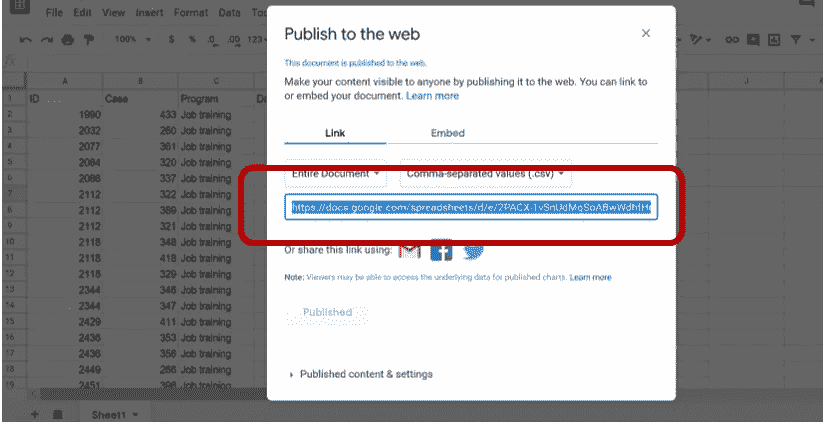
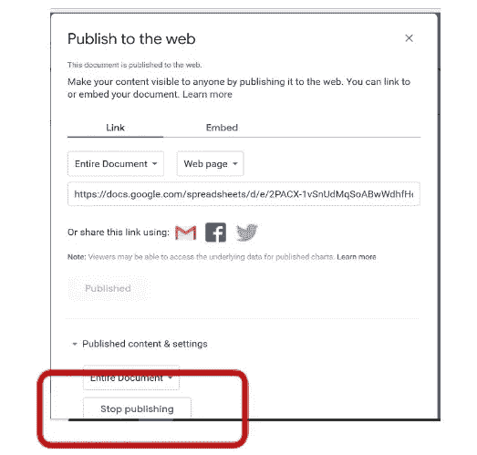

# 学习项目监控 R 的五个理由

> 原文：<https://towardsdatascience.com/five-reasons-to-learn-r-for-project-monitoring-95991e3efb55?source=collection_archive---------53----------------------->

杰夫·谢尔登在 [Unsplash](https://unsplash.com/s/photos/project?utm_source=unsplash&utm_medium=referral&utm_content=creditCopyText) 上的照片

监控是项目成功的重要组成部分。它包括查看所收集数据的质量，确定数据收集中的差距，并创建月度报告以显示计划的状况。对于任何监督数据管理组件的人来说，总是存在使用什么软件的问题。难题在于选择一个机构负担得起的、多功能的(统计分析与可视化)工具，并且需要较少的技术知识/编码来操作。事实上，找到一个满足所有这些要求的软件并不容易。

在我的实践中，我观察了各种工具，我发现 R 对项目监控非常有帮助。它可以完美地处理数据管理领域的常规任务，例如合并数据集、控制数据质量、更新缺失数据、根据项目需求对数据进行切片/子集化，以及创建月度报告。本文后面提供了一个具体的仪表板示例。

当然，您可以使用 R 做其他高级的事情，包括交互式仪表板、全面的统计分析以及开发您自己的功能或程序。然而，事实是你不需要每天都使用这种技能。你知道如何做的简单事情可以让你在工作中更有效率——最终，简单的事情会让我们的生活变得轻松愉快。

***合并数据集***

r 支持各种类型的数据格式，如 spss、sas、txt、excel 和 csv。许多机构正在使用 google sheets 进行数据存储和收集。google sheets 中的数据可以在几秒钟内加载到 R 环境中。

这里有一个具体的例子:

一个项目有四个不同的项目:教育、健康、职业培训和家庭倡导。每个项目都收集受益人案例、日期和所提供服务的详细信息。受益人可以同时参加几个项目。每个受益人收到他或她自己的唯一 ID。在加入特定项目之前，有一个独立的单位完成接收(人口统计)并决定申请人加入的项目。由于数据来自不同的地方，您的任务是将它们组合成一个数据集。数据是用谷歌工作表存储的。

下面是如何使用 r 来实现它。

首先，转到工作表中的文件部分，单击发布并复制链接。这个链接会用来上传数据到 r，需要注意的是，你要把这个链接保密，不要和任何人分享；否则，数据可能会被第三方访问。

将数据加载到 R 环境后，返回到 sheets，并单击 stop publishing。这将使链接无效。我的 R 代码有四个链接，因为我有四个不同的源代码要合并成一个。我使用 rbind 函数将项目数据组合成一个数据集，因为它们具有相同的列(ID、Case、Program、Date、ServiceID)。完成这一步后，我可以将其与受益人的人口统计数据合并。在您决定合并文件之前，请仔细研究您的数据结构，并决定哪种方法是最好的。r 还允许完全连接、左连接或右连接。

合并文件要采取的步骤:

***数据质量控制***

好的数据有助于我们做出正确的决定。因此，对作为项目一部分收集的数据进行定期检查非常重要。由于数据收集是一个涉及多方的复杂过程，最常见的错误发生在数据输入阶段。通常，您必须处理缺失或不准确的数据。幸运的是，你总是可以接触到目标群体，并且总是有机会获得正确的数据并更新你的记录。

这是另一个例子:

对于大多数项目，您总是可以找到方法来识别数据集中的可疑内容。该计划可适用于一定年龄、收入和住房状况的人。在这种情况下，你可以寻找数据或筛选年龄小于 18 岁且收入高的受益人。记住这一点，我将使用它来查找数据集中不符合这些标准的案例。我还将检查其他变量是否有缺失数据。该代码将包含以下变量:性别、种族、收入、家庭人数和年龄。任务是识别受益人身上缺失或可疑的价值。下面是用 r 写的代码。

这让我得到了有缺失/可疑数据的受益人名单:

***更新缺失数据***

在识别丢失的值之后，下一步是更新。上面的 R 代码帮助我找到了有问题的案例，现在我可以修复这个问题了。种族的缺失值是亚洲人，因为性别是男性，年龄 9 必须替换为 19，收入 77723 应该是 17723，家庭 0 和 11 必须替换为 1。下面的代码说明了处理这些问题的步骤。

这是我的输出:

***切片/分组数据***

监控中的另一个常见任务是使用频率或交叉表对数据进行分组。您可能希望深入了解正在收集的数据，并以稍微不同的方式对其进行分组。根据收入情况，许多社区服务机构都有资格成为项目受益人。要了解谁有资格享受哪种类型的服务，你需要查看联邦贫困指导方针(T2 和 FPG)。为此，你需要有三条信息:收入、家庭人数和 FPG 表。在 R 的帮助下将数据分组后，您可以使用 crosstab 函数生成一个漂亮的表格，显示您的程序家庭所处的位置。下面提供了一个示例和代码。还可以补充。csv 函数在这段代码的末尾。这将把您的表格保存为 csv 文件，可以很容易地与团队的其他成员共享。

这是我的输出:

***月度监控报告***

月度报告对于理解项目的整体发展是非常有用的。如果您监督您的项目管理团队的每月更新，您应该考虑开发一个报告项目进展的 statics 仪表板。在我的例子中，我使用了四个图表:

1.  登记的受益人人数
2.  性别代表性
3.  提供的服务
4.  按天数提供的服务数量

现在，让我们把一切联系起来。一旦你找到了加载、清理和创建图表的方法，你就可以在你的月度报告中使用相同的代码。唯一需要改变的是代码中的日期。需要几个小时完成的工作将变成 15 分钟的工作。下面是一个可以用 r 生成的仪表板的例子。

下面的代码显示了如何用 ggpolt2 制作圆环图:

下面是使用 ggplot2 创建堆积条形图的代码:

这就是如何用 ggplot2 创建棒棒糖图:

这是使用 ggplot2 创建日历的方法:

现在，将这四个图表合并到一个仪表板中。

简而言之，R 可以成为非常有用的项目监控软件。上面的例子演示了您可以尝试完成各种任务的方法。由于每个项目本质上都是独一无二的，您可以进一步试验 R 来研究它在处理任何与数据相关的任务时是如何有用的。