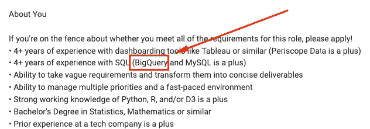

# 数据科学训练营不会教的五项技能(这会让你被录用！)

> 原文：<https://towardsdatascience.com/five-skills-they-dont-teach-at-data-science-bootcamp-that-will-get-you-hired-9023e5428b8e?source=collection_archive---------64----------------------->

## 获得第一份工作的缺失环节是什么？

蒂姆·高在 [Unsplash](https://unsplash.com/s/photos/interview?utm_source=unsplash&utm_medium=referral&utm_content=creditCopyText) 上拍摄的照片

众所周知，训练营不能让你为数据科学领域的工作做好充分准备。我在 Udacity、Udemy、Coursera、EdX 和 General Assembly 上分享了我的数据科学课程/训练营/mooc，我可以证明，没有面试官说过，“我在你的简历上看到你参加了数据科学训练营，你被录用了。”事实上，我的面试官从来没有提到过我的在线课程和训练营的教育背景。

事实是，数据科学训练营并不是你在数据科学领域获得第一份工作的灵丹妙药。它们通常被宣传为一种神奇的解决方案，如果你花 4 个月的时间参加这个项目，你会学到获得第一份工作所需的一切。事实上，训练营更像是发射台。他们是向数据科学职业过渡的良好开端。

根据我作为数据科学家的个人经验，并询问我在行业中的同事，我们看到大多数申请人在申请他们的第一份数据科学工作时缺乏的五项技能。

# 中间 SQL

您可能会指出，您已经从课程中了解了 SQL。这就是为什么我说**中级** SQL。所有的数据科学课程都会涉及 SQL，但他们不会花时间去深入研究 SQL。记住你 80%的时间会花在数据争论上。SQL 是那 80%的一部分，知道如何写好 SQL 会节省你很多时间。

图片来自 [Pixabay](https://pixabay.com/?utm_source=link-attribution&utm_medium=referral&utm_campaign=image&utm_content=1895779)

SQL 为什么这么重要？在您的课程中，您的数据以 csv 文件的形式提供给您。在生产中，您的数据存在于数据库中。了解如何针对多个表编写高效的 SQL 查询将允许您提取自己的数据。

> “从表格中选择”是你缺乏经验的信号。

使用生产数据库时，表可能有数十亿行和数百列。SELECT *是一种锁定数据库资源的快速方法。如果您绝对需要做 SELECT *，请包含一个 limit 子句，以便可以实际检索和显示结果。

您还应该知道如何以及何时使用窗口函数、自连接和交叉连接。在处理十亿行数据库时，了解它们将决定代码的成败。

# 导航云

在数据科学训练营中，你可以在本地笔记本电脑上做任何事情。在野外，一切都托管在云中。在 AWS、微软 Azure 和谷歌云上浏览公司的云基础设施是你在任何技术工作中首先要做的事情之一。

但是了解云技术如何让我被雇佣呢？职位描述有时不会明确地说 AWS。相反，他们引用云上的服务和技术，如“EMR”和“SageMaker”。

数据科学家职位描述

在上面的职位描述中，我们看到他们招聘 BigQuery 经验丰富的员工。BigQuery 是 Google Cloud 的无服务器数据仓库(没错，你用 SQL 查询)。由此，你可能会认为他们的服务是托管在谷歌云上的，你在这方面的任何经验都会自动让你比下一个候选人更有竞争力。

# 野外的数据科学

在我们的一次面试中，我们问候选人，“这是一个很好的解决方案，但是你从哪里得到数据呢？”

回应:“哦，我们可以做 pd.read_csv()。”

> “数据从哪里来”的答案。不是 pd.read_csv()

作为一名工作中的数据科学家，我的桌面上没有一个文件夹是我为 csv 文件中的数据单击打开的。我通常使用托管在云桶中的 parquet 和 gzip 文件，或者查询数据库来检索我的数据。例如，为了获得必要的数据来回答一个业务问题，我可能需要与几个工程师合作，以了解流程的不同部分，从数据是如何生成的，到如何有效地将所有数据提取到一个中心位置进行分析。

迪伦·吉利斯在 [Unsplash](https://unsplash.com/s/photos/teamwork?utm_source=unsplash&utm_medium=referral&utm_content=creditCopyText) 上的照片

实际上，数据科学要混乱得多。像随机梯度下降一样，我们正在迭代寻找一个解决方案，但通常没有好的指标。一些看似简单的事情，比如回答“上个月的销售额是多少？”往往会变得更加复杂，因为数据可能存在于多个数据库和一个同事的 excel 表格中。你会惊讶有多少数据是电子邮件链中的 excel 表格附件。

要获得一些数据科学的实际经验，请加入黑客马拉松，启动自己的数据项目，生成自己的数据，参加社区数据活动和小组。

# 战略性思考

数据科学家通常是数据问题的中间人。例如，我们在生成数据的工程师和希望用数据回答一些问题的产品经理之间工作。换句话说，我们与多个利益相关方和资源合作来解决与数据相关的问题。

图片由 [200 度](https://pixabay.com/users/200degrees-2051452/?utm_source=link-attribution&utm_medium=referral&utm_campaign=image&utm_content=1989339)来自 [Pixabay](https://pixabay.com/?utm_source=link-attribution&utm_medium=referral&utm_campaign=image&utm_content=1989339)

要想成功，你需要知道如何在大局中定义自己的角色。例如，假设您受雇创建一个需求预测仪表板。这里有一组要问的问题:

1.  谁将使用该控制面板，哪些功能很重要？
2.  如何使用这个仪表板？它需要多久更新一次？
3.  用户将如何访问仪表板？仪表板将在哪里托管？
4.  数据从哪里来？谁负责保证、部署和维护基础架构？

在新兵训练营，我们会得到有明确目标的问题集，知道什么是正确的。在工作上，成功往往是没有定义的，顶多不断变化。这就是为什么从更广的角度看待问题并理解实际需求是很重要的。

# 敏捷/灵活

我们不是在寻找完美的答案。我们正在寻找能够按时部署的最佳答案。在训练营，我们的任务是提高模型的准确性。在工作中，准确性只是我们努力实现的众多指标之一。其他的包括可维护性、可部署性、可伸缩性、可再现性，我们能在有限的时间内做到这些吗？

照片由[费伦茨·霍瓦特](https://unsplash.com/@designhorf?utm_source=unsplash&utm_medium=referral&utm_content=creditCopyText)在 [Unsplash](https://unsplash.com/s/photos/agile?utm_source=unsplash&utm_medium=referral&utm_content=creditCopyText) 上拍摄

我们需要对不断变化的请求和数据保持敏捷和灵活。您在冲刺开始时试图解决的问题可能会在冲刺中期发生变化。例证:最近的疫情改变了许多业务运营，包括数据科学团队的业务运营。

数据可能会改变或损坏。要知道你建立的解决方案和模型都是有限的。比方说，您上个月构建的需求预测仪表板可能已经过时/损坏，因为以前可用的一些数据已经改变了格式或不再可用。

# 最后

训练营更像是数据科学领域的发射台。它们绝不是一个包罗万象的项目，你必须通过这个项目才能成为数据科学家。我和我的同事经常发现数据科学申请者缺乏的五项技能是:

1.  中间 SQL
2.  导航云
3.  野外的数据科学
4.  战略性思考
5.  敏捷/灵活

作为额外的奖励，请确保在您的数据科学之旅中包括继续教育。这个领域每年都在快速发展，所以你需要继续学习最新的技术和技巧。我认识的所有数据科学家都有一些业余项目或爱好，他们正在追求提高他们的数据科学技能。

至此，我真诚地希望我对你获得第一份数据科学工作有所帮助。如果您有任何问题，以及哪些资源会对您有所帮助，请告诉我。我可以通过 LinkedIn 上的 [jasonwithcoffee](https://www.linkedin.com/in/jasonwithcoffee/) 联系到。