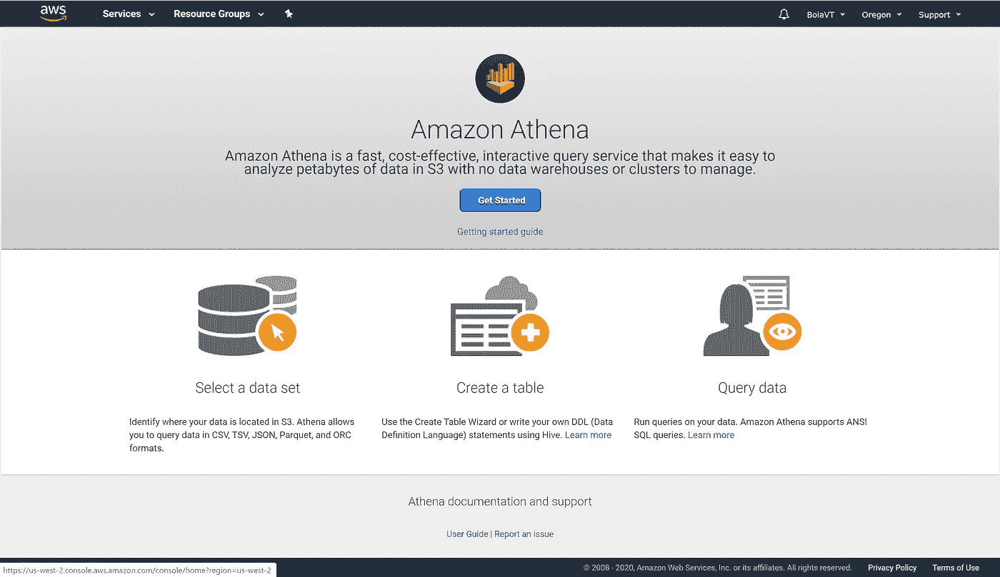

# 使用 AWS Athena 设置数据源的五个步骤

> 原文：<https://towardsdatascience.com/five-steps-to-set-up-a-data-source-using-aws-athena-62d89d0a9051?source=collection_archive---------65----------------------->

## 为可视化准备德克萨斯州健康事实数据

A thena 是 AWS 中的一项无服务器服务，它提供了对存储在亚马逊简单存储服务(S3)中的数据执行查询的机会。在本文中，我将描述在 AWS Athena 中准备好数据源以创建有洞察力的仪表板的五个步骤。

由[克里斯托弗·高尔](https://unsplash.com/@cgower?utm_source=medium&utm_medium=referral)在 [Unsplash](https://unsplash.com?utm_source=medium&utm_medium=referral) 上拍摄的照片

德克萨斯州健康服务部每年维护健康事实档案数据。我获得了两个 excel 文件，分别包含 2012 年、2013 年、2014 年和 2015 年结构化格式的健康事实数据。

我编写 Python 代码来检查和更新数据的质量，使其整洁，并创建一个 CSV 文件。

CSV 文件随后被存储在 AWS S3 存储桶中，下面是在 AWS Athena 中设置数据源的步骤。

> Amazon Athena 是一个交互式查询服务，允许您从 Amazon S3 查询数据，而不需要集群或数据仓库。

**第一步。在 AWS 控制台中，通过在搜索栏中键入或从分析类别中选择 Athena。**

**第二步。点击【开始使用】**

现在，您可以选择连接到数据源。我将使用默认的 AwsDataCatalog

您可以手动创建数据库和表，也可以使用 AWS Glue。我用了 AWS 胶水。

**第三步。启动 AWS Glue 并添加爬虫**

***爬虫信息*** :我把爬虫命名为“mytxhealthfacts”。我跳过了可选条目。

***爬虫源类型*** :我选择了“数据存储”作为爬虫源类型

***数据仓库*** :我选择了 S3 作为数据仓库。我在 AWS S3 中输入 csv 文件的位置作为包含路径。您也可以通过导航到该文件，然后选择复制路径将其放在剪贴板上来获得它。

我跳过了添加另一个数据存储的选项。

***IAM 角色*** :我选择了一个现有的 IAM 角色。

***日程*** :我选择了频率选项“按需运行”

***输出*** :我选择了添加名为“txhealthfacts”的数据库的选项，跳过了所有可选条目。

最后，我回顾了前面添加爬虫的所有步骤，并单击“Finish”。

**步骤四。运行爬虫**

这花了几秒钟，我看到状态从“开始”到“停止”再到“就绪”。

爬虫准备好之后，我回到雅典娜。

**第五步。启动 Athena 并点击“查询编辑器”**

我确认已经创建了数据库，并且还创建了包含来自 csv 文件的正确元数据的表。我还运行了一个查询来确认记录的数量。

现在，我在 AWS Athena 中有可用的数据源。我现在可以从 Quicksight 或 Tableau 等可视化工具连接到它，并创建一个有洞察力的仪表板。