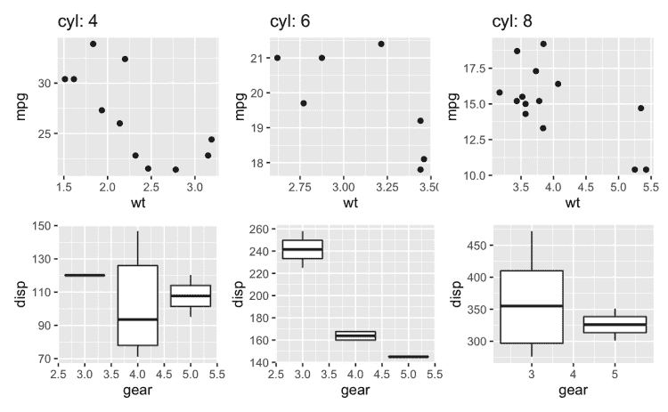

# 你可能不知道的五个小技巧

> 原文：<https://towardsdatascience.com/five-tidyverse-tricks-you-may-not-know-about-c5026d5a19da?source=collection_archive---------14----------------------->

## 这些例子说明了为什么 R 现在是直观数据操作的首选语言

最近通过与 tidyverse 的许多其他用户合作，我突然意识到，有许多人并不知道这个软件包集合为他们提供的帮助他们处理日常数据争论的所有东西。特别是，两个关键的软件包在过去的一年中进行了重大更新，并引入了我认为具有变革性的新功能——允许用户在控制数据和提高代码效率方面加快步伐。

2019 年末，`tidyr 1.0.0`发布。在众多更新中，最关键的是引入了函数`pivot_longer()`和`pivot_wider()`来更好地管理和控制数据帧从宽格式到长格式的转换——这是最常见的数据争论任务之一。取代了`gather()`和`spread()`，这些新功能引入了更多管理转换细节的能力，在用户如何定制其输出方面为他们节省了时间。

2020 年初，`dplyr 1.0.0`上映。这个版本中的新功能范围很广，但特别是引入了作为副词与`summarise()`和`mutate()`一起使用的`across()`和`c_across()`，简化了用户需要处理的范围变量的数量，并且像`tidyr`变化一样，允许更好地控制输出的外观。

这两个更新都利用了 R 生态系统中的重大创新，包括`rlang`、`vctrs`和`glue`等的更新。

因此，如果您还没有查看这些更新，现在是查看 tidyverse 包的好时机。在本文中，我想向您展示它们如何让您的生活变得更加轻松，以及如何使用它们用更少的代码来处理数据。为此，我将展示五个你可能不知道的简单例子。

# 1.在`tidyr::pivot_wider()`中任意组合列名

`pivot_wider()`的整体思想是，你想要获取长格式的数据，并将其转换为宽格式。例如，假设您的数据如下所示:

现在，假设您有兴趣查看每种风暴状态每年的平均压力和中值压力。您可以使用`pivot_wider()`,它很聪明地知道您正在尝试做什么，并在默认情况下将列名粘贴在一起:

您还受益于`names_glue`参数，它允许您使用简单而直观的`glue`语法按照自己的意愿构造组合的列名:

# 2.使用`tidyr::pivot_longer()`任意分解列维度

如果您有表示多个维度的宽数据，您可以将其转换为长数据，并在`pivot_longer()`的`names_pattern`参数中使用 regex 从列名中分离出任意数量的维度。例如，要将之前的表格移回长表格，我们可以这样做:

# 3.使用`dplyr::across()`对任意多的列进行汇总或变异

`across()`是 dplyr 中的一个新副词，它允许您灵活地处理任意数量的列，并更好地控制输出。以前，如果您想在许多列上进行许多操作，您需要使用`summarise()`和`mutate()`的作用域变体来实现这一点，并且默认输出不容易控制。例如:

现在副词`across()`可以用于所有情况，以达到相同的目的，所以你不再需要使用`_if`、`_at`和`_all`的变体。它充当在`summarise()`或`mutate()`中使用的选择函数，并提供对`.names`参数的简单使用，以使用`glue`语法控制输出的列名:

# 4.使用`dplyr::nest_by()`对嵌套数据运行模型

需要对数据帧的子集执行操作是很常见的，这需要您根据某些变量来嵌套数据。以前，这只能通过组合像`tidyr::nest()`、`dplyr::group_by()`和`dplyr::rowwise()`这样的函数来实现，但是新的`dplyr::nest_by()`函数现在可以处理所有这些，并减少你需要键入的代码量。

假设您想在`mtcars`上运行一个线性模型，但是您想对不同的圆柱体模型分别执行。对于`nest_by()`来说，这是一份完美的工作。当您使用`nest_by()`时，嵌套数据帧的“列表列”在名为`data`的列中生成，如下所示:

然后，您可以在进一步的命令中引用该列，允许您执行非常复杂的操作，如运行模型，或者执行您自己的函数:

现在，为了使我们的输出更加漂亮和用户友好，我们可以使用我们之前学到的一些技巧:

# 5.使用`dplyr::summarise()`和`dplyr::mutate()`生成对象——不仅仅是值

列表列的美妙之处在于，您可以在其中存储许多不同的内容，而不仅仅是值。现在，您可以使用我们的老朋友`summarise()`和`mutate()`来生成不仅包含值，还包含数据框架、模型甚至图表的列。

在这个例子中，我使用`ggplot2`创建了一些简单的函数来生成散点图和箱线图。然后，我嵌套我的数据并变异生成这些图的新列。

如您所见，所有的图现在都存储在我们创建的两个列表列中。我们现在可以方便地把它们拿出来使用。例如，使用`patchwork`:

最初我是一名纯粹的数学家，后来我成为了一名心理计量学家和数据科学家。我热衷于将所有这些学科的严谨性应用到复杂的人的问题上。我也是一个编码极客和日本 RPG 的超级粉丝。在[*LinkedIn*](https://www.linkedin.com/in/keith-mcnulty/)*或*[*Twitter*](https://twitter.com/dr_keithmcnulty)*上找我。也可以看看我在*[*drkeithmcnulty.com*](http://drkeithmcnulty.com/)*上的博客。*

维基共享照片