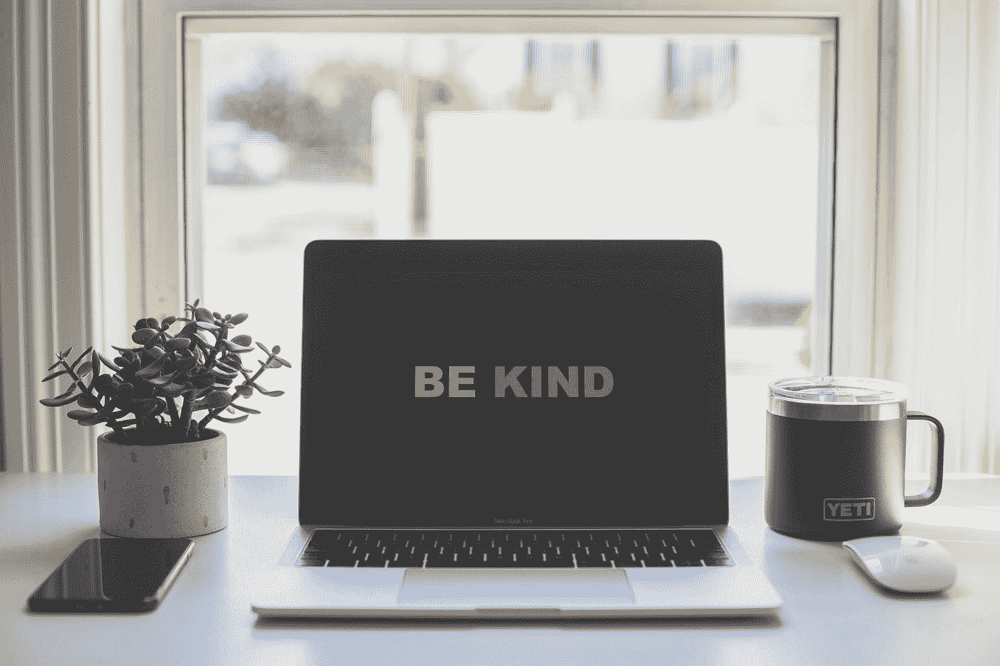

# 数据科学技术教我们成为更好的人的五种方式

> 原文：<https://towardsdatascience.com/five-ways-data-science-techniques-teach-us-to-be-better-humans-53fbc97d6d3f?source=collection_archive---------43----------------------->

## 自学的数据科学方法

照片由[戴恩·托普金](https://unsplash.com/@dtopkin1?utm_source=medium&utm_medium=referral)在 [Unsplash](https://unsplash.com?utm_source=medium&utm_medium=referral) 上拍摄

当涉及到在世界上传播善的时候，数据科学有一个极其混杂的名声。

[Marinus Analytics](https://www.marinusanalytics.com) 一直在使用面部和纹身识别算法来识别和营救人口贩运的受害者。然而，执法中使用的一些相同的图像识别技术在妇女和少数民族群体中具有极高的错误识别率[1]。

如果即使是计算能力远远超过人脑的专家开发的模型也包含偏见和误解，那么作为人类，我们怎么能希望在伦理上完美无瑕呢？

我们处理数据和从数据中学习的方式是通过多种经验方法发展起来的。这些方法试图将我们引向最好的量化结果。那么，为什么不将您的数据科学实践应用到自己身上，看看您能学到什么呢？

## 电子设计自动化(Electronic Design Automation)

先说一个缩写吧！EDA 指的是探索性的数据分析，或者换句话说，在深入研究之前仔细看看你有什么。EDA 的目的是揭示各种有趣的发现，这些发现可能会影响你努力工作的结果，比如你的人口中存在很大的偏差。BMC 公共健康发表的研究[2]发现，招募男性参与健康行为研究在历史上比招募女性更困难。EDA 让我们能够尽早发现这些偏差，以确保我们不会制定出让女性成为最大受益者的公共卫生战略。

这种谨慎的方法鼓励数据科学家从后退一步开始，并问“我被告知什么”,他们将及时得到更准确、校准更好、理解更好的解决方案。或者，正如我更喜欢的，“草率的结论导致蹩脚的解决方案”，这同样适用于复杂的人类情况。

## 克服偏见

将您自己的经验带到您的数据挑战中，并希望首先测试这些挑战，这是很自然的。对我们的数据提出问题的过程通常在特征工程期间进行，是形成数据科学解决方案的基础。虽然我们可能希望从我们的直觉开始，但考虑不寻常或不太可能的事情是否重要？这确保了解决方案反映了现实，而不仅仅是你对现实的感知。

就像机器学习算法完全通过过去的数据获得信息一样，我们的世界观无疑是由我们自己的生活经历塑造的。心理学家告诉我们，不仅有可能克服我们的认知偏见，而且当我们这样做时，我们能够做出更好的决定。

**协作**

编码被认为是孤独的追求。“[橡皮鸭](https://en.wikipedia.org/wiki/Rubber_duck_debugging)法甚至建议你用无生命的物体解决问题！然而，征求他人的意见至少可以用来确定你的旅行方向。在职业生涯早期能够与有经验的同事合作的学者被证明更成功[4]。被告知新的想法或信息可能会让人不知所措，与他人一起面对这些会促进更好的相互理解。或者至少，你的困惑有人陪伴。

**交叉验证**

通过使用[交叉验证](https://en.wikipedia.org/wiki/Cross-validation_(statistics))，我们希望了解我们的解决方案将如何在独立数据集上执行。这可能会突出不吸引人的属性，如过度拟合或选择偏差，我们将明智地纠正这些属性，因此人们普遍认为，在不同的数据折叠上交叉验证您的解决方案会带来更好的结果。同样，麦肯锡的一份[报告显示，管理董事会更加多元化的公司表现更好。](https://www.mckinsey.com/~/media/mckinsey/business%20functions/organization/our%20insights/delivering%20through%20diversity/delivering-through-diversity_full-report.ashx)

我们都有一个聪明的朋友，无论发生什么，他都会站在你这边；然而，当你真的需要被告知放弃不合适的合作伙伴/装备/算法选择时，你真的会更好地利用各种观点，而不是不断地在同质样本上交叉验证。

照片由[内森·杜姆劳](https://unsplash.com/@nate_dumlao?utm_source=medium&utm_medium=referral)在 [Unsplash](https://unsplash.com?utm_source=medium&utm_medium=referral) 上拍摄

**超参数调谐**

调整算法的超参数可以把一个好的解变成一个优秀的解。或者，在著名的数据科学竞赛网站 Kaggle 上，可以挤出一点点额外的模型准确性分数，以便您现在可以向竞争对手“[山姆卫斯·詹吉](https://en.wikipedia.org/wiki/Samwise_Gamgee)”展示谁真正统治了他们。虽然有许多技术可以帮助这一点，但本质上可以归结为转动一些旋钮，并使用您精心构建的交叉验证样本来告诉您它是否有效。

作为人类，完美是不可能的。我们有权犯错误并试图改正错误。用一个耐心的、深思熟虑的和多样的交叉验证样本包围你自己，你会发现自己能够不断迭代和改进。

在生活中，就像在数据科学中一样，从一个善意的天真方法开始，然后通过应用额外的信息来迭代它，以便朝着更好的方向努力，这并不可耻。我也毫不怀疑，当你认为自己或你的数据科学项目“完成”时，情况将会改变，需要新的校准。

[E] A. Pesah，A. Wehenkel 和 G. Louppe，[用于无似然推理的递归机器](https://arxiv.org/abs/1811.12932) (2018)，NeurIPS 2018 元学习研讨会

[1] Buolamwini，j .，Gebru，t .,“性别差异:商业性别分类的交叉准确性差异”机器学习研究论文集 81:1–15，2018 年关于公平性、问责制和透明度的会议

[2] Ryan，j .、Lopian，l .、Le，B. *等*天没有下雨男人:一项调查改善男性健康行为研究方法的混合方法研究。 *BMC 公共卫生* **19、** 814 (2019)。[https://doi.org/10.1186/s12889-019-7087-4](https://doi.org/10.1186/s12889-019-7087-4)

[3] Morewedge C. K .，Sellier A-L .，Scopelliti I .“去偏置培训改善现场决策”(2019)，APS。[https://doi.org/10.1177/0956797619861429](https://doi.org/10.1177%2F0956797619861429)

[4] Li，w .，Aste，t .，Caccioli，F. *等*早期与顶尖科学家合作预示着学术生涯的成功。*Nat Commun*10、 5170 (2019)。[https://doi.org/10.1038/s41467-019-13130-4](https://doi.org/10.1038/s41467-019-13130-4)