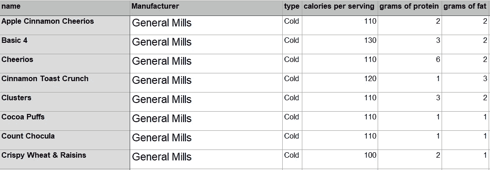
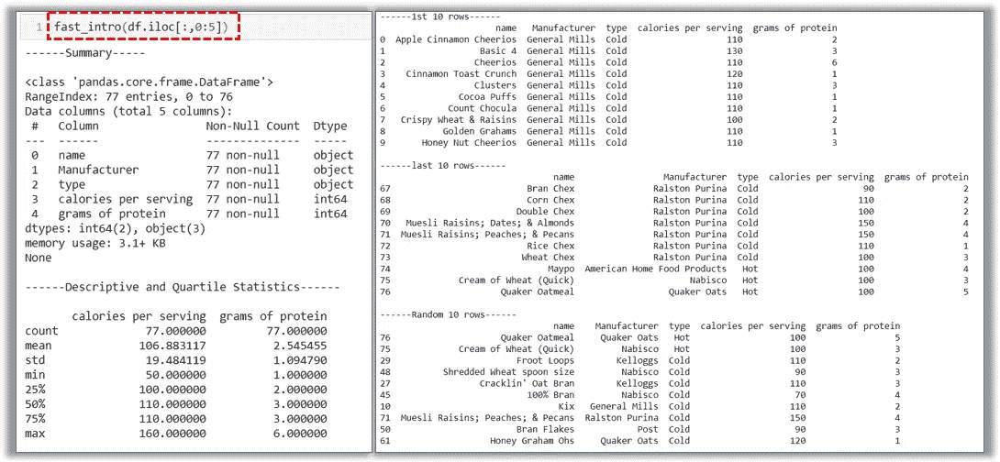
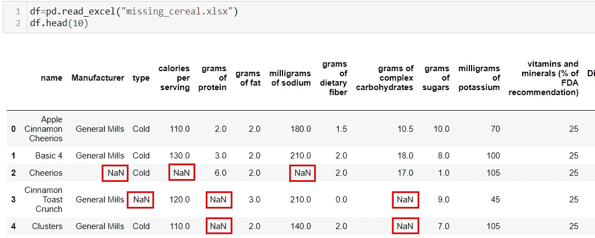
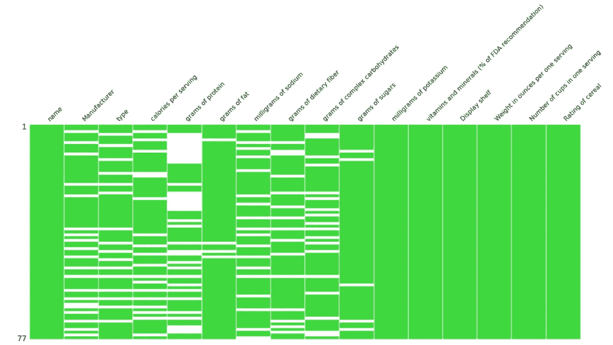
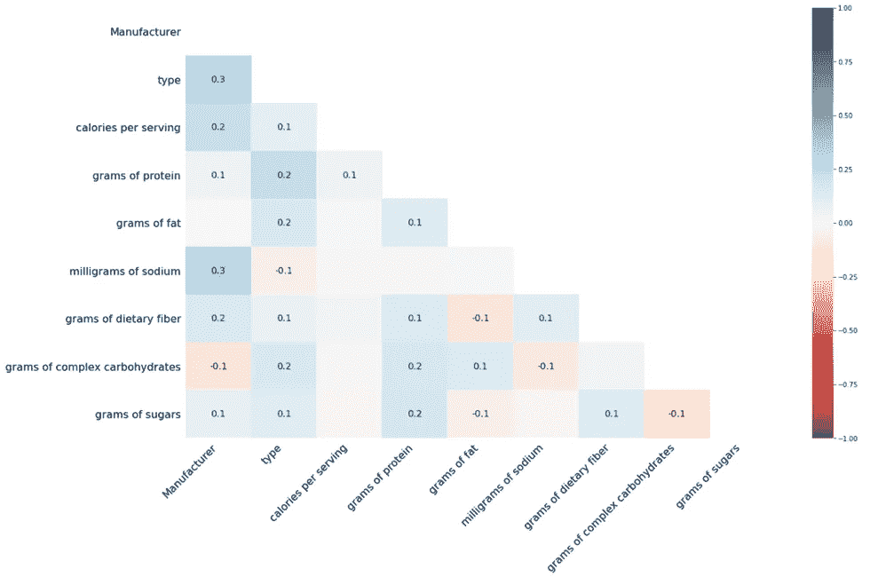
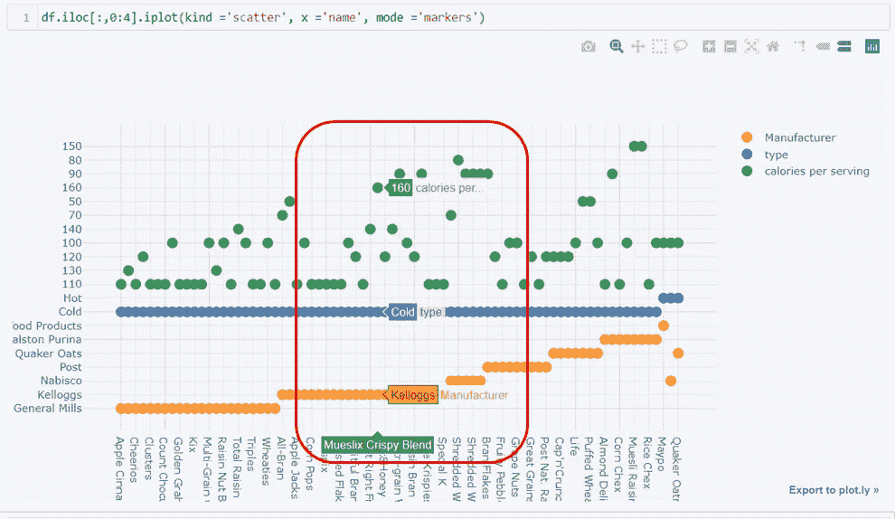
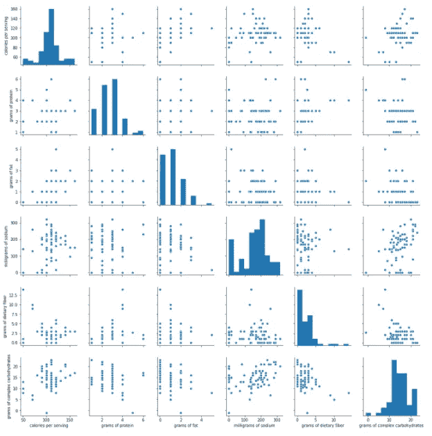
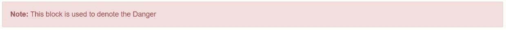

# 加快数据分析的五种方法

> 原文：<https://towardsdatascience.com/five-ways-for-faster-data-analysis-801a043bfea9?source=collection_archive---------32----------------------->

## 让它在竞争中脱颖而出


图片由[皮克斯拜](https://pixabay.com/?utm_source=link-attribution&utm_medium=referral&utm_campaign=image&utm_content=1647322)的 Gerd Altmann 提供

Python 是数据分析的基本和流行工具之一。但是，如果比赛中的每个人都在使用 Python 呢？如何加快分析速度？如何让你的数据分析脱颖而出🏁达到积分表的顶端？在这里，我要告诉你 5 个简单易用的方法来加速你的数据分析。

由于 Jupyter-Notebook 在大多数数据科学初学者中很受欢迎，我将使用 Jupyter-Notebook 向您介绍这些工具。在开始这个故事之前，我假设您已经了解了 Python 和 Jupyter-Notebook 的基础知识。

有了一些例子，一切都好了🏆所以，我选择了数据集[早餐麦片](https://data.world/makeovermonday/2020w36)，这是它的样子。



作者图片:早餐谷物数据集一瞥

没有花更多的时间介绍，我直接进入 5 个工具池，以加快您的数据分析

让我们导入所有需要的包，并用下面的代码块将数据读入 Jupyter-Notebook

```
import pandas as pd
import df= pd.read_excel("cereal.xlsx")
```

# 没有熊猫概况的统计数据

数据分析过程从理解可用数据开始。这使您能够了解变量的数据类型、缺失值、每个变量或列中的唯一值，以及数字列的平均值、标准差、最小-最大值等基本统计数据。对于这些操作，熊猫概况可能是最好的解决方案。然而，根据 stackoverflow.com 的评论，它的安装并不简单。

所以，让我们坚持熊猫的基本功能🎯

用户定义的函数⚡️将在这里帮助你，你可以在你的项目的任何后期阶段修改这些函数。

这就是你如何把所有用户定义的函数组合起来。

```
def fast_intro(df):
    print("------Summary-----\n")
    print(df.info())
    print("\n------Descriptive and Quartile Statistics------\n")
    print(df.describe())
    print("\n------1st 10 rows------\n")
    print(df.head(10))
    print("\n------last 10 rows------\n")
    print(df.tail(10))
    print("\n------Random 10 rows------\n")
    print(df.sample(10))fast_intro(df)
```

输出看起来会像这样—



作者图片:上述代码的统计输出示例

🏆将所有基本功能组合在一个功能中的优势:

1.  它让你的代码保持干净
2.  它提高了代码的可读性
3.  它将所有的统计数据保存在一个地方，可以通过一条线访问

📌您可以创建多个这样的函数，并将它们全部放在同一个 python 文件中。这个文件可以是你的自定义包，它可以被导入到任何项目和功能可以直接使用。

# 可视化缺失值和缺失号

原始数据经常遇到的一个问题是*缺少值。*如果数据集在特定的行-列对中没有任何值，则它有一个缺失值。当这样的数据集被读入 pandas 数据帧时，缺失的值用`NaN`表示



作者图片:缺失值就是这样读入熊猫数据帧的

对于这个特殊的例子，我创建了另一个数据集——missing _ gratey . xlsx

熊猫提供功能如熊猫。DataFrame.isnull()，熊猫。DataFrame.isna()来标识空值。然而，软件包`**missingno**` 将整个功能提升到了一个新的水平。它可视化了数据帧中缺失值的分布。

同样，第一次使用时，你需要安装`missingno`包

```
pip install missingno
```

安装完成后，只需将其导入到您当前的笔记本中，您就可以开始探索了

```
import missingno as msno
%matplotlib inline
```

让我们来看看这两个`missingno`可视化

```
msno.matrix(df)
```



作者图片:数据框中缺少值

在上图中，数据集中的每一列都有一个绿色列，白色水平线表示缺失的值。

软件包`missingno`的另一个可视化工具是热图——它显示了两列之间的缺失关联。相关值可以解释为，

> *value = 1* :如果一个变量出现，那么另一个变量很可能会丢失
> 
> *value = -1* :如果一个变量出现，那么另一个变量最有可能出现
> 
> *value = 0* :缺失值的出现之间没有依赖关系

包`missingno`中的热图就是这样实现的—

```
msno.heatmap(df)
```



作者图片:缺失关联热图

🏆仅仅一行代码就能给你如此有趣的可视化效果，并使你的数据分析更快。只需一句话就能提供大量信息，帮助您快速⏰决定处理缺失值的策略。

对如何直接从网页中收集数据感到好奇？？这是一篇关于网络抓取的有趣的 4 分钟阅读材料。

[](/web-scraping-make-your-own-dataset-cc973a9f0ee5) [## 网页抓取—制作您自己的数据集

### 从网页中提取数据并将其存储到 excel 中—只需 4 个简单的步骤

towardsdatascience.com](/web-scraping-make-your-own-dataset-cc973a9f0ee5) 

# 与 Plotly 和袖扣的互动情节

除了简单的静态图表和熊猫数据框的功能`.plot()`,你还可以使用袖扣包包含互动和吸引人的图表。

Plotly 是袖扣的先决条件，需要在安装袖扣之前安装。同样，这些安装只是首次使用的一部分。

```
pip install plotly
pip install cufflinks
```

一旦这些包进入你的系统，你需要做的就是用下面的语句导入它们

```
import cufflinks as cf
import plotly.offline
cf.go_offline()
```

一旦包被导入，就该开始了-

```
df.iloc[:,0:4].iplot(kind ='scatter', x ='name', mode ='markers')
```

这是你的输出结果



作者图片:带袖扣的散点图

📌只需将光标移动到不同的散乱点上，就会弹出上图红框所示的数据标签。类似地，所有其他的绘图、图表都可以实现。

🏆您不需要在代码中添加任何额外的语句来获得这样的交互式绘图，它使您的数据可视化从其他 Matplotlib 图表中脱颖而出。

# 带有 Seaborn 的两两二元分布

一旦处理了丢失的值和其他与数据质量相关的问题，下一步就是探索性数据分析(EDA)。它揭示了隐藏的模式，单个变量的分布(*单变量分布*，以及两个变量之间的关系(*双变量分布*)。

seaborn 软件包中的 Pair Plot 是一个方便易用的工具，可以用来理解单变量和双变量分布。

让我们看一看——

```
import seaborn as sns
sns.pairplot(df)
```

在谷物数据集中，配对图看起来像这样—



作者图片:Seaborn Pairplot

在上面的配对图矩阵的对角线上，可以看到单变量分布，所有非对角线条目显示不同列对之间的双变量分布。

📌只需选择您想要分析的变量，将其传递给`sns.seaborn()`，并在几分之一秒内获得如此有趣的可视化效果。

🏆快速配对包`seaborn`中的图⏰创建强大的数据可视化，以识别数据集中的趋势。

# 创造性地使用降价——使用警告框

Markdown 是一种类似于 HTML 的标记语言。在任何数据分析项目中，markdown 用于讨论分析流程，在 Jupyter-Notebook 中生成报告，以及在 markdown 文件(如 README.md)中创建项目报告📋

❓:但是如果每个人都使用相同的减价格式，那么你的数据分析怎么会比别人看起来更好呢？

🏆这里有三种创造性的方法来使用减价文本，让你的分析看起来更有创意。在创建这样的警告框之前，将一个单元格转换为 markdown 并执行下面提到的代码。

1.  红色警报框

此框用于表示*危险*或重要性，如代码中的重要声明。

```
<div class="alert alert-block alert-danger">
<b>Note:</b> This block is used to denote the Danger
</div>
```



作者图片:红色警戒框

2.绿色警告框

此框用于表示*成功*，如成功执行一段代码。

```
<div class="alert alert-block alert-success">
<b>Note:</b> This block is used to denote the Success
</div>
```


作者图片:绿色警示框

3.黄色警告框

此框用于表示*警告*，如需要安装额外的软件包或在应用功能前处理缺失值。

```
<div class="alert alert-block alert-warning">
<b>Note:</b> This block is used to denote the Warning
</div>
```


作者图片:黄色警告框

4.蓝色警报框

这个框用来表示*提示*，注释等关于分析的附加信息。

```
<div class="alert alert-block alert-info">
<b>Note:</b> This block is used to denote the Information
</div>
```


作者图片:蓝色警告框

总结一下，

为了满足对数据驱动的洞察力的持续需求，需要尽可能快地分析原始数据。更快、更有洞察力的数据分析意味着有更多时间专注于其他任务。考虑到这一点，我向您展示了 5 个现成的代码片段，以即兴发挥您的数据分析。

感谢您的时间和阅读！

我希望这些数据分析技术对你有用。请随时添加您的反馈。