# 新冠肺炎数据平滑的 5 种错误方法

> 原文：<https://towardsdatascience.com/five-wrong-ways-to-do-covid-19-data-smoothing-1538db6ff182?source=collection_archive---------22----------------------->

## 新冠肺炎的大部分数据分析是基于有缺陷的平滑技术

您可能认为原始数据比平滑数据更准确。但在新冠肺炎疫情的情况下，平滑数据减少了报告异常，比原始数据更准确地表示了时间。但前提是平滑处理正确。

# 错误方法 1:不使用平滑数据来揭示趋势

原始的州级数据是嘈杂的，很难看出原始数据的趋势。以下示例显示了来自夏威夷的当前原始数据报告。浅蓝色的线代表阳性测试，红色的线代表死亡。

测试是上升还是下降？从这种数据描述中几乎无法判断。

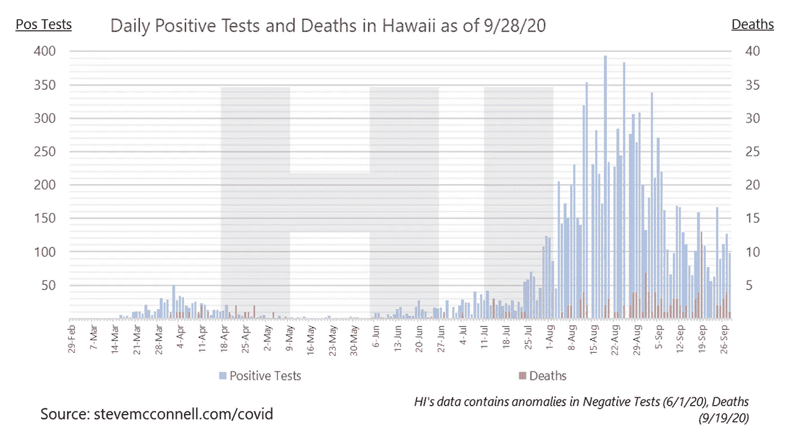

相比之下，下图告诉你阳性测试目前是上升还是下降了？从视觉上看，很明显，大约一周以来，阳性测试一直持平或略有增加。

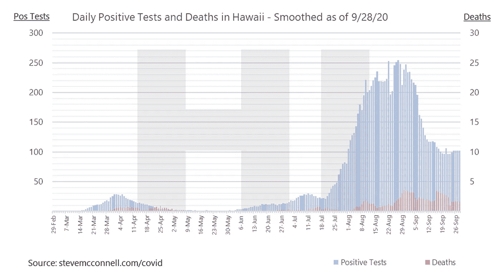

# 错误方式 2:不使用平滑数据来减少州数据校正的影响

大多数州已经在疫情过程中对其数据进行了校正，并且在许多情况下，州在一天之内将数周或数月的校正值全部转储到数据库中。

纽约的数据(下图)包括了他们对 5 月初死亡数据的一个修正(高红线)。如果你从字面上理解这个数据，一天内有 1000 人死亡。但是 1000 个人并没有真的在一天内死去；纽约刚刚报道了一天内如此大规模的调整。这种峰值极大地破坏了对包含峰值的时间段的分析。

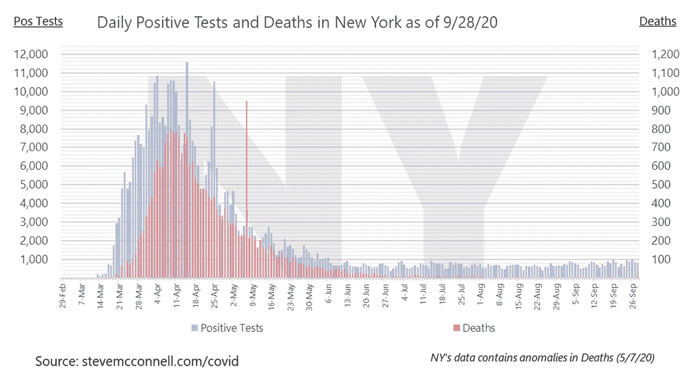

平滑后的数据(如下)仍然会受到这种校正的影响-您可以从 1000 死亡校正中看到 5 月份的驼峰-但是平滑后的数据受峰值的影响较小。

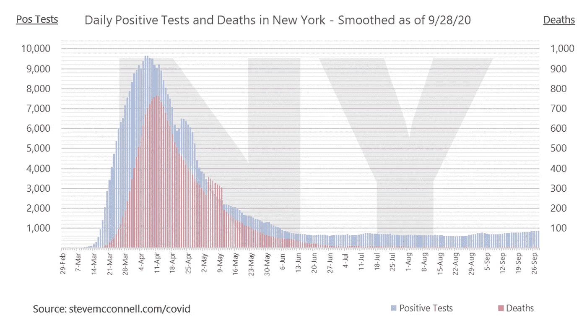

# 错误方式#3:使用 7 天以外的平滑周期

许多州并不每天报告结果。许多国家显示出在某些日子少报而在其他日子多报的周循环。例如，我所在的州(华盛顿)在周日少报，然后在接下来的几天多报。你可以在下图中看到华盛顿每周少报和多报的节奏。

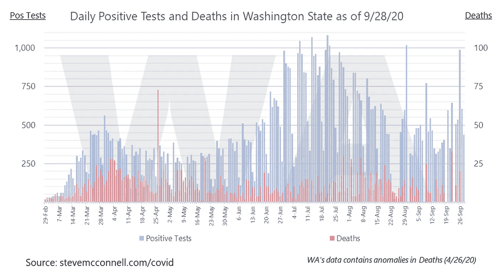

短于 7 天或长于 7 天的平滑期会对少报或多报结果的天数造成不成比例的影响。以下是全国范围内工作日与趋势的典型偏差:

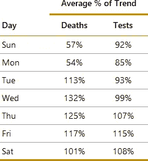

作为为什么需要 7 天周期的一个例子，假设对死亡数据的平滑是在周六到周一的 3 天基础上完成的。在这种情况下，5 天期间将是趋势的 71%,因为周日和周一的典型漏报。

类似地，如果对从星期二到星期四的 3 天进行死亡平滑，那么这 3 天将是趋势的 124%。需要包括整整 7 天，以获得该周数据的准确情况。

从视觉上看，这表现为平滑后的数据看起来不太平滑。以下是最近美国 7 天的平滑数据，看起来相当平滑:

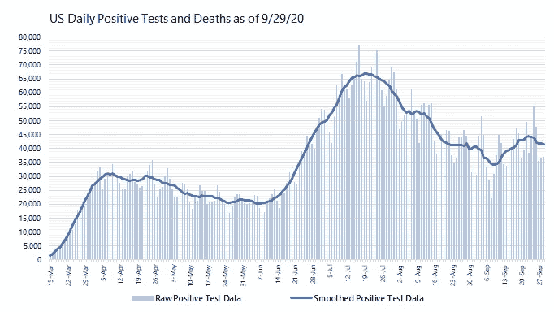

这是在 5 天基础上平滑的相同数据，看起来不是很平滑:

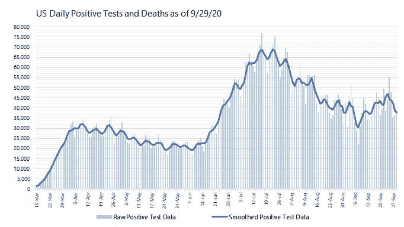

您可能会认为 7 天平滑比 5 天平滑更平滑的原因是因为它的周期更长。这是不正确的。长于 7 天的周期具有与短于 7 天的周期相同的问题:它们重复计算低于平均值或高于平均值的天数，因此降低了准确性。以下是 9 天平滑后的相同数据:

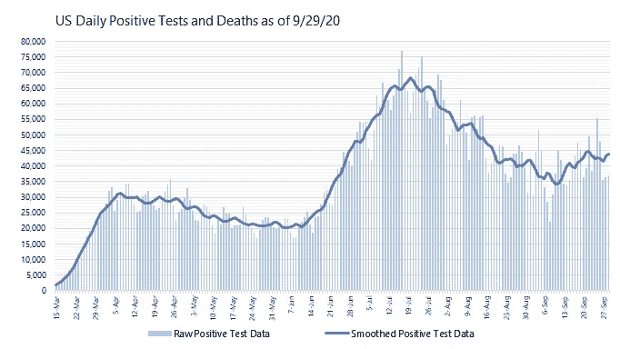

9 天平滑比 5 天平滑，但比 7 天粗糙。平滑问题是每周周期，而不是纯粹的天数本身。

7 天的倍数的平滑周期没有这个问题。7、14 和 21 天的平滑周期都可以是精确的。

# 错误方法#4:使用滞后平滑周期

一些平滑技术使用 7 天平滑期，但是它们在滞后的基础上计算 7 天平均值。换句话说，他们通过平均天数 *n* 、 *n-1* 、 *n-2* 、 *n-3* 、 *n-4* 、 *n-5* 和 *n-6* 来计算天数 *n* 的值。

在回顾的基础上进行平滑意味着数据的平均值基于 3.5 天前的中点。声称显示第 *n* 天的数据实际上显示的是第 *n-3.5* 天的数据。

在显示原始数据和平滑数据的图表上很容易发现这种现象，如下图所示:

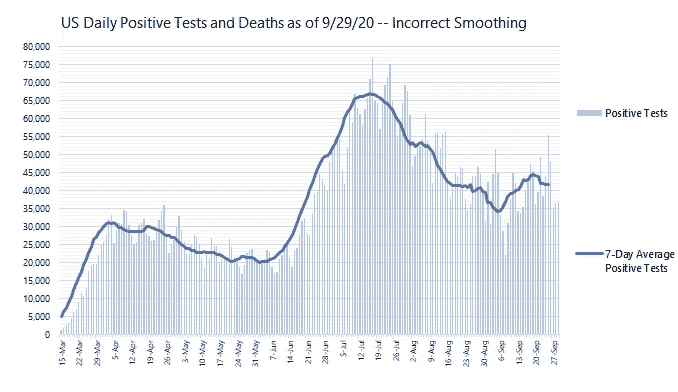

如果你研究一下图表，你会发现平滑线滞后于原始数据线。波峰和波谷有 3-4 天的时差。如果平滑处理得当，平滑线将位于原始数据行的正上方，如下所示:

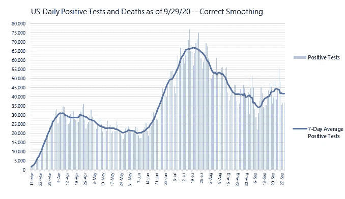

7 天平滑需要基于记录日期前 3 天、记录日期、记录日期后 3 天，例如基于天数 *n-3* 、 *n-2* 、 *n-1* 、 *n* 、 *n+1* 、 *n+2* 、 *n+3* 。

# 错误方式 5:没有有意识地处理最近 3 天的事情

如果记录的日期是今天，这意味着第 *n+1* 、 *n+2* 和 *n+3* 天还没有发生。我们丢失了 3 天的前瞻性数据。

同样的问题也适用于昨天，它丢失了 2 天的前瞻数据，以及前天，它丢失了 1 天的数据。

因此，我们需要一个平滑最近 3 天的计划，因为只有部分平滑数据可用。有几个选项可用:

*   将今天的数据预测到未来 3 天，并根据预测进行平滑处理。
*   当你没有展望未来的日子时，换成回顾过去。今天使用最近 7 天。昨天使用今天加上最近 6 天。前天使用今天、昨天和最近 5 天。之前的天数使用正常的 7 天平滑。
*   最近几天基于部分时段而非 7 天时段的平滑。今天是根据今天加上之前的 3 天进行平滑的，总共 4 天。昨天是基于 5 天平滑的。前天是按 6 天平滑的。之前的所有日子都可以用正常的 7 天来平滑。
*   不要提供最近 3 天的平滑数据。

最后一种方法是最正确的，但是它限制了利用最近几天的能力。

前三种方法有可能在最近几天的平滑中引入误差。但是，这些错误是暂时的，随着完整数据的出现，它们将在接下来的 3 天内得到纠正。

这方面的失败模式不是有意识地选择最适合这种情况的方法。制定一个计划，并仔细考虑当你的前瞻时间用完时，转向向前预测、向后看或使用不完整数据的影响。

# 摘要

平滑处理得好可以提高新冠肺炎数据的准确性和可用性。平滑处理得不好会给数据带来误差。

不正确的平滑技术可能是新冠肺炎数据分析的盲点。幸运的是，这个特殊的盲点很容易纠正。

# 更多详情请访问新冠肺炎信息网站

我领导的团队将 *CovidComplete* 的预测数据输入疾病预防控制中心的[集合模型](https://www.cdc.gov/coronavirus/2019-ncov/covid-data/forecasting-us.html)。对于这些图表的更新，更多的图表，美国和州级的预测，以及预测评估，请查看我的新冠肺炎信息[网站](https://stevemcconnell.com/covid)。

# 我的背景

在过去的 20 年里，我专注于理解软件开发的数据分析，包括质量、生产率和评估。我从处理噪音数据、坏数据、不确定性和预测中学到的技术都适用于新冠肺炎。