# 使用 Alpha-Beta Estimator- Python 修正您的测量值

> 原文：<https://towardsdatascience.com/fix-your-measurements-with-alpha-beta-estimator-python-6cddfb3ac24?source=collection_archive---------24----------------------->

## 用 python 实现的数学模型，用于追踪位置和减少数据中的噪声

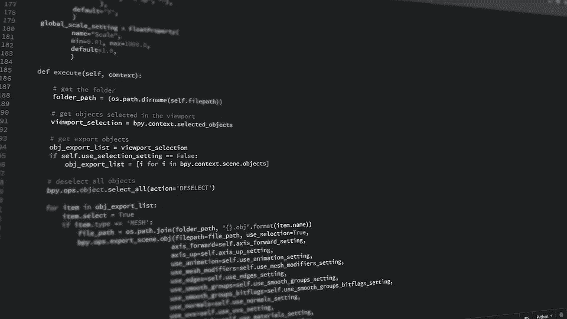

# 什么是阿尔法-贝塔滤镜？

就其核心而言，alpha-beta 滤波器是一个简单而强大的估计器，它使我们能够修改样本数据以减少噪声的影响，并准确确定样本的真实值，同时还使我们能够预测其下一个值。

它主要用于跟踪飞机、温度、位置等。它与卡尔曼滤波器密切相关，但它们有其核心区别，我们不会在本文中深入探讨，如果您对这个问题感兴趣，请发表评论。

# 演示问题

假设我们想要准确预测飞机的位置，但我们的输入中有采样噪声，必须提出两个问题:

*   我们怎样才能消除噪音？
*   平面的速度在样本之间是半常数，我不能只用一个线性函数吗？

让我们用一些图来表示这个问题，我们正在追踪一架在完美的 sin(x)波中飞行的飞机，这是原始数据，以及他的运动在一个线性函数中会是什么样子

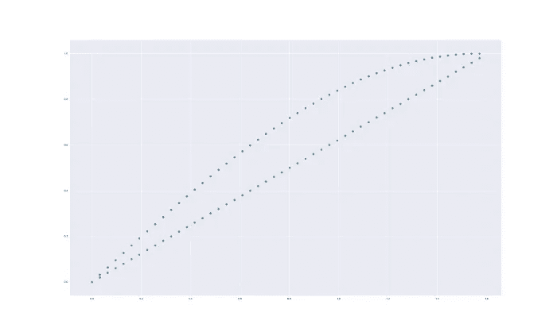

蓝色—原始数据，绿色—线性函数

现在这是错误的，你可能会说，你可以做得更好，我可以从每两个蓝点创建一个线性函数，更准确地表示平面运动函数。虽然这是真的:

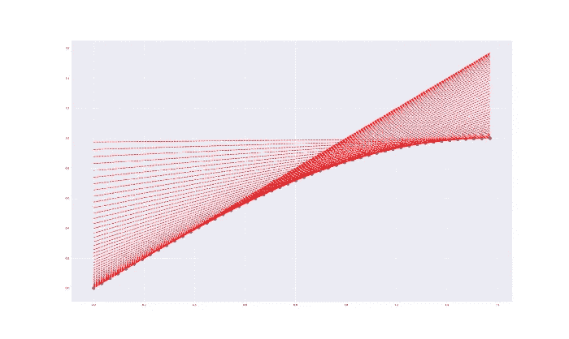

蓝色为平面数据，红色为点与点之间的线性函数

这没有考虑到两个问题

*   将使我们的衍生产品变得无关紧要的少量数据
*   噪音数据

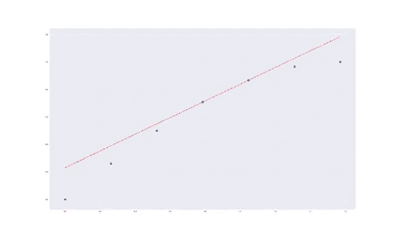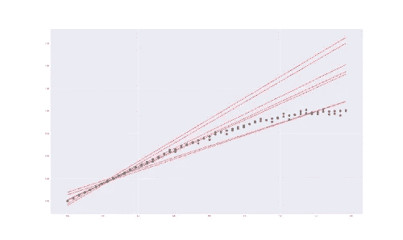

左边—少量数据，右边是有测量误差的数据

这是非常明显的，即使 sin(x)导数在低数值时接近于线性线，但由于测量误差，一些红线完全倾斜。

# 该算法

这个算法本身非常简单，它被称为 alpha-beta 是有原因的，它有两个参数，alpha 和 beta，每个参数控制其他东西。

这个想法是预测平面的下一个点在哪里，与平面的样本点进行比较。

*   α将是量化测量误差的因子
*   β将是量化速度调整的因素。

β和α应该在 0 和 1 之间，否则，它会放大误差效应，α和β没有正确或错误的数字，只有符合你的数据的数字。

# 选择α和β

更快变化的模型将需要更高的β，以适应其新的速度，而具有高β的高噪声数据会损害估计器的准确性。

有噪声的数据也需要减少α，以减轻噪声的影响。

# 在实践中

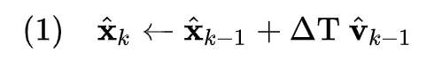

我们用(δ时间*速度)+上一个位置来预测下一个位置。

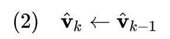

然后我们假设我们的上一个速度，也是我们的当前速度。

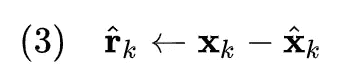

然后我们计算样本位置和预期位置之间的误差。

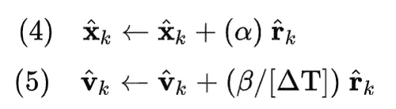

1.  最后，我们使用 Alpha 来减少误差
2.  修正速度的β+误差

# 实践中的代码— Python

我已经写了一个类来演示这个算法的实现，注意，由于图形的原因，我已经记录了一些不需要的数据，你可以减去这些数据。

# 结果

首先，让我们创建一个示例数据列表:

然后让我们启动一个跟踪器，并将所有样本添加到跟踪器中。

最后，让我们看一些图表，看看它看起来像什么:

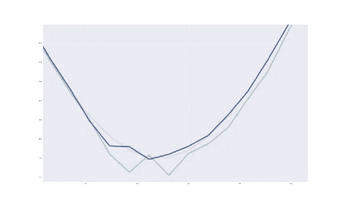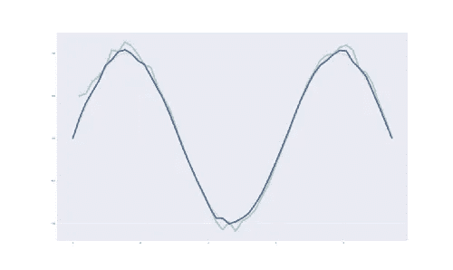

红色-实线，蓝色-估计值，绿色-下一个数据点之前的预测

蓝线是我们的估计，几乎完全精确到我们的数据，没有任何干扰！

我们可以看到一些东西:

1.  如果你有大量的数据，开始的速度没那么重要，否则，你可能不得不用一个激进的β值
2.  估计器和真实位置之间的距离相对较小。
3.  除了主要的速度变化，该模型的预测能力非常好，有了大量的数据，或者优化 beta 和 alpha，你可以获得更好的结果。

最后，我还想说明估计量也更接近真实值，即测量误差

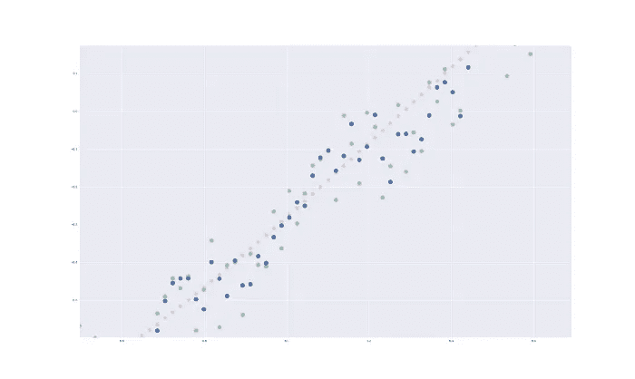

蓝色-我们的估计，绿色-样本，红色-纯数据

> *我们可以看到，我们已经改进了样本数据，并且估计目标的真实位置更加接近其真实值。* 简单一句话——蓝色比绿色更接近红色

在所有这些之后，我们有:

*   比样本数据更好地估计目标的位置
*   每个给定时间的目标当前状态、速度和位置
*   在给定时间准确预测下一个样本位置的能力。

# 最后的想法

阿尔法贝塔过滤器，是一个简单而有效的估计器，跟踪随时间变化，对一个不固定的数学模型，它让你消除误差，预测估计器状态的未来结果，在一个非常简单的方式。

我希望你喜欢它！