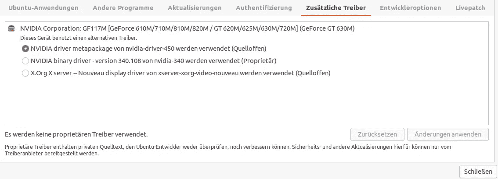
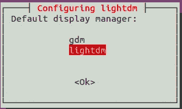
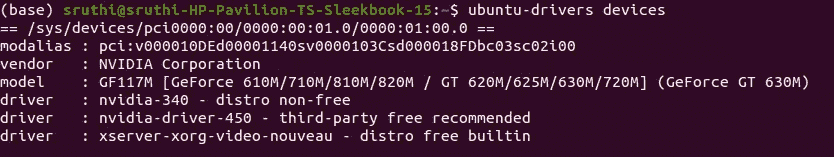

# 修复损坏的 Ubuntu GUI

> 原文：<https://towardsdatascience.com/fixing-a-broken-ubuntu-gui-5ce3656922f5?source=collection_archive---------3----------------------->

## 从不良驱动程序安装中吸取的教训


亚历克斯·库利科夫在 [Unsplash](https://unsplash.com?utm_source=medium&utm_medium=referral) 上的照片

我经常在 Windows 和 Ubuntu 之间切换。我最近注意到，我有一段时间没有使用我的 Kubuntu PC 了，在这段时间里它积满了灰尘。我决定加快速度。受够了 Kubuntu，我换到了 **Ubuntu 20.04** ，安装起来并不那么痛苦，你知道 GUI 支持，等等。

后来，当安装速度太慢时，麻烦就来了。在修复这些错误的过程中，我经历了太熟悉的 NVIDIA，light-dm 问题，这是我作为 Ubuntu 新手必须经历的几次。

我决定把它一劳永逸地记录下来，给每个像我一样饱受 Ubuntu 新安装之苦的人。

# SLOO…ooo www Ubuntu？

这可能是因为 Ubuntu 在新安装时默认使用 XOrg 驱动程序。您可以在“附加驱动程序”下的软件更新应用程序中看到这一点。如果选择 Xorg(截图第三个选项)，很可能不是最好的。(在我的例子中，使用了大部分 CPU)。



作者截图:请原谅我的德语，但你仍然可以从他们的地理位置中识别选项

为了解决这个问题，您现在必须:

1.  安装显卡的专有驱动程序(我的是 NVIDIA GeForce GT)
2.  为您的显卡找到最新稳定版本的驱动程序并安装它们

(你一试 1 就知道要做 2 了，失败了(！)

如果我为你工作——太棒了，做一个

```
sudo reboot
```

你可以走了！

# 如果您的驱动程序安装失败并且 GUI 崩溃

如果您的 GUI 由于某种原因挂起，或者进程没有成功完成，切换回 Xorg 并重新安装稳定的驱动程序。如果你不这样做，你的 GUI 在重启时会变得一团糟。

在我的例子中，重启失败了。它把我带到一个空白屏幕上闪烁的光标，就像这样:


:(图片作者

为了走出这个深渊，按 ctrl + F1(或者 F2，3，4，5，6，7)直到其中一个起作用。

```
ctrl + F1
```

您将从那里进入一个常规的命令行界面。使用您的用户名和密码登录。然后，执行以下命令:

```
sudo apt-get purge lightdm
sudo apt-get update
sudo apt-get install lightdm
dpkg-reconfigure lightdm
sudo reboot
```

这是因为 Ubuntu 的显示是由 lightdm 包管理的，失败了。您正在清除并重新安装它以修复这些问题。

当您重新配置 lightdm 时，系统会询问您是想继续使用 lightdm 还是换成 GDM3。我留在了 lightdm，因为我更熟悉(网上很多人抱怨 gdm 是一个管理 NVIDIA 驱动程序的经理)



作者截图:lightdm 重新配置

此时，我欣喜若狂，因为一切似乎都正常，我来到了我的登录屏幕。

但是当我输入我的证书时，我的电脑决定一次又一次地询问我的证书。我陷入了一个登录循环！！

*注意:如果您的 dpkg 重新配置在这一行失败，*

```
dpkg-reconfigure lightdm
```

运行这个，你应该没问题:

```
sudo dpkg --configure -a
```

# 登录循环和出路

如果你不能登录到你的帐户，但图形用户界面是回来了，你必须修复你的驱动程序从命令行(你打破了他们在第 1 步！！！)

所以现在，按 Ctrl+F3 重新控制你的命令行。(使用 Alt+箭头键，可以在屏幕之间切换:登录、命令行等。).使用您的凭据登录。

```
Ctrl+F3
```

这里有两个可能的故障源:

1.  。x 权限混乱
2.  NVIDIA 驱动程序被搞乱了

在我们的案例中，我们知道是司机。如果您想检查您的权限，请执行以下操作:

```
ls -lA
```

现在寻找这条线:

```
-rw — — — — 1 user user 79 Sep 3 19:56 .Xauthority
```

如果不是您的用户名必须在哪里，您会看到:

```
-rw — — — — 1 root root 79 Sep 3 19:56 .Xauthority
```

你必须:

```
chown username:username .Xauthority
```

你有你的权限，你可以登录！

如果这不是问题所在，请重新安装驱动程序:

```
sudo add-apt-repository ppa:graphics-drivers/ppa
sudo apt update
```

现在寻找可用的驱动程序:



作者截图

我用的是第三方免费推荐的驱动。安装它(替换最后的*你的-Nvidia-driver-这里的*与它的实际名称从上面的结果):

```
sudo apt install your-nvidia-driver-here
```

如果这成功了，不仅你的 GUI 回来了，而且你的显卡硬件也有了更好的驱动程序！

做一个:

```
sudo reboot
```

这个应该行！

我的电脑现在工作起来就像一台普通的电脑，并且不需要太长时间就能启动。如果你有类似的问题，希望这有所帮助！