# 修正新冠肺炎病例数和死亡人数漏报

> 原文：<https://towardsdatascience.com/fixing-covid-19-case-number-and-death-toll-underreporting-bd9422c88cc4?source=collection_archive---------33----------------------->

## [现实世界中的数据科学](https://medium.com/towards-data-science/data-science-in-the-real-world/home)

## 或者，为什么有些国家的数字可能是报告数字的 10 倍

由 Shutterstock 上的 Corona Borealis 工作室制作

在这个充满挑战的时代，我们中的许多人不断被新冠肺炎新闻中相互矛盾的更新和统计数据所淹没。你可能已经看到了最近的头条新闻，如*、【武汉再访其电晕死亡人数高达 50%】、*为什么*、*流行病学家仍然不知道新冠肺炎的死亡率*。*

这种含糊不清和相互矛盾的信息会导致沮丧、焦虑、困惑和日益增长的恐惧。作为一名科学家，我发现获得更清晰的理解有助于我们从恐惧转向有意识的行动。为了帮助解决这个问题，我创建了一个简单直观的应用程序(可在[https://pharmhax.shinyapps.io/covid-corrector-shiny](https://pharmhax.shinyapps.io/covid-corrector-shiny/)获得)和一个演练来帮助你理解这些数据:

*   首先，我将为你描绘一幅图画来解释我为什么发展这个方法。也许你会认同这个思考过程，也许你不会，但围绕它的潜在现实我们都能认同，因为，从今天起，它已经变得不可避免。
*   第二，我会告诉你为什么不幸的是，这些数字可能比报道的要高得多。
*   第三，我会告诉你如何确定这些数字的精确度。
*   第四，我将带你浏览正确的数字，并为你指出我为你创建的应用程序，以便你能够自己检查这些数字——这里需要注意的是**你不需要任何专业知识来使用应用程序**，你需要的只是一个浏览器(或者你的拇指，如果你坚持在你的手机上使用仪表板风格的应用程序)。我还分享了 GitHub 库，以防您想使用代码或扩展它。
*   第五，*我会请你将这篇文章分享给你的网络，如果你知情的话，请在*[*data @ neuro synergy . ai*](http://data@neurosynergy.ai)*分享你可能拥有的关于漏报的任何数据*。这将提高本文中提出的纠正方法的准确性，以便我们作为一个群体能够更好地准备和应对。

# 低细节渲染

商店里的长队、戴口罩的指南、呆在公寓里的要求以及社交距离——你已经看到了这些，但当你看到报告的冠状病毒感染数量(取决于你所在的位置)时，你可能会得出结论，你周围应该只有极少数人可能患有冠状病毒，所以为什么要大惊小怪呢？

重要的是要明白，忽视这些指导方针确实是危险的，在我看来，问题的关键是看冠状病毒病例(以及死亡人数)是否被低估了。如果确实有更多的人被感染，你可能会开始明白为什么出现在公共场合的风险比看起来要高。

剧透:这些数字确实比报道的要高得多，所以如果你只读到这一点，请呆在家里……休息的时候一定要读完剩下的部分！

好的。这幅画已经被勾勒出来了，至少是大致的轮廓。让我们进入更深层次的细节。

# 新冠肺炎——2020 年(或许也是 2021 年)的病态表演秀

你可能最近看到了很多关于冠状病毒的文章，特别是关于它可能被严重低估的文章。我在上面给你留了一些链接，但如果你想看到更多，只需在谷歌中键入“冠状病毒漏报”。你会惊讶于这种漏报的范围有多广。那么，如果漏报不是秘密，为什么对此无所作为，为什么我们看不到 T2 真实的 T3 数字？

一个原因是真实数字根本无法测量。

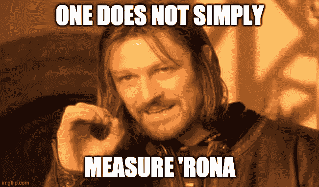

罗纳具有很强的传染性，R0(将从受感染个体身上感染病毒的人数)估计为 2-3，随着激烈的讨论，这个数字甚至会更高——根据洛斯阿拉莫斯国家实验室的一个小组[最近的一篇文章](https://wwwnc.cdc.gov/eid/article/26/7/20-0282_article)，它接近于 5。无论如何，它比 R0 约为 1.3 的普通流感要高得多。

但是为什么我们甚至没有新冠肺炎 R0 的精确估计呢？其背后最可能的原因与导致冠状病毒病例和死亡病例系统性漏报的原因相同。让我们来看看其中的一些。

遗漏报告的一个主要原因是新冠肺炎普遍无症状。疾控中心主任提供的无症状携带者(仍具传染性)比例的最近估计为 25%。无症状携带者不会注意到他们的感染，因此不会对报告的病例数有所贡献，所以这些病例数被不适当地降低了这个分数。然而，根据发表在《科学》上的一项[研究，数量惊人的冠状病毒病例被认为是轻微的，以至于大约 85%的病例轻微到不值得医生就诊，导致这些病例没有记录。85%!从表面上看，这确实是一个令人毛骨悚然的数字。这第一个(巨大的)漏报来源将主要影响病例的报告，以及冠状病毒动力学(如 R0)的估计，但它不会影响报告的死亡人数，因为这些将来自最严重的病例，最有可能在急诊室结束。](https://science.sciencemag.org/content/early/2020/03/24/science.abb3221)

我们现在转换话题，关注死亡报道。冠状病毒导致的死亡确实可能被低报，这是因为次要的死亡原因、当地的报告做法以及更多的各种情况。

让我们从上面最后一个也是最深奥的类别开始，死亡漏报杂记。《华尔街日报》的一篇文章提供了一个例子，它讲述了意大利养老院发生的几起大规模死亡事件，多达三分之一的住院医生在 3 月份死亡，而这些死亡事件中没有一例是由冠状病毒引起的。[其他各种各样的例子](https://www.nytimes.com/2020/04/17/us/coronavirus-death-rate.html)将源于发生在家中的死亡——这些似乎也普遍报道不足——以及由于测试短缺而没有进行冠状病毒测试的患者的死亡，因此没有被报道为 Covid 受害者。

次要死因是冠状病毒相关死亡漏报的另一个原因，其中死亡可归因于下游原因，如呼吸衰竭，而不是新冠肺炎作为呼吸衰竭背后的原始原因。

当地报告惯例可能是未报告 Covid 死亡的另一个来源。一个例子来自波兰，在波兰，用于报告冠状病毒死亡的两种医学代码中只有一种被指定用于政府发布的官方指南——U07**. 1**，这是 ICD-10 代码，表示通过实验室检测确诊的新冠肺炎病例，而 U07 **.2** ，这是用于因临床表现而怀疑感染冠状病毒的患者的代码，不在官方指南范围内。在缺乏临床测试的情况下，大胆猜测一下这两种情况中哪一种更常见。这样，所有本应通过 U07 **.2** ICD 代码确诊死于冠状病毒的患者都不会出现在官方报告的数字中。

好的，冠状病毒病例报告不足，冠状病毒死亡也是如此——我们能计算出真实的数字吗？

# 怎么做

本节将详细介绍方法，即支持我们应用程序的代码如何纠正报告的数字。如果您现在想跳过“如何做”并看看这些方法的实际应用，请随意进入下一节，在这里将纠正方法应用到报告中。

几周前，我在 LinkedIn 上偶然发现了 Lachmann 等人的一篇非常有趣的 [medRxiv 预印本](https://doi.org/10.1101/2020.03.14.20036178)，它专注于本文概述的任务的一部分:纠正报道不足的新冠肺炎案件数量(正如预印本标题本身所揭示的)。

预印本是奇怪的东西。我当时下载的文章版本已经被取代，3 月 31 日上传的文章的当前版本具有非常不同的重心，作者专注于插值和住院建模，而 3 月 18 日的文章版本([仍可在此处访问](https://www.medrxiv.org/content/10.1101/2020.03.14.20036178v1?versioned=true))专注于开发一种简单的方法，通过将该国的人口统计数据和死亡率与参考国家的人口统计数据和死亡率进行比较，来校正任何国家的报告数字。“死亡率”中的单词 *rate* 在这里是有效的。潜在的想法是，在任何两个拥有相似医疗保健和相似人口分布的国家，真实的死亡率应该是相同的。

由于死亡率是死亡人数除以病例数，如果我们对病例的了解不全面，那么我们对死亡率的计算就会出错。如果我们对死亡有不完全的了解，这同样适用，但是理论上这部分比案例更难错过。正如我们在上一节中了解到的那样，我们之所以走到这一步，首先是因为全球的病例和死亡报告并不完善，但事实证明，韩国非常善于进行冠状病毒测试，提供良好的患者护理，并记录与 Covid 相关的病例和死亡，从而提供了尽可能好的基准。

Lachmann 等人提出的校正系数是基于参考国家的平均死亡率乘以校正国家和参考国家的脆弱性比率，其中每个国家的脆弱性是按年龄分层的公民总数乘以该年龄人群中观察到的死亡率。如果你感兴趣的话，手稿第一版的 C 部分给出了描述这些量及其关系的方程。

太好了，现在我们有一种方法来纠正未报告的病例数——这种调整使我们的数字相对接近于如果某个国家的检测实践(以及对冠状病毒的整体反应)像韩国一样好，那么在该国可以检测到多少例*。然而，这还没有考虑到其他非常难以解释的因素，例如无症状(或非常轻微)的病例。*

*下一步，为了考虑其他因素并进一步调整病例数以及死亡报告数，我们将使用一个简单的乘数。这个乘数将不是一个单点，而是一个完整的高斯分布，这意味着我们对校正后的报告和死亡人数的估计也不再由每个日期的一个点来表示，而是所有可能值的集合。*

*这个乘数的平均值及其标准偏差目前是相当随意的。但今后我们将把它们视为贝叶斯先验，一旦我们有了某个国家未报告的病例和死亡比例的数据，我将使用贝叶斯定理来组合这些数据，并得出每个国家倍增校正因子的更加现实的后验估计。*

*应该指出的是，还有其他非常有希望的方法来纠正死亡报告数字，包括使用在特定时间特定地区的预期死亡人数的偏差，这些数字目前都可以归因于新冠肺炎死亡。经济学家已经使用了这种方法，我将仔细跟踪它，因为它最终可能成为一种数据来源，可以合并到这里讨论和显示的方法中。*

# *更正报告*

*上述方法 Lachmann 等人的病例数校正和高斯乘数校正(一旦漏报数据可用，这将在未来被视为更准确的贝叶斯校正之前使用)—在我看来，如果有一个应用程序来查看每个国家的数字，应用校正，并立即可视化估计值，那就太好了。**所以我做了一个闪亮的应用程序来做这件事！就是这里:***

*【https://pharmhax.shinyapps.io/covid-corrector-shiny/ *

***这里是 GitHub 库:***

*[https://github.com/pharmhax/covid19-corrector](https://github.com/pharmhax/covid19-corrector)*

*应该指出的是，代码，参考修正方法，和可视化是基于拉赫曼等人的预印本。*

*让我们直接进入可视化，从快速浏览美国和韩国未经修正的原始病例和死亡数字开始:*

*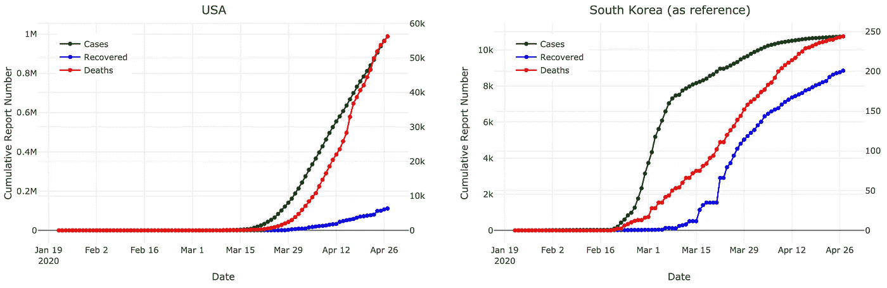*

*请注意，左边的 y 轴表示病例和恢复情况，而右边的 y 轴表示死亡情况*

*我们可以看到，美国的死亡率没有韩国稳定:*

*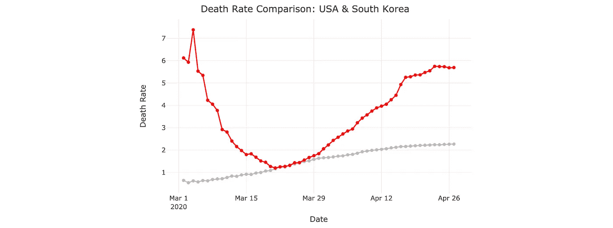*

*参考国家(韩国)用灰色表示；被更正的国家/地区(美国)为红色*

*这种不稳定性或许是美国修正病例数图的一个充分预兆:*

*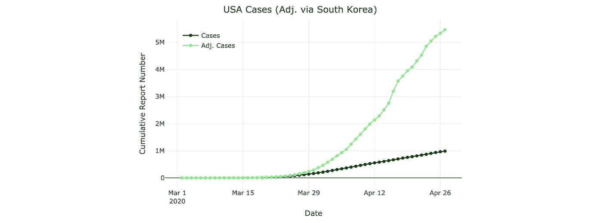*

*~ 550 万箱，550 万！不是 100 万——我希望现在更清楚为什么你应该保持社交距离并戴上口罩。*

*现在，让我们首先假设只有大约三分之一的死亡被报告，并对死亡和病例进行统计上的 3 倍乘性校正:*

*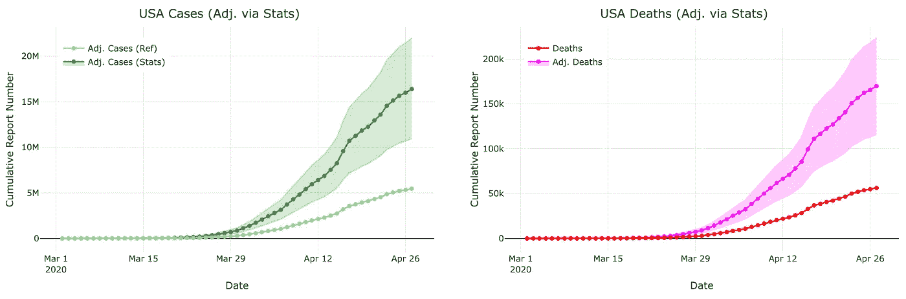*

*也就是大约 1640 万例(95%置信区间:1100 万—2200 万)和 16.98 万例死亡(95%置信区间:116.2 万—223.4 万)。需要指出的是，乘性修正是在没有任何数据的情况下应用的，所以在我们有数据让统计修正更真实之前，这些估计值还是要带着一桶盐的！*

*现在让我们看看波兰作为一个代表性国家，其指南中不包括(主要的)U07 **.2** 病例和死亡:*

*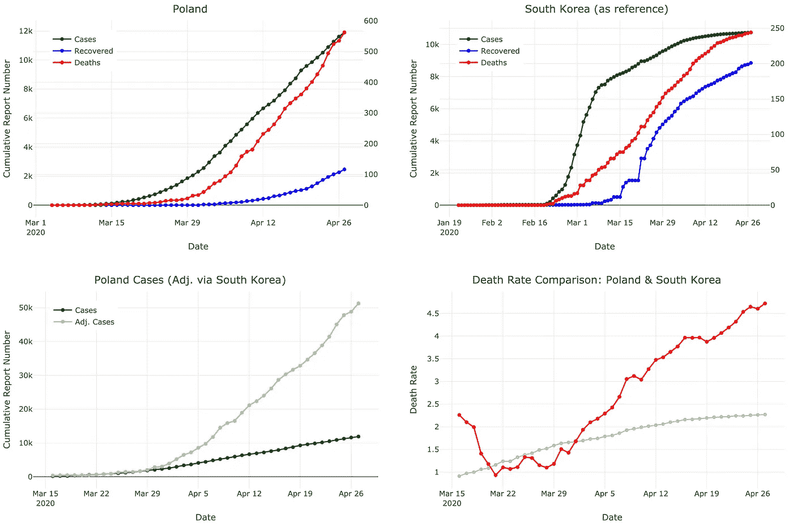*

*约 11.9k 的报告病例已被更正为约 51.3k，这是一个显著的增长，但与我们在其他国家看到的情况相比，这个数字似乎相对较低(按人口比例)。同样，我们将首先假设只有大约三分之一的死亡病例被报告，并对波兰的死亡和病例进行统计上的 3 倍乘性校正(这对于病例来说实际上可能是保守的，因为我们还遗漏了无症状的患者！)并查看调整后的数字:*

*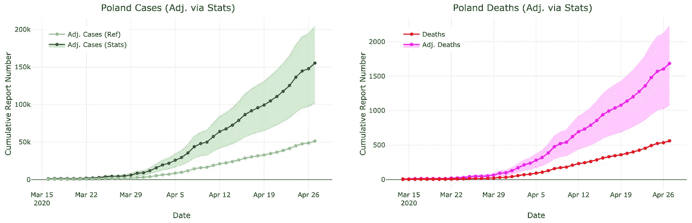*

*我们的病例经历了从大约 51.3k 预测病例到大约 155.3k (95%置信区间:102.5k-204.2k)的急剧增加，从大约 560 例报告死亡到大约 1，680 例(95%置信区间:1，080-2，220)，因此在每种情况下增加了大约 3 倍，正如我们在校正中使用的设置所预期的那样。*

*让我们来看看意大利:*

*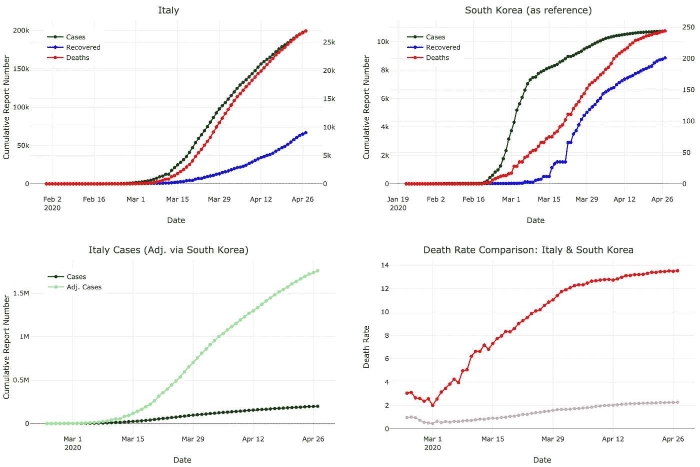**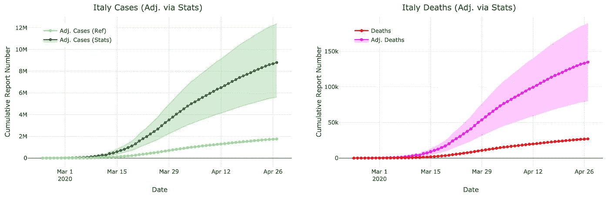*

*这些数字令人震惊——使用韩国的数据将目前估计的略低于 20 万的病例数调整为几乎 10 倍，即 176 万。使用乘法进行的进一步调整(其中我们乘以 5，因为意大利的医疗保健系统在这场危机中尤其不堪重负)显示，累计病例数可能高达 880 万(95% CI:560 万-1240 万)，死亡人数为 13.49 万(95% CI:80.9 万-188.7 万)。*

*最后，让我们看看中国:*

*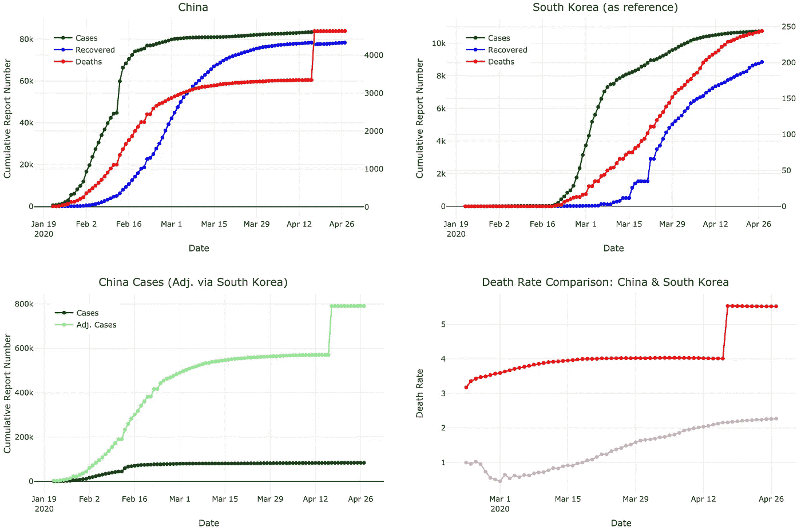**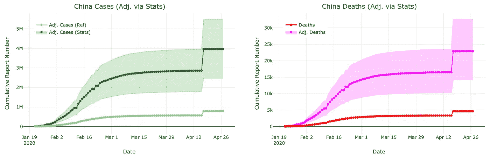*

*中国报告的病例徘徊在 8.4 万左右，最近更新了死亡人数，从< 3.5k to ~4.6k (this sudden uptick can be seen across the plots above). After adjustment the number of cases raises almost 10-fold, to ~790k. Due to the recent articles, we can assume that the underreporting of both cases and deaths in China is widespread, so we apply a multiplicative correction of 5\. This shows us that there may be easily have been as many as 4M cases (95% CI: 2.5M — 5.5M), and 23k deaths (95% CI: 14k — 32.5k) — a number that, according to recent headlines might be still understating the true magnitude of the crisis in China. This example provides a good illustration to the fact that data is badly needed to make this corrective measure more accurate and enable it to capture the nuances of reporting specific to each country on a case-by-case basis.*

# *From Priors to Posteriors — you can help make the estimates more realistic!*

*As mentioned in passing earlier, the multiplicative Gaussian correction presented here lends itself well to the Bayesian paradigm. Without going into excessive mathematical detail, we can use the Bayes’ theorem roughly as follows:*

**P*(*m*|*D*)=*P*(*m*)*P*(*D*|*m*)/*P*(*D*)*

*其中 *P* ( *m* | *D* )是我们观察到真实生活数据中未报告的病例和/或死亡比例后乘数的后验估计， *P* ( *m* )是我们的预先数据先验估计(目前在应用程序中使用)，*P*(*D*|*m*)是被观察的可能性*

*我敢打赌你已经看过无数次了——如果你没有看过，你可能会知道这其中哪个部分是至关重要的，但却是缺失的。是数据， *D* ！*

*如果您有任何数据，即关于冠状病毒导致的病例比例或死亡比例未报告的信息，请通过 [data@neurosynergy.ai](mailto:data@neurosynergy.ai) 与我们联系。此外，请与您的网络分享这篇文章，尤其是与医疗保健专业人员，因为他们可能对未报告的部分有宝贵的见解。这将有助于将本文中介绍的简单乘法校正器变成现实的统计校正器。*

*目前就这些。保持健康，记住——保持社交距离和戴口罩是有意义的(这些数字，尤其是在适当纠正的情况下，***就是*** 显示的)。*

**本文表达的观点和内容仅属于我个人，不代表我的雇主的观点或意见。**

*最初发表于[神经协同](https://www.neurosynergy.io/articles/fixingcovid-19underreporting)。*

****编者注:*** [*走向数据科学*](http://towardsdatascience.com/) *是一份以数据科学和机器学习研究为主的中型刊物。我们不是健康专家或流行病学家，本文的观点不应被解释为专业建议。想了解更多关于疫情冠状病毒的信息，可以点击* [*这里*](https://www.who.int/emergencies/diseases/novel-coronavirus-2019/situation-reports) *。**