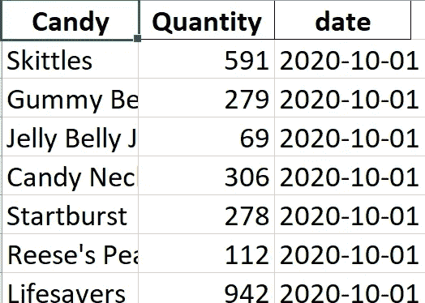

# 修复数据文件-添加缺失的日期列

> 原文：<https://towardsdatascience.com/fixing-data-files-adding-a-missing-date-column-dc42d7106325?source=collection_archive---------26----------------------->

## 如何用 python 在 4 个快速步骤中为多个文件添加日期？


图片由来自[皮克斯拜](https://pixabay.com/?utm_source=link-attribution&utm_medium=referral&utm_campaign=image&utm_content=318359)的[汉斯·布拉克斯米尔](https://pixabay.com/users/hans-2/?utm_source=link-attribution&utm_medium=referral&utm_campaign=image&utm_content=318359)拍摄

你有一整个文件夹的文件准备分析。仔细看，你会发现每个文件名都有日期，但记录上没有相应的日期。要将数据加载到数据框或表中，您需要一些日期或时间戳来维护记录的顺序。内心深处，你在呻吟。怎么办？

您可以使用 python 读入文件，并根据文件名日期添加一个新列。

## 方案

您需要创建 2020 年 10 月第一周糖果销售的可视化。

这些文件是每天创建的，包含不同的糖果和销售量。


这些文件位于一个文件夹中。文件名因销售日期而异。


## 解决办法

如果缺少日期列，将日期列添加到所有文件的 4 个步骤

1.  使用前面我为[文本抓取任务](/using-data-science-skills-now-text-scraping-8847ca4825fd)使用的 python glob，我创建了一个文件夹中所有文件的列表。
2.  遍历文件列表。从文件名中获取日期。
3.  接下来，打开文件并将其读入数据框。添加(或更新，如果已经存在)日期列。
4.  将更新的数据写回文件。

运行这个简单的脚本后，文件现已更新:



现在，将这些文件放入一个文件中变得容易多了。我也在剧本中加入了这一点。

```
# import required packages
import pandas as pd
import glob
import os
import re
import sys# where is your folder?folderPath  = '<path to your top folder>'# Find the candy sales files
files = glob.glob(folderPath + '/**/*candy_sales*',recursive=True)viz_df = pd.DataFrame()"""Loop through all the files , remove punctuationn, split each line into elements and match the elements to the list of words"""
for file in files:
    basic_file_name = file.replace(folderPath,'')

    basic_file_date = basic_file_name[14:22]

    # yyyy-mm-dd
    #file_date = str(basic_file_name[14:18]) + '-' + str(basic_file_name[18:20])  + '-' + str(basic_file_name[20:22])

    # mm/dd/yyyy
    file_date = str(basic_file_name[18:20])  + '-' + str(basic_file_name[20:22]) + '-' + str(basic_file_name[14:18])df = pd.DataFrame()
    df = pd.read_excel(file, header=0)

    df['date'] = file_datedf.to_excel(file, header=True, index=False)

print('Done updating files')# Create a viz file
for file in files:
    df = pd.DataFrame()
    df = pd.read_excel(file, header=0)
    viz_df = viz_df.append(df)

viz_df.to_excel(folderPath + '/viz_file.xlsx', header=True, index=False)
print('Done printing viz file')
```

一旦你有了最终的文件，把它放到一个 Viz 工具中——比如 Tableau Public。


## 结论

在短短几分钟内，您已经从一堆无用的无日期记录变成了一个带有时间戳的行文件，以备分析。