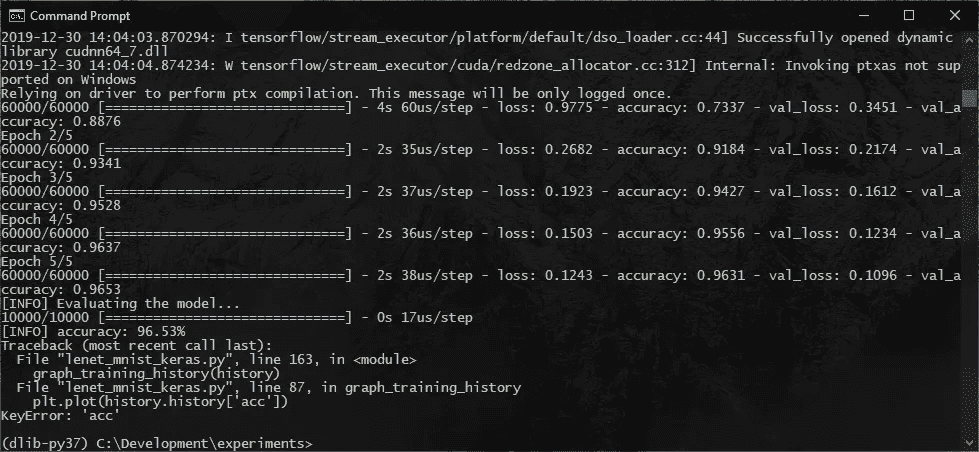
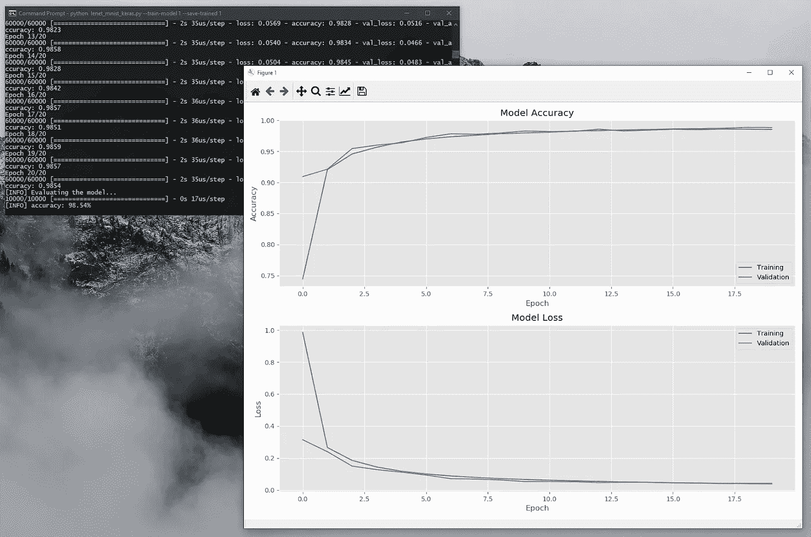

# 修复 Keras 2.3.x 或更新版本中的 key error:“ACC”和 key error:“val _ ACC”错误

> 原文：<https://towardsdatascience.com/fixing-the-keyerror-acc-and-keyerror-val-acc-errors-in-keras-2-3-x-or-newer-b29b52609af9?source=collection_archive---------10----------------------->

## 如果您的 Keras 代码中出现诸如 KeyError: 'acc '或 KeyError: 'val_acc '之类的错误，这可能是由于 Keras 2.3.x 中最近的一个更改。

在 Keras 2.3.0 中，矩阵的报告方式被更改为与指定的名称完全一致。如果您使用的是旧代码或旧代码示例，那么您可能会遇到错误。以下是修复它们的方法。

您是否使用过由 Keras 的 fit()函数返回的“历史”对象来绘制或可视化您的模型的训练历史？自从最近的 Keras 升级以来，您是否遇到过类似下面这样的“KeyError”类型的错误，并想知道为什么？

```
Traceback (most recent call last):
  File "lenet_mnist_keras.py", line 163, in <module>
    graph_training_history(history)
  File "lenet_mnist_keras.py", line 87, in graph_training_history
    plt.plot(history.history['acc'])
KeyError: 'acc'
```



尝试读取历史记录对象时出现密钥错误:“acc”

```
Traceback (most recent call last):
  File "lenet_mnist_keras.py", line 163, in <module>
    graph_training_history(history)
  File "lenet_mnist_keras.py", line 88, in graph_training_history
    plt.plot(history.history['val_acc'])
KeyError: 'val_acc'
```


尝试读取历史对象时出现密钥错误:“val_acc”

这要归功于 Keras 2 . 3 . 0 版本中引入的一个突破性的变化。

根据 2.3.0 发行说明:

> *"指标和损失现在以用户指定的确切名称报告(例如，如果您通过指标=['acc']，您的指标将在字符串“acc”下报告，而不是“accuracy”，反之，指标=['accuracy']将在字符串“accuracy”下报告。*

你可以在这里阅读官方发布说明:【https://github.com/keras-team/keras/releases/tag/2.3.0

这意味着，如果您在 **model.compile()** 中指定 **metrics=["accuracy"]** ，那么历史对象将拥有关键字 **'accuracy'** 和 **'val_accuracy'** 。而如果您将其指定为 **metrics=["acc"]** ，那么它们将使用关键字 **'acc'** 和 **'val_acc'** 进行报告。

因此，要修复这个错误，你应该在你的代码中使用一个标准。

您可以使用“acc”，

```
...

model.compile(loss="categorical_crossentropy",
              optimizer=opt, metrics=["acc"])

...

plt.figure(**1**)

# summarize history for accuracy

plt.subplot(**211**)
plt.plot(history.history['acc'])
plt.plot(history.history['val_acc'])
plt.title('Model Accuracy')
plt.ylabel('Accuracy')
plt.xlabel('Epoch')
plt.legend(['Training', 'Validation'], loc='lower right')

# summarize history for loss

plt.subplot(**212**)
plt.plot(history.history['loss'])
plt.plot(history.history['val_loss'])
plt.title('Model Loss')
plt.ylabel('Loss')
plt.xlabel('Epoch')
plt.legend(['Training', 'Validation'], loc='upper right')

plt.tight_layout()

plt.show()
```

或者，使用“准确性”。

```
...

model.compile(loss="categorical_crossentropy",
              optimizer=opt, metrics=["accuracy"])

...

plt.figure(**1**)

# summarize history for accuracy

plt.subplot(**211**)
plt.plot(history.history['accuracy'])
plt.plot(history.history['val_accuracy'])
plt.title('Model Accuracy')
plt.ylabel('Accuracy')
plt.xlabel('Epoch')
plt.legend(['Training', 'Validation'], loc='lower right')

# summarize history for loss

plt.subplot(**212**)
plt.plot(history.history['loss'])
plt.plot(history.history['val_loss'])
plt.title('Model Loss')
plt.ylabel('Loss')
plt.xlabel('Epoch')
plt.legend(['Training', 'Validation'], loc='upper right')

plt.tight_layout()

plt.show()
```



可视化“修复”后的模型训练历史

只要记住在 metrics=[…]和从 history 对象访问键的地方使用相同的键。

相关链接:
[如何在 Keras 中绘制模型训练历史](https://www.codesofinterest.com/2017/03/graph-model-training-history-keras.html)
[Keras 2.3.0 发行说明](https://github.com/keras-team/keras/releases/tag/2.3.0)

**注:**早在 2020 年 1 月，我第一次在我的博客上发表了这篇文章。但是我看到你们中的许多人仍然面临这个问题。所以我在这里重新发布它，希望能帮助许多人修复他们的代码。

【https://www.codesofinterest.com】最初发表于[](https://www.codesofinterest.com/2020/01/fixing-keyerror-acc-valacc-keras.html)**。**