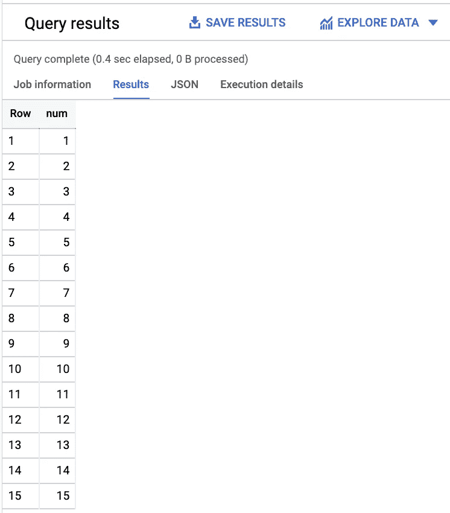

# BigQuery 中的 FizzBuzz

> 原文：<https://towardsdatascience.com/fizzbuzz-in-bigquery-e0c4fbc1d195?source=collection_archive---------74----------------------->

## 有时你需要一个巨大的托管数据库服务来传递 FizzBuzz

如果你过去做过编程，我肯定你听说过 FizzBuzz 挑战。这是一个简单的编程任务，应该会让应届毕业生措手不及。有很多关于如何用 Java、Python、C 等等语言来做这件事的帖子。但我认为在 BigQuery 中进行会很有趣。

图片来源: [pxfuel](https://www.pxfuel.com/en/free-photo-jyliq)

挑战如下:

写一个函数或者程序，打印从 1 到 100 的数字，但是如果这个数字能被 3 整除，打印`Fizz`，如果这个数字能被 5 整除，打印`Buzz`，如果能被 3 和 5 整除，打印`FizzBuzz`。

多刺激啊，对吧？

这里有一个朱莉娅版本让我们思考(因为我喜欢朱莉娅:

现在，这个问题已经解决了，让我们从创建数字开始。你可以使用`union all`语句，但是那会很快变得很无聊，所以我将使用数组来代替。请注意，这些查询在 BigQuery 中都是免费的，因为我们不查询任何实际数据，我们只是自己动态生成数据。

这使我们得到以下结果:

还有，生活中免费的东西总是更好:

这里发生的事情是，`GenerateArray` [创建了一个从 1 到 15 的数组](https://cloud.google.com/bigquery/docs/reference/standard-sql/arrays#using_generated_values)，然后我们使用`Unnest`到[展平数组](https://cloud.google.com/bigquery/docs/reference/standard-sql/arrays#flattening_arrays)，并使用数组的每个元素作为列`num`的行值。(上面链接了函数的文档。)

现在是嘶嘶作响的部分。我将使用上面创建的表，只是为了使代码更容易阅读，并对其应用一个`CASE`语句:

需要注意的事项:

*   我们必须首先检查一个数是否能被 3 和 5 整除(即 15)
*   不可分的数字必须转换为字符串，以确保该列的所有元素都具有相同的类型

这应该可以了。下次他们让你在采访中写 FizzBuzz 的时候，登录 GCP，在 BigQuery 中写！

 [## BigQuery 中的斐波那契数列

### 在 BigQuery 中使用用户定义的 JavaScript 函数来计算 Fibonacci

towardsdatascience.com](/fibonacci-series-with-user-defined-functions-in-bigquery-f72e3e360ce6)  [## 将文件更快地加载到 BigQuery 中

### 针对摄取的 CSV、GZIP、AVRO 和拼花文件类型进行基准测试

towardsdatascience.com](/load-files-faster-into-bigquery-94355c4c086a)