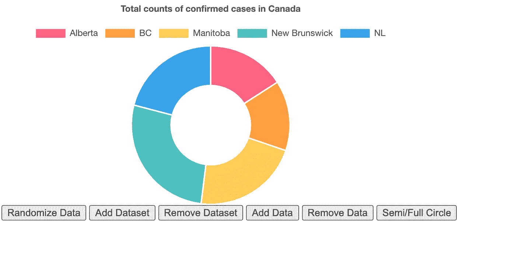

# 仪表盘教程(一):Flask 和 Chart.js

> 原文：<https://towardsdatascience.com/flask-and-chart-js-tutorial-i-d33e05fba845?source=collection_archive---------2----------------------->

## 关于 Flask 和 Chart.JS 的教程。通过代码片段和示例浏览 web 和图表设计。


照片由[freepik.com](https://www.freepik.com/)拍摄

当使用 Python 创建 web 时，Flask 通常是开发人员常用的后端。Flask 支持 HTTP 请求的管理和模板呈现。在这篇博客中，我们将介绍 flask 的基本结构，以及 flask 如何从其他网页中渲染模板。此外，您将学习加载一个逗号分隔值(CSV)文件，并使用 [Chart.js](https://www.chartjs.org/) 将其可视化。

在本文中，您将了解到:

(1)创建一个基本的烧瓶应用程序

(2)图表。JS 图

## 创建基本的烧瓶应用程序

首先，我们创建一个. py 文件来导入 flask 包并设置 flask 配置。Flask 会从 templates 文件夹中调用 HTML 文件，而不需要任何指定的路径。为了将 flask 指向正确的文件夹，我们指定了**模板 _ 文件夹**和**静态 _ 文件夹**路径。在静态文件夹中，它通常存储 javascript、CSS 文件和图像。在模板文件夹中，它通常存储 HTML 文件。此外，我们为终端设置 app.config 等于 True 来显示错误消息。此外，错误消息会在控制台的 inspect 元素下弹出。

```
**import** flask

app **=** flask.Flask(__name__, static_url_path='',
            static_folder='static',
            template_folder='template')
app.config["DEBUG"] **=** True
```

然后，我们继续定义主页的路径。我们能够给出一个可以传入 HTML 的网页名称。 **Render_template** 函数会调用 HTML 文件并显示在指定的网页路径上。对于 user 的第二个功能，可以将嵌入在 route 中的 name 标签传递到 HTML 中。例如，当给出([http://127 . 0 . 0 . 1:5000/home](http://127.0.0.1:5000/home))时，内容将是“Hello home”。此外，用户可以通过使用**重定向**函数来分配 HTML 网页的路径，并将网页名称放入 **url_for** 函数中。

```
from flask import render_template, redirect, url_for

[@app](http://twitter.com/app).route("/home")
def home():
    return render_template("home.html")[@app](http://twitter.com/app).route("/<name>")
def user(name):
    return f"Hello-- {name}!"[@app](http://twitter.com/app).route("/admin")
def admin():
    return redirect(url_for("home"))
```

完成上述设置后，您就可以通过启动主机和端口来运行 flask 应用程序了。

```
if __name__ == '__main__':
    app.run(host="localhost", port=8000, debug=True)
```

# 图表。JS 图

图表。JS 成为一个流行且强大的数据可视化库。该库增加了用户通过输入某些参数来定制图的灵活性，这满足了用户的期望。从 Chart.js 创建绘图的主要优点是基本的代码结构，它允许用户显示绘图而无需创建许多行代码。

在开始之前，请确保通过调用网页或指定下载文件的本地目录来调用 Chart.js 文件。

```
<script src="https://cdnjs.cloudflare.com/ajax/libs/Chart.js/2.5.0/Chart.min.js"></script>
```

我们还需要创建一个**画布节点**来呈现图表，并用其宽度和高度指定绘图的大小。

```
<canvas id="myChart" width="400" height="400"></canvas>
```

对于以下使用 Chart.js 的 4 个绘图示例，我主要使用来自加拿大新冠肺炎疫情数据源的流行病学数据。可以通过其[链接](https://github.com/ishaberry/Covid19Canada)访问数据。

## 条形图

首先，我们将通过调用 d3 库来加载 CSV 文件，该文件将被呈现到 makeChart 函数中。接下来，我们用数据参数定义函数，并将数据列映射到某些变量。

```
d3
 .csv(“/file/Bar_cases.csv”)
 .then(makeChart);function makeChart(data) {
      var country = data.map(function(d) {return d.province;});
      var value = data.map(function(d) {return d.cumulative_cases;});
```

然后，我们通过 **getElementById 调用画布 id 来创建图表。**通过将类型指定为条形(要翻转条形的方向，请将类型设置为 horizontalBar)即可生成条形图。条形图的标签设置为省份名称，数据为 5 月份的累计病例数。您可以通过参数创建图例和标题。

```
// Bar chart
      new Chart(document.getElementById("myCanvas"), {
          type: 'bar',
          data: {
            labels: country,
            datasets: [
              {
                label: "Population (millions)",
                backgroundColor: ["#3e95cd", "#8e5ea2","#3cba9f","#e8c3b9","#c45850"],
                data: value
              }
            ]
          },
          options: {
            legend: { display: false },
            title: {
              display: true,
              text: 'Total Confirmed Cases of COVID in May'
            }
          }
      });
```

通过下面的柱状图，我们可以通过悬停的信息看到信息。在五个省份中，魁北克省感染 COVID 的人数最多，而安大略省是第二高的省份。


图表 1:条形图

## **折线图**

首先，我们需要为线图准备数据集。为了创建时间序列线图，我们需要筛选每个省的每月 COVID19 确诊病例。 **OnlyUnique** 函数是从一个数组中生成唯一值。 **forEach** 函数能够通过一个数组上的值和索引的迭代，在多个数组上找到相同的索引。

```
// get unique value of array
    function onlyUnique(value, index, self) {
    return self.indexOf(value) === index;
      }
    var mon_unique = month.filter( onlyUnique );province.forEach((pro, index) => {
      if (pro =="Alberta") {
      ab_val.push(value[index]);
    } else if (pro =="BC") {
      BC_val.push(value[index]);
    } else if (pro =="Manitoba") {
      mb_val.push(value[index]);
    } else if (pro =="New Brunswick") {
      nb_val.push(value[index]);
    }
     else {
      nl_val.push(value[index]);
    }
    });
```

通过将类型指定为线条，可以简单地生成折线图。对于每一行，我们可以输入包装在数据集列表中的标签和数据。默认情况下，每条线下的区域用颜色填充，覆盖该线和 x 轴之间的区域。可以通过指定(`fill: false`)来删除颜色。此外，可以用 borderColor 参数指定颜色。

```
// Line chart
    new Chart(document.getElementById("myCanvas"), {
  type: 'line',
  data: {
    labels: mon_unique,
    datasets: [{
        data: ab_val,
        label: "Alberta",
        borderColor: "#3e95cd",
        fill: false
      }, {
        data: BC_val,
        label: "BC",
        borderColor: "#8e5ea2",
        fill: false
      }, {
        data: mb_val,
        label: "Manitoba",
        borderColor: "#3cba9f",
        fill: false
      }, {
        data: nb_val,
        label: "New Brunswick",
        borderColor: "#e8c3b9",
        fill: false
      }, {
        data: nl_val,
        label: "NL",
        borderColor: "#c45850",
        fill: false
      }
    ]
  },
  options: {
    title: {
      display: true,
      text: 'Positive Cases of COVID in provinces of Canada'
    },
    hover: {
     mode: 'index',
     intersect: true
    },
  }
});
```

从下面的线图来看，除 BC 省外，4 个省在 1 月和 2 月报告了 0 例确诊病例。从 2 月中旬开始，艾伯塔省和不列颠哥伦比亚省的确诊病例逐渐增加。从 3 月开始，艾伯塔省的阳性病例大幅增加，因为 AB 省在 5 个省中名列前茅。另一方面，MB、NB 和 NL 等省报告的确诊 COVID 病例较少。5 月，曲线变平，COVID 案例减少。


图表 2:折线图

## 圆环图

首先，我们需要为甜甜圈图准备数据集。每个省数组被处理并有五月份累积案例的最终输入。

```
//donut chart, get the end of MAy & display the cumulative cases of 5 provinces// get unique value of array
    function onlyUnique(value, index, self) {
    return self.indexOf(value) === index;
      }
    var pro_unique = province.filter( onlyUnique );
    var ab_val = []
    var BC_val = []
    var mb_val = []
    var nb_val = []
    var nl_val = []date.forEach((i_dt, index) => {
      if (i_dt == '2020-05-31' && province[index] =="Alberta") {
      ab_val.push(value[index]);
    } else if (i_dt == '2020-05-31' && province[index] =="BC") {
      BC_val.push(value[index]);
    } else if (i_dt == '2020-05-31' && province[index] =="Manitoba") {
      mb_val.push(value[index]);
    } else if (i_dt == '2020-05-31' && province[index] =="New Brunswick") {
      nb_val.push(value[index]);
    }
     else if (i_dt == '2020-05-31' && province[index] =="NL") {
     nl_val.push(value[index]);
    }
    });
```

总共有 6 个按钮。按钮 randomizeData 使数据随机化，同时每个标签的区域可以按比例显示。对于其他 4 个按钮，它们支持添加或删除数据的功能。此外，像半圆/全圆按钮，允许圆扩大和缩小到秋天和一半的大小。一旦每个按钮都被单击，它将调用 Doughnut.update()函数来更新绘图。

```
<button id="randomizeData">Randomize Data</button>
<button id="addDataset">Add Dataset</button>
<button id="removeDataset">Remove Dataset</button>
<button id="addData">Add Data</button>
<button id="removeData">Remove Data</button>
<button id="changeCircleSize">Semi/Full Circle</button>window.chartColors = {
      red: 'rgb(255, 99, 132)',
      orange: 'rgb(255, 159, 64)',
      yellow: 'rgb(255, 205, 86)',
      green: 'rgb(75, 192, 192)',
      blue: 'rgb(54, 162, 235)',
      purple: 'rgb(153, 102, 255)',
      grey: 'rgb(201, 203, 207)'
    };
var config = {
   type: 'doughnut',
   data: {
    datasets: [{
     data: [
      ab_val,
      BC_val,
      mb_val,
      nb_val,
      nl_val,
     ],
     backgroundColor: [
      window.chartColors.red,
      window.chartColors.orange,
      window.chartColors.yellow,
      window.chartColors.green,
      window.chartColors.blue,
     ],
     label: 'Dataset 1'
    }],
    labels: pro_unique
   },
   options: {
    responsive: true,
    legend: {
     position: 'top',
    },
    title: {
     display: true,
     text: 'Total counts of confirmed cases in Canada'
    },
    animation: {
     animateScale: true,
     animateRotate: true
    }
   }
  };window.onload = function() {
   var ctx = document.getElementById('chart-area').getContext('2d');
   window.myDoughnut = new Chart(ctx, config);
  };document.getElementById('randomizeData').addEventListener('click', function() {
   config.data.datasets.forEach(function(dataset) {
    dataset.data = dataset.data.map(function() {
     return randomScalingFactor();
    });
   });window.myDoughnut.update();
  });var colorNames = Object.keys(window.chartColors);
  document.getElementById('addDataset').addEventListener('click', function() {
   var newDataset = {
    backgroundColor: [],
    data: [],
    label: 'New dataset ' + config.data.datasets.length,
   };for (var index = 0; index < config.data.labels.length; ++index) {
    newDataset.data.push(randomScalingFactor());var colorName = colorNames[index % colorNames.length];
    var newColor = window.chartColors[colorName];
    newDataset.backgroundColor.push(newColor);
   }config.data.datasets.push(newDataset);
   window.myDoughnut.update();
  });document.getElementById('addData').addEventListener('click', function() {
   if (config.data.datasets.length > 0) {
    config.data.labels.push('data #' + config.data.labels.length);var colorName = colorNames[config.data.datasets[0].data.length % colorNames.length];
    var newColor = window.chartColors[colorName];config.data.datasets.forEach(function(dataset) {
     dataset.data.push(randomScalingFactor());
     dataset.backgroundColor.push(newColor);
    });window.myDoughnut.update();
   }
  });document.getElementById('removeDataset').addEventListener('click', function() {
   config.data.datasets.splice(0, 1);
   window.myDoughnut.update();
  });document.getElementById('removeData').addEventListener('click', function() {
   config.data.labels.splice(-1, 1); // remove the label firstconfig.data.datasets.forEach(function(dataset) {
    dataset.data.pop();
    dataset.backgroundColor.pop();
   });window.myDoughnut.update();
  });document.getElementById('changeCircleSize').addEventListener('click', function() {
   if (window.myDoughnut.options.circumference === Math.PI) {
    window.myDoughnut.options.circumference = 2 * Math.PI;
    window.myDoughnut.options.rotation = -Math.PI / 2;
   } else {
    window.myDoughnut.options.circumference = Math.PI;
    window.myDoughnut.options.rotation = -Math.PI;
   }window.myDoughnut.update();
  });
```

从下图中，我们可以看到新不伦瑞克省确诊的 COVID 病例最多，而马尼托巴省也有类似比例的确诊病例。对于下面的图 4，它显示了圆环图在半圆布局中的不同显示。



图表 3:圆环图(全圆)


图表 4:圆环图(半圆)

## 条形图

首先，我们需要为条形图准备数据集。本图表主要关注 1-6 月艾伯塔省**COVID 的**累计 _ 病例、累计 _ 痊愈、累计 _ 死亡、**和**活跃 _ 病例 _ 变化**。为了使这些值公平地分布在同一范围内，我处理了 **cumulative_cases** 和 **cumulative_recovered** 列，并在数组上记录日志。**

```
// get unique value of array
  function onlyUnique(value, index, self) {
  return self.indexOf(value) === index;
    }
  var date_unique = date.filter( onlyUnique );
  var ab_case = []
  var ab_recover = []
  var ab_deaths = []
  var ab_case_mean = []
  var ab_case_log = []
  var ab_recover_log = []province.forEach((i_pro, index) => {
    if (i_pro =="Alberta") {
    ab_case.push(case1[index]);
    ab_recover.push(recover[index]);
    ab_deaths.push(deaths[index]);
    ab_case_mean.push(case_mean[index]);
  }
  });
// take log on ab_case, ab_recover
ab_case.forEach((i_ab, index) => {
      ab_recover_log.push(Math.log(ab_recover[index]));
      ab_case_log.push(Math.log(i_ab));
  });
```

**在 Chat.js 中，可以灵活地创建由两种或多种不同图表类型组合而成的混合图表。在下面的例子中，我创建了一个条形折线图，它具有独立的类型参数规范。**

```
new Chart(document.getElementById("canvas"), {
    type: 'bar',
    data: {
        datasets: [{
            label: 'log on cumulative_cases in Alberta',
            backgroundColor: window.chartColors.red,
            data: ab_case_log,
            borderColor: 'white',
        borderWidth: 2
        }, {
            label: 'log on cumulative_recovered in Alberta',
            backgroundColor: window.chartColors.green,
            data: ab_recover_log,
            borderColor: 'white',
        borderWidth: 2
        },{
            label: 'cumulative_deaths in Alberta',
            backgroundColor: window.chartColors.purple,
            data: ab_deaths,
            borderColor: 'white',
        borderWidth: 2
        },
        {
            label: 'Month average of active cases in Alberta',
            data: ab_case_mean,
            fill: false,
            borderColor:window.chartColors.blue,
            borderWidth: 2,
            // Changes this dataset to become a line
            type: 'line'
        }],
        labels: date_unique
    },
    options: {
      title: {
        display: true,
        text: 'Positive Cases of COVID in provinces of Canada'
      },
      hover: {
            mode: 'index',
            intersect: true
          },
    }});
```

**从下面的条形图中，我们可以看到四月份的平均活动案例急剧增加，而五月份的平均活动案例急剧减少。从 5 月到 6 月，尽管活跃病例的数量仍然为负，但有一条向上的曲线显示，感染 COVID 的人越来越少。**

****

**绘图 4:条形折线图(半圆)**

# **总之:**

*   **Flask 是一个强大的后端，可以很好地处理 HTML 和 javascript 文件。一旦用确切的文件夹指定了目录，应用程序将通过指定的路径呈现页面。**
*   **图表。JS 是一个可视化库，支持许多图表，如条形图、折线图、面积图、圆环图等。最棒的是，您可以自定义布局，如悬停信息、刻度范围、x 轴和 y 轴标签等。**

# **参考:**

**图表。JS 文档网站:[https://www.chartjs.org/](https://www.chartjs.org/)**