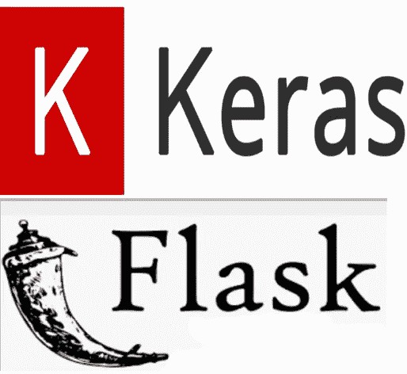
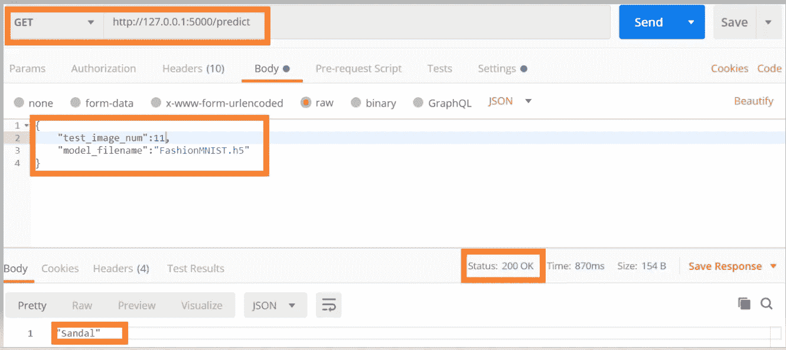
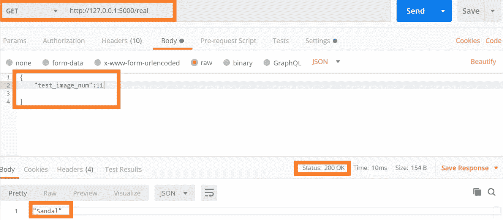

# 使用 Keras 进行多类分类的 Flask API

> 原文：<https://towardsdatascience.com/flask-api-for-multi-class-classification-using-keras-4c9c7e85b5f2?source=collection_archive---------18----------------------->

## 如何使用 Flask 为深度学习模型创建生产就绪的 API

在本文中，您将了解如何使用通过 Keras 和 Flask 构建的时尚 MNIST 数据集，为深度学习模型创建模块化的生产就绪库。



*深度学习模型生产就绪代码的关键特征是什么？*

## 面向生产的深度学习代码的特性

*   **异常处理**监控错误并在出现错误时理解代码流。
*   **日志**可以设置为不同的级别，如*调试、信息、警告、错误或关键*。在生产中，我们应该将日志记录级别设置为仅记录警告、错误和关键信息。
*   **使用 GitLab 对代码进行版本控制**
*   **代码注释**对于理解代码非常重要
*   **代码优化**实现高效的内存使用和计算
*   **容器化**深度学习模型代码及其所有依赖库。

我们将在另一篇文章中了解 Docker 以及如何将深度学习模型容器化。

## 创建配置类

我们需要参数化一些用于微调深度学习模型的常见属性，可以使用 Config 类来完成。我们还添加了根据输入数据而变化的参数，以保持模型的通用性。

*   **输入数据集相关参数**:图像尺寸——高度和宽度、数据集大小以及待识别类别的标签
*   **模型微调参数**:优化器、优化器的学习率、时期数和 batch_size。我们还可以包括退出率、输入节点的数量、隐藏层的数量等。
*   **存储信息的文件**:保存训练重量的重量文件和记录日志的日志文件名

您可以根据需要添加/删除配置参数。这些配置参数用于深度学习模型中的所有不同操作。

```
**class Config(object):**

    **IMAGE_HEIGHT=28
    IMAGE_WIDTH=28
    DATA_SIZE=1000
    CLASS_NAME=*'T-shirt/top', 'Trouser', 'Pullover', 'Dress', 'Coat','Sandal', 'Shirt', 'Sneaker', 'Bag', 'Ankle boot'***
    **WEIGHT_FILENAME='FashionMNIST.h5'
    LOG_FILENAME='LOG_FASHION.TXT'
    EPOCHS=100
    OPTIMIZER='RMSProp'
    LEARNING_RATE=0.001
    BATCH_SIZE=64**

    **def __init__(self):
        self.IMAGE_DIM = (self.IMAGE_HEIGHT, self.IMAGE_WIDTH)**
```

## 建立分类模型

创建一个类***classFashionMNIST***用于处理深度学习模型的不同方面。该类将有方法来

*   **归一化数据**
*   **构建深度学习模型**
*   **训练模型**
*   **使用模型**进行预测
*   **显示来自数据集的图像**
*   **从数据集中找到图像的实际类别**

**日志记录和异常处理是代码不可或缺的一部分，使其更加健壮。**

init()用于设置我们对类进行不同操作所需的参数，比如图像的高度、宽度、数据集大小以及我们想要预测的不同类。init()还用于读取时尚 MNIST 数据集以进行训练和验证，

```
**def __init__(self, height, width, data_size, class_name):
        try:
            self.height= height
            self.width=width
            self.data_size=data_size
            self.class_names =list(class_name)
            (self.train_images, self.train_labels), (self.test_images, self.test_labels) = tf.keras.datasets.fashion_mnist.load_data()
            self.test_data= self.test_images
        except:
            logging.error("Error in init %s", sys.exc_info())**
```

**归一化数据集**

由于图像中的像素强度介于 1-255 之间，因此通过在 0 和 1 之间缩放值来标准化图像

```
**def normalize_data(self):**
        ***try:*
            *logging.info("Normalizing data")*** *# load train and test images and labels based on data size* **self.train_labels = self.train_labels[:self.data_size]
            self.test_labels = self.test_labels[:self.data_size]** *#Normalize the data* **self.train_images = self.train_images[:self.data_size].astype('float32') / 255
            self.test_images = self.test_images[:self.data_size].astype('float32') / 255
           * logging.info("Rshaping data")*** *# Reshape the data* **self.train_images = self.train_images.reshape((self.train_images.shape[0],  self.width, self.height,1))
            self.test_images = self.test_images.reshape((self.test_images.shape[0],  self.width, self.height,1))
        *except:*
           * logging.error("Error", sys.exc_info())***
```

**创建深度学习分类模型**

我们传递优化器和配置文件中设置的学习率来编译模型。由于深度学习模型是多类分类，使用的损失函数是***sparse _ categorial _ cross entropy。*** 如果做的是二元分类模型，那么用***binary _ cross entropy***作为损失函数。

```
**def create_model(self, optimizer, learning_rate):**
        ***try:***
            ***logging.info("Creatig model")***
            **model = tf.keras.Sequential()**
           * # Must define the input shape in the first layer of the neural network*
           ** model.add(tf.keras.layers.Conv2D(filters=64, kernel_size=2, padding='same', activation='relu', input_shape=(28,28,1))) 
            model.add(tf.keras.layers.MaxPooling2D(pool_size=2))
            model.add(tf.keras.layers.Dropout(0.3))
            model.add(tf.keras.layers.Conv2D(filters=32, kernel_size=2, padding='same', activation='relu'))
            model.add(tf.keras.layers.MaxPooling2D(pool_size=2))
            model.add(tf.keras.layers.Dropout(0.3))**
            **model.add(tf.keras.layers.Flatten())
            model.add(tf.keras.layers.Dense(256, activation='relu'))
            model.add(tf.keras.layers.Dropout(0.5))
            model.add(tf.keras.layers.Dense(10, activation='softmax'))**
            ***logging.info("Model Created")***
            *# creating optimizer based on the config*
            **opt= self.get_optimizer(optimizer, learning_rate)**

            *#Compiling the model*
            **model.compile(loss='sparse_categorical_crossentropy',
                     optimizer=opt,
                     metrics=['accuracy'])**
            ***logging.info(" Model Compiled")***
       ** *except:
            logging.error(" Error during Model Creation - %s", sys.exc_info())***
       ** *finally:***
           ** return model**
```

**设置优化器**

处理了三个流行的优化器: ***Adam，SGD，RMSProp*** 。RMSProp 是默认的优化器，默认的学习率设置为 0.001。我们可以其他[优化者](https://medium.com/datadriveninvestor/overview-of-different-optimizers-for-neural-networks-e0ed119440c3)像 ***动量、内斯特罗夫、阿达格勒、阿达德尔塔。***

```
**def get_optimizer(self,optimizer_name='RMSProp', learning_rate=0.001):
        *try:*
            if optimizer_name=='Adam':                
                optimizer = optimizers.Adam(learning_rate=learning_rate, beta_1=0.9, beta_2=0.999, amsgrad=False)
            elif optimizer_name=='SGD':
                optimizer = optimizers.SGD(lr=learning_rate, momentum=0.9)
            elif optimizer_name=='RMSProp':
                optimizer = optimizers.RMSprop()
           * logging.info("Optimizer created %s", optimizer_name)*
            return optimizer
        *except:
             logging.error(" Error during visualization - %s", sys.exc_info())***
```

**训练模型**

创建模型，归一化数据，最后在列车图像和列车标签上训练数据。

如果准确度小于 0.8 或者验证准确度小于 0.7，那么我们将在日志文件中发出警告，通知团队该模型可能需要重新训练。

```
**def train_model(self,filename, epochs, optimizer, learning_rate, batch_size):
       * try:*
            model = self.create_model(optimizer, learning_rate)
            *logging.info("Model created ")
            logging.info("Normalizing the data")*
            self.normalize_data()
            *logging.info(self.train_images.shape)
            logging.info("Training started")*
            history=model.fit(self.train_images, 
                  self.train_labels,  
                  batch_size=batch_size,
                  epochs=epochs,
                  validation_data=(self.test_images,self.test_labels))
            *logging.info(" Training finished")*
            acc= np.average(history.history['acc'])
            val_acc=np.average(history.history['val_acc'])
           * logging.info(" Model accurcay on train images : {:5.2f}".format(acc))
            logging.info("Accurcay too low for val {:5.2f}".format(val_acc))*
            model.save(filename)
            *logging.info("Model saved %s", filename)*
            if acc <.8 or val_acc<0.7:
                *logging.warn("Accurcay too low {:5.2f}".format(acc) )
                logging.warn("Accurcay too low for val {:5.2f}".format(val_acc))*
            return history, model
       * except:
             logging.error(" Error during Model Creation - %s", sys.exc_info())***
```

**预测数据**

为了预测数据，我们传递测试图像的索引和包含训练权重的文件。

```
**def predict_data(self, test_image_num, filename):
        *try:
            logging.info("Predciting the data for %d", test_image_num)*
            test_img = self.test_images[test_image_num].reshape((1, self.width, self.height,1))
            test_img=test_img.astype('float32') / 255
            model = tf.keras.models.load_model(filename)
            *logging.info("Loaded the trained weights from %s", filename)*
            pred= model.predict(test_img)
            pred= np.argmax(pred)
           * logging.info("Predicted class  %s",self.class_names[pred] )*
            return self.class_names[pred]
       * except:
            logging.error(" Error during Model predcition - %s", sys.exc_info())***
```

**测试图像的实际类别**

因为我们使用了 FashoinMNIST，所以我们知道可以用来比较输出的测试图像的类别

```
**def actual_data(self,test_image_num):
        return self.class_names[self.test_labels[test_image_num]]**
```

## classFashionMNIST 类的完整代码

```
*#Importing required libraries*
**import tensorflow as tf
import numpy as np
import matplotlib.pyplot as plt
import sys
import logging
from tensorflow.keras import optimizers***# setting the random seed*
**np.random.seed(1)
tf.compat.v1.set_random_seed(1)****class classFashionMNIST:**

    *'''
    Method Name: init
    Functionality: initializes the class
    Parameters:  sets the height, width of the image,  data size and class labels
    '''*
    **def __init__(self, height, width, data_size, class_name):
        *try:*
            self.height= height
            self.width=width
            self.data_size=data_size
            self.class_names =list(class_name)
            (self.train_images, self.train_labels), (self.test_images, self.test_labels) = tf.keras.datasets.fashion_mnist.load_data()
            self.test_data= self.test_images
        *except:*
            logging.error("Error in init %s", sys.exc_info())**

    *'''
    Method Name: normalize data
    Functionality: Normalizes the images pixel intensity values by
                   scaling pixel values to the range 0-1 to centering and 
                   even standardizing the values.
    Parameters:  None
    '''*
    **def normalize_data(self):**
        ***try:*
            logging.info("Normalizing data")

            # load train and test images and labels based on data size
            self.train_labels = self.train_labels[:self.data_size]
            self.test_labels = self.test_labels[:self.data_size]

            #Normalize the data
            self.train_images = self.train_images[:self.data_size].astype('float32') / 255
            self.test_images = self.test_images[:self.data_size].astype('float32') / 255
            logging.info("Rshaping data")
            # Reshape the data
            self.train_images = self.train_images.reshape((self.train_images.shape[0],  self.width, self.height,1))
            self.test_images = self.test_images.reshape((self.test_images.shape[0],  self.width, self.height,1))
        *except:*
            logging.error("Error", sys.exc_info())***'''
    Method Name: create_mode
    Functionality: Creates the deep learning model for multiclass classification
    Parameters:  optimizer - optimizers can be Adam, SGD or RMSProp
                 Learning_rate- learning rate of the optimizer
    '''***def create_model(self, optimizer, learning_rate):
        *try:*
            *logging.info("Creatig model")*
            model = tf.keras.Sequential()
           *** # Must define the input shape in the first layer of the neural network* **model.add(tf.keras.layers.Conv2D(filters=64, kernel_size=2, padding='same', activation='relu', input_shape=(28,28,1))) 
            model.add(tf.keras.layers.MaxPooling2D(pool_size=2))
            model.add(tf.keras.layers.Dropout(0.3))
            model.add(tf.keras.layers.Conv2D(filters=32, kernel_size=2, padding='same', activation='relu'))
            model.add(tf.keras.layers.MaxPooling2D(pool_size=2))
            model.add(tf.keras.layers.Dropout(0.3))
            model.add(tf.keras.layers.Flatten())
            model.add(tf.keras.layers.Dense(256, activation='relu'))
            model.add(tf.keras.layers.Dropout(0.5))
            model.add(tf.keras.layers.Dense(10, activation='softmax'))
            *logging.info("Model Created")**** # creating optimizer based on the config* **opt= self.get_optimizer(optimizer, learning_rate)*** #Compiling the model* **model.compile(loss='sparse_categorical_crossentropy',
                     optimizer=opt,
                     metrics=['accuracy'])
           * logging.info(" Model Compiled")*
       * except*:
            *logging.error(" Error during Model Creation - %s", sys.exc_info())
        finally:*
            return model***'''
    Method Name: train_model
    Functionality: Trains the deep learning multiclass classification model
    Parameters:  filename : File o save the trained weights
                 epochs : No. of epcohs to train the model
                 optimizer - optimizers can be Adam, SGD or RMSProp
                 Learning_rate- learning rate of the optimizer
                 Batch_size - batch_size of the dataset to train the model
    '''* 
    **def train_model(self,filename, epochs, optimizer, learning_rate, batch_size):
        *try:*
            model = self.create_model(optimizer, learning_rate)
            *logging.info("Model created ")
            logging.info("Normalizing the data")*
            self.normalize_data()
            *logging.info(self.train_images.shape)
            logging.info("Training started")*
            history=model.fit(self.train_images, 
                  self.train_labels,  
                  batch_size=batch_size,
                  epochs=epochs,
                  validation_data=(self.test_images,self.test_labels))
            *logging.info(" Training finished")*
            acc= np.average(history.history['acc'])
            val_acc=np.average(history.history['val_acc'])
            *logging.info(" Model accurcay on train images : {:5.2f}".format(acc))*
           * logging.info("Accurcay too low for val {:5.2f}".format(val_acc))*
            model.save(filename)
            *logging.info("Model saved %s", filename)*
            if acc <.8 or val_acc<0.7:
                *logging.warn("Accurcay too low {:5.2f}".format(acc) )
                logging.warn("Accurcay too low for val {:5.2f}".format(val_acc))*
            return history, model
        *except:
             logging.error(" Error during Model Creation - %s", sys.exc_info())****'''
    Method Name: predict_data
    Functionality: predicts the data for  multiclass classification model
    Parameters: test_image_num - index of the test image that we want to predcit 
               filename : File containing  the trained weights

    '''* 
    **def predict_data(self, test_image_num, filename):
        *try:
            logging.info("Predciting the data for %d", test_image_num)*
            test_img = self.test_images[test_image_num].reshape((1, self.width, self.height,1))
            test_img=test_img.astype('float32') / 255
            model = tf.keras.models.load_model(filename)
            *logging.info("Loaded the trained weights from %s", filename)*
            pred= model.predict(test_img)
            pred= np.argmax(pred)
           * logging.info("Predicted class  %s",self.class_names[pred] )*
            return self.class_names[pred]
       * except:
            logging.error(" Error during Model predcition - %s", sys.exc_info())****'''
     Method Name: actual_data
    Functionality: Retrives the actual class for the test image based on the index passed
    Parameters: test_image_num - index of the test image that we want to predcit 
    '''
* **def actual_data(self,test_image_num):
        return self.class_names[self.test_labels[test_image_num]]

   *'''
    Method Name: get_optimizer
    Functionality: Creates the optimizers based on passed parameter and learning rate
    Parameters:  Optimizer_name - optimizers can be Adam, SGD or RMSProp
                 Learning_rate- learning rate of the optimizer
    '''*** 
    **def get_optimizer(self,optimizer_name='RMSProp', learning_rate=0.001):
        *try*:
            if optimizer_name=='Adam':                
                optimizer = optimizers.Adam(learning_rate=learning_rate, beta_1=0.9, beta_2=0.999, amsgrad=False)
            elif optimizer_name=='SGD':
                optimizer = optimizers.SGD(lr=learning_rate, momentum=0.9)
            elif optimizer_name=='RMSProp':
                optimizer = optimizers.RMSprop()
            *logging.info("Optimizer created %s", optimizer_name)*
            return optimizer
       * except:
             logging.error(" Error during visualization - %s", sys.exc_info())***
```

## 使用 Flask 创建 API

阅读这里的[，对如何使用 Flask](https://levelup.gitconnected.com/simple-api-using-flask-bc1b7486af88) 创建一个基本 API 有一个基本的了解

导入使用 Flask API、classFashionMNIST、FashionMNIST 配置类和日志记录类所需的库。

通过创建 Flask 的一个实例来创建一个应用程序对象，我们将一个预定义的变量“__name__”传递给它，这是我们的模块的名称。

```
from flask import Flask, jsonify, request
from flask_restful import  Api, Resource
import numpy as np
from Fashion_MNIST import classFashionMNIST
from FashionConfig import Config as cfg
import logging
import absl.loggingapp=Flask(__name__)
```

我们编写了两个 GET 方法，一个用于进行预测，一个用于检索实际的类

```
[**@app**](http://twitter.com/app)**.route("/predict", methods=["GET"])
def predict():
    pred =""
    posted_data = request.get_json()
    test_image_num=posted_data['test_image_num']
    logging.info("In Predict")
    model_filename=cfg.WEIGHT_FILENAME
    pred= fashionMNISTclass.predict_data(test_image_num, model_filename)
    return jsonify(pred)**[**@app**](http://twitter.com/app)**.route("/real", methods=["GET"])
def real():
    data =""
    posted_data = request.get_json()
    test_image_num=posted_data['test_image_num']
    data = fashionMNISTclass.actual_data(test_image_num)
    return jsonify(data)**
```

我使用的是 TF 1.14，因此我们需要禁用 abseil-py，这样日志就不会被重定向到 stderr。我们根据配置参数中指定的日志文件名来设置日志文件

加载 API 时训练数据集，因此等待预测，直到模型完全加载和编译

```
**if __name__ == '__main__':**
    ***logging.root.removeHandler(absl.logging._absl_handler)***
    **absl.logging._warn_preinit_stderr = False**
    **logging.basicConfig(filename=cfg.LOG_FILENAME, filemode='a', format='%(filename)s-%(asctime)s %(msecs)d- %(process)d-%(levelname)s - %(message)s', 
                    datefmt='%d-%b-%y %H:%M:%S %p' ,
                    level=logging.DEBUG)**
   ** fashionMNISTclass= classFashionMNIST(cfg.IMAGE_HEIGHT, cfg.IMAGE_WIDTH, cfg.DATA_SIZE, cfg.CLASS_NAME)**
   * # noramlize the data*
    **fashionMNISTclass.normalize_data()**
    *# train the model*
 **history, model =  history, model = fashionMNISTclass.train_model(cfg.WEIGHT_FILENAME, 
                                                   cfg.EPOCHS,
                                                   cfg.OPTIMIZER,
                                                   cfg.LEARNING_RATE,
                                                   cfg.BATCH_SIZE) 
    app.run(debug=True)**
```

使用 postman 测试预测方法



检查实际的类名



完整的代码可在[这里](https://github.com/arshren/Classification-Fashion-MNIST)

## 结论:

现在，您可以使用 Keras 为二进制或多类分类模型编写一个生产就绪的代码了。可以对代码进行许多调整，本文中提到了其中一些。