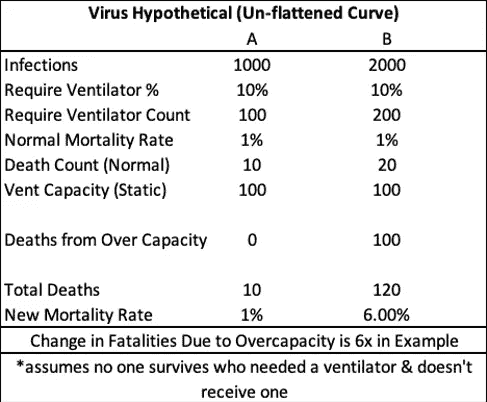

# 拉平许多曲线

> 原文：<https://towardsdatascience.com/flattening-the-many-curves-bef1e94a6d25?source=collection_archive---------39----------------------->

缅因州新港——迈克·卢基安诺夫摄影

## 曲线是局部的——即使很小的爆发也能摧毁较小的社区

当我与人们谈论社交距离和阅读反对庇护指令的观点时，我震惊于人们对社交距离的目的和价值以及“拉平曲线”的意义的困惑。非常简单地说，大规模隔离/社会距离服务于一个主要目的——***阻止每个人同时生病*** 。当每个人同时生病时，医疗响应能力就会崩溃，死亡人数也会增加。这并不是为了永久地拯救人们免于被感染——这实际上只是为了推迟不可避免的事情，以便我们中的更多人能够幸免于难。包括一些美国参议员在内的许多人继续指出支持这一立场的顶级统计数据，即社交距离的成本比病毒本身更糟糕。如果不解决选择牺牲生命换取 GDP 这一严肃的道德和伦理问题，似乎我们至少应该向我们牺牲的羔羊解释清楚，社会距离做/不做什么。

**缺乏检测使得大范围封锁成为必要**:人们谈论/写道要采取更外科手术式的方法来控制病毒。将韩国作为一个案例研究——早期的大规模检测和追踪感染者的社会接触，以及在全国范围内的严厉执法帮助他们遏制了病毒。事实上，没有症状的人可以携带和传播这种病毒，这使得检测对于遏制病毒比以往任何病毒都更加重要。至少从一月份开始，这一点已经广为人知(尽管一位美国州长声称在 4 月 2 日发现了这一点)。如果没有疾控中心跟踪的广泛检测，就没有办法在不引发另一场疫情的情况下控制解除当地隔离。大规模测试要把我们从大规模隔离的需要中拯救出来已经太晚了，但是大规模测试需要到位才能让我们摆脱隔离。

**拉平曲线是关于管理医疗保健能力:**不，在开发出疫苗或更好的疗法之前，我们都不会被隔离(尽管这应该同时发生)。隔离的主要目的是试图将医院中的人数控制在医院能够照顾他们的最大能力之下。由于不同的地理区域在不同的时间被袭击，并且有不同的医疗能力，每个州和当地的自治市看起来会非常不同。要了解不同州的曲线，请访问 https://covid19.healthdata.org/projections。虽然很难知道在如此低的测试水平下，对大多数州病例数量的预测是否准确，但能力限制的整合应使其成为了解局部风险的非常有用的工具。

**如果医疗系统超出能力，病毒的“自然”死亡率就无关紧要:**由于测试不佳，病毒的自然死亡率估计值很难确定。似乎越来越确定的一件事是，那些认为它“就像流感”的人可能会错 7-10 倍。然而，即使新冠肺炎的自然死亡率与季节性流感一样低——它在人口中的传播速度也会增加需要医疗护理的总人数，以至于原本可以得救的人会死亡。以此作为一个过度简化的例子，说明超出容量的系统是如何放大结果的:

X 病毒已经感染了 1000 人，它的正常死亡率为 1%，10%达到需要呼吸机才能生存的地步。如果当地医院只有 100 台呼吸机(假设硬约束，没有即兴发明)。如果同样的病毒传播到 2000 人，容量限制会将前 100 名以上需要呼吸机的人拒之门外。假设没有一个需要呼吸机的人能在没有呼吸机的情况下存活，正常的死亡率适用于有呼吸机的人。在这个简化的例子中，死亡率从 1%飙升至 6%。

显然，在现实世界中，容量过剩/容量不足之间的界限并不十分清晰，但当你达到临界点时，其后果可能会实际上使死亡率增加许多倍——特别是在当地水平**。在能力方面有更多的限制，包括人员配备、重症监护室床位、药物等。试图通过简单地采用全国总感染人口估计数并乘以静态死亡率来预测 COVID 疫情总死亡人数的模型没有考虑到当地的能力限制，因此严重低估了无所作为的人类成本。**

****展望未来:**尽管强烈的声音敦促我们在病毒达到顶点之前回去工作，过早的“恢复正常”将对人类生命造成又一次可怕的损失，并对经济造成第二次灾难性的打击。为了让我们“重新开始工作”,需要一个大规模的检测机制和一个协调良好的、有针对性的隔离系统，以确保健康的人受到保护，病毒携带者被隔离。这不仅需要测试，还需要警惕的集中跟踪结果和快速行动计划，以迅速遏制疫情的再次出现。这就是我们回去工作的方式——但是没有迹象表明联邦政府的领导层有能力取得如此大的成就。如果“恢复工作”的命令最终没有在流通中进行数十亿次快速 COVID 测试，以及在我们“重新开业”之前进行隔离和遏制的国家计划，我们将发现自己又回到了起点——在试图“管理曲线”的本地化封锁中。**

*****编者注:*** [*走向数据科学*](http://towardsdatascience.com/) *是一份以研究数据科学和机器学习为主的中型刊物。我们不是健康专家或流行病学家，本文的观点不应被解释为专业建议。想了解更多关于疫情冠状病毒的信息，可以点击* [*这里*](https://www.who.int/emergencies/diseases/novel-coronavirus-2019/situation-reports) *。***