# 缓解交通拥堵

> 原文：<https://towardsdatascience.com/flattening-traffic-congestion-b668b1fcda0f?source=collection_archive---------41----------------------->

## 新冠肺炎如何改变我们的驾驶模式的分析

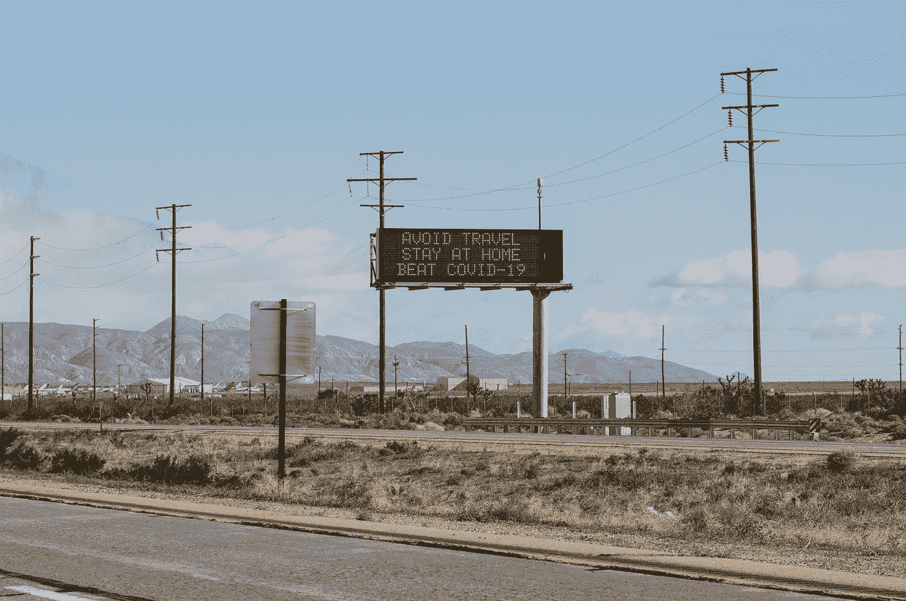

Brian Wangenheim 在 [Unsplash](https://unsplash.com?utm_source=medium&utm_medium=referral) 上拍摄的照片

免责声明 *—* [*健康或 COVID:来自我们编辑的注释*](/coronavirus-note-from-our-editors-75edf965777c)

我花了很多时间在不列颠哥伦比亚的海天高速公路上，往返于我在斯夸米什的家和我在温哥华的工作单位之间。结果，我想到了交通…很多。我知道，周一到周五，如果我在早上 6:45 而不是 7:00 离开我在斯夸米什的家，我可以避免拥堵，并节省 10 分钟的上班时间。我知道，晚于下午 4:00 下班会让我在钢铁工人桥上遇到大塞车，周五下午温哥华到斯夸米什的“周末战士”交通会让我在北温哥华陷入令人窒息的停滞状态。我也知道周末海空高速公路上的交通堵塞，特别是在惠斯勒的长周末或大雪天，即使不比平日更糟糕，也一样糟糕。

你可能会认为，有了这些信息，我就可以避免交通堵塞，并最大限度地减少我的驾驶时间。不对。我仍然被困在城市走走停停，高速公路合并备份，以及与天气有关的减速。我可以接受这一现实，但作为一个喜欢硬数据而不是观察的人，我决定用一些数字来说明温哥华和海天高速公路的交通拥堵情况。

那么新冠肺炎和这些有什么关系呢？

事实证明，在建立我的数据集的过程中，我最终捕捉到了社会距离和非必要服务关闭对温哥华和海天交通拥堵的影响。这些结果不仅显示了道路上交通流量减少的明显结论，还表明了人们驾驶习惯和旅行倾向的转变，这意味着通勤者、“周末战士”、长周末家庭野营旅行和观光者的减少。

# 目标

我关注的是新冠肺炎对温哥华交通拥堵和海天高速公路的影响。具体来说，我想回答几个关键问题:

1.  对日常交通拥堵的总体影响是什么？
2.  工作日和高峰时间的交通拥堵是如何受到影响的？
3.  周末的交通拥堵情况有所改变吗(即人们是否因为个人原因减少了出行)？

# 收集数据

我从谷歌地图距离矩阵 API 收集了驾驶时间数据，并将其存储在亚马逊网络服务(AWS) DynamoDB 数据库中。这些数据是使用在 AWS Lambda 中按计划运行的 Python 代码收集的。距离矩阵 API 允许我请求两点之间的估计行驶时间，就好像我现在就要出发一样。这相当于在我的谷歌地图手机应用程序中输入目的地，然后得到一个估计的驾驶时间。

我在 2019 年 10 月 17 日至 2020 年 4 月 13 日之间每 30 分钟收集 4 条路线的数据，分别是[往返温哥华市区和斯夸米什](https://goo.gl/maps/VF2fYnoxrqdBRCxc7)和[往返东温哥华和斯夸米什](https://goo.gl/maps/Q9fP7XY3CvLBY5QX9)。本文仅提供温哥华至斯夸米什和东温哥华至斯夸米什的数据。这两条路线都是主要的通勤通道，但有一个主要因素不同，东温哥华到斯夸米什路线绕过温哥华市中心。

通过将我的 Google Maps API 请求限制在 4 条路线，并对 Lambda 和 DynamoDB 服务使用 AWS 免费层，我最终什么也没欠。一旦我收集了有用的数据集，我就编写一些 Python 代码，并将数据从 DynamoDB 导出到本地机器上的一个 CSV 文件中，在那里我清理并可视化了 Jupyter 笔记本中的数据。

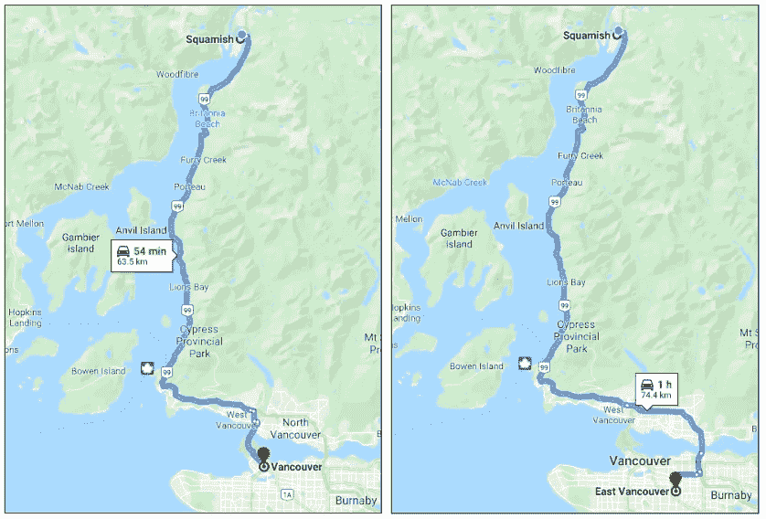

从斯夸米什到温哥华市区(左)和东温哥华(右)的路线

# 探索数据

行驶时间是一个容易收集的交通指标，可以揭示很多交通趋势。请看下图，该图显示了 2020 年温哥华和斯夸米什之间以及东温哥华和斯夸米什之间的行驶时间。这两条路线在早上和晚上的高峰时间都有高峰(即高峰)和晚上的平静(即低谷)。这在东温哥华到斯夸米什的记录中尤其明显，其中驾驶时间的峰值以 5 为一组，对应于周一到周五(例如，2020 年 1 月 20 日这一周)。另外，请注意两个记录中的异常值(最大的峰值)。这些事件代表的是增加驾驶时间的事件，超出了平均高峰时间交通可能造成的影响，例如一月中旬的暴风雪。

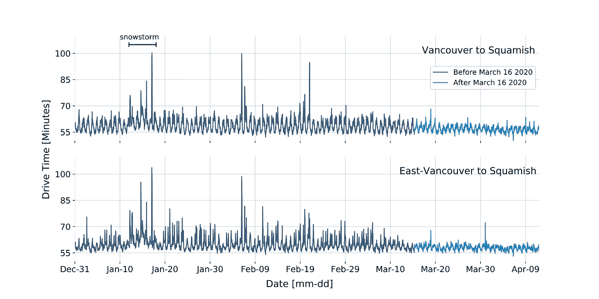

2020 年温哥华到斯夸米什(上图)和东温哥华到斯夸米什(下图)的行驶时间

新冠肺炎对驾驶时间的影响跃然纸上！3 月 16 日，贾斯廷·特鲁多总理宣布了抗击新冠肺炎的重大行动。我将这一天视为不列颠哥伦比亚省新冠肺炎的“开始”(至少在对驾驶时间的影响方面)。该日期后记录的驾驶时间显著减少。事实上，午夜和高峰时间驾驶时间之间的差异几乎消失了(即高峰和低谷更接近)！

**关于这个数据集，需要注意一些事情:**

1.  谷歌地图使用位置数据来帮助估计驾驶时间。这意味着路上的谷歌地图用户越少，驾驶时间估计的可变性就越大(即数据越少=不确定性越大)。例如，一辆汽车在半夜以 140 公里/小时的速度行驶在高速公路上，这将导致谷歌估计更短的行驶时间。相反，一辆汽车半夜停在高速公路上会导致谷歌估计更长的行驶时间。我见过谷歌地图在半夜显示减速(即红色地图颜色)，因为有一辆车靠边了。
2.  行驶时间对应于既有城市路段又有公路路段的路径。这意味着沿某条路线行驶时间的增加可能是由于城市中的交通流量增加，而高速公路是畅通的，反之亦然。因此，请务必记住，该数据集只能概括路线的总体趋势，而不能概括单个道路的趋势。

# 拥挤程度指数

虽然行驶时间对于可视化交通趋势(如高峰时间和天气延误)非常有用，但它并不容易解释。例如，如果我告诉你，昨天我花了 60 分钟从 **A** 开车到 **B** ，今天花了 70 分钟，你会认为今天堵车了。然而，如果我告诉你从 **A** 开车到 **B** 的平均时间是 55 分钟，你会认为这两天都堵车。但是如果我说平均时间是 75 分钟，而不是 55 分钟，你会认为这两天的交通都很少。看到问题了吗？行驶时间并不能直接告诉你交通拥堵的程度(即交通拥堵程度是高于还是低于平均水平)。

为了应对这一点，我创建了一个交通拥堵水平指数，定义为驾驶时间与周一至周五凌晨 2:00 的平均驾驶时间(即基线)之间的百分比差异。我假设周一到周五凌晨 2:00 的平均驾驶时间代表了没有交通堵塞的驾驶时间，或者交通专家所说的自由流动。

查看数据时，请记住以下几点:

*   **正拥堵级别意味着路线上的交通流量大于平均凌晨 2:00 观察到的流量。**
*   **负拥堵级别表示路线上的交通流量低于平均凌晨 2:00 观察到的流量。**
*   **拥堵级别是针对整条路线的，并没有说明拥堵发生在路线的哪个位置(即高峰时段拥堵可能发生在城市，而不是远离城市的高速公路)。**

请看下图，该图显示了 2020 年温哥华和斯夸米什之间以及东温哥华和斯夸米什之间的交通拥堵情况。两条路线在高峰时段的交通拥堵率都增加了 10%到 20%。超出这一范围的增长对应于“不可预见的”事件，如交通事故和恶劣天气(如 1 月中旬的暴风雪)。请注意，在暴风雪期间，即使是在午夜，拥挤程度也在上升。但是为什么暴风雪中的半夜会有更多的车辆呢？请记住上一节，谷歌地图使用位置数据来估计驾驶时间，因此，如果有几个人在暴风雪中驾驶，并且不可避免地驾驶缓慢，那么谷歌将估计较长的驾驶时间，这转化为增加的拥堵。

总的来说，拥堵级别指数比单独的驾驶时间提供了更大的洞察力，但也不是没有缺点(即，暴风雪中拥堵的增加或拥堵位置的不清晰)。

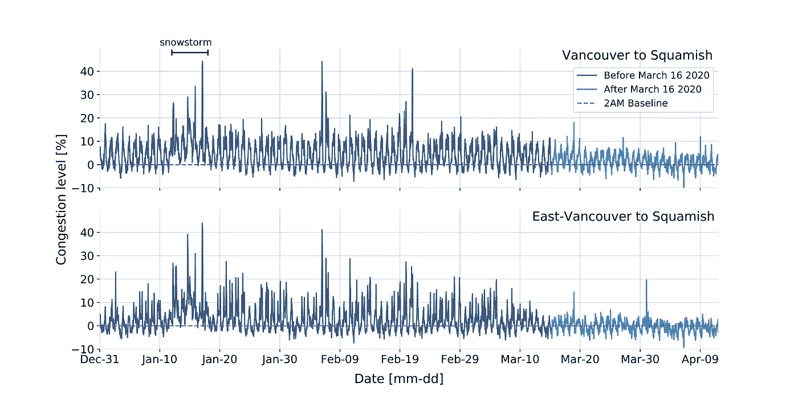

2020 年温哥华至斯夸米什(上图)和东温哥华至斯夸米什(下图)的拥堵水平

# 日常拥堵

问:对日常交通拥堵的总体影响是什么？

接下来的两个数字显示了在 2020 年 3 月 16 日之前和之后的某一天，上午 7:00 到下午 7:00 之间，您在温哥华到斯夸米什和东温哥华到斯夸米什路线上会遇到的平均交通拥堵情况。

这个数字不需要很多解释。新冠肺炎的影响是减少了这两条路线全天的交通拥堵。温哥华至斯夸米什航线的交通拥堵在工作日从 8%-10%减少到不到 4%，在周末从 5%-6%减少到不到 2%。东温哥华至斯夸米什航线的交通拥堵在一周内从 6%-9%减少到不到 1%，在周末从 2%-4%减少到不到 1%。**东温哥华到斯夸米什航线的负拥堵级别表明，现在上午 7:00 到下午 7:00 之间的平均交通流量比新冠肺炎之前的凌晨 2:00 要少。哇！**

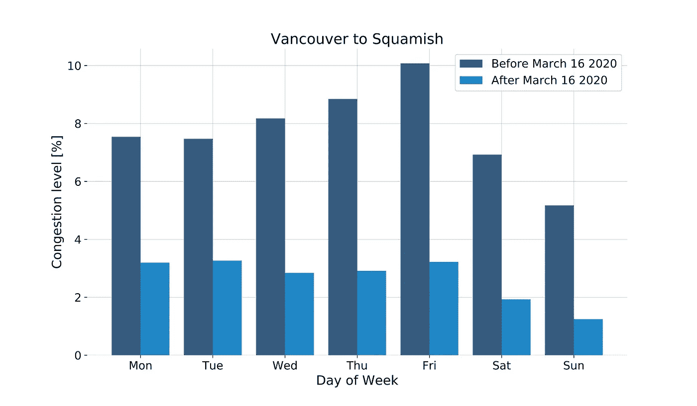

新冠肺炎对温哥华至斯夸米什每日交通拥堵的影响

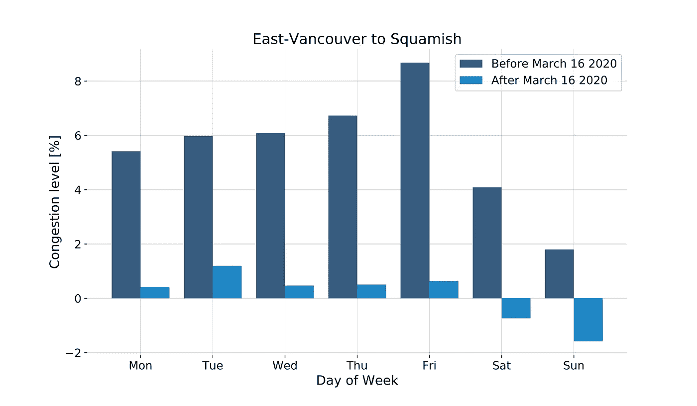

新冠肺炎对东温哥华至斯夸米什每日交通拥堵的影响

## **小时拥堵—工作日**

问:高峰时段的交通受到了怎样的影响？

每日交通拥堵揭示了高水平的趋势，但每小时的交通拥堵真正告诉我们人们生活的哪一部分受到了新冠肺炎的影响。接下来的两个数字显示了在 2020 年 3 月 16 日之前和之后的工作周期间，上午 7:00 到下午 7:00 之间，每小时在温哥华到斯夸米什和东温哥华到斯夸米什路线上遇到的平均交通拥堵情况。

不足为奇的是，所有时段的交通拥堵都有所减少，高峰时段的交通拥堵减少最多。此外，两条路线都有负面或接近负面的交通拥堵在晚上后新冠肺炎。这表明，人们不仅不去工作，而且在工作日呆在家里，这无疑是企业关门的一个原因。这是惊人的，一个主要的大都市在下午 6 点几乎没有交通拥堵！

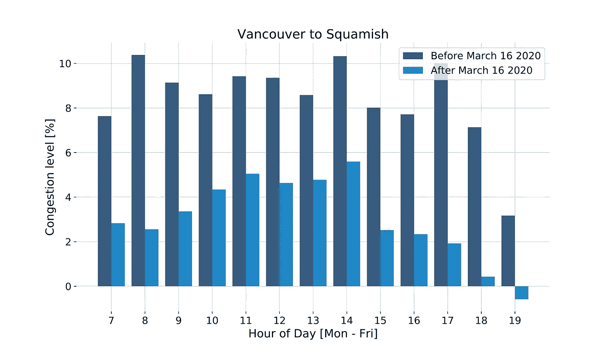

新冠肺炎对温哥华至斯夸米什工作日每小时交通拥堵的影响

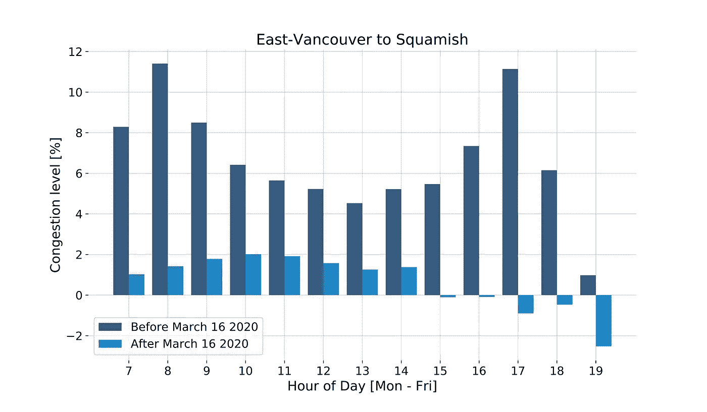

新冠肺炎对东温哥华至斯夸米什工作周每小时交通拥挤的影响

## 每小时拥堵—周末

问:周末交通受到了怎样的影响？

接下来的两个数字显示了在 2020 年 3 月 16 日之前和之后的周末上午 7:00 到下午 7:00 之间，您在温哥华到斯夸米什和东温哥华到斯夸米什路线上每小时会遇到的平均交通拥堵情况。

在新冠肺炎之前，如果你从温哥华或东温哥华出发去斯夸米什骑自行车、滑雪或喝贡多拉啤酒一天，然后在上午 10 点后离开，你会觉得是在开慢车。现在，你最好还是早点离开，但是即使你中午离开，交通堵塞也会少很多。这表明，人们不仅在工作日不通勤上班，晚上呆在家里，而且由于个人原因，他们在周末开车的次数也减少了。

新冠肺炎对温哥华至斯夸米什周末每小时交通拥堵的影响

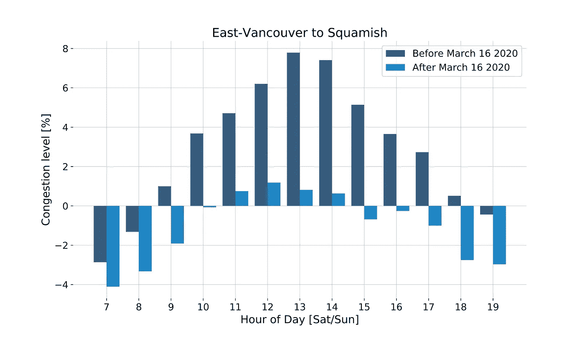

新冠肺炎对东温哥华到斯夸米什周末每小时交通拥堵的影响

## 每小时拥堵—晴朗/温暖的周末

**问:在阳光明媚的周末，人们还会开车从海上去天空高速公路吗？**

接下来的两张图显示了 2020 年 3 月 16 日之前的周末以及 2020 年 3 月 16 日之前和之后的周末，上午 9:00 至下午 14:00 之间，您在温哥华至斯夸米什和东温哥华至斯夸米什路线上每小时可能遇到的平均交通拥堵情况。

海空高速公路带司机穿过斯夸米什和惠斯勒，是一条很受欢迎的户外休闲公路。我的思考过程是，当户外活动更受欢迎时，人们更倾向于在天气好的时候开车去海上高速公路，所以在温暖晴朗的周末观察拥堵趋势会让我们更深入地了解有多少“游客”去斯夸米什。

结果相当令人信服。最高拥堵级别对应的是 2019 年 11 月温暖晴朗的周末。在这个周末，拥堵程度甚至大大超过了新冠肺炎之前周末的平均拥堵水平。更令人惊讶的是新冠肺炎飓风后温暖晴朗的周末拥堵情况有所减少。事实上，新冠肺炎事件后最不拥堵的周末是一个美丽的复活节周末，通常会有成千上万的司机在海上高速公路上行驶。

在更个人的层面上，最有趣的数据是 3 月 21/22 日的周末。本周末有[经证实的新闻报道](https://www.squamishchief.com/news/local-news/bc-parks-closes-off-access-to-the-stawamus-chief-1.24103455)称数百人徒步 Stawamus Chief(斯夸米什的一条受欢迎的小道),在这些报道之后，有说法称大部分是来自温哥华的人没有遵循新冠肺炎的社交距离惯例，开车去斯夸米什。如果这是真的，我本以为拥堵水平会更接近新冠肺炎之前的平均水平。特别是因为社交距离意味着司机不再拼车，这意味着路上有更多的车来让同样数量的人到达一个地点。

相反，我认为一个更合理的答案是，游客的增加可能比预期的占当地居民的比例更大。考虑到这一点，工作的人越来越少，而那些工作的人都是在家工作，实行半灵活的时间表。此外，在新冠肺炎期间，人们一直在推动限制他们接触极限运动，如野外滑雪和爬山。所有这些都表明，可供娱乐的地方越来越少，而更多的当地人有空闲时间去娱乐。

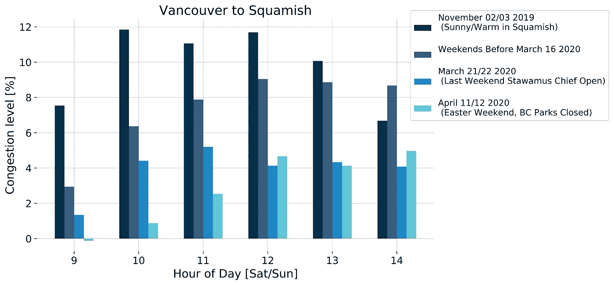

新冠肺炎对温哥华至斯夸米什选定周末每小时交通拥堵的影响

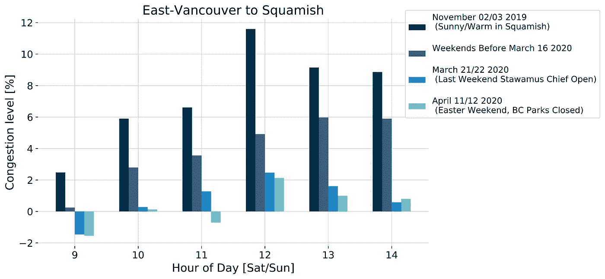

新冠肺炎对东温哥华至斯夸米什选定周末每小时交通拥堵的影响

# 结论

我很幸运，因为我的数据集是在新冠肺炎措施开始前后收集的，这给我留下了一个有趣的故事，但我的发现并不孤单。全世界，包括其他[加拿大](https://www.theglobeandmail.com/drive/mobility/article-rush-hour-traffic-plummets-as-people-respond-to-the-covid-19-pandemic/)城市，交通拥堵都在减少。

**主要外卖如下:**

*   路上的司机越来越少。工作日高峰时间和周末交通拥堵都有所下降。
*   人们不仅不去工作，而且他们似乎听从了呆在家里的指导方针，因为个人原因不开车。这表现在晚上和周末的交通拥堵明显减少。
*   开车从大海到天空高速公路，参观斯夸米什和惠斯勒的人数似乎有所下降。人们住在离家更近的地方。不过，我承认用这个数据集来做这个断言有点牵强。相反，仅沿着海空高速公路(即没有城市交通)收集斯夸米什和温哥华之间的数据将会揭示更多**。**

本分析中使用的所有数据都可以在 [GitHub](https://github.com/david-hurley/traffic-congestion-analysis) 上免费获得。