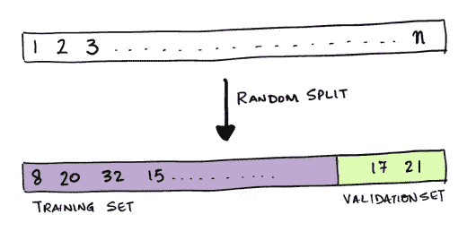
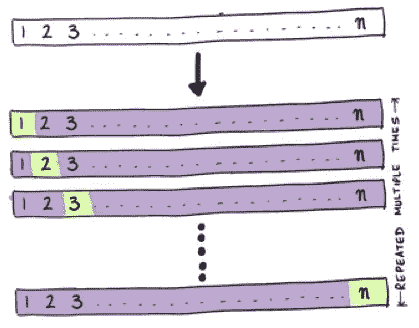
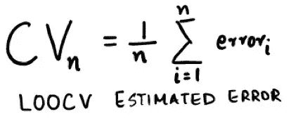
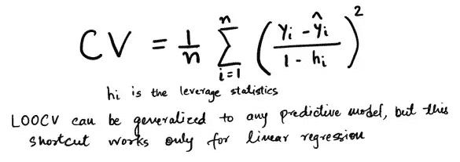
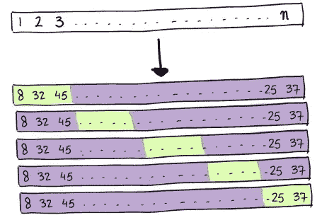
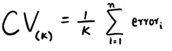
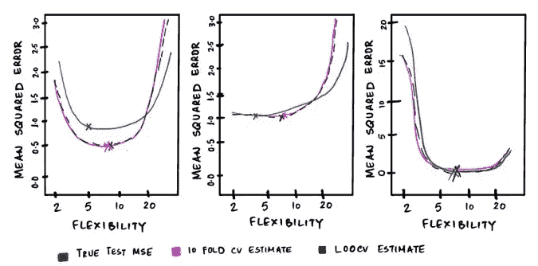
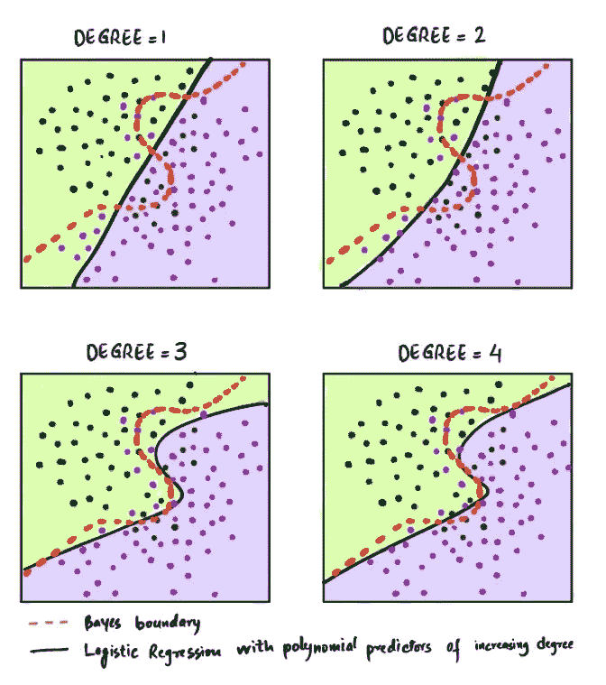
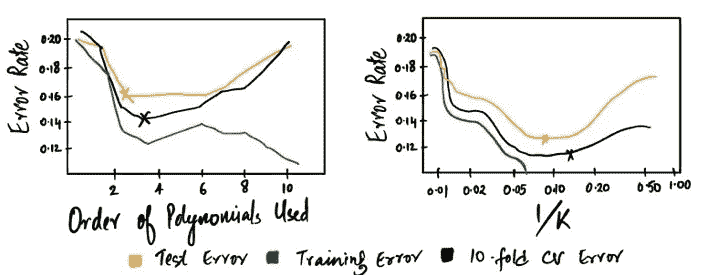

# 交叉验证的味道

> 原文：<https://towardsdatascience.com/flavors-of-cross-validation-edfee24e8916?source=collection_archive---------24----------------------->

## 使用交叉验证背后的动机

内森·杜姆劳在 [Unsplash](https://unsplash.com) 上的照片

交叉验证(也称为**旋转估计**或**样本外**测试)是一种重采样方法，用于

**模型评估**(评估模型的性能)

**型号选择**(选择型号的适当灵活度)

交叉验证评估预测模型的性能，并评估它们在独立数据集上的样本外的表现。简单地说，它检查一个**模型是否是可推广的**。

## 传统模型评估技术:-

***验证集方法(数据分割)***

在这种方法中，观察集被随机分为训练集和验证集。70/30 或 80/20 的比例更常用，尽管确切的比例取决于数据的大小。

在训练集上拟合该模型，然后使用拟合的模型来预测对验证集中的观察的响应。得到的验证集错误率提供了对测试错误率的估计。根据响应的类型，可以使用适当的误差度量来测量误差率，例如均方误差(MSE)、均方根误差(RMSE)或平均绝对百分比误差(MAPE)。

***优势:-***

简单且易于实施

计算上**便宜**

***缺点:-***

错误率可能具有**高方差**，这取决于哪些**数据点**最终出现在**训练集和验证集**中

**高估**的**测试误差**。记住，统计方法在训练较少的观察值时表现会更差。在这种方法中，很大一部分观察值在验证集中，其余的在训练集中。

***留一交叉验证(LOOCV)***

在 LOOCV，数据以这样的方式分割:除了一个数据点包含在验证集中之外，所有的数据点 (n-1)都包含在训练集**中。重复该方法，直到每个数据点都被用作验证集。计算平均误差以评估模型。**

***优点:-***

**偏差较小**。由于训练集大小包括几乎所有的观察值(n-1)，与验证集方法相比，高估误差的趋势几乎可以忽略。

***劣势:-***

*   计算上**昂贵**(模型需要拟合 n 次)。

对于线性回归，有一个降低 LOOCV 成本的捷径:

***k 倍交叉验证***

在这种方法中，数据被随机分成大小近似相等的 k 个子集**。一次，一个折叠被视为验证集，其余折叠(k-1)被视为训练集。重复该过程，直到每个折叠被用作验证集，即 k 次。通过取测试误差的 k 个估计值的平均值来计算 k 倍 CV 估计值。**

***优势:-***

这种方法**减少了数据分割方式的影响**。每个数据点在测试集中出现一次，在训练集中出现 k-1 次。随着 k 的增加，估计值的方差减小。

***缺点:-***

由于与 LOOCV 相比，该模型的数据较少，因此**会将偏差**引入测试误差的估计中。

***k 倍 CV 的偏倚和方差权衡***

偏倚是样本统计数据系统地高估或低估总体参数的趋势。就**偏倚缩减**而言， **LOOCV 优于 K-fold CV，**，因为它使用 n-1 个样本来训练模型，这与全数据集一样好。

方差衡量一组数据点偏离平均值的程度。*高相关值的平均值比低相关值的平均值具有更高的方差*。由于在 **LOOCV** 中，每个拟合模型中的训练数据集几乎相似，每个模型的输出高度相关，导致**的方差高于 K 倍 CV**

**k 值越大，方差越小，偏差越大**，而**降低 k 会增加方差，降低偏差**。考虑到这些因素， **k = 5 或 k = 10** ，给出了偏差和方差平衡的最佳点。

## 选择最佳模型

***在一个回归问题中***

对于导致**最低测试误差**的方法，我们在**估计测试 MSE 曲线中寻找**最小点**的位置。**

尽管 CV 误差估计与实际测试误差不同，但交叉验证误差最小的模型通常具有相对较小的测试误差。

*   ***在分类问题中***

通过选择交叉验证误差估计值最小的模型，可以使用交叉验证来决定最佳模型。在下图中，10 倍 CV 误差估计提供了测试误差率的一个很好的近似值。

***带回家消息*** : —交叉验证*是评估模型有效性的有用工具，尤其是处理过拟合和欠拟合*。

**简而言之，学习方法中涉及数据的每个方面都必须进行交叉验证。**

参考资料:

1.  G.放大图片作者:James d . Witten t .统计学习导论:在 R 中的应用。(2013).