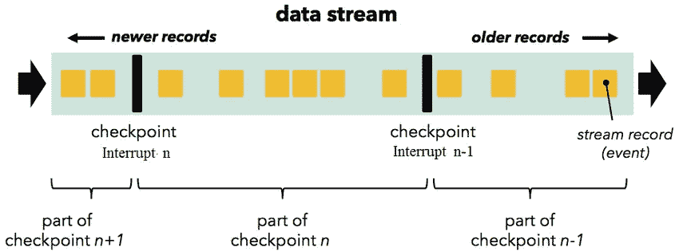

# Flink 检查点和恢复

> 原文：<https://towardsdatascience.com/flink-checkpointing-and-recovery-7e59e76c2d45?source=collection_archive---------48----------------------->



[图片来源于 Apache Flink](https://ci.apache.org/projects/flink/flink-docs-release-1.11/fig/stream_barriers.svg)

## 如何使用检查点和允许延迟建立容错的流管道

[Apache Flink](https://flink.apache.org/) 是一个流行的实时数据处理框架。由于它以容错方式以极高的吞吐量进行低延迟处理，因此越来越受欢迎。

虽然 Flink 提供了很好的文档，但我花了一些时间来理解各种机制，这些机制共同使 Flink 检查点和恢复工作端到端地进行。在本文中，我将解释创建容错 Flink 作业需要在不同操作员级别执行的关键步骤。Flink 基本运算符是源、进程和接收器。流程操作符可以有多种风格。

因此，让我们开始了解您需要做些什么来启用检查点并让所有操作者都知道检查点。

## Flink 环境配置(检查指向)

检查点的 Flink 作业配置

## 源操作符检查点

源操作符是从源中获取数据的操作符。我编写了一个简单的基于 SQL 连续查询的源操作符，并跟踪时间戳，直到数据被查询。该信息将作为 flink 检查点流程的一部分进行存储。flink 在作业操作员级别保存源的状态。***check pointed function***接口或者***list check pointed***接口应该由源函数实现如下:

根据配置，Flink 作业操作员将每 30 秒调用一次***snapshot state***方法。方法应该返回要保存在状态后端中的值

***restoreState*** 方法在操作员重启时调用，该方法是处理程序方法，用于设置检查点期间最后存储的时间戳(状态)

## 过程功能检查点

Flink 支持通过***KeyedProcessFunction***保存每个按键的状态。***process window function***也可以在事件时间处理的情况下，按键保存窗口的状态

对于***KeyedProcessFunction***， ***ValueState*** 需要按键存储如下:

***ValueState*** 只是其中一个例子。还有其他拯救国家的方法。***ProcessWindowFunction***自动保存窗口状态，无需设置变量。

## 接收器函数检查点

接收器函数检查点的工作方式类似于源函数检查点，状态保存在作业操作符级别。我已经为 Postgres DB 实现了 Sink 函数。考虑到性能和效率，可以有多种方法来使宿功能容错和鲁棒。我采用了一种简单的方法，并会在今后加以改进。

通过在 ***snapshotState*** 方法中提交语句，我确保所有未决数据都被刷新并作为检查点触发器的一部分提交。

## 准备就绪

最后，您需要运行您的作业，您可以在处理之间尝试取消它，并通过提供如下检查点位置来尝试重新运行它。你需要自己通过最近的关卡，注意 **-s** 参数。

```
.\flink.bat run -m localhost:8081 **-s D:\flink-checkpoints\1d96f28886b693452ab1c88ab72a35c8\chk-10** -c <Job class Name> <Path to Jar file>
```

## 结论

这是检查点和故障恢复的基本方法，可能需要根据每个用例进行更多的改进。请随时向我提供您的反馈。快乐阅读！！

代码库的存储库链接:

[](https://github.com/swagy-tarun/flink-demos) [## 斯瓦吉-塔伦/弗林克-德莫斯

### GitHub 是超过 5000 万开发人员的家园，他们一起工作来托管和审查代码、管理项目和构建…

github.com](https://github.com/swagy-tarun/flink-demos)