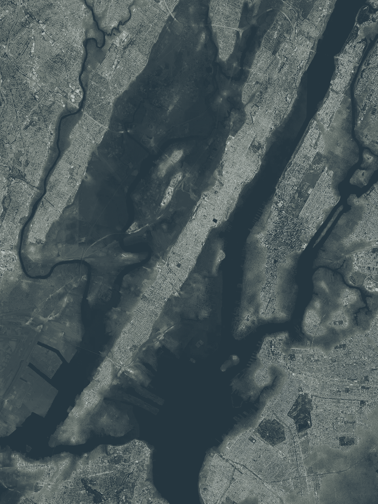
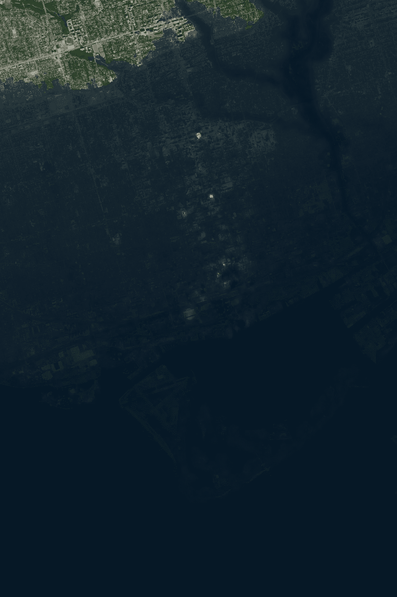
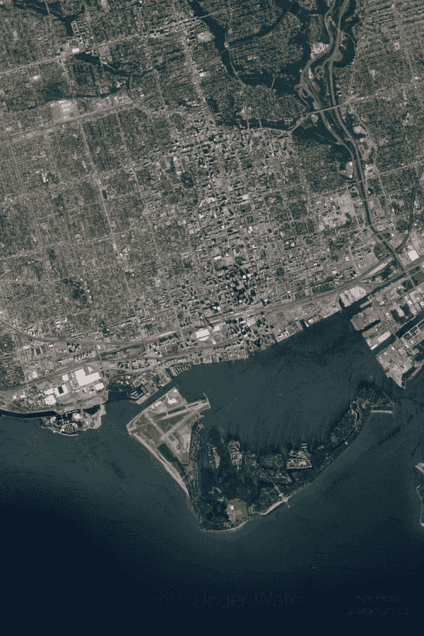

# 使用 Mapbox 和 Python 制作洪水地图动画

> 原文：<https://towardsdatascience.com/flood-map-animations-with-mapbox-and-python-fb0b5d3109a7?source=collection_archive---------44----------------------->

## 进来吧，水很好！



纽约市洪水(凯尔·帕斯托尔)

在我以前写的一篇文章中，我们谈到了使用 Mapbox 和 Python 来获得超高分辨率的卫星图像。除了卫星图像之外，我们还能够获得海拔地图，它基本上告诉我们每一个像素的海拔高度，以米为单位。有关更多详细信息，请参见以下内容:

[](/creating-high-resolution-satellite-images-with-mapbox-and-python-750b3ac83dd7) [## 用 Mapbox 和 Python 制作高分辨率卫星影像

### 超高分辨率卫星和高程图像

towardsdatascience.com](/creating-high-resolution-satellite-images-with-mapbox-and-python-750b3ac83dd7) 

这次我想把这些数据应用到一些有趣的事情上。

> 如果海平面上升会发生什么？一座城市被水淹没后会是什么样子？

我们将假设我们运行了代码来获取之前的影像，所以我们在这里想要做的是编写一个简短的脚本，它将随着时间的推移来制作洪水水位的动画。

像往常一样，我们从导入和子目录开始

```
import numpy as np
import PIL **# Image manipulation library** mkdir ./depth  **# Just a place to store our animation frames**
```

接下来，我们将简单地循环我们感兴趣的深度级别。这就是一些艺术性来选择一个很好的水平范围来制作一个流畅有趣的动画。你可能要玩一会儿了！

```
**# Loop over a range between 0 and 100 in 0.25 increments**
for i, level in enumerate(np.arange(0,100,0.25)):

    **# First open up the satellite image we want as the background**
    im = PIL.Image.open('./composite_images/satellite.png')
        .convert('RGBA') ** # Create a solid image that looks like deep water (dark blue)**
    overlay = PIL.Image.new('RGBA', im.size,(4,22,37,255)) **# Convert it into a numpy array**
    ni = np.array(overlay) **# Next we extract the elevation data into a numpy array**
    e = np.array([np.array(xi) for xi in elevation_data]) **# NB: both ni and e are the same shape so we can operation on
    them with numpy** **# Perform element-wise subtraction with the level**
    depth = level - e
```

在循环的这一点上，我将快速离开一下。这里我们有一个与原始图像大小相同的数组。它包含每个像素的深度。下一步是决定如何根据深度修改*叠加图像。*在这个例子中，我决定根据深度缩放 alpha 通道(透明度)。越深，透明度越低，我们看到的水就越暗。

```
 alpha_mask = np.copy(depth)
    alpha_mask = alpha_mask*255/alpha_mask.max()
    alpha_mask  = np.where(alpha_mask<0, 0, alpha_mask)
    alpha_mask = alpha_mask**.2 
    alpha_mask = alpha_mask*255/alpha_mask.max()
```

让我们再一次一行一行地回顾我们刚刚做的事情。

L1:我们通过 ***复制*** 深度数组做了一个阿尔法遮罩。复制是非常重要的，否则它就是对对象的引用(如果对象改变了，它也会改变)。

L2:然后我们缩放蒙版，最深的像素设置为 255(最大不透明度)。这当然重新调整了所有的元素，这正是我们想要的。

L3:任何小于零(水面以上)的东西我们都将设置为完全透明。

L4:我遇到的一个问题是水的整体外观没有给人一种视觉上的深度感。它要么看起来完全黑暗，要么非常透明。我决定放大这些点，这样透明度会有一个梯度下降。我使用 x**0.2 作为我的函数，但你可以改变它，以适应什么好看。

L5:在我们的功率标度之后，我们做了另一个重新标度。

```
 **# Set the overlay layer opacity channel to the alpha mask**
    ni[...,3] = alpha_mask[...] **# Convert the numpy array back to an image**
    W = PIL.Image.fromarray(ni) **# Paste the image and save every depth frame**
    im.paste(W , (0,0),W)
    im.save('./depth/'+ str(i).zfill(4) +'.png')
```

为了体验一下单帧图像的效果，下面是多伦多大约 100 米深处的图像。你可以看到缩放使山谷看起来有更深的水。



多伦多被淹至 100 米左右(凯尔·帕斯托尔)

这看起来很不错，所以现在是时候制作动画了。我们将使用 ffmpeg 把我们的许多帧图像转换成一个. mp4 文件。首先，我们必须安装所需的软件包。注意，我在 Kaggle(在线 python 笔记本)上做了所有这些，它在最后有链接。

```
**# Install the package in linux**
apt-get update
apt install -y ffmpeg**# Run the command**
ffmpeg  -i ./depth/%04d.png -c:v libx264 -c:a aac -ar 44100 -filter "minterpolate='fps=30'" -pix_fmt yuv420p output.mp4
```

所用的一组参数大多是为了使 mp4 的最终编码可以在 insta gram(@ datastufplus)上发布。

在我们运行这个并做了一些简单的文字叠加(使用 inshot for android)之后，我们得到了最终的动画。



多伦多洪水(凯尔·帕斯托尔)

哇，看起来真酷！

最棒的是，你可以在任何地方重新运行。整个事情都是自动化的！

# 参考和链接

我做了这一切，因此图像是我的！万岁！

代码链接可在此处找到:

[](https://www.kaggle.com/kapastor/flood-map-with-mapbox-and-python) [## 使用 Mapbox 和 Python 制作洪水地图

### 使用 Kaggle 笔记本探索和运行机器学习代码|使用来自非数据源的数据

www.kaggle.com](https://www.kaggle.com/kapastor/flood-map-with-mapbox-and-python)