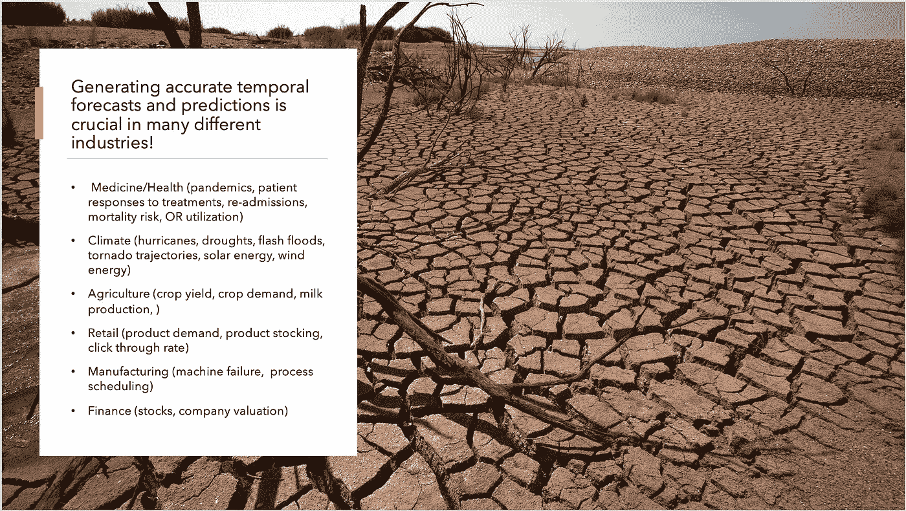

# flow-Forecast:py torch 中的时间序列预测库

> 原文：<https://towardsdatascience.com/flow-forecast-a-time-series-forecasting-library-built-in-pytorch-bbae7d8407b3?source=collection_archive---------29----------------------->

## 准确的多元时间序列预测和分类仍然是许多企业和非营利组织面临的主要挑战。

Flow Forecast 是[最近创建的开源框架](https://github.com/AIStream-Peelout/flow-forecast)，旨在方便使用最先进的机器学习模型来预测和/或分类复杂的时态数据。此外，flow-forecast 与 Google 云平台、Weights and Biases、Colaboratory 和其他行业常用工具进行了本机集成。

**背景**

[在我之前的一些文章中，我谈到了对精确时间序列预测的需求以及使用深度学习的前景](/attention-for-time-series-classification-and-forecasting-261723e0006d?source=---------2------------------)。流量预测最初是使用变压器和基线模型的变体来预测溪流和河流流量。然而，在训练变压器的过程中，我遇到了几个与找到正确的超参数和正确的架构相关的问题。因此，有必要开发一个平台来尝试多种配置。流量预测旨在允许您非常容易地为您的模型尝试许多不同的超参数和训练选项。改变一个模型就像在配置文件中交换模型的名字一样简单。

我面临的另一个问题是如何将额外的静态数据集整合到预测中。对于河流流量预测，有大量的元数据，如纬度、经度、土壤深度、海拔、坡度等。为此，我们决定研究像自动编码器这样的无监督方法来形成嵌入。这激发了创建一种通用方法来综合嵌入和时间预测的想法。

**利用流量预测**

有几个简单的资源可以用来开始流量预测。我在 5 月份录制了一个简短的介绍视频,还有更详细的现场编码会议[。](https://www.youtube.com/watch?v=thh_BaVbOhs&t=1477s)我们还有一个基本的[辅导笔记本](https://colab.research.google.com/drive/1u2xHJI_z-XoLTeFYGRzYS5PjdZGRakyG)，你可以用它来了解流量预测是如何解决一个基本问题的。此外，还有一个[更详细的笔记本，我们用它来进行核心新冠肺炎](https://github.com/CoronaWhy/task-ts/blob/master/notebooks/COVID_Covariate_Forecast-1.5.ipynb)预测。[最后，我们还提供了 ReadTheDocs 以获取深入的文档](https://flow-forecast.readthedocs.io/en/latest/#)以及我们的官方维基页面。

**投稿**

我们总是欢迎新的模型和损失函数出现在我们的知识库中。我们已经创建了一些描述贡献过程的简单文档。还有几个[现场编码视频](https://www.youtube.com/channel/UCJeAAx1mDUEVpTYEX0EWXSg)，所以你可以看到如何自己添加新的模型到存储库中。

**流量预测和路线图的核心目标**

*   提供一个中央存储库，存储所有用 PyTorch 编写的最新时间序列预测和分类模型，并且易于扩展。
*   使用各种损失函数、评估指标轻松评估您的模型，并查看预测值与实际值的图表。
*   测试各种超参数、损失函数和轻微的架构变化。通过 Wandb 报告和自动减重到云来跟踪您的实验。
*   从文本、图像、数字、地理空间等多种形式将静态元数据合成到您的预测中
*   允许您利用时间序列的最新迁移学习/预培训技术来改进您的预测。
*   支持将时间序列模型轻松部署到生产环境中，以及简单易用的持续评估机制。
*   轻松集成云提供商，如 GCP、AWS 和 Azure 及其相关的数据存储解决方案 GCS、S3、Redshift、BigQuery 等

**问题/反馈**

我们感谢对我们的知识库的问题和反馈。如果你遇到一个 bug 或者想要一个额外的特性，比如一个模型或者一个损失函数，你可以自由地打开一个问题。