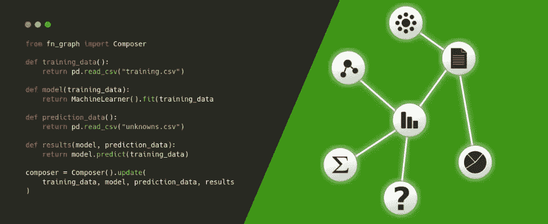
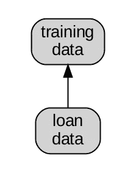
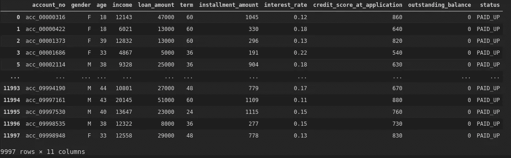
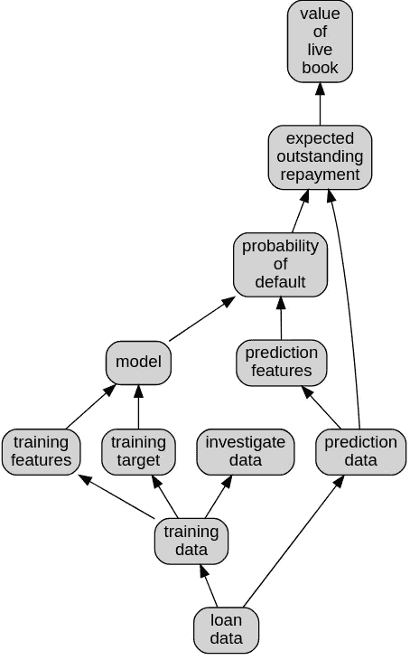
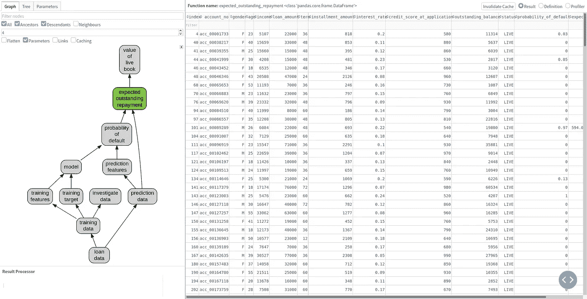
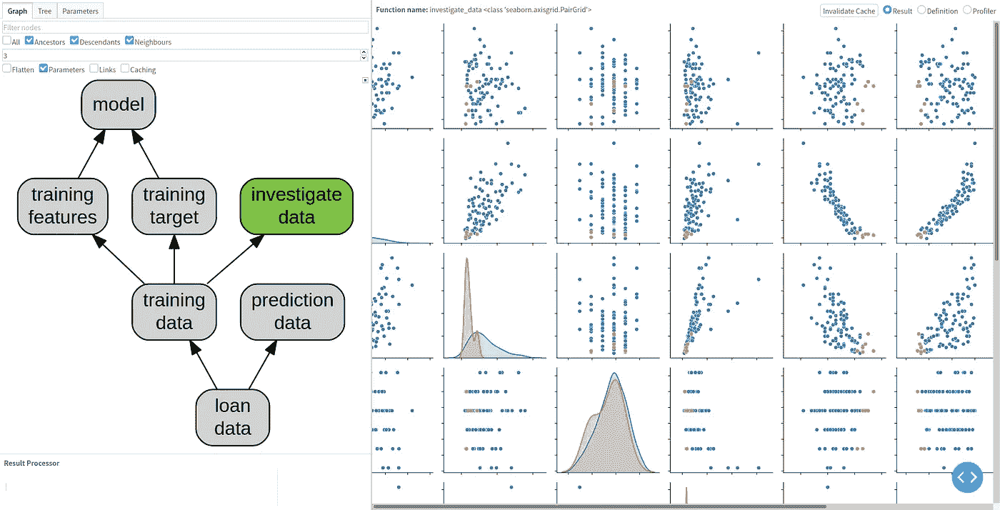
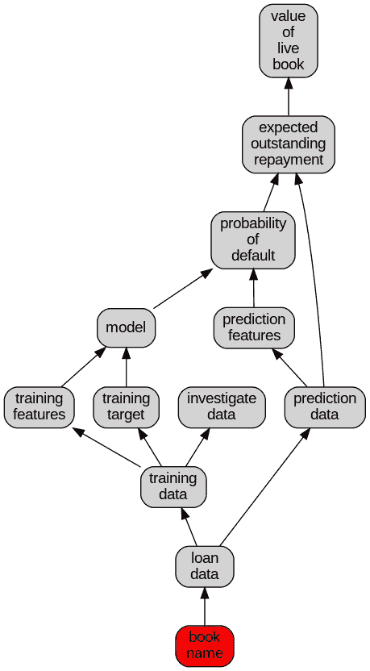
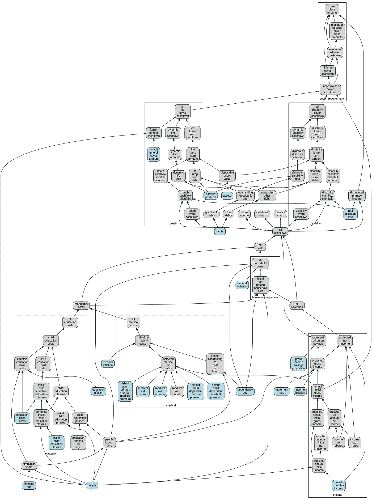

# Fn 图 Python 中的轻量级管道

> 原文：<https://towardsdatascience.com/fn-graph-lightweight-pipelines-in-python-121f8d5f9ef6?source=collection_archive---------38----------------------->



## 管理、维护和操作数据科学、财务或任何其他复杂的业务逻辑

今天我们发布我们新的 Python 建模管道(或函数图)库 [*fn_graph*](https://fn_graph.businessoptics.biz/) 。过去十年来，我们一直在构建和运营各种类型的计算模型，无论是机器学习模型、金融模型还是通用数据管道。这个图书馆是我们过去所有学习的成果。

# **什么是 fn_graph？**

*fn_graph* 是一个轻量级的库，让您可以轻松地在 python 中构建和可视化数据流样式的模型，然后轻松地将它们移动到您的生产环境中或嵌入到您的模型支持产品中。

*fn_graph* 旨在改善车型生命周期的开发阶段、生产阶段和维护阶段。

# **等等，我们说的模型是什么意思？**

模型是一个非常超载的术语，但这里我们指的是整体意义上的。这包括统计和机器学习模型，它们之前的数据准备逻辑，以及更经典的定量模型，如金融模型。与模型相关联的是进行测试、评估和配置的所有逻辑。

# **标准方法有什么“错误”？**

开发模型并将它们集成到生产系统或产品中的标准方法有许多令人恼火和低效的地方。标准模型开发生命周期可以(非常粗略地)分为 3 个阶段:

## 模型开发

模型开发需要调查任何基础数据、设计解决方案、准备数据、训练任何机器学习模型以及测试任何结果。这通常发生在 Jupyter 笔记本电脑中，也经常发生在分析师的笔记本电脑(或个人云实例)上。在这个阶段，快速迭代、尝试新想法并与相关利益相关者分享这些结果的能力是至关重要的。

笔记本是数据社区的一大进步，但它们也有一些不尽人意的品质。主要问题是它们主要是为实验而构建的，而不是构建可重用的东西。这在学术界是很好的，在那里你主要是想展示一些可以做的事情或者证明一个特定的结果，用相关的可爱的标记、图表和一个写得很好的文化编程风格的叙述。不幸的是，令许多数据科学家新手失望的是，这不是工业界想要的。行业希望能够不止一次地运营某项业务，以便有希望实现盈利。

普遍的现实甚至更糟糕，大多数时候你不会得到一个漂亮的唐纳德·克努特风格的笔记本。相反，由于笔记本的性质，它不利于模块化，你会得到一堆难看的非常非结构化、未封装的代码，这些代码通常不会运行，除非这些单元以一种连作者都不知道的神奇顺序运行。对于一个适当复杂的领域，笔记本可能会变得非常长(因为记住将事情分解成模块并不容易，当你这样做时，你会失去轻松查看中间结果的能力)并且非常笨拙。

这些考虑进一步扩展到模型生命周期中，我们将会谈到，但也横向扩展到可扩展性、可重用性和跨团队维护技术和机构知识的容易性等方面。

## **模型生产**

一旦分析师/数据科学家/建模师完成了他们的模型，结果得到了验证，所有的数字看起来都不错，下一个阶段就是将模型投入生产。对于不同的项目，这可能意味着不同的事情，但也可能是将它作为某种预定的任务转移到生产数据源之外，或者将其包装到 API 中，或者将其更深入地集成到现有产品的代码库中。

无论是哪种情况，需求都与基于笔记本的模型开发阶段有很大的不同。模型开发阶段优先考虑能够快速尝试新事物，并能够深入检查模型的所有步骤和内部工作。相反，生产阶段优先考虑对模型进行清晰的封装，这种封装易于配置，并且可以端到端地重复运行。

所以经常发生的是笔记本被扔给生产工程师，他现在想要写模块化的合理可重用的代码，必须把它分成不同的函数、类等等。这不可避免地会产生微妙的错误，需要很长时间才能消除，特别是在统计模型中，测试比仅仅检查最终结果是否相等要困难得多。

如果模型没有被重写，它就会被包裹在一个可怕的大函数中，这使得调试、测试和维护变得非常困难，同时效率也非常低。

无论发生什么，该模型的一个版本已经准备好投入生产..事实就是如此。

## **车型维护**

模型投入生产一段时间后，是时候做出改变了。这可能是因为需求发生了微小的变化，或者现在有了更多的数据和使用，结果没有给出最初期望的行为。

这些变化需要分析师/数据科学家/建模师的技能，而不是生产工程师的技能，来进行和验证这些变化。请记住，我们实际上有两个版本的代码，分析师的笔记本和工程师的模块。这些人在行为上可能也有一些不同。

分析师不能只使用工程师的产品代码，因为它被很好地封装，所以很难到达中间步骤，这可能是你需要研究的。因此，要么必须对原始笔记本进行修补和更新，以适应任何差异，要么必须将生产代码翻过来，平铺到另一个笔记本中。

然后可以进行更改，必须重复之前的生产过程。这种情况会持续到产品的有效寿命。没那么有趣。

# **fn _ graph 有什么帮助？**

fn_graph 让你从普通的 python 函数中构建可组合的数据流风格管道(真正的图形)。它用最少的样板文件做到了这一点。这种结构允许在模型开发过程中探索和询问模型的细节，并且可以轻松地将整个管道导入到生产代码中，而无需任何更改。

该库的核心技巧是，它将函数参数名与函数名进行匹配，以构建图形。这留下了一个非常清晰的实现，其中一切都只是一个函数，但因为我们知道函数图的结构，它可以询问它并访问中间结果，这使得检查非常容易。因为每个函数都可以而且应该是纯的，因为它不应该有任何副作用，所以代码非常可靠并且容易推理。一旦这个我们称之为 **Composer** 的函数图完成，它就是一个普通的 python 对象，可以导入到生产代码中，并调用结果。这在示例中更容易看到(取自 *fn_graph* 信用模型示例)。

# 信贷建模示例

我们有一个`credit_data.csv`文件，该文件包含贷款账簿中大量贷款的信息，并且它有一个状态栏，其中包含值已付、违约和存活。其中已付表示贷款已还清，违约表示客户在还清贷款前已停止付款，最后还活着表示贷款仍在偿还。此外，它还具有贷款的许多属性以及剩余的未偿余额。这里的目标是训练一个模型，预测哪些贷款将被偿还，并最终计算出剩余图书的价值。

现在我们将它们链接起来，添加到链接它们的`Composer`:

这将通过函数名和参数名链接两个函数(注意`loan_data`是函数名，`training_data`是参数名)。

我们可以通过(这在笔记本电脑环境中有效)查看这个(非常简单的图表):

这应该能让我们得到这个。



我们可以通过函数名查询结果:

这会给我们带来这样的结果



这显然非常简单，所以让我们扩展一下。您可以浏览代码，细节并不重要，但应该是不言自明的。

这就给出了下面的函数图:



需要注意的是，很容易一眼就能对模型的流程有一个总体的感觉。此外，它在锅炉钢板上的含量极低。唯一的额外代码是每个函数多一行。fn_graph 也没有将你束缚于任何特定的数据结构或库，我们自由地将普通的 python 数据结构与 Pandas 数据帧甚至绘图混合。

如果我们想调查，也可以很容易地查询中间结果:

# Fn 图形工作室

访问功能图的显式调用结构允许我们创建一些非常有趣的工具。一个与 *fn_graph* 的兄弟项目是 [fn_graph_studio](https://github.com/BusinessOptics/fn_graph_studio/) ，这是一个为 *fn_graph* 作曲家设计的基于网络的浏览器。它允许用户浏览功能图，查看和操作结果。这在模型开发阶段是非常有用的(它伴随着热重新加载)，一旦部署，它可以被用来允许不太技术化的涉众仍然获得对模型的良好理解。工作室值得拥有自己的职位，但它是一个非常强大的机器，可以很好地增强笔记本电脑。



Fn 图形工作室显示了作曲家的图形和熊猫的结果



Fn Graph Studio 显示了 composer 图和 Seaborn 图

# 转向生产

因此，尽管 fn_graph 使模型开发变得更加容易和清晰，我们还没有讨论它如何使模型生产变得更加容易。最重要的是，您可以通过编程轻松地操作编写器，顾名思义，它允许您编写和管理逻辑。

为了举例，让我们假设我们想把我们的风险模型打包在一个 API 中，这个 API 接受一个贷款帐本名称，根据某种映射从 S3 加载相关数据，然后返回结果。基本上，我们只是创建了一个函数，它接受一个字符串作为参数并返回一个数字。

我们能做的就是导入我们的 composer，然后更新它。

这更新了 loan_data 函数，用一个接受字符串输入并从 S3 加载相关文件的函数替换了以前从文件系统加载的函数。如果我们查看它的 graphviz，我们会看到 loan_data 函数现在接受了一个尚未提供的输入(因此它显示为一个红色错误节点)。



对于像这样的情况，我们只想将输入输入到一个 composer 中，我们可以使用参数。最简单的例子是:

它设置 loan_book 参数，然后调用结果。这非常容易用一个函数来包装:

您可以在 flask endpoint 或任何其他地方轻松地调用它。

请注意，我们不需要以任何方式重构我们的初始模型，如果对它进行了更改，它们会自动流入到产品中。

同样，如果您需要调查一个特定的结果，您可以下载一个文件并使用原始的 composer，或者直接调查生产 composer。这是可能的，因为您可以直接处理中间结果。例如:

这在通常封装的代码中是不可能的，比如生产工程师编写的代码，它会隐藏模型的内部。在这里，我们得到了两个世界的最好的东西，我们有一个很好的封装接口，能够调用最终结果(`value_of_live_book`)，同时还可以访问内部工作。

# 一些其他功能

其他几个功能被包括在内，或者自然地从 *fn_graph* 中掉出。

## 复杂的组合和名称空间

一旦模型变大，它们就变得难以组织。为了帮助这个*，fn_graph* 有了名称空间的概念。名称空间允许您将更小的子模型组合成更大的模型，确保它们没有命名冲突。与 *fn_graph_studio* 相结合，它使得处理非常复杂的模型变得简单得多，更重要的是更容易解释和协作。我们已经建立了包含数百个函数的非常大的模型，如下所示，同时能够轻松地讨论和实现正在进行的更改。



## 贮藏

分析师和数据科学家在他们的笔记本上反复实现的一个常见的东西是缓存。当处理甚至稍微大一点的数据集时，如果整个模型必须为每个变更完全重新运行，那么它会大大降低迭代时间(或者是完全禁止的)。这经常导致在笔记本上散布 if 语句，这些语句控制是计算一个值还是仅仅从先前保存的文件中提取它。随着一些灵巧的无序单元执行，这种工作方式会留下凌乱的笔记本，并且很难重现，逻辑中更糟糕的变化可能会被无意中忽略(缓存无效错误)，导致各种错误和浪费时间。

然而，由于 *fn_graph* 具有依赖图或被称为缓存的函数，缓存失效变成了一个可以统一自动应用的简单练习。 *fn_graph* 附带多个缓存后端，包括一个`development_cache`，它将智能地缓存到磁盘，并在函数更改时使缓存无效。这使得缓存对用户完全透明。

## 这只是普通的 Python 函数

*fn_graph* 的最大优势在于它实际上只是普通的 python 函数。没有必须学习的重量级对象模型，也没有复杂的运行时。

它对您可以使用的工具包没有任何限制，因为它实际上只是编排函数调用。你可以把它和你最喜欢的机器学习库、熊猫、纯 python 数据结构或者任何你需要的利基库一起使用。您可以集成到任何 web 服务器或您可能拥有的其他任务系统中，只要它可以调用 python 函数，就没有任何限制。

# 听起来有趣吗？

可以用 pip 安装 *fn_graph* ，

```
pip install fn_graph
```

你可能想安装 *fn_graph_studio* (它作为一个依赖项被分离出来，因为生产系统不需要它)，以及示例的依赖项。

```
pip install fn_graph_studio
```

然后运行我们在这里提到的例子:

```
fn_graph_studio example credit
```

您也可以在[https://fn _ graph . business optics . biz/](https://fn_graph.businessoptics.biz/)找到实时画廊网站。你可以在[https://fn-graph.readthedocs.io/en/latest/](https://fn-graph.readthedocs.io/)找到文档，并查看 github 库:

*   [https://github.com/BusinessOptics/fn_graph](https://github.com/BusinessOptics/fn_graph)
*   [https://github.com/BusinessOptics/fn_graph_studio](https://github.com/BusinessOptics/fn_graph_studio)

我们希望听到您的反馈。