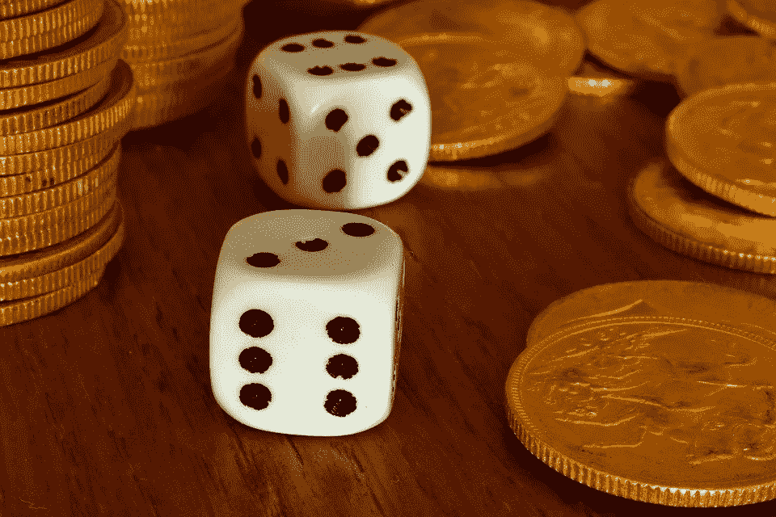

# 关注决定，而不是结果！

> 原文：<https://towardsdatascience.com/focus-on-decisions-not-outcomes-bf6e99cf5e4f?source=collection_archive---------13----------------------->

## 社会为结果偏差付出的可怕代价

*(为了增加趣味，在你继续阅读之前，先看看***。)**

*学习是好事，但不要因为错误的诊断而学到错误的教训。有时候，生活会扔给你一个你无法预料的随机曲线球，不管你的决策能力有多高。当这种情况发生时，调整你的决策过程是糟糕的想法。*

*我举个例子解释一下。*

*想象一下，你即将观察到一个公平的硬币同时翻转，一个公平的六面骰子同时滚动。在此之前，你有两个选择:*

1.  *在硬币上赌博，忽略骰子:如果是正面，获得 100 美元，否则没有。*
2.  **在骰子上赌博，忽略硬币:如果是 6，就获得 100 美元，否则什么也没有。**

*你选择哪个？*

**

*图片:[来源](https://pixabay.com/photos/dice-gambling-gold-pounds-game-4499089/)*

*更好的决定似乎是硬币，它有 1/2 的机会给你钱，而在骰子上有 1/6 的机会。对吗？没错。如果你被 100 美元所激励，这应该是显而易见的。*

*现在动作发生了，我们看到了结果:硬币落下时反面朝上，而骰子显示 6。该死，你应该选择死亡！*

*不，不，你不应该。肯定不是。这就是 ***结果偏差*** ，这是一个你应该尽快戒除的习惯——尤其是如果你希望成为一名优秀的领导者或决策者的话。*

> *始终只根据决策时已知的信息来评估决策质量。*

*如果我们看结果，当你可以得到 100 美元的时候，你得到了 0 美元。我们能解决吗？不，那个决定已经结束了。你应该从中学到什么？我希望没什么。否则，下次你可能会选择公平的骰子而不是公平的硬币。如果你喜欢钱，那将是一个愚蠢的选择。不管你怎么划分，50%的胜率比 17%的胜率更好。*

# *对社会的威胁*

*或许更令人担忧的是，结果偏差威胁着社会提拔和留住有能力的领导人的能力。假设赌硬币和骰子之间的抉择不是由你来做的。相反，你看着希瑟成功了。像希瑟一样，你也会选择硬币，但你不会去想它。你太忙于关注她得到的坏结果:反面+6 =错过了 100 美元的机会。如果你对结果有偏见，你会把结果归咎于*她的*——忘记了她做出了明智的决定——你会吵着让另一个没有坏结果的决策者取代她，因为:*

*   *他们没有希瑟有经验，所以他们的记录没有污点。*
*   *他们很幸运。(一有空就查 [***生存偏差***](https://twitter.com/quaesita/status/1233041495407636482) 。)*

*不管怎样，你刚刚投票缩小了社会中有能力的决策者的范围，惩罚了希瑟的随意性( ***结果*** )，而你本应该根据她当时所知道的来庆祝她的明智行动( ***决定*** )。*

> *结果偏差给社会带来了可怕的代价。*

*结果偏差给社会带来了可怕的代价。我们明智的决策者是我们最好的资产，然而当真正的罪魁祸首是随机性时，许多人愿意牺牲他们作为替罪羊。如果你有理由相信某人的决策过程是一流的，不要对他们持有不好的结果。*

# ****实用建议****

*评估决策者的技能时，忽略结果。只看决策时已知的情况。在我们的例子中，这是 50%对 17%的胜算。决策者选择了 50%？很好。我希望他们下次也会选择同样的方式。*

# *更实用的建议*

*如果你是一名高层领导(或渴望成为一名高层领导)，你可以在我的后续文章 [*事后分析决策的问题*](http://bit.ly/quaesita_outcomes) *中找到更多实用建议。**

# *脚注*

*结果偏见不是关于道德哲学的争论。[*原因如下。*](https://bit.ly/quaesita_consequentialism)*

# *感谢阅读！*

*如果你想了解结果偏见在延续偏见中的作用，可以看看我相关文章的最后一部分:*

* [## 你是一个糟糕的决策者吗？

### 决策分析的黄金法则:避免结果偏差

medium.com](https://medium.com/@kozyrkov/are-you-a-bad-decision-maker-34690deae223) 

# 与凯西·科兹尔科夫联系

让我们做朋友吧！你可以在 [Twitter](https://twitter.com/quaesita) 、 [YouTube](https://www.youtube.com/channel/UCbOX--VOebPe-MMRkatFRxw) 和 [LinkedIn](https://www.linkedin.com/in/kozyrkov/) 上找到我。有兴趣让我在你的活动上发言吗？用[这个表格](http://bit.ly/makecassietalk)联系。

# 人工智能课程怎么样？

寻找一个为初学者和专家设计的有趣的应用人工智能课程？我做了一个给你看。

在这里欣赏整个课程播放列表:[bit.ly/machinefriend](http://bit.ly/machinefriend)*