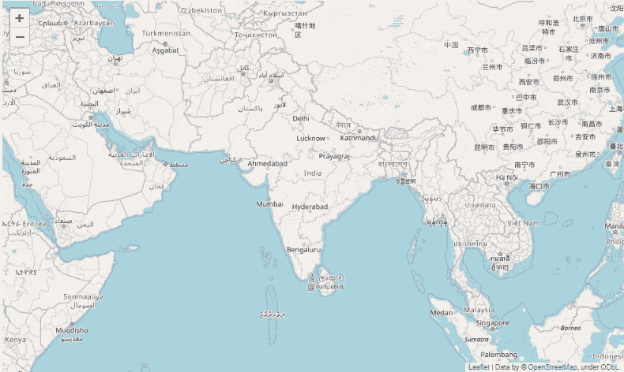
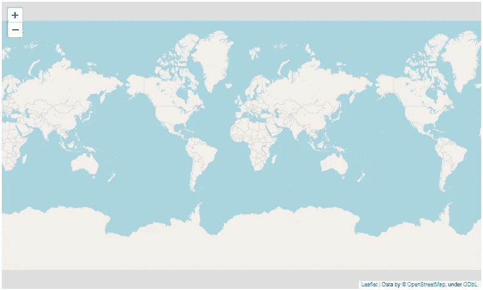
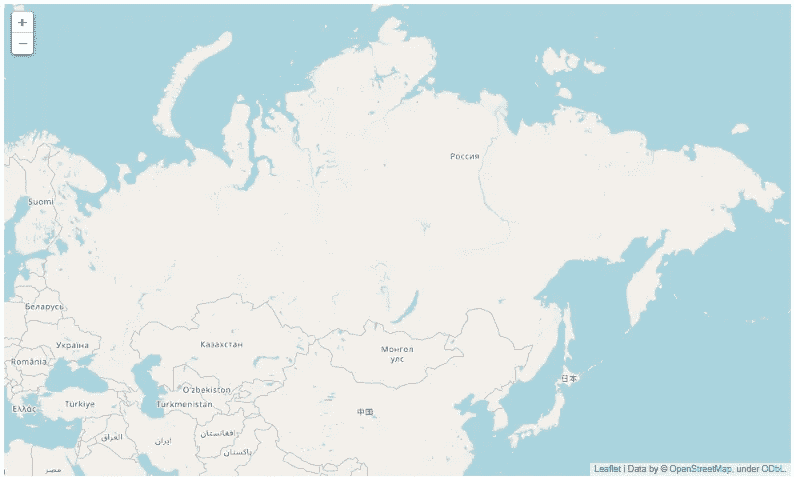
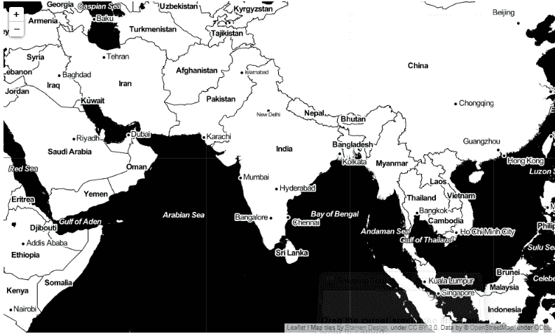
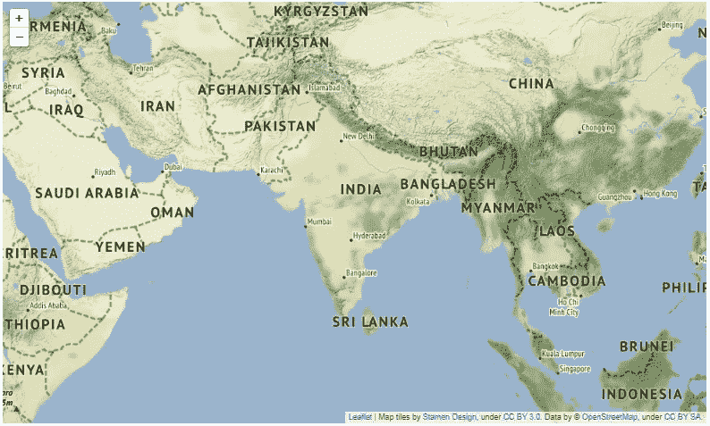
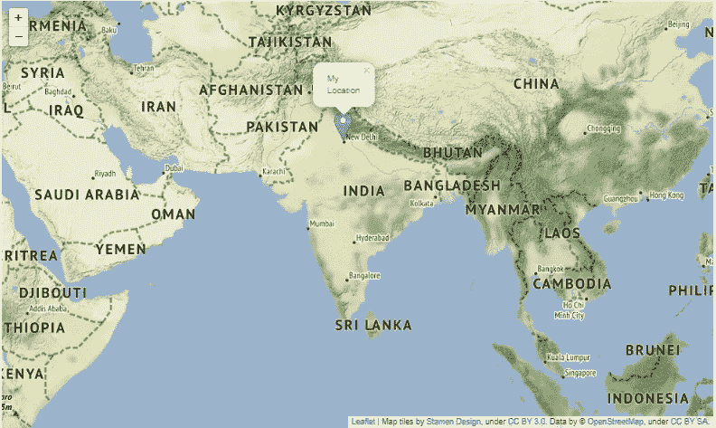

# 叶子:创建交互式传单地图

> 原文：<https://towardsdatascience.com/folium-create-interactive-leaflet-maps-919def6d6c63?source=collection_archive---------31----------------------->

## 一个用于创建地图的 python 库。



在本文中，我们将探索一个 Python 库**follow**，它使得在交互式活页地图上可视化用 Python 处理的数据变得容易。

使用 lyum 创建的地图具有高度的交互性，这使得它对于仪表板的构建更加有用。所以，让我们开始探索叶，并了解我们探索它的方式。

# **安装叶片**

我们可以通过在命令提示符下运行下面给出的命令来安装 lyum。

```
pip install folium
```

# 使用 leav 创建世界地图

在安装了 leav 之后，我们需要将它导入到我们的 Jupiter 笔记本中来开始工作。Folium 是一个易于理解的库，通过它，您只需几行代码就可以创建具有高度交互性和视觉吸引力的地图。

在这里，我们将学习如何使用它来创建一个世界地图。为此，我们只需要调用 Map()函数。下面给出的代码将帮助您更好地理解这一点。

```
#importing folium library
import folium# calling Map() function
world_map = folium.Map()#displaying world map
world_map
```



使用只有一行代码的 follow 进行映射。

上面创建的地图是交互式的，也就是说，你可以使用“+”和“-”或只使用鼠标光标来放大和缩小地图。

我们可以将包含特定位置的经度和纬度的“位置”参数传递给 Map()函数，以显示所需位置的地图。例如，你可以看到下面的代码，我用它的坐标创建了俄罗斯的地图。这里我还传递了一个名为“zoom_start”的属性，它已经相应地放大了。

```
mah_map = folium.Map(location=[61.5240, 105.3188], zoom_start=3)
mah_map
```



用叶子制作的俄罗斯地图

此外，您可以使用 lyum 创建不同类型的地图。其中一些我已经解释如下。

# 雄蕊调色图

这些是高对比度的黑白地图。它们非常适合数据混搭和探索河流蜿蜒和沿海地区。

为了创建它，我们只需要给 Map()函数添加一个名为'**瓷砖'**的属性，并将其设置为**雄蕊调色剂**。下面的代码是用来创建一个印度雄蕊调色地图。

```
india_map = folium.Map(location=[20.5937, 78.9629 ], zoom_start=4,              tiles='Stamen Toner')india_map
```



印度雄蕊调色地图。

# 雄蕊地形图

这些地图显示了山丘阴影和自然植被颜色。它们还展示了双车道道路的高级标签和线条综合。

为了创建这个，我们需要设置属性瓦片的值为**雄蕊地形。下面的代码将生成印度的雄蕊地形图。**

```
india_map = folium.Map(location=[20.5937, 78.9629 ], zoom_start=4, tiles='Stamen Terrain')india_map
```



印度雄蕊地形图。

除此之外，还有更多磁贴选项，如“亮地图框”等。你可以探索和学习。

Folium 还有一个标记功能，可以标记您选择的给定坐标的所需位置。我们也可以选择标记的图标。

下面给出的代码用于创建一个地图，并在所需的位置显示标记。

```
my_map = folium.Map(location=[20.5937, 78.9629], zoom_start=4,   tiles='Stamen Terrain')folium.Marker([28.73158, 77.13267], popup='MyLocation',                 
               marker_icon='cloud').add_to(my_map)
my_map
```



显示弹出式菜单的标记。

# 结论

在本文中，我们探索了一个漂亮的库，它可以用来创建具有交互性和视觉吸引力的传单地图。我们可以在仪表板中或根据需要使用这些地图。Folium 易于理解库，只用一行代码就创建了地图。本文只是对 leav 的一个基本了解，继续下去，探索 leav 的更多特性。

[](/downloading-stock-data-and-representing-it-visually-6433f7938f98) [## 下载股票数据并直观地展示出来

### 使用 YFinance 和 Plotly 库进行股票数据分析

towardsdatascience.com](/downloading-stock-data-and-representing-it-visually-6433f7938f98) [](/understanding-data-analysis-step-by-step-48e604cb882) [## 逐步了解数据分析

### 对数据集应用数据分析以获得关于数据的见解。

towardsdatascience.com](/understanding-data-analysis-step-by-step-48e604cb882) 

# 在你走之前

***感谢*** *的阅读！如果你想与我取得联系，请随时通过 hmix13@gmail.com 联系我或我的* [***LinkedIn 个人资料*** *。*](https://www.linkedin.com/in/himanshusharmads/) *您也可以在我的**[***Github 中查看我在这里使用的代码和数据。***](https://github.com/hmix13/Folium)*