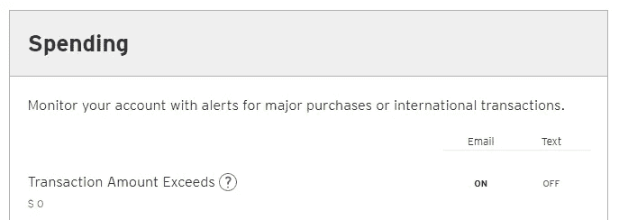
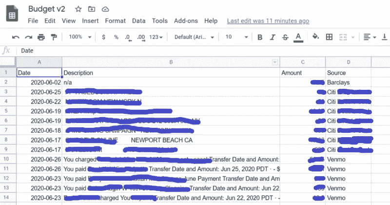
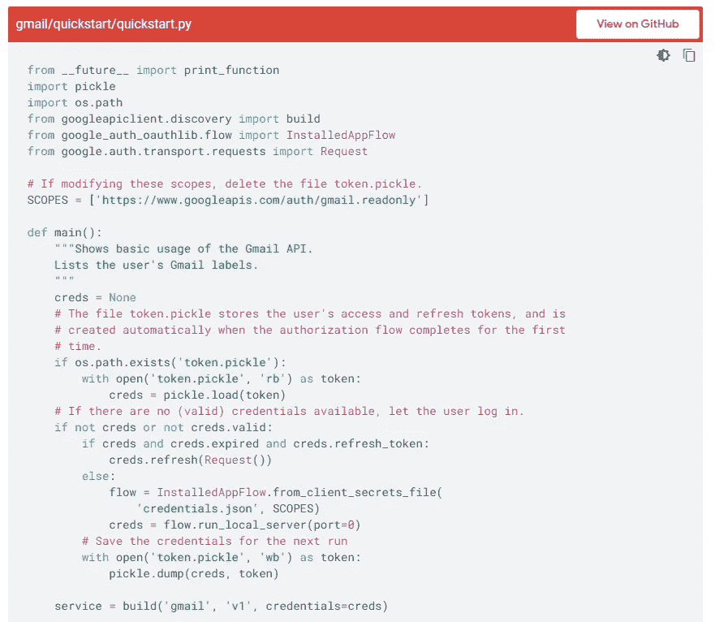
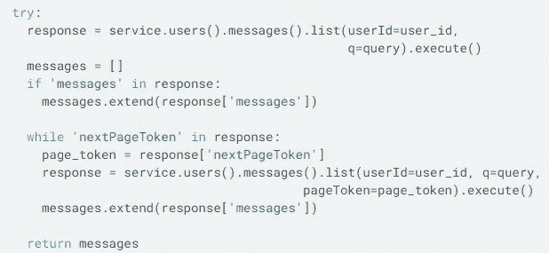
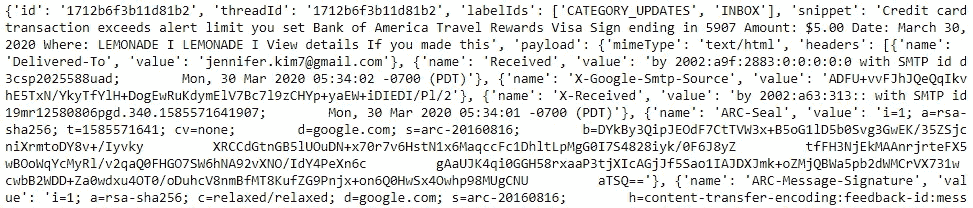
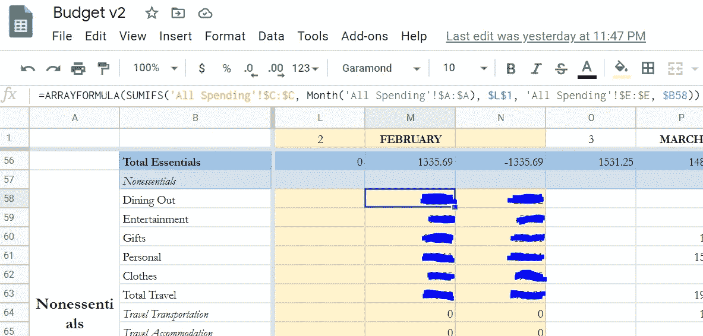

# 跟随我的极端预算改造(英尺。Gmail API)

> 原文：<https://towardsdatascience.com/follow-along-with-my-extreme-budget-makeover-ft-the-gmail-api-2872cc006b60?source=collection_archive---------43----------------------->

## 使用 Gmail 和 Google Sheets APIs 的端到端支出跟踪器


照片由[费边布兰克](https://unsplash.com/@blankerwahnsinn?utm_source=medium&utm_medium=referral)在 [Unsplash](https://unsplash.com?utm_source=medium&utm_medium=referral) 上拍摄

2020 年是改善之年——对自己，对政府和现有机构，对消费习惯。我的预算方法拥抱了这一主题，并把自己从一个半可接受的过程(使用[硒和美丽的汤](/how-i-diyd-my-budget-using-python-for-selenium-and-beautiful-soup-4d2edc5c519))磨练成一个精炼无缝的过程(使用 Gmail API)。

我第一次偶然发现使用 Gmail 的想法是因为我注意到每次我完成与 Venmo 的交易后都会收到一封电子邮件。这些邮件包含了我预算所需的所有信息——日期、商家和金额。我研究了 Gmail API，看能否解析出这些信息，并将其插入到 Google Sheets 中。这是一个令人惊讶的无痛过程，我发现我可以通过打开任何超过 0.00 美元的交易的电子邮件通知，用我的每张信用卡收到类似的交易电子邮件。



打开信用卡交易通知的选项

与我以前使用 Selenium 和 Beautiful Soup 的方法不同，使用 Gmail API 提供了更好的安全性和对历史数据的访问。API 只需要一个认证步骤，并且不需要本地机器上的明文密码。您还可以在收件箱中检索任何过去的交易，只要电子邮件格式没有改变。然后，我使用 Google Sheets API 上传所有这些检索到的事务，以便于查看、分类和聚合。这些实质性的好处带来了比以前更好的用户体验。



这一过程的最终产品

跟着我来创建你自己的端到端方法，来掌握你今年的消费习惯。

*完整代码可以在我的 Github* [*这里*](https://github.com/jenniferrkim/budget_gmailapi) *找到。如果你想建立自己的预算工具，我很乐意帮忙——到 jenniferrkim7@gmail.com 找我。*

## 目录:

1.  检索交易电子邮件
2.  提取交易数据
3.  发送到 Google 工作表
4.  死刑
5.  结论

# 检索交易电子邮件

## 证明

我们首先需要认证才能访问我们所有的电子邮件。Gmail API 的 [Python Quickstart](https://developers.google.com/gmail/api/quickstart/python) (也有其他语言版本)让这一切变得简单，因为它提供了一个完整的样本，可以验证您的第一个请求。因为我们将只在本地机器上使用这个脚本，所以如下所示的认证方法对于这个项目来说已经足够了。



使用 Python 快速启动 Gmail API 的身份验证

现在我们已经通过了身份验证，是时候发出请求了。

## 使用 Gmail 的用户检索电子邮件。邮件:列表和获取

**用户消息:列表**

```
response = service.users().messages().list(userId='me', q=query).execute()
```

`[list](https://developers.google.com/gmail/api/v1/reference/users/messages/list)` [方法](https://developers.google.com/gmail/api/v1/reference/users/messages/list)返回我们检索的电子邮件的 id 和 threadId，稍后可以将它们传递给`get`方法以获得电子邮件的文本。多亏了`query`参数，我们可以让这个方法只返回我们感兴趣的邮件。这里，我们以与 [Gmail 搜索框](https://support.google.com/mail/answer/7190?hl=en)相同的查询格式传入一个参数。由于每个银行机构的电子邮件格式不同，我们可以创建一个函数，根据选择的银行返回不同的查询。

我们使用文档中的以下代码片段来查看多页回复。



**用户.消息:获取**

`[get](https://developers.google.com/gmail/api/v1/reference/users/messages/get)` [方法](https://developers.google.com/gmail/api/v1/reference/users/messages/get)返回给定来自`list`方法的 id 的特定电子邮件的附加信息。

```
msg = service.users().messages().get(userId='me', id=item['id'], format = raw_or_nah).execute()
```

如上所示，`get`方法有一个`format`参数，我们可以在“完整”、“元数据”、“最小”和“原始”之间选择消息的格式。我们首先必须确定是否可以从“元数据”格式返回的片段中获得我们需要的数据，该片段包含电子邮件的主题和前几行。如果我们需要的信息不在这个代码片段中，我们可以在格式“full”或“raw”之间进行选择，这将以 base64url 编码的字符串形式返回完整的电子邮件。我选择了“原始”

现在我们有了我们的信息，是时候提取[有趣的](https://www.youtube.com/watch?v=YIALlhlyqO4)信息了。

# 提取交易数据

## 正在解析格式为“元数据”的消息

我们需要的交易信息是日期、商家和金额。来自美国银行和 Venmo 的交易通知电子邮件在以“元数据”格式返回的消息中包含了所有这三个内容



“元数据”格式的消息示例

不幸的是，不容易看到信息在哪里，因为这些信息中的每一条都是一个又大又乱的字典。我们必须通读字典，看看我们需要哪些键值对。日期可能嵌套在关键字“payload”和“headers”中，我们可以使用`[parser.parse](https://dateutil.readthedocs.io/en/stable/parser.html)`提取日期值。

```
for msg in msgli:        
    # getting dates        
    headerli = msg['payload']['headers']        
    for nestdic in headerli:            
        if nestdic['name'] == 'Date':                
            date = parser.parse(nestdic['value']).date()
            dateli.append(date)
```

其余信息可能包含在关键字“snippet”的值中。我们可以使用 money-parser 包的 [price_str](https://pypi.org/project/money-parser/) 函数来查找交易的金额，并通过识别我们知道的指示商家信息/描述所在位置的关键字来定位商家。

```
# getting amounts and description of transaction        
snippet = msg['snippet']        
amount_index = snippet.find("Amount")        
date_index = snippet.find("Date")        
where_index = snippet.find("Where")        
end_index = snippet.find("View details")        
if end_index == -1:            
    end_index = snippet.find("This may") amt_string = snippet[amount_index:date_index]        
where_string = snippet[where_index + 7:end_index]
```

当我们从每条消息中提取日期、商家和金额时，我们可以将每条信息添加到它们各自的列表中，以便在提取完成后放入数据帧中。

*在 Venmo 上的旁白*

在信用卡账单上，返还给我们的钱显示为负余额，与消费交易相反。然而，在 Venmo 上，无论我们是付款人还是收款人，金额总是正的。为了保持我们的支出数字准确，我们必须将我们被支付时的实例数量乘以-1。要查看代码，请参考上面 parse_venmo.py 中的第 21 行。

## 解析格式为“raw”的消息

当我们的信息不在关键字“snippet”的值中时，我们需要完整的电子邮件数据，使用格式“raw”进行检索。由于这种格式返回的字符串是 base64url 字符串，因此必须先对其进行解码才能读取(第 9 行)。解码后，我们需要的信息可以像元数据片段中的商家一样提取出来——根据关键字的位置解析字符串。

## 当您想要解析的数据在电子邮件中不存在时

有时候，生活会让你陷入困境。其他时候，巴克莱会这么做。巴克莱发送的电子邮件只包含交易的日期和金额，没有商家。这个我们真的无能为力，可能想用 [Selenium 和 Beautiful Soup](/how-i-diyd-my-budget-using-python-for-selenium-and-beautiful-soup-4d2edc5c519) 之类的工具直接从银行网站获取信息。

# 发送到 Google 工作表



谷歌工作表公式计算每个类别的总和

Google Sheets 提供了一个可访问的基础来创建一个体面的预算界面，上面就是一个例子。我们可以通过 pygsheets 使用 Google Sheets API 将所有交易信息发送到预算文件中的一个表中。下面的方法来自埃里克·鲁德的帖子[这里](https://erikrood.com/Posts/py_gsheets.html)。在对表中某一列的交易进行手动分类后，我们可以使用“sum if”公式计算每个支出类别的总额。


Google Sheets 中的最终数据框架

# 死刑

为了便于执行，我们可以将上述所有函数添加到一个`main`函数中，该函数根据我们选择的金融机构(包括选择“all”)启动整个交易聚合过程。

# 结论

我们现在有了一个脚本，可以和 Mint 一样好地获取我们的支出数据(如果不是更好，也要感谢包含了 Venmo)。借助 Google Sheets 的强大功能，我们甚至可以根据自己的需要定制界面。凭借这一新发现的力量，我们有望在 2020 年及以后继续培养良好的理财习惯。

*完整代码可以在我的 Github* [*这里*](https://github.com/jenniferrkim/budget_gmailapi) *找到。如果你想建立自己的预算工具，我很乐意帮忙——到 jenniferrkim7@gmail.com 找我。*