# 随着冠状病毒的传播

> 原文：<https://towardsdatascience.com/following-the-spread-of-coronavirus-23626940c125?source=collection_archive---------22----------------------->

## 一个可免费下载的仪表板，用于可视化新冠肺炎疫情

作者: [*保罗*](https://www.linkedin.com/in/paolo-tamagnini/) *和* [*罗莎丽娅*](https://www.linkedin.com/in/rosaria/) *，克尼梅*

*2020 年 7 月 6 日更新*

# 世界范围的新冠肺炎起义

我们现在都熟悉这张图表了。

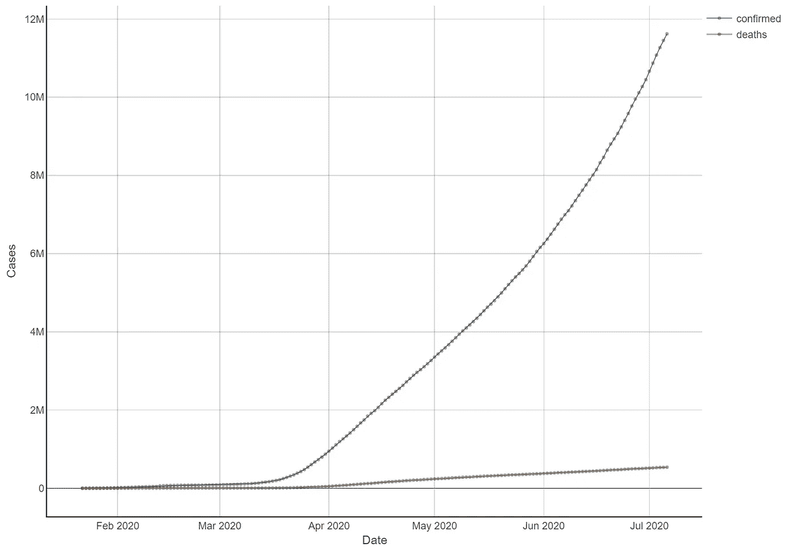

图一。累计确诊新冠肺炎病例数和因新冠肺炎导致的死亡数。JHU 不再支持恢复次数。

这一次，我们所说的“所有人”实际上是指全世界的所有人。随着新冠肺炎病毒在世界各地的逐渐传播，我们已经读到和听到了更多关于它的传染性的报道；在中国、韩国、意大利、美国、巴西等一些地区的极端侵略性，以及未来更多地区的侵略性；采取的严厉遏制措施；我们已经看到了这张图表，通过统计全世界确诊病例和死亡的累计人数，每天都在监测疾病的传播。

这些数字的详细分类可以在现在非常受欢迎的博客文章“[冠状病毒:为什么你必须现在行动](https://medium.com/@tomaspueyo/coronavirus-act-today-or-people-will-die-f4d3d9cd99ca)”中找到，作者是[托马斯·普约](https://medium.com/@tomaspueyo?source=post_page-----f4d3d9cd99ca----------------------)。这种疾病在世界范围内的传播和在中国以外的世界范围内的传播之间的显著差异表明了中国的遏制措施是多么有效，以及猖獗的新冠肺炎病毒现在对世界其他地区构成的危险:首先是美国、巴西、南韩、伊朗和意大利，它们是中国以外受影响最严重的国家。一个星期后的今天，情况是否有了重大变化？

我们在一个免费下载的网络应用程序中复制了这个线图和其他图表，以深入了解当前情况。我们对这些数据进行了分类，以了解各大洲和各个国家的情况。

# 亚洲

让我们从疫情开始的亚洲的数据开始分析。图 2a 显示了截至 2020 年 7 月 6 日亚洲国家新冠肺炎确诊病例的累计数量。

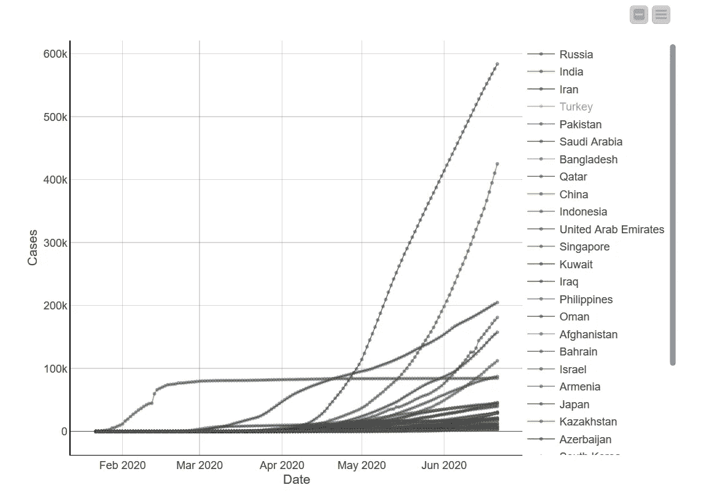

*图 2a。亚洲各国每日累计确诊新冠肺炎病例数*

图 2a 显示，COVID19 确诊病例数的领先优势现在属于俄罗斯，而中国似乎最终达到了控制局势所需的曲线平坦化。紧随俄罗斯之后，我们发现印度也有类似的曲线。中国和韩国的曲线提前变平，给所有仍在抗击病毒的国家带来了希望。自 2 月 20 日以来，韩国实施了封锁和人员跟踪措施。显然，大约过了两周，这些措施的效果才在情节中显现出来。

俄罗斯和印度的数据差异很大，因此很难看出其他国家的情况。为了更好地了解细节，这个相同的线图被移动到 y 轴上的对数刻度(图 2b)。在这里，可以更容易地看到所有国家的趋势，而不仅仅是俄罗斯和印度。请注意，在对数标度中，一切都变得不那么引人注目:指数曲线变成了直线，较慢的增长变得更加明显。例如，我们可以看到，中国和韩国确诊病例数量的增长比俄罗斯或印度下降得多，尽管这两条对数曲线非常接近。

对东亚国家的曲线调查是一个相当重要的难题，因为这些国家较早受到疫情的影响，因此在处理疫情方面有较长的经验。通过检查这些曲线，我们可以更多地了解疾病的传播和遏制措施的有效性。

对韩国来说，疫情的发作可以追溯到 1 月 20 日左右；2 月中旬出现大幅增长，直到 3 月初开始放缓。这证实了大约两周前控制措施生效的数字。

俄罗斯的曲线开始稍晚，开始时与中国的曲线增长相似，在 4 月中旬加速，但继续稳定增长。还没有像中国或韩国那样放缓的迹象。

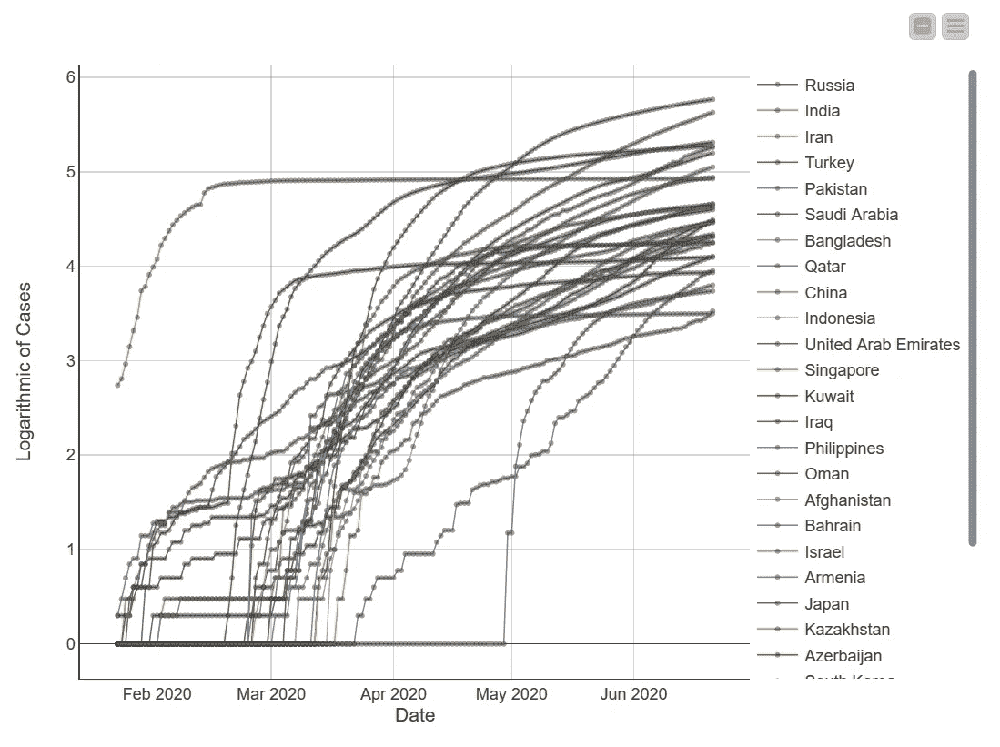

图 2b。亚洲各国每日累计确诊新冠肺炎病例数的对数标度

往西看，我们看到疫情在中东爆发，主要是在伊朗。这种疾病在这里的传播比在远东开始得晚，但它遵循同样的戏剧性趋势，目前没有减缓的迹象。

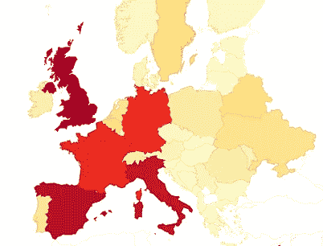

# 欧洲

下面的图 3a 显示了欧洲的严峻形势，现在英国以惊人的最高确诊病例数领先。截至 2020 年 5 月，意大利是确诊病例最多的国家。从 3 月初开始，意大利实施了严厉的禁售措施，最初的形式较为温和，但从 3 月 9 日开始，形式变得更加严格。经过一个多月的强制封锁，意大利确诊病例的增长速度才开始放缓。不过，对所有欧洲国家来说，曲线变平是显而易见的，包括现在的英国。

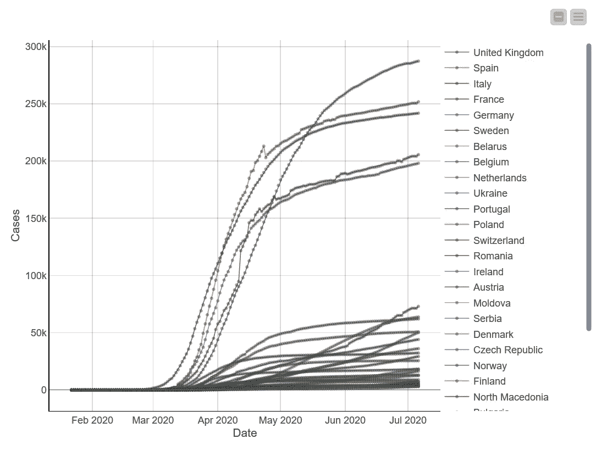

图 3a。欧洲各国每日累计确诊新冠肺炎病例数

然而，关于传染病传播的数字并不能说明全部情况。流行病的另一面是死亡率，即死亡人数。图 3b 中示出了与图 3a 中相似的曲线。这一次在 y 轴上，我们看到的是新冠肺炎病毒导致的累计死亡人数，而不是确诊病例数。该图类似于图 3a，英国和意大利付出的代价最大，紧随其后的是法国和西班牙。到目前为止，所有欧洲国家都遇到了疫情。迄今为止，德国的情况仍未得到解释(图 3a)，确诊病例数量很高，随之而来的死亡人数相对较低(图 3b)。

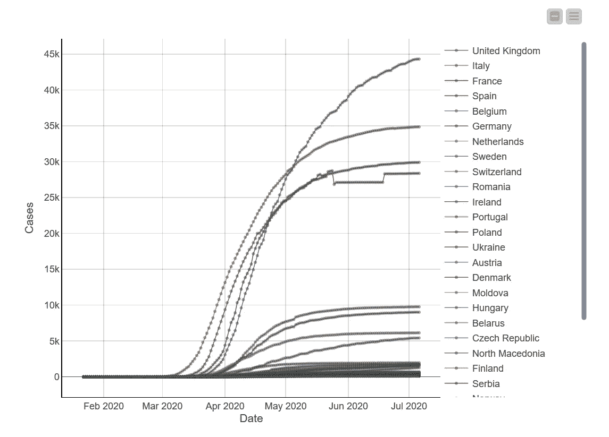

图 3b。欧洲各国每天因新冠肺炎病毒导致的累计死亡人数

在 3 月至 5 月的某个时间点，在意大利 3 月采取行动后，所有这些国家都实施了遏制措施。结果是所有曲线变平。

# 从以前的经验中学习

在过去的几个月里，在互联网上可以看到的另一个流行图表是由马克·汉德利制作的，可以在他的 T2 推特账户上看到。这是一个累积数字的线形图，其中 x 轴上的时间被标准化为该国疫情开始后的天数。将时间零点视为该国确诊第一例新冠肺炎病例的时间，随后绘制从时间零点开始的天数曲线。这种视图的优点是曲线重叠，就好像它们同时在进化。这是各国现在从早期受影响国家的经验中学习的一种方式(图 4)。

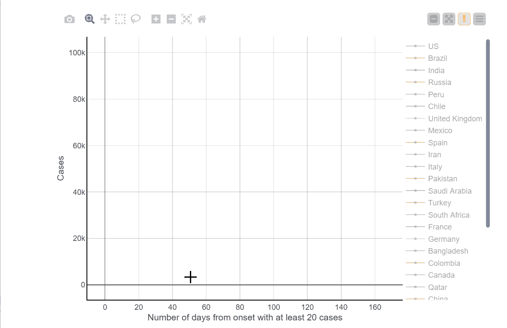

*图 4。10 个受影响最严重国家每日确诊的新冠肺炎病例累计数。x 轴上的时间已被标准化为从该国疫情开始的天数，我们将其定义为至少有 20 例病例的第一天。*

马克·汉德利在三月初用这幅图展示了如果德国、美国或法国不采取紧急遏制措施，他们将面临什么。的确，在那个时候，许多国家都表现出与意大利相同的曲线起点；这表明如果不采取早期的控制措施，也会发生类似的演变。这里我们可以看到，到目前为止，美国、巴西、俄罗斯和印度在确诊病例数量上已经迅速达到并超过了所有其他国家，即使在时间轴上晚了几天。

今年 3 月，将意大利与中国进行比较，我们可以看到，这两个国家疫情的早期开始是相似的，尽管中国在发病后约一个月开始看到确诊病例的增长受到限制。根据这张图表，并假设遏制措施在这两个国家产生了相同的效果，我们可以预计意大利的增长率将在一两周内下降。意大利在 COVID spread 上的曲线达到与中国曲线相同的形状确实花了更长的时间。请注意，“假设遏制措施在这两个国家有相同的效果”是一个很大程度上未经证实的假设，因为意大利没有实施跟踪其人口。同样值得一提的是，这两个国家的人口统计数据非常不同，它们的规模和卫生系统也是如此。

# 北美洲

北美最令人担忧的趋势是美国的趋势(图 5a)。疾病的快速传播类似于欧洲国家的早期数据点(图 4)。

与美国相比，加拿大确诊的新冠肺炎病例较少。然而，如果我们检查对数曲线，我们可以看到疾病传播的侵略性是相似的(图 5b)。

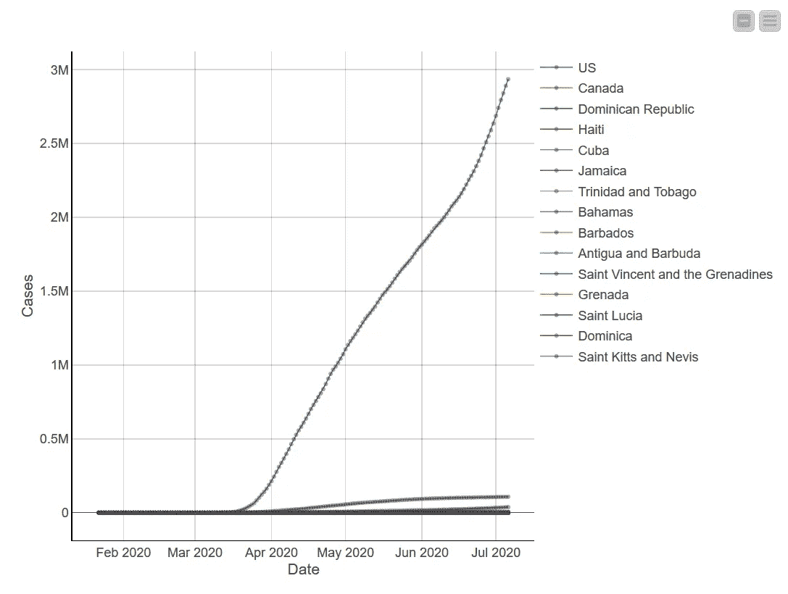

*图 5a。北美累计确诊新冠肺炎病例数*

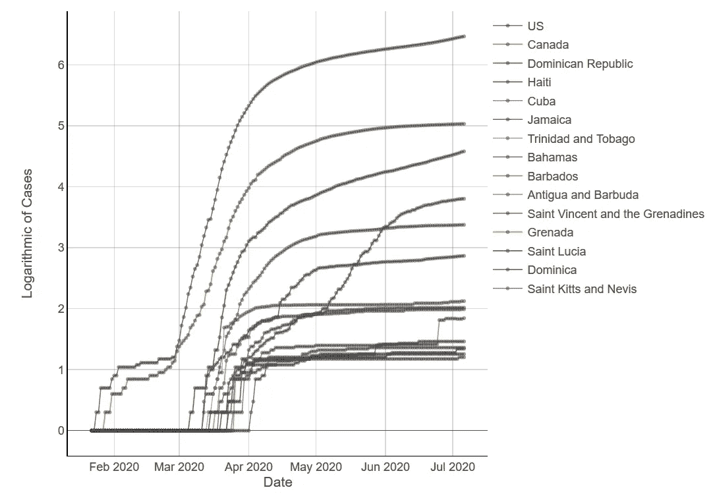

图 5b。北美新冠肺炎确诊病例累计数的对数标度

# 南美。参见 AMERICA

截至 2020 年 7 月，所有国家都出现了 COVID19 确诊病例。最具侵略性的传播是在南美洲。这确实是这篇博文与之前版本最大的不同:南美确诊病例数量高(图 6)。

*图六。南美累计确诊新冠肺炎病例数*

# 总的来说

累积数字和曲线的平坦并不能说明全部情况。我们可以通过每天检查受影响最严重国家的新增确诊病例数来更深入地了解情况(图 7)。

在这里，我们可以看到，2020 年 7 月 6 日，全球确诊的新冠肺炎病例数量急剧上升。

逐国深入研究，我们没有看到中国和韩国的数据，即确诊病例数量微不足道。相反，我们看到美国(深蓝色)、巴西(浅蓝色)、印度(橙色)和俄罗斯(浅橙色)的确诊病例数量每天都在大幅增加。尽管每日增加的数字似乎在减少，但鉴于这种情况，可以持谨慎乐观的态度。

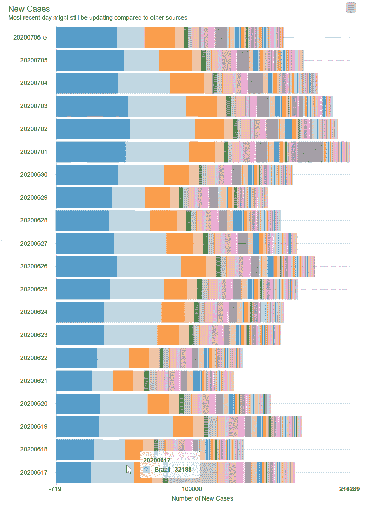

图 7。受影响最严重的国家每日新增确诊新冠肺炎病例数

# web 应用程序

最后，让我们抛开传染和死亡这个悲伤的领域，简单地看看我们是如何使用[引导分析](https://en.wikipedia.org/wiki/Guided_analytics)实现这个 web 应用程序的。它由两页组成。第一页显示了全球确诊病例和死亡病例的总体线图(如图 1 所示)。在这里，我们还可以选择我们想要执行的分析类型:全球范围的或特定洲的；统计确诊病例和死亡人数。

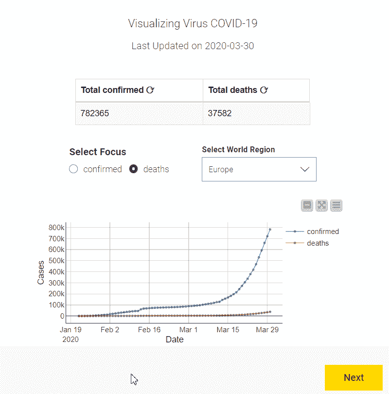

图 8。可视化全球新冠肺炎数据的 web 应用程序的第一页。在这里，您可以选择是否在接下来的页面中显示特定洲的确诊病例数、死亡人数和康复人数。

通过点击页面右下角的“Next ”,我们移动到 web 应用程序的第二页(图 9)。在这里你可以找到我们在图 2、3、4、5 和 6 中展示的所有子图形，以及世界地图上的一个 choropleth。所有情节都是互动的。您可以在列表中添加和删除国家/地区，放大和缩小图的部分，选择数据点，并在所有其他图中显示相同的数据点。

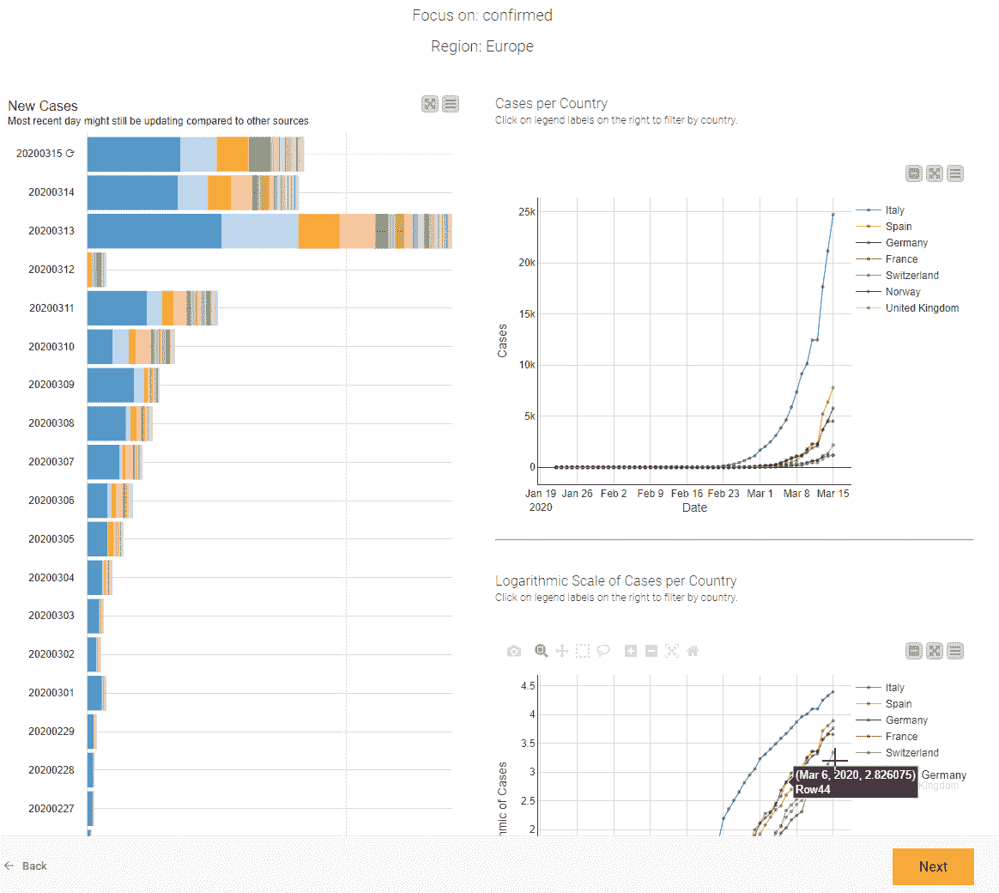

图 9。用于可视化全球新冠肺炎数据的 web 应用程序的第二页。这是显示上述图和图表的地方。在这种情况下，我们只看到欧洲国家的仪表板。

开发这个应用程序不需要编码，因为它是使用免费开源的 [KNIME 分析平台](https://www.knime.com/downloads)开发的。实现该 web 应用程序的工作流“[新冠肺炎实时可视化使用引导分析](https://hub.knime.com/paolotamag/spaces/Public/latest/COVID-19_Live_Visualization)”(图 10)是免费的，可以从 [KNIME Hub](https://hub.knime.com/) 下载。

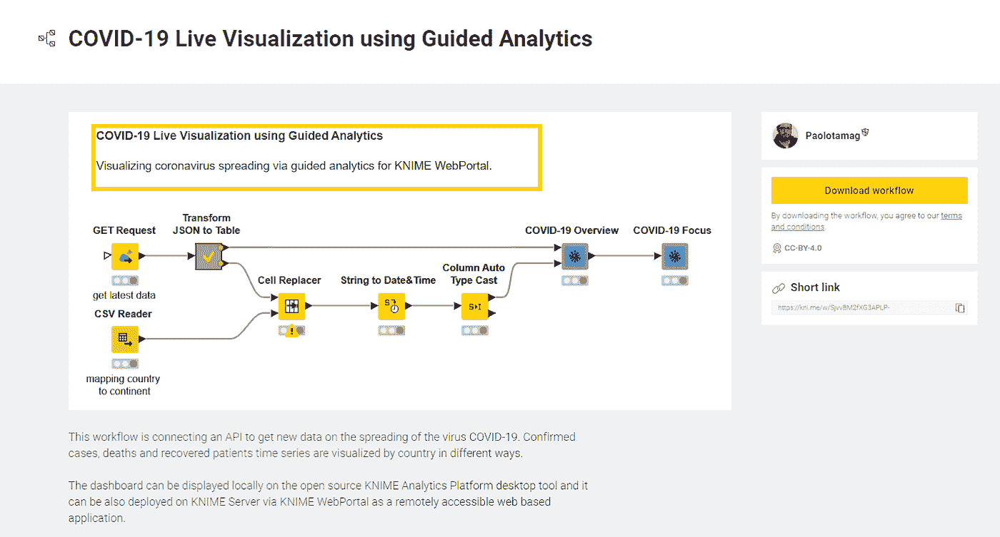

图 10。 [*KNIME 工作流程*](https://kni.me/w/SjvvBM2fXG3APLP-) *实现了 web 应用程序来可视化世界范围的新冠肺炎数据，可以从*[*KNIME Hub*](https://hub.knime.com)*下载，并在免费开源的* [*KNIME 分析平台*](https://www.knime.com/knime-analytics-platform) *上执行。图像权利* [CC-BY-4.0](https://creativecommons.org/licenses/by/4.0/)

工作流获取这个 [GitHub 存储库](https://github.com/ExpDev07/coronavirus-tracker-api)通过 REST API 提供的数据。API 服务检查约翰霍普金斯 CSSE 的 [2019-nCoV 数据仓库，并每小时缓存最新数据。每次工作流执行时，我们都从 REST API 获取这些缓存数据。如果 API 由于某种原因中断，KNIME 工作流也会通过一个简单的](https://github.com/CSSEGISandData/COVID-19)[表阅读器](https://kni.me/n/3OUoQi6aEdn90sL1)节点提供额外的缓存数据。克尼姆。表格文件存储在工作流中，每次在 KNIME Analytics 平台上执行工作流时都会更新。

接下来，工作流使用适当的 KNIME 扩展处理 JSON 结构化数据，将带有洲名的列附加到每个记录的[，添加正确的](https://kni.me/n/71a_wzUQb9FDO9iU)[时间戳域](https://kni.me/n/sLTXYsycpYMwt_yW)，识别[缺失值](https://kni.me/n/iQCmMxBEl2szprD5)，最后使用组件“新冠肺炎概览”可视化应用程序的第一页。使用[单选控件](https://kni.me/n/cTGxg7Zk5Qmlub_X)用户可以选择要可视化的患者病例类别(如确诊病例)和洲(如欧洲)。在名为“新冠肺炎焦点”的下一个组件中，可以通过 [Plotly](https://kni.me/e/NXfbxRi-JV1Tt7yC) 和 [Google GeoChart](https://kni.me/w/MDMPYVV5ZyxNSB8y) 以及其他 [KNIME JavaScript 节点](https://kni.me/e/0qveOxOA3751S6Vx)来可视化各个选择的更多信息。

工作流程可以通过 KNIME 服务器部署在 KNIME 门户网站上，所有这些复杂性对用户来说都是隐藏的。用户可以通过任何网络浏览器的简单链接访问组合视图(或仪表板),并与之交互，以可视化冠状病毒危机的最新可用数据。

更多示例工作流可在 [KNIME Hub](https://hub.knime.com) 上获得，例如[Paolo Tamagnini 的另一个工作流](https://kni.me/w/Tm8j2q8h6ngtGx9v)、[逐地区可视化新冠肺炎病毒数据](https://twitter.com/paolotamag/status/1237433355563565056)。您可以随意下载工作流程，进行定制，在社交媒体上重新分享，并在 [KNIME 论坛](https://forum.knime.com/t/covid-19-live-visualization-using-guided-analytics/21757)发表评论。